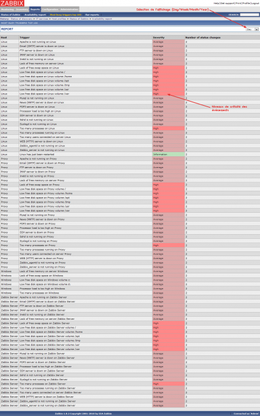

supervision:zabbix:zabbix-frontend\_reports\_most-busy-triggers-top-100.png
===========================================================================

zabbix-frontend\_reports\_most-busy-triggers-top-100.png

← Retour à [Interface Web de
Zabbix](../../../zabbix/zabbix-interface.html "zabbix:zabbix-interface")

Date:
:   2013/03/29 09:42
Nom de fichier:
:   zabbix-frontend\_reports\_most-busy-triggers-top-100.png
Format:
:   PNG
Taille:
:   132KB
Largeur:
:   1263
Hauteur:
:   2018

