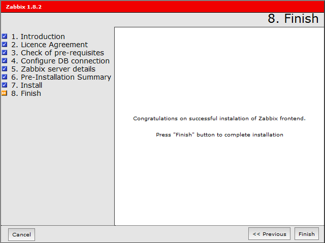

supervision:zabbix:zabbix-frontend\_source\_install11.png
=========================================================

zabbix-frontend\_source\_install11.png

← Retour à [Installation de Zabbix sur
Ubuntu](../../../zabbix/zabbix-ubuntu-install.html "zabbix:zabbix-ubuntu-install")

Date:
:   2013/03/29 09:42
Nom de fichier:
:   zabbix-frontend\_source\_install11.png
Format:
:   PNG
Taille:
:   24KB
Largeur:
:   640
Hauteur:
:   479

