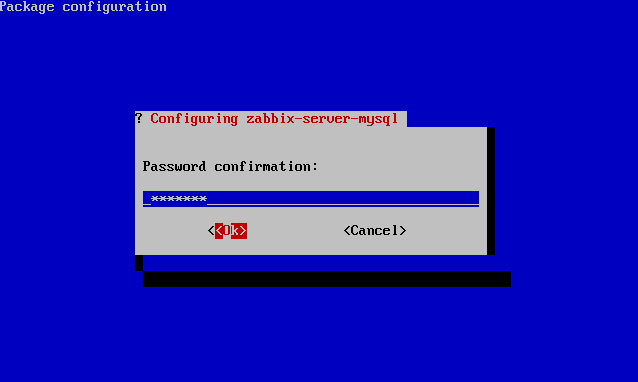

supervision:zabbix:zabbix-server\_depot\_install4.png
=====================================================

zabbix-server\_depot\_install4.png

← Retour à [Installation de Zabbix sur
Ubuntu](../../../zabbix/zabbix-ubuntu-install.html "zabbix:zabbix-ubuntu-install")

Date:
:   2013/03/29 09:42
Nom de fichier:
:   zabbix-server\_depot\_install4.png
Format:
:   PNG
Taille:
:   3KB
Largeur:
:   638
Hauteur:
:   382

