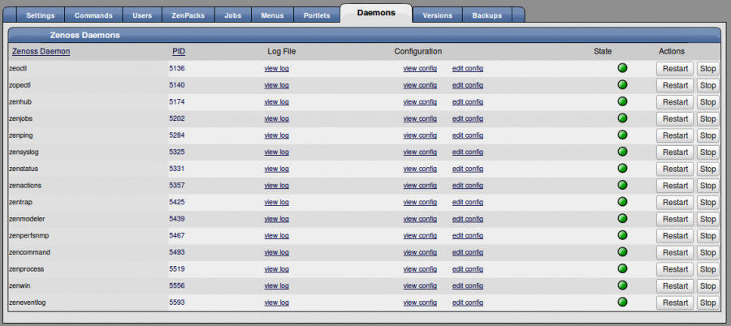

supervision:zenoss\_settings\_demon.png
=======================================

zenoss\_settings\_demon.png

← Retour à [Interface Web de
Zenoss](../../zenoss/zenoss-interface.html "zenoss:zenoss-interface")

Date:
:   2013/03/29 09:42
Nom de fichier:
:   zenoss\_settings\_demon.png
Format:
:   PNG
Taille:
:   88KB
Largeur:
:   1136
Hauteur:
:   508

