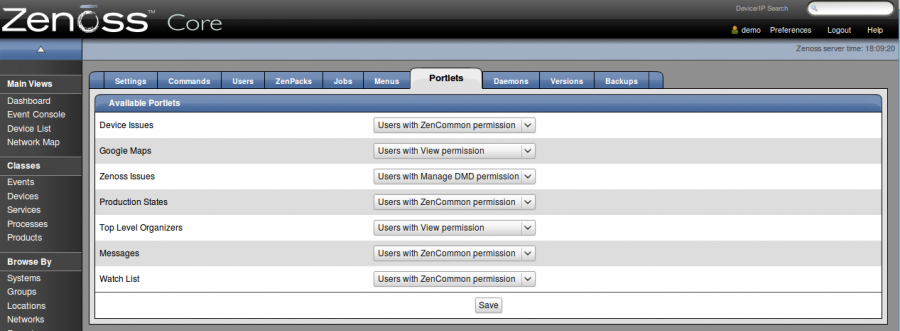

supervision:zenoss\_settings\_portlets.png
==========================================

zenoss\_settings\_portlets.png

← Retour à [Interface Web de
Zenoss](../../zenoss/zenoss-interface.html "zenoss:zenoss-interface")

Date:
:   2013/03/29 09:42
Nom de fichier:
:   zenoss\_settings\_portlets.png
Format:
:   PNG
Taille:
:   76KB
Largeur:
:   1267
Hauteur:
:   467

