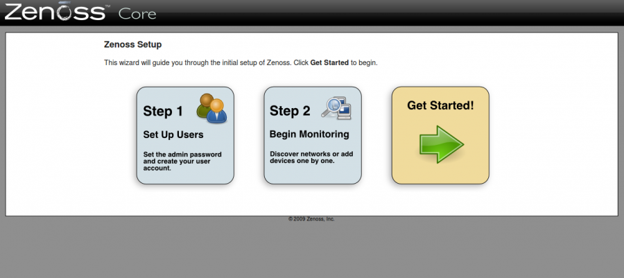

supervision:zenoss\_setup1.png
==============================

zenoss\_setup1.png

← Retour à [Installation de Zenoss sur
Ubuntu](../../zenoss/zenoss-ubuntu-install.html "zenoss:zenoss-ubuntu-install")

Date:
:   2013/03/29 09:42
Nom de fichier:
:   zenoss\_setup1.png
Format:
:   PNG
Taille:
:   75KB
Largeur:
:   1277
Hauteur:
:   570

