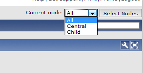

zabbix:zabbix-distributed-architecture\_server-use-1.png
========================================================

zabbix-distributed-architecture\_server-use-1.png

← Retour à [Architectures distribuées de
Zabbix](../../zabbix/zabbix-distributed-architecture.html "zabbix:zabbix-distributed-architecture")

Date:
:   2013/03/29 09:42
Nom de fichier:
:   zabbix-distributed-architecture\_server-use-1.png
Format:
:   PNG
Taille:
:   8KB
Largeur:
:   293
Hauteur:
:   149

