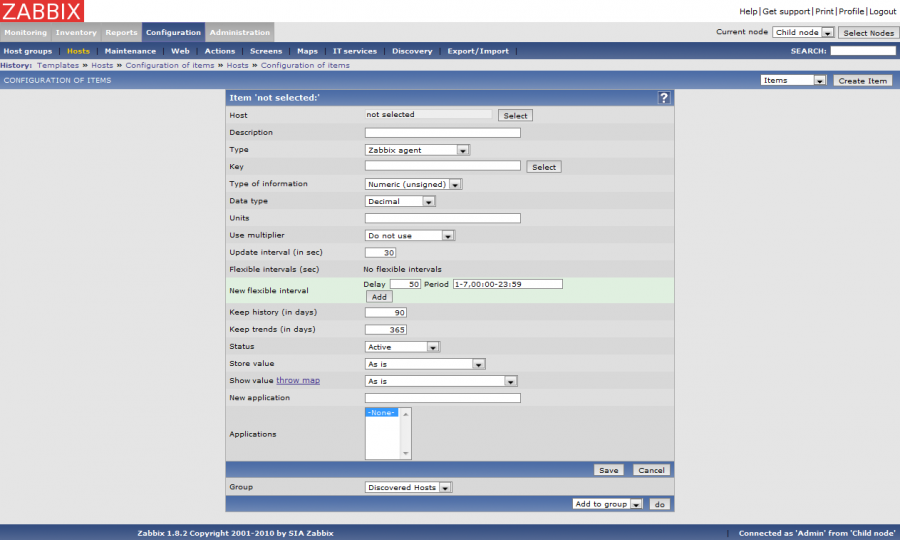

zabbix:zabbix-use\_item-1.png
=============================

zabbix-use\_item-1.png

← Retour à [Prise en main de
Zabbix](../../zabbix/zabbix-use.html "zabbix:zabbix-use")

Date:
:   2013/03/29 09:42
Nom de fichier:
:   zabbix-use\_item-1.png
Format:
:   PNG
Taille:
:   72KB
Largeur:
:   1263
Hauteur:
:   759

