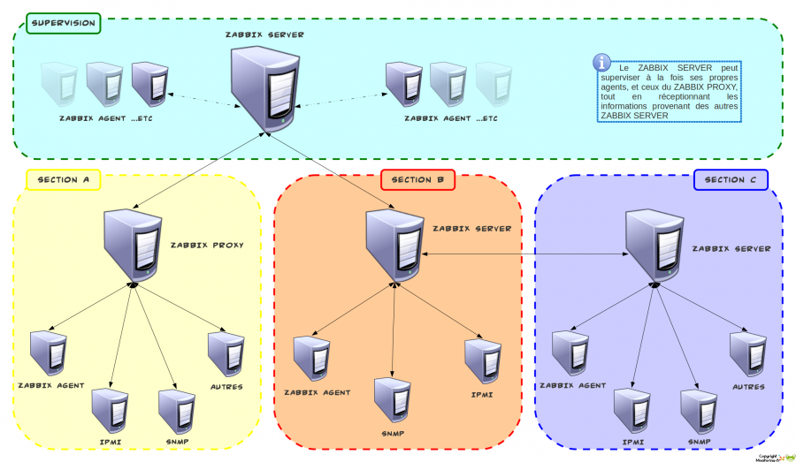

zabbix:zabbix-work\_multiserveurproxy.png
=========================================

zabbix-work\_multiserveurproxy.png

← Retour à [Fonctionnement de
Zabbix](../../zabbix/zabbix-work.html "zabbix:zabbix-work")

Date:
:   2013/03/29 09:42
Nom de fichier:
:   zabbix-work\_multiserveurproxy.png
Format:
:   PNG
Taille:
:   394KB
Largeur:
:   2249
Hauteur:
:   1308

