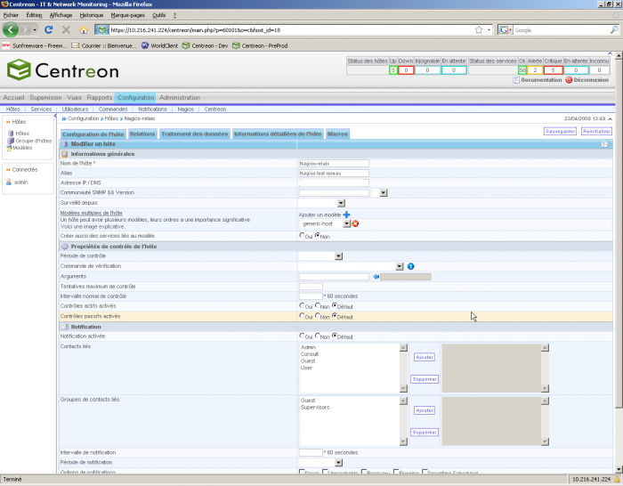
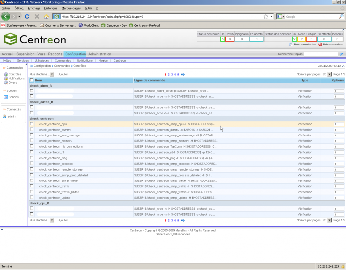

### Table des matières {.toggle}

-   [Manuel d'utilisation
    Centreon](start.html#manuel-d-utilisation-centreon)
    -   [Chapitre 1 - Installation](start.html#chapitre-1-installation)
    -   [Chapitre 2 - Interface](start.html#chapitre-2-interface)
        -   [Accueil](start.html#accueil)
        -   [Supervision](start.html#supervision)
        -   [Vues](start.html#vues)
        -   [Rapport](start.html#rapport)
        -   [Configuration](start.html#configuration)
        -   [Administration](start.html#administration)
    -   [Chapitre 3 - Prise en
        main](start.html#chapitre-3-prise-en-main)
        -   [Ajout d'un hôte](start.html#ajout-d-un-hote)
        -   [Ajout d'un groupe
            d'hôtes](start.html#ajout-d-un-groupe-d-hotes)
        -   [Ajout d'une commande](start.html#ajout-d-une-commande)
        -   [Ajout d'un service](start.html#ajout-d-un-service)
        -   [Suppression d'un
            service](start.html#suppression-d-un-service)
        -   [Mise à jour de la
            configuration](start.html#mise-a-jour-de-la-configuration)
        -   [Paramétrage d’un compte utilisateur en lecture
            seule](start.html#parametrage-d-un-compte-utilisateur-en-lecture-seule)
        -   [Personnaliser l'apparence des
            courbes](start.html#personnaliser-l-apparence-des-courbes)

Manuel d'utilisation Centreon {#manuel-d-utilisation-centreon .sectionedit1}
=============================

Chapitre 1 - Installation {#chapitre-1-installation .sectionedit2}
-------------------------

**[Installation de Centreon 2.1 sur CentOS
5.3](../../../../centreon/centreon-centos-install.html "centreon:centreon-centos-install")**

**[Installation Nagios / Centreon sur RedHat
EL](../../../../centreon/centreon-redhat-install.html "centreon:centreon-redhat-install")**

Chapitre 2 - Interface {#chapitre-2-interface .sectionedit3}
----------------------

### Accueil {#accueil .sectionedit4}

#### Tactical Overview

Il s’agit de la vue d’accueil après s’être connecter à Centreon.

#### Santé Globale {#sante-globale}

Cette vue vous permet d’avoir en représentation dite en “camembert”, un
état de santé globale de votre supervision.

#### Statistique de Nagios

Dans cette vue, vous allez retrouvez les performances de votre
supervision (temps de check, latence …) et des graphiques traçant
l’historique de performance de chacun de vos instances.

-   Temps de check, latence

-   Graphique de performance des “Pollers”

### Supervision {#supervision .sectionedit5}

La vue de Supervision va vous permettre d’accéder à vos hôtes et
services supervisés. Plusieurs vues s’offrent à vous selon les
préférences de chacun.

#### Les Hôtes {#les-hotes}

#### Les services

Petit passage sur la vue du détails d’un service

#### Les journaux d'évènements {#les-journaux-d-evenements}

Dans cette vue, vous aurez accès à tout l’historique des eventlogs
concernant Centreon (Nagios)

### Vues {#vues .sectionedit6}

Cette vue permet de voir, créer, paramétrer des templates de graphiques
pour les exploiter ensuite pour vos hôtes et services.

### Rapport {#rapport .sectionedit7}

Cette vue vous permet d’avoir des statistiques de fiabilité sur une
période de temps données.

### Configuration {#configuration .sectionedit8}

Le chapitre sur les vues de la configuration de Centreon est assez
imposant car cette GUI est très complète ce qui peut la rendre complexe
aux yeux des débutants.

#### Hôtes {#hotes}

Dans cette vue, vous allez pouvoir créer et paramétrer vos hôtes pour
qu’ils soient ensuite injectés dans Nagios. Concernant la création d’un
hôte, veuillez vous référer aux Chapitre 3 - **[Ajout d'un
hôte](../../../../centreon/manuel-utilisation/start.html#ajout-d-un-hote "centreon:manuel-utilisation:start")**

#### Services

Dans cette vue, vous allez pouvoir créer et paramétrer vos services pour
qu’ils soient ensuite injectés dans Nagios. Concernant la création d’un
service, veuillez vous référer aux Chapitre 3 - **[Ajout d'un
service](../../../../centreon/manuel-utilisation/start.html#ajout-d-un-service "centreon:manuel-utilisation:start")**

#### Utilisateurs

Dans cette vue, vous allez pouvoir créer et paramétrer vos utilisateurs.
Concernant la création d’un utilisateur, veuillez vous référer aux
Chapitre 3 - **[Paramétrage d’un compte utilisateur en lecture
seule](../../../../centreon/manuel-utilisation/start.html#parametrage-d-un-compte-utilisateur-en-lecture-seule "centreon:manuel-utilisation:start")**

#### Commandes

Dans cette vue, vous allez pouvoir créer et paramétrer vos commandes.
Concernant la création d’une commande, veuillez vous référer aux
Chapitre 3 - **[Ajout d'une
commande](../../../../centreon/manuel-utilisation/start.html#ajout-d-une-commande "centreon:manuel-utilisation:start")**

#### Notifications

Pour des explications sur le contenu de cette vue –\> cf:image
ci-dessous

#### Nagios

La vue suivante vous permet de gérer la configuration générale, les
ressources de nagios et d’injecter la configuration Centreon dans le
répertoire etc de nagios pour qu’il prenne en compte vos modifications.
Mais toute cette partie là est expliquée plus en détails dans le
Chapitre 3 - **[Export de la configuration Centreon vers
Nagios](http://wiki.monitoring-fr.org/centreon/manuel-utilisation/export-centreon-nagios "centreon:manuel-utilisation:export-centreon-nagios")**

#### Centreon

La vue suivante s’appelle Centreon mais est plus orienté sur la gestion
de NDO et de la supervision en mode distribuée. On peut y déclarer des
collecteurs. Cette partie est détaillée dans le Chapitre 3 - **[Comment
passer sa supervision Centreon en Distribuée
?](http://wiki.monitoring-fr.org/centreon/manuel-utilisation/centreon-supervision-distribuee "centreon:manuel-utilisation:centreon-supervision-distribuee")**

### Administration {#administration .sectionedit9}

#### Options

On retrouve dans cette vue les points de configurations fondamentaux de
Centreon (le répertoire où il est installé, options d’affichage, etc ….)

#### Modules

Cette vue sert à créer vos modules pour les greffer à Centreon.

#### ACL

Dans cette vue, vous pourrez gérer les rôles et droits d’accès pour vos
utilisateurs.

#### Base de données {#base-de-donnees}

Cette vue vous permet de garder un oeil sur la taille de votre base NDO.
Grâce à cela, vous pourrez réagir si ça taille devient trop imposante
(ce qui pourrait conduire à des pertes de performances).

#### Sessions

Comme son nom l’indique, cette vue vous permet de voir les utilisateurs
se connectant sur le portail de supervision.

#### Etat du serveur

Cette vue vous permet d’avoir un état de santé globale de votre serveur
Centreon sans avoir à aller dans un terminal et taper des commandes
linux.

#### A propos

Petite page bien utile qui présence tout d’abord les contributeurs de ce
projet. Mais cette page rassemble des outils bien utiles comme le Wiki
de Centreon par exemple.

Chapitre 3 - Prise en main {#chapitre-3-prise-en-main .sectionedit10}
--------------------------

### Ajout d'un hôte {#ajout-d-un-hote .sectionedit11}

La configuration d’un hôte peut être assez fastidieuse car elle comporte
un grand nombre de paramètres à fixer. Cependant, il est possible et
fortement recommandé d’utiliser les templates (modèles) pour les hôtes
afin de faciliter le travail. Ces modèles permettent de définir les
paramètres par défaut. De base, Centreon définit tout un ensemble de
templates, dans le cadre du projet, nous utilisons, pour le moment le
template « generic-host ».

Nous précisons les paramètres essentiels pour configurer un hôte.

**Nom de l’hôte :** C’est le nom qui va l’identifier pour Nagios et
Centreon

**Alias :** Le « surnom » de l’hôte. On peut aussi mettre des
informations supplémentaires (localisation…)

**Adresse IP/DNS :** l’adresse IP

**Surveillé depuis :** Le collecteur qui va le superviser

**Modèle multiple de l’hôte :** Le template attaché pour cet hôte. Il
faut prendre « generic-host » par défaut.

Une fois ces paramètres renseignés, il est possible d’attacher, si
nécessaires cet hôte à un ou des groupes (champ Groupe d’hôtes parent).
Il est aussi possible de définir une « généalogie » pour les hôtes : on
définit des hôtes parents et /ou enfants. Cette notion permet de définir
une cartographie (ou plutôt généalogie) des hôtes.

Ex : On définit comme père un switch. Tous les serveurs « fils »
connectés au switch ne seront plus supervisés si celui-ci tombe.

### Ajout d'un groupe d'hôtes {#ajout-d-un-groupe-d-hotes .sectionedit12}

Il est souvent pratique de regrouper les hôtes pour améliorer
l’affichage et la gestion des services dans Centreon. Par exemple, on
peut souhaiter regrouper les hôtes par type d’OS, par environnements
applicatifs, par type de matériels…

Pour ajouter ou modifier un groupe d’hôtes, il faut se rendre dans
l’onglet Configuration → Hôtes → Groupe d’hôtes. Il suffit ensuite de
compléter la page, en spécifiant le nom du groupe, son alias (« surnom
») et les membres de ce groupe.

### Ajout d'une commande {#ajout-d-une-commande .sectionedit13}

Un service, dans Centreon (ou Nagios) définit une tâche « logique » à
effectuer sur un hôte (contrôle d’un serveur web, contrôle des données
systèmes…). Le travail réel est effectué par le plugin (programme,
script… sur le collecteur ou en local sur l’hôte, par exemple
check\_http pour le contrôle d’un service web). Pour faire le lien entre
le service et le plugin qui doit être lancé, il faut définir des
commandes. Une commande correspond à l’exécution du plugin en ligne de
commande, avec les paramètres nécessaires.

Pour ajouter ou modifier une commande, il faut se rendre dans l’onglet
Configuration → Commandes → Contrôles. Sur la page s’affiche toutes les
commandes déjà connues et qu’il est possible de modifier.

Si on souhaite ajouter une commande, il suffit de cliquer sur ajouter.

Les paramètres pour la définition d’une commande sont les suivantes :

**Nom de la commande :** c’est le nom qui va être sélectionnable quand
nous allons définir un service.

**Ligne de commande :** c’est ici que l’on construit la commande qui va
être lancée par Nagios. Centreon propose des menus déroulants afin de
faciliter cette construction.

-   Le premier menu donne accès aux macros utilisateurs (par défaut la
    macro \$USER1\$ contient le chemin des plugins).
-   Le deuxième menu permet de sélectionner le plugin qui doit être
    utilisé.
-   Le troisième menu permet de sélectionner les macros disponibles dans
    Nagios (ex \$HOSTADDRESS\$).

**Exemple d’arguments :** Ces deux cases permettent de tester une
commande et de définir les valeurs par défaut lors de la définition d’un
service.

**Type de commande :** On laisse la valeur par défaut « vérification ».

**Modèle de graphique :** On peut laisser ce champ vide ou utiliser un
des modèles proposés.

### Ajout d'un service {#ajout-d-un-service .sectionedit14}

Une fois l’hôte et la commande renseignés, nous allons pouvoir définir
un service attaché au serveur supervisé. Pour ajouter ou modifier un
service, il faut se rendre dans l’onglet Configuration → Services. Sur
la page s’affiche tous les services par hôte.

Pour ajouter un service, il suffit donc de sélectionner Ajouter et de
commencer la configuration. Comme pour les hôtes, il y a un grand nombre
de paramètres à définir. Il est donc aussi fortement conseillé
d’utiliser les templates pour faciliter la configuration du service. Par
défaut nous utilisons le template generic-service.

Sur la page Configuration du service, nous allons renseigner les
paramètres suivants :

**Description :** C’est le nom du service qui sera affiché dans la page
de supervision

**Modèle de service :** Le template utilisé, par défaut nous prenons
generic-service.

**Commande de vérification :** c’est ici que l’on précise la commande à
utiliser.

**Arguments :** les arguments de la commande. Le format est !arg1 !arg2
!arg3 !….

Pour les options de notifications, si elle sont différentes de celle du
template :

**Contacts liés :** les contacts à notifier

**Groupe de contacts liés :** les groupes de contacts à notifier

Sur la page Relations, nous allons faire le lien entre le service et
le/les hôtes. Il est possible d’attacher un service à un ou plusieurs et
à un ou plusieurs groupes d’hôtes. NB : si un service est attaché à un
groupe d’hôte, il apparaîtra dans le sous-menu Services par Groupe
d’hôtes et non pas Services par hôte.

### Suppression d'un service {#suppression-d-un-service .sectionedit15}

Ce paragraphe traite de la manière de supprimer un service pour un ou
plusieurs hôtes ou groupe d’hôtes. Lorsque l’on se connecte sur la page
de configuration de services, nous voyons les services définis pour les
hôtes. Il y a deux « types » de services : ceux qui sont liés à un seul
hôte et ceux qui sont liés à un ensemble d’hôtes (ceux-ci apparaissent
surlignés en orange).

Dans la capture d’écran ci-dessous, nous pouvons voir que les service /,
load et memory sont attachés uniquement à l’hôte Centreon. Par contre le
service ping est attaché à Centreon mais aussi à d’autres machines
(deuxième capture d’écran).

Pour supprimer le service load, il suffirait de le sélectionner et de
choisir Supprimer dans l’onglet Plus d’actions. Par contre, dans le cas
du service ping, si on effectue la même action, nous allons supprimer le
service non seulement pour l’hôte Centreon mais aussi pour tous les
hôtes pour lesquels le service est attaché.

Si on souhaite supprimer le service ping uniquement pour l’hôte
Centreon, il faut modifier la définition du service, en allant dans
l’onglet Relations et en supprimant l’hôte Centreon de la sélection.

### Mise à jour de la configuration {#mise-a-jour-de-la-configuration .sectionedit16}

Lorsque l’on modifie la configuration dans Centreon, on ne fait que
modifier l’état de la base Centreon. Les modifications ne sont pas
encore prises en compte par les différents collecteurs Nagios. Pour
effectuer cette mise à jour, il faut se rendre : **Configuration →
Nagios → Générer**

Il est possible de choisir sur quel collecteur (ou bien tous), nous
souhaitons générer la configuration. Il est possible de seulement
générer la configuration sans redémarrer les collecteurs Nagios ou de
redémarrer aussi les collecteurs (on coche Redémarrer Nagios et on
choisit ma méthode Redémarrer). Une fois la sélection faite, on valide
en cliquant sur Exporter.

### Paramétrage d’un compte utilisateur en lecture seule {#parametrage-d-un-compte-utilisateur-en-lecture-seule .sectionedit17}

#### Création du compte {#creation-du-compte}

Tout d’abord, il faut que l’on créé un compte utilisateur de
consultation dans centreon. Il faut aller dans l’onglet **Configuration
–\> Utilisateurs –\> Ajouter**

Ensuite, nous allons renseigner notre utilisateur comme ci-dessous (cf
capture) :

**Nom complet :** Henri\_Dicule

**Alias/login :** Henri\_Dicule

**Email :** henri.dicule@localhost (adresse factice)

**Autorisé à se connecter à l’interface Web :** Oui

**Mot de passe :** hdicule

**Administrateur :** Non

**Options de notifications d’hôte :** None

**Période de notifications d’hôte :** none

**Commande de notification d’hôte :** host-notify-by-email

**Options de notifications de service :** None

**Période de notifications de service :** none

**Commande de notification de service :** service-notify-by-email

Maintenant que notre compte est créé, nous allons nous intéresser à ces
droits.

#### Gestion des ACL (mode en lecture seule)

##### Création du groupe d’accès {#creation-du-groupe-d-acces}

Il faut créer un groupe d’accès pour y rattacher notre compte. Il faut
aller dans l’onglet **Administration –\> ACL –\> Gestion des groupes
d’accès –\> Ajouter**

Ensuite, il faut déclarer le groupe d’accès comme ci-dessous :

##### Création du paramétrage « lecture seule » {#creation-du-parametrage-lecture-seule}

Il faut aller dans l’onglet **Administration –\> ACL –\> Gestion des
accès aux menus –\> Ajouter**

Il faut paramétrer l’accès aux différentes vues comme ci-dessous :

##### Paramétrage de visualisation du contenu {#parametrage-de-visualisation-du-contenu}

Il est possible dans centreon d’autoriser à un utilisateur la
vsualisation d’une ou plusieurs machines. Pour se faire, il faut
procéder de la manière suivante :

Aller dans **Administration –\> ACL –\> Gestion des accès aux ressources
–\> Ajouter**

Dans l’onglet Informations Générales, rentrer les informations comme
ci-dessous :

Ensuite, dans l’onglet Hosts Resources, vous allez pouvoir définir quels
hôtes votre utuilisateur à le droit de voir.

Même chose pour les services, aller dans Services Resources :

Vous pouvez maintenant sauvegarder, pensez à Recharger les ACL et
essayer votre nouveau compte utilisateur.

### Personnaliser l'apparence des courbes {#personnaliser-l-apparence-des-courbes .sectionedit18}

Ceci est la documentation pour la version 2.1.x. La gestion des courbes
à un peu changé dans Centreon 2.2.

Dans Centreon, à partir du moment ou vos plugins remontent des données
de performance, il est possible d’obtenir des courbes affichant
l’évolution des mesures dans le temps. Par exemple si vous surveillez le
trafic des interfaces de vos routeurs, le plugin renvois deux données de
performances : le trafic en entrées et en sortie. Centreon utilise ces
données pour alimenter des bases rrd et utilise le contenu de ces bases
pour générer des graphiques.

Le problème est que Centreon génère les graphiques possédant plusieurs
courbe avec une seule couleur pour l’ensemble des courbes. Cela n’aide
pas forcément à interpréter ce type de graphique par exemple :

Centreon nous aide (un peu) à personnaliser les couleurs des différentes
courbes). Pour cela il faut aller dans : le menu vue puis graphiques
puis courbes.

Centreon affiche ensuite la liste des modèles de courbes et leurs
principales propriétés :

