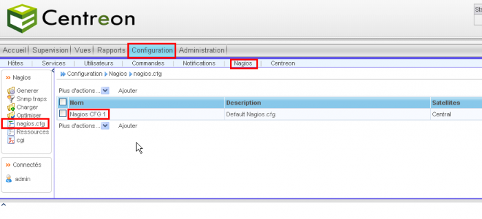

### Table des matières {.toggle}

-   [Installation MKLivestatus & Intégration dans
    Centreon](mklivestatus-install-integration-centreon.html#installation-mklivestatus-integration-dans-centreon)
    -   -   [Installation](mklivestatus-install-integration-centreon.html#installation)
        -   [Intégration dans
            Centreon](mklivestatus-install-integration-centreon.html#integration-dans-centreon)

Installation MKLivestatus & Intégration dans Centreon {#installation-mklivestatus-integration-dans-centreon .sectionedit1}
=====================================================

### Installation {#installation .sectionedit2}

Nous allons installer MKLiveStatus via les sources.

~~~~ {.code .bash}
cd /tmp
wget http://mathias-kettner.de/download/mk-livestatus-1.1.3.tar.gz
tar -xvzf mk-livestatus-1.1.3.tar.gz
cd mk-livestatus-1.1.3
~~~~

~~~~ {.code .bash}
./configure
~~~~

~~~~ {.code .bash}
make
~~~~

On copie le fichier livestatus.o dans le répertoire bin de Nagios.

~~~~ {.code .bash}
cp src/livestatus.o /usr/local/nagios/bin/
~~~~

### Intégration dans Centreon {#integration-dans-centreon .sectionedit3}

-   **Le module de courtage MKLiveStatus doit être installé. (cf
    procédure [Installation MKLivestatus & Intégration dans
    Centreon](../../../centreon/mklivestatus-install-integration-centreon.html "centreon:mklivestatus-install-integration-centreon")**
    )

-   **Le patch Multi Broker pour Centreon doit être installé pour les
    versions de Centreon inférieures à 2.2. (cf procédure [Installation
    du patch Multi Broker pour
    Centreon](../../../centreon/multi-broker-patch-install.html "centreon:multi-broker-patch-install")**
    )

Dans Centreon, allez dans **Configuration –\> Nagios –\> nagios.cfg**,
éditer le *Nagios CFG 1* et ajoutez le broker module livestatus comme
ci-dessous :

*\* /usr/local/nagios/bin/livestatus.o /usr/local/nagios/var/rw/live*

Et Sauvegardez.

Pour finir, Repoussez la configuration à l’aide de l’interface Centreon.
