### Table des matières {.toggle}

-   [Superviser un Autocom OXE V9.x Alcatel-Lucent sous
    Centreon/Nagios](superviser-oxe-alcatel.html#superviser-un-autocom-oxe-v9x-alcatel-lucent-sous-centreonnagios)
    -   [Configuration du SNMP sur
        l'OXE](superviser-oxe-alcatel.html#configuration-du-snmp-sur-l-oxe)
    -   [Configuration du serveur
        Centreon/Nagios](superviser-oxe-alcatel.html#configuration-du-serveur-centreonnagios)
        -   [Configuration des Mibs et Traps
            SNMP](superviser-oxe-alcatel.html#configuration-des-mibs-et-traps-snmp)
        -   [Création du service passif
            TRAP\_OXE](superviser-oxe-alcatel.html#creation-du-service-passif-trap_oxe)
        -   [Création de la commande
            gestion\_trap\_oxe](superviser-oxe-alcatel.html#creation-de-la-commande-gestion_trap_oxe)
        -   [Résultat](superviser-oxe-alcatel.html#resultat)

Superviser un Autocom OXE V9.x Alcatel-Lucent sous Centreon/Nagios {#superviser-un-autocom-oxe-v9x-alcatel-lucent-sous-centreonnagios .sectionedit1}
==================================================================

Le but de ce tutorial est de faire remonter au serveur Centreon/Nagios
les traps des OXE Alcatel ainsi que l’état des cartes, état des T2…\
 La méthode n’est peut être pas très académique mais elle marche
parfaitement. Elle est en prod et permet la supervision de 4 appliances
Alcatel R9 et d’environ 60 alvéoles (cristal et IPMG) pour environ 5000
usagers.

Ce tutoriel a été réalisé par :

  **Rôle**        **Nom**
  --------------- --------------------------------------------------------------------------------------------------------------------------------------------------------------------------------------------------------------------------
  **Rédacteur**   [Pascal MARTIN](../../../cdn-cgi/l/email-protection.html#6b4d48135d0f504d48135d5a504d48135d52504d48135d08504d48135f5b504d48135c5b504d48135d0f504d48135d5a504d48135c59504d48135c5f504d48135d52X;n.net "mail@pmartin.net")

Configuration du SNMP sur l'OXE {#configuration-du-snmp-sur-l-oxe .sectionedit3}
-------------------------------

2 solutions pour activer le SNMP sur l’autocom :

-   En ligne de commande : se loguer avec le compte **mtcl** puis lancer
    le **mgr**.

[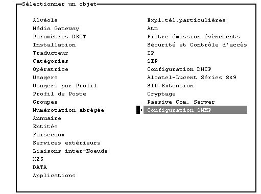](../../../_detail/powered/centreon/tutooxe-001.png@id=centreon%253Asuperviser-oxe-alcatel.html "powered:centreon:tutooxe-001.png")

-   Via la 4760

[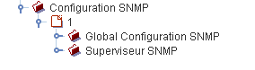](../../../_detail/powered/centreon/tutooxe-002.png@id=centreon%253Asuperviser-oxe-alcatel.html "powered:centreon:tutooxe-002.png")

Dans la partie **Configuration SNMP/Global configuration** : nous
**activons SNMP** et paramétrons sa **communauté** et sa **version**. \
 Dans la partie **Configuration SNMP/Global configuration** : nous
ajoutons l’**adresse IP** du serveur Nagios, sa **communauté** et le
type de trap à **Etendu**.

Attention aux filtres d’évènements éventuels dans la partie
**Applications/Gestion des Incidents**

Configuration du serveur Centreon/Nagios {#configuration-du-serveur-centreonnagios .sectionedit4}
----------------------------------------

### Configuration des Mibs et Traps SNMP {#configuration-des-mibs-et-traps-snmp .sectionedit5}

Considérons que snmpd est correctement configuré sur le serveur.

-   Copier les Mibs Alcatel-Lucent suivantes **A4400-CPU-MIB.txt,
    A4400-RTM-MIB.txt et HPOV-NNM.txt** dans le répertoire des mibs
    (Généralement **/usr/local/share/snmp/mibs/**).
-   Ajouter Alcatel-Lucent dans la liste des constructeurs par le **Menu
    Configuration/Services/Manufacturer/Ajouter**

[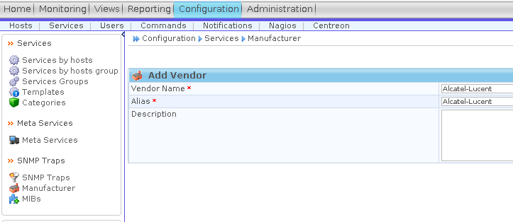](../../../_detail/powered/centreon/tutooxe-004.png@id=centreon%253Asuperviser-oxe-alcatel.html "powered:centreon:tutooxe-004.png")

-   Puis effectuer l’import de la mib **TRAP-MIB.txt** sous Centreon
    afin de traduire les traps **Menu Configuration/Services/MIBS**
    (Attention à bien sélectionner le Vendor Name Alcatel-Lucent) :

-   Ensuite, il vous faut créer le trap Trap\_OXE avec comme OID :
    .1.3.6.1.4.1.637.64.0.10.1.2
-   Puis le Trap\_OXE\_V9 avec comme OID :
    .1.3.6.1.4.1.637.64.0.10.1.2.0.3 ( L’oid est différent à partir de
    la version 9 )

[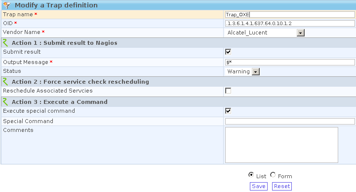](../../../_detail/powered/centreon/tutooxe-013.png@id=centreon%253Asuperviser-oxe-alcatel.html "powered:centreon:tutooxe-013.png")\

[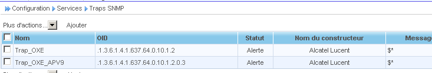](../../../_detail/centreon/screenshot191.png@id=centreon%253Asuperviser-oxe-alcatel.html "centreon:screenshot191.png")\

Les OXE alcatel envoient toutes les alertes dans une même trap ce qui
complique l’interprétation des différents évènements par Nagios.

### Création du service passif TRAP\_OXE {#creation-du-service-passif-trap_oxe .sectionedit6}

Que l’on appliquera à un hôte ou groupe d’hôte.
\

[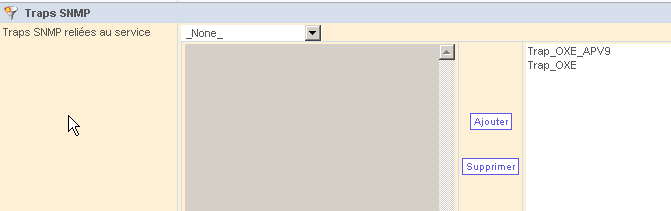](../../../_detail/centreon/screenshot189.png@id=centreon%253Asuperviser-oxe-alcatel.html "centreon:screenshot189.png")\
 **Très important** ⇒ Dans l’onglet **Traitement des données** on active
le gestionnaire d’évènements vers une commande que l’on décrire ensuite.
[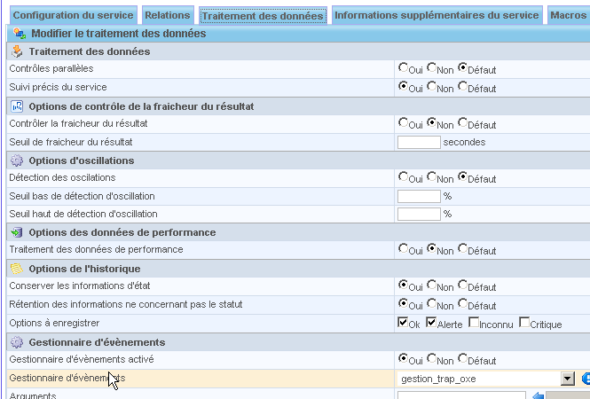](../../../_detail/centreon/screenshot190.png@id=centreon%253Asuperviser-oxe-alcatel.html "centreon:screenshot190.png")\

### Création de la commande gestion\_trap\_oxe {#creation-de-la-commande-gestion_trap_oxe .sectionedit7}

[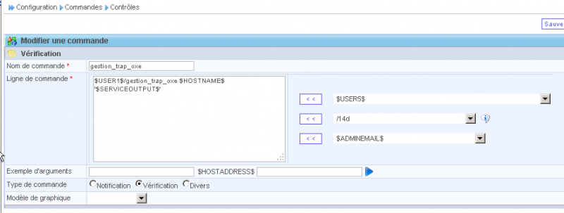](../../../_detail/centreon/screenshot192.png@id=centreon%253Asuperviser-oxe-alcatel.html "centreon:screenshot192.png")\

Puis créer le script **gestion\_trap\_oxe** dans la directory
nagios/libexec qui permettra d’écrire dans nagios.cmd (fichier de
commande externe de Nagios)

Le script peut surement être optimisé ! Spécialistes perl bien venu!

~~~ {.code .perl}
#! /usr/bin/perl -w
###################################################################
# Recuperation des trap snmp venant des PabX OXE  R9.0
#
#
#
#
#
#
###################################################################
#
####################################################################
#
# Script init
#
 
# Arguments:
#  $1 = host_name (Short name of host that the service is
#       associated with)
#  $2 = svc_description (Description of the service)
#  $3 = state_string (A string representing the status of
#       the given service - "OK", "WARNING", "CRITICAL"
#       or "UNKNOWN")
#  $4 = plugin_output (A text string that should be used
#       as the plugin output for the service checks)
#
 
 
 
my $host = $ARGV[0];
my $output = $ARGV[1];
my @tab = "a";
my $states = "0";
my $svc_dest = "";
my $commandfile = '/usr/local/nagios/var/rw/nagios.cmd';
my $date=`date`;
 
@tab = split /\ /, $output;
 
if ($tab[13] =~ /^[0-9]{4}/) {
my $incident = $tab[18];
                SWITCH: {
                        $incident == "1125" && do {
                                        $states = "0";
                                        $svc_dest = "OXE_login";
                                        $desc_alarm ="Login sur le pabx par $tab[22]" . " $date";
                                        print "\$var = 1\n";
                                        last SWITCH; };
 
                        $incident == "311" && do {
                                        $states = "1";
                                        $svc_dest = "OXE_T2_alv_$tab[6]";
                                        $desc_alarm ="$host : Etablissement Niveau 2 T2 ACT: $tab[6] Carte: $tab[8]" . " $date";
                                        last SWITCH; };
 
                        $incident == "310" && do {
                                        $states = "2";
                                        $svc_dest = "OXE_T2_alv_$tab[6]";
                                        $desc_alarm ="$host : Perte acces Niveau 2 T2 ACT: $tab[6] Carte: $tab[8]" . " $date";
                                        last SWITCH; };
 
                        $incident == "1025" && do {
                                        print "\$var = 2\n";
                                        last SWITCH; };
 
                        $incident == "1026" && do {
                                        print "\$var = 3\n";
                                        last SWITCH; };
                        print "\$var is not equal with 1 or 2 or 3\n";
 
                                }
 
} elsif ($tab[9] =~ /^[0-9]{4}/) {
                my $incident = $tab[14];
                SWITCH: {
 
                        $incident == "2019" && do {
                                        $states = "0";
                                        $svc_dest = "OXE_alv_$tab[6]";
                                        $desc_alarm ="$host : mise en service de ACT: $tab[6] Carte: $tab[8] $output" . " $date";
                                        last SWITCH; };
 
                        $incident == "2042" && do {
                                        $states = "2";
                                        $svc_dest = "OXE_alv_$tab[6]";
                                        $desc_alarm ="$host : perte de ACT: $tab[6] carte:$tab[8] $output" . " $date";
                                        last SWITCH; };
 
                        print "\$var is not equal with 1 or 2 or 3\n";
                                }
 
}
 else {
        die ("quit");
    $states = "1";
        $svc_dest = "OXE_alarme_inconnue";
        $desc_alarm ="$output";
}
 
 
 
        open(ECRITURE,">$commandfile") || die ("erreur d'ouverture de sortie.txt");
        print ECRITURE "[%lu] PROCESS_SERVICE_CHECK_RESULT;$host;$svc_dest;$states;$desc_alarm\n";
        print ECRITURE "[%lu] PROCESS_SERVICE_CHECK_RESULT;$host;Trap_OXE;0;OK";
        close(ECRITURE);
~~~

Ce scipt va donc déclencher via, une commande externe Nagios, le statut
warning sur les services passif (dans script : \$svc\_dest) OXE\_alv\_x
…
[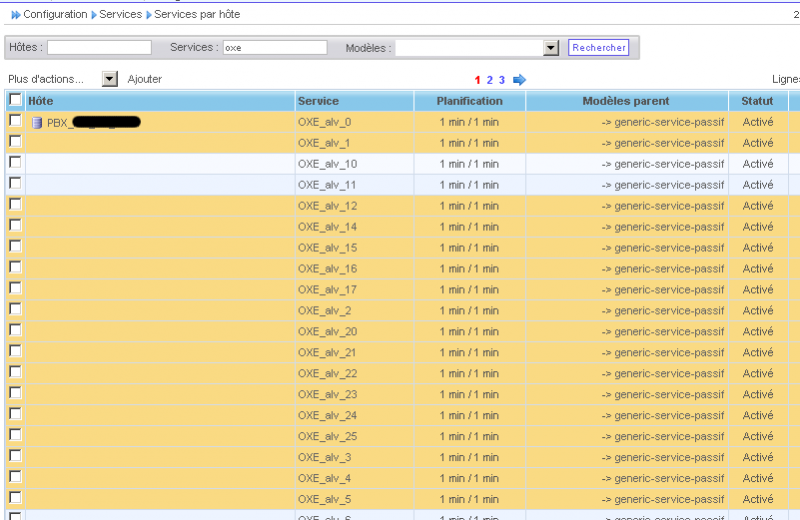](../../../_detail/centreon/screenshot193.png@id=centreon%253Asuperviser-oxe-alcatel.html "centreon:screenshot193.png")\

[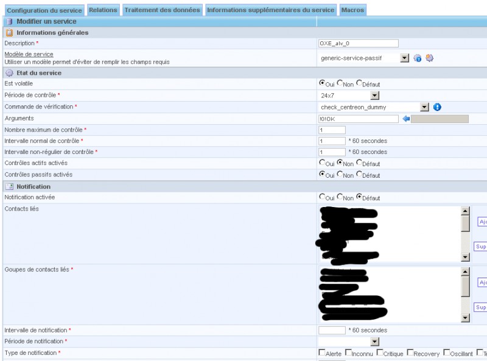](../../../_detail/centreon/screenshot194.png@id=centreon%253Asuperviser-oxe-alcatel.html "centreon:screenshot194.png")\

### Résultat {#resultat .sectionedit8}

Voici ce que ça donne comme résultat. Je me suis cantonné aux alertes
sur les cartes défectueuse, les pertes et retour des T2 et perte
d’alvéole.

[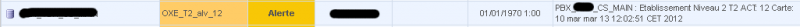](../../../_detail/centreon/screenshot195.png@id=centreon%253Asuperviser-oxe-alcatel.html "centreon:screenshot195.png")
[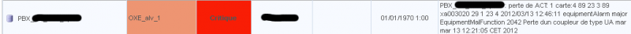](../../../_detail/centreon/screenshot196.png@id=centreon%253Asuperviser-oxe-alcatel.html "centreon:screenshot196.png")
