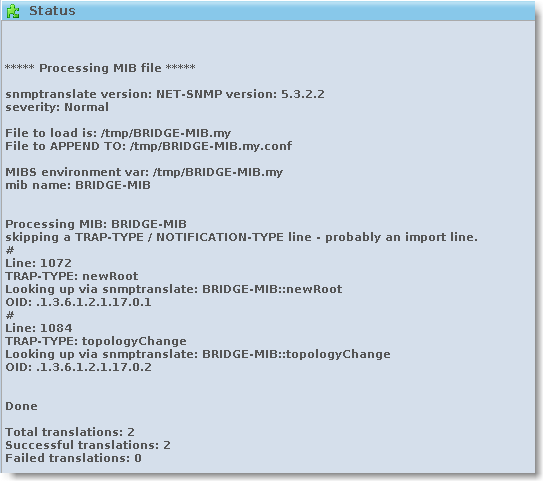
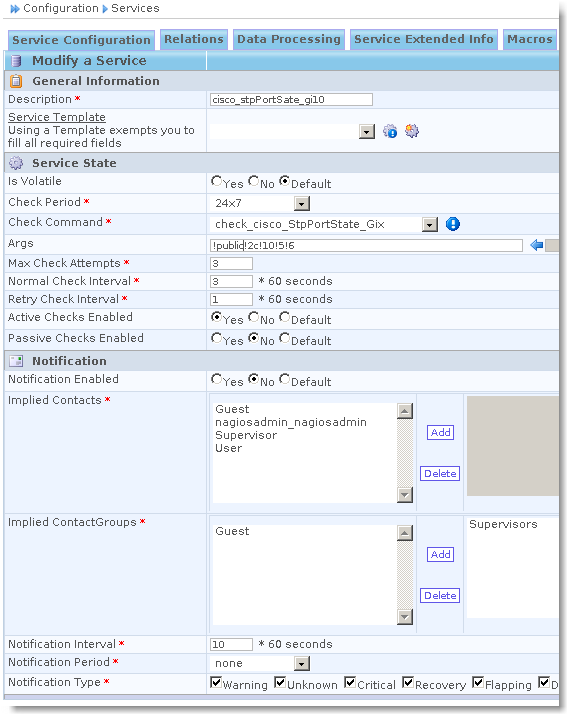

### Table des matières {.toggle}

-   [Superviser le spanning-tree sous
    Centreon/Nagios](superviser-spanning-tree.html#superviser-le-spanning-tree-sous-centreonnagios)
    -   [Configuration du switch
        Cisco](superviser-spanning-tree.html#configuration-du-switch-cisco)
    -   [Configuration du serveur
        Centreon/Nagios](superviser-spanning-tree.html#configuration-du-serveur-centreonnagios)
        -   [Configuration des Mibs et Traps
            SNMP](superviser-spanning-tree.html#configuration-des-mibs-et-traps-snmp)
        -   [Création du service passif afin de prendre en compte le
            Traps](superviser-spanning-tree.html#creation-du-service-passif-afin-de-prendre-en-compte-le-traps)
        -   [Création du service actif permettant de controler l'état
            STP de
            l'interface](superviser-spanning-tree.html#creation-du-service-actif-permettant-de-controler-l-etat-stp-de-l-interface)

Superviser le spanning-tree sous Centreon/Nagios {#superviser-le-spanning-tree-sous-centreonnagios .sectionedit1}
================================================

Contribution : — *[Pascal
Martin](../../../cdn-cgi/l/email-protection.html#6640451e50025d40451e50575d40451e505f5d40451e50055d40451e52565d40451e51565d40451e50025d40451e50575d40451e51545d40451e51525d40451e505fX;n.net "mail@pmartin.net")
2010/05/05 12:03*

Le but de ce Tuto est de faire remonter au serveur Centreon/Nagios un
changement de SpanningTree sur le réseau et de vérifier l’etat des
interfaces (au sens STP : blocking, Forwarding…)

Configuration du switch Cisco {#configuration-du-switch-cisco .sectionedit2}
-----------------------------

Activation d’un Spanning-tree MST:

~~~~ {.code}
spanning-tree mode mst
spanning-tree extend system-id
!
spanning-tree mst configuration
 name instance_mst1
 revision 1
~~~~

Configuration SNMP du switch (à adapter avec votre communauté SNMP et
l’adresse IP de votre serveur):

~~~~ {.code}
snmp-server community macommunauteSNMP RO
snmp-server enable traps bridge newroot topologychange
snmp-server host @ip_ServeurNagios macommunauteSNMP
~~~~

Configuration du serveur Centreon/Nagios {#configuration-du-serveur-centreonnagios .sectionedit3}
----------------------------------------

### Configuration des Mibs et Traps SNMP {#configuration-des-mibs-et-traps-snmp .sectionedit4}

Considérons que snmpd est correctement configuré sur le serveur.

-   Copier la Mib BRIDGE-MIB.my dans le répertoire des mibs
    (Généralement **/usr/local/share/snmp/mibs/**).
-   Puis effectuer l’import de la mib BRIDGE-MIB.my sous Centreon afin
    de traduire les traps **Menu Configuration/Services/MIBS** :

-   Nous constatons bien la prise en charge de 2 traps dont
    **TopologyChange** :

-   Nous pouvons modifier la sortie du trap TopologyChange afin que le
    message remonté dans Centreon soit plus parlant (Output
    Message)**Menu Configuration/Services/SNMP traps** :

-   Générer les fichiers de configuration des snmpTraps **Menu
    Configuration/Nagios/Snmp traps**

### Création du service passif afin de prendre en compte le Traps {#creation-du-service-passif-afin-de-prendre-en-compte-le-traps .sectionedit5}

-   Créer un nouveau service **Menu Configuration/Services/Add**

Onglet Service Configuration:

-   Dans l’onglet Relations, attribuer le service à un equipement
    configuré correctement et selectionner le trap qui nous interresse:

-   Dans l’onglet Data Processing, on pourra parametrer un Freshness
    Threshold:

### Création du service actif permettant de controler l'état STP de l'interface {#creation-du-service-actif-permettant-de-controler-l-etat-stp-de-l-interface .sectionedit6}

-   Tout d’abord nous allons créer une nouvelle commande de check **Menu
    Configuration/Commandes**

~~~~ {.code}
$ARG1$ = Communauté
$ARG2$ = version snmp
$ARG3$ = Numero de l'interface ( index)
$ARG4$ = Etat warning désiré (1=disabled 2=blocking 3=listening 4=learning 5=forwarding 6=broken) 
$ARG5$ = Etat Critique désiré (1=disabled 2=blocking 3=listening 4=learning 5=forwarding 6=broken)
~~~~

-   Puis enfin créer le service actif utilisant cette commande de Check.
    Ce service sera biensûr à rattacher un équipement réseau.

