### Table des matières {.toggle}

-   [Installation de
    EyesOfNetwork](eyesofnetwork-iso-install.html#installation-de-eyesofnetwork)

Installation de EyesOfNetwork {#installation-de-eyesofnetwork .sectionedit1}
=============================

Tutoriel sur l’installation de EyesOfNetwork.

Ce tutoriel a été réalisé par :

  **Rôle**        **Nom**
  --------------- ------------------
  **Rédacteur**   Romuald FRONTEAU

EON n’est installable que sur Centos via un format ISO. Vous avez le
choix entre le CD (645M, EON + dépendances) ou le dvd (3.7G, EON +
dépendances + tout CentOS). Personnellement, on a pris le dvd comme ça
on manquera de rien.

Pour commencer insérer votre cd ou dvd dans votre lecteur et c’est
parti.

-   Faire Suivant

[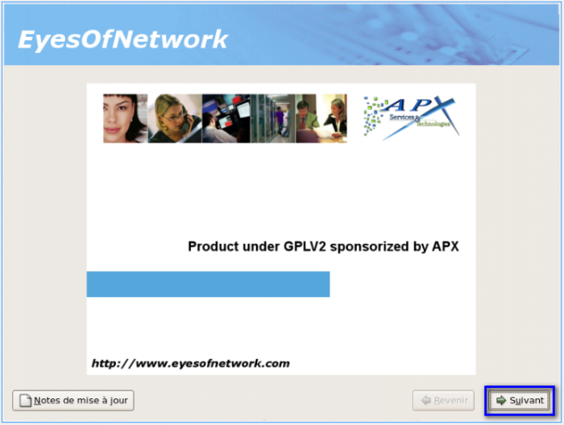](../../../_detail/eon-image1.png@id=eyesofnetwork%253Aeyesofnetwork-iso-install.html "eon-image1.png")

-   Choisir la langue, dans notre cas Français et faire suivant

[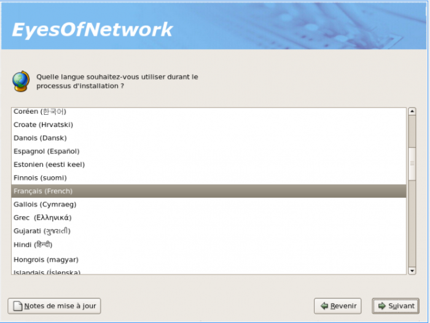](../../../_detail/eon-image2.png@id=eyesofnetwork%253Aeyesofnetwork-iso-install.html "eon-image2.png")

-   Choisir le clavier et faire suivant

[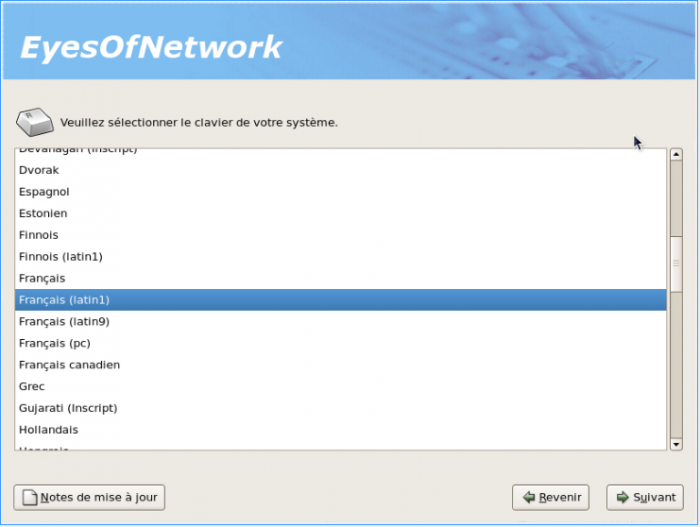](../../../_detail/eon-image3.png@id=eyesofnetwork%253Aeyesofnetwork-iso-install.html "eon-image3.png")

-   Ensuite, il vous demande de formater le disque (nous mettons « oui »
    car notre machine est vierge)

[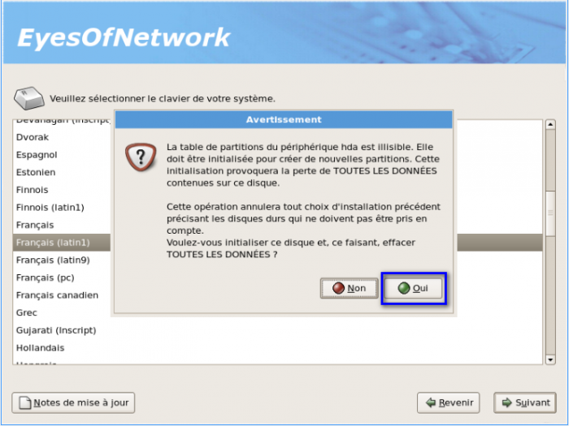](../../../_detail/eon-image4.png@id=eyesofnetwork%253Aeyesofnetwork-iso-install.html "eon-image4.png")

-   Sur l’image ci-dessous, vous pouvez choisir la manière dont vous
    allez gérer votre espace disque (pour notre cas, ce sera une
    installation par défaut)

[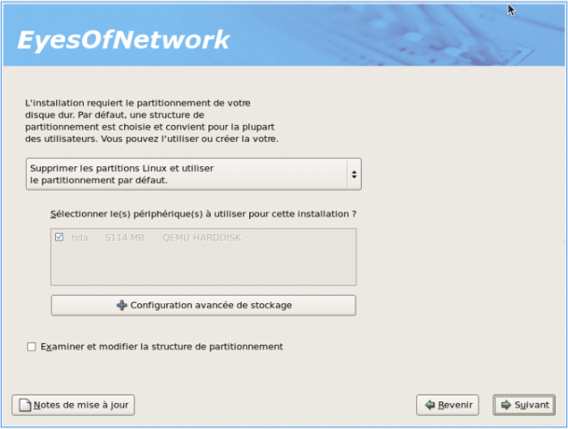](../../../_detail/eon-image5.png@id=eyesofnetwork%253Aeyesofnetwork-iso-install.html "eon-image5.png")

-   Confirmation de votre choix

[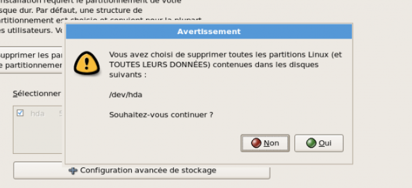](../../../_detail/eon-image6.png@id=eyesofnetwork%253Aeyesofnetwork-iso-install.html "eon-image6.png")

-   Paramétrage du réseau, Pour le DHCP, seulement faire suivant :

[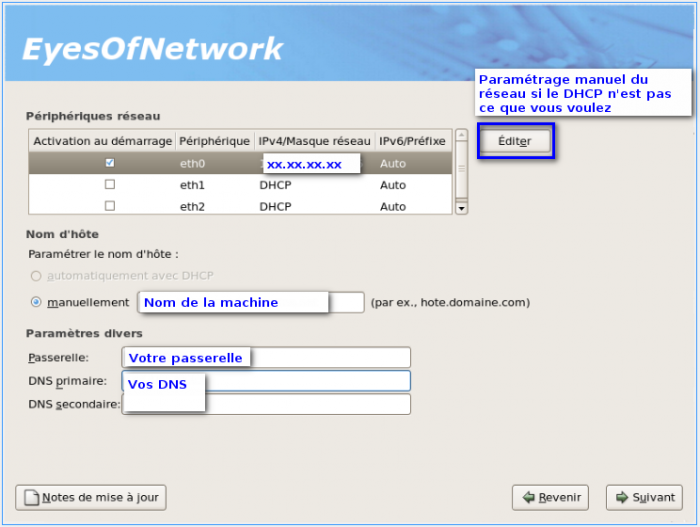](../../../_detail/eon-image7.png@id=eyesofnetwork%253Aeyesofnetwork-iso-install.html "eon-image7.png")

-   Fuseau Horaire

[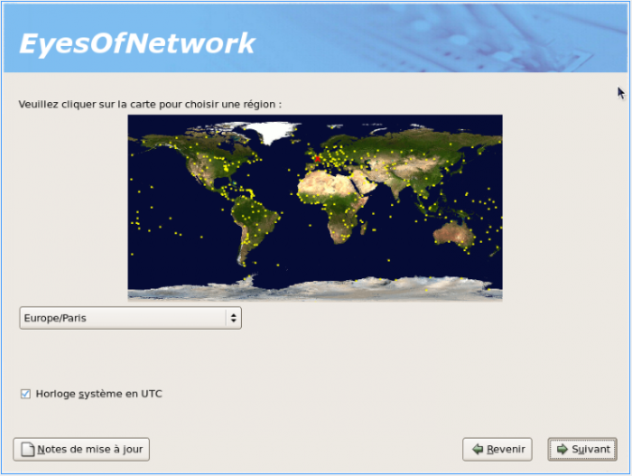](../../../_detail/eon-image8.png@id=eyesofnetwork%253Aeyesofnetwork-iso-install.html "eon-image8.png")

-   Mot de passe du compte root

[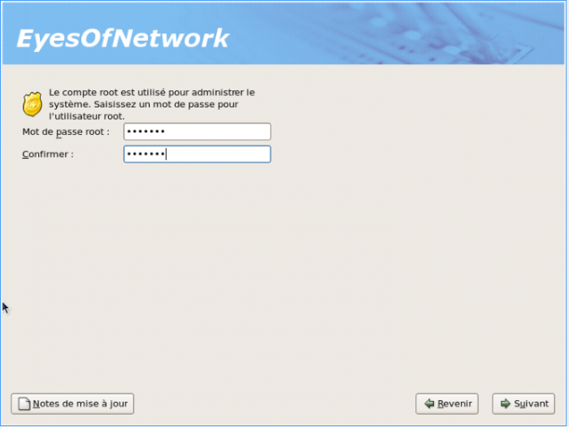](../../../_detail/eon-image9.png@id=eyesofnetwork%253Aeyesofnetwork-iso-install.html "eon-image9.png")

-   Dans notre cas, juste EyesOfNetwork nous intéresse, nous ne désirons
    aucune couche graphique

[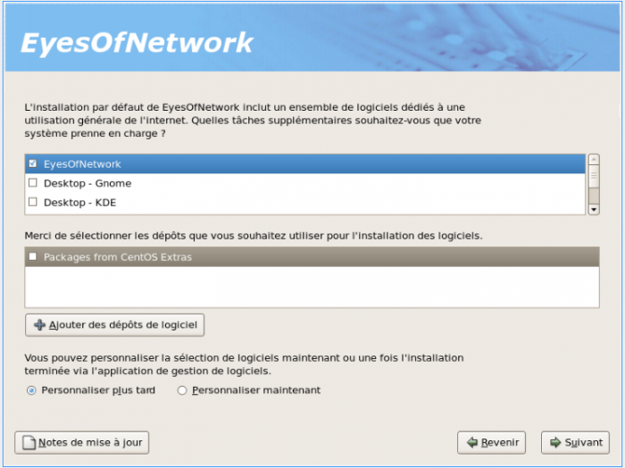](../../../_detail/eon-image10.png@id=eyesofnetwork%253Aeyesofnetwork-iso-install.html "eon-image10.png")

-   Faire Suivant

[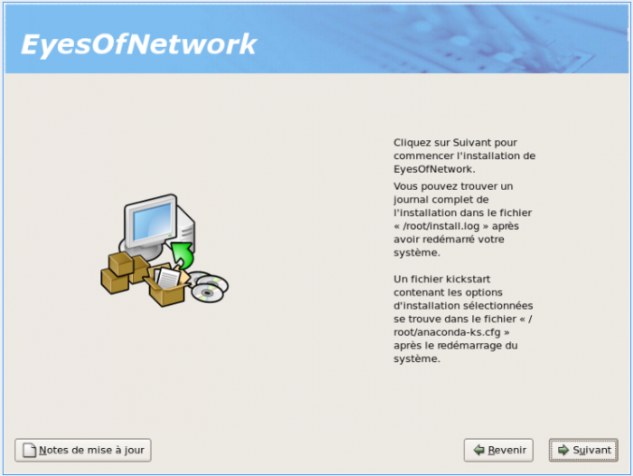](../../../_detail/eon-image11.png@id=eyesofnetwork%253Aeyesofnetwork-iso-install.html "eon-image11.png")

-   Démarrage de l’installation

[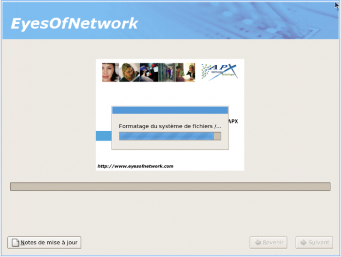](../../../_detail/eon-image12.png@id=eyesofnetwork%253Aeyesofnetwork-iso-install.html "eon-image12.png")

-   Redémarrage

[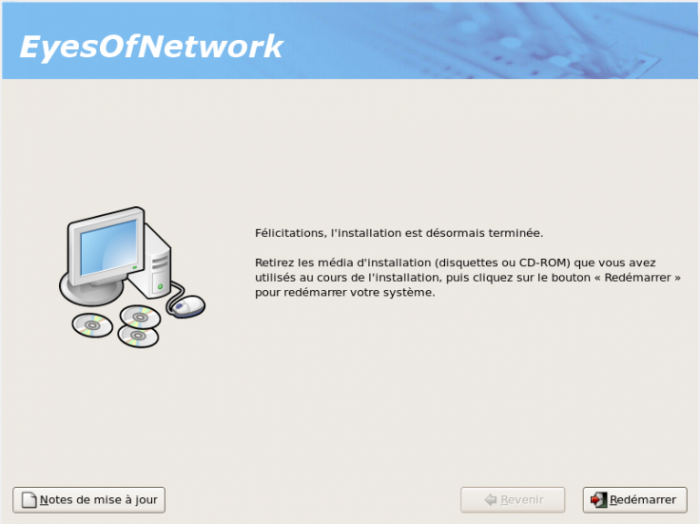](../../../_detail/eon-image13.png@id=eyesofnetwork%253Aeyesofnetwork-iso-install.html "eon-image13.png")
