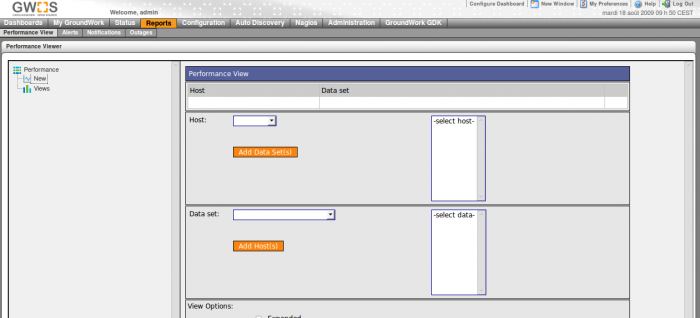

### Table des matières {.toggle}

-   [Installation de Groundwork Bêta 6.0 sur Ubuntu 8.0.4
    LTS](groundwork6.0-install-ubuntu.html#installation-de-groundwork-beta-60-sur-ubuntu-804-lts)
    -   [Pré-requis](groundwork6.0-install-ubuntu.html#pre-requis)
    -   [Installation](groundwork6.0-install-ubuntu.html#installation)
    -   [Présentation de
        l'interface](groundwork6.0-install-ubuntu.html#presentation-de-l-interface)
        -   [Login](groundwork6.0-install-ubuntu.html#login)
        -   [Dashboard](groundwork6.0-install-ubuntu.html#dashboard)
        -   [My
            Groundworks](groundwork6.0-install-ubuntu.html#my-groundworks)
        -   [Status](groundwork6.0-install-ubuntu.html#status)
        -   [Reports](groundwork6.0-install-ubuntu.html#reports)
        -   [Configuration](groundwork6.0-install-ubuntu.html#configuration)
        -   [Auto
            Discovery](groundwork6.0-install-ubuntu.html#auto-discovery)
        -   [Nagios](groundwork6.0-install-ubuntu.html#nagios)
        -   [Administration](groundwork6.0-install-ubuntu.html#administration)
        -   [Groundwork
            GDK](groundwork6.0-install-ubuntu.html#groundwork-gdk)

Installation de Groundwork Bêta 6.0 sur Ubuntu 8.0.4 LTS {#installation-de-groundwork-beta-60-sur-ubuntu-804-lts .sectionedit1}
========================================================

**ATTENTION: La version 6.0 de Groundwork est encore en Bêta !! Ce
produit n’est pas encore en version finale donc l’interface peut
présenter encore des bugs.**

[Groundwork](http://www.groundworkopensource.com/ "http://www.groundworkopensource.com/")
possède un logiciel de supervision basé sur Nagios; un peu comme
Centreon ou Opsview. Groundwork Monitor est un ensemble de logiciels
open source packagés (dont Nagios, nmap, RRDtool…) dans un framework
dédié à la supervision.

Cette solution est disponible sous forme de cd à installer (quelques
versions de retard) et est une des plus prometteuses. Chaque nouvelle
version la rapproche un peu plus de la maturité.

**Cette page est exclusivement créé pour ce bêta test de la Version
6.0.**

Ce tutoriel a été réalisé par :

  **Rôle**        **Nom**
  --------------- ------------------
  **Rédacteur**   Romuald FRONTEAU

Pré-requis {#pre-requis .sectionedit3}
----------

-   **Matériel :**

Groundwork vous fera des warning si vous êtes en dessous de ces seuils
mais à ce que j’ai pu tester il lui faudrait :

1.  4Go de RAM
2.  160 Go de Disque
3.  et un bon processeur

Personnellement, je l’ai monté sur une VM :

1.  1go de RAM
2.  6 Go de disque dont 3 Go sont convenable pour /usr (si
    partitionnement LVM)
3.  1 CPU, 2833.432MHz

-   **Packaging :**

~~~
sudo apt-get install -y mysql-server mysql-client phpmyadmin wget
~~~

Installation {#installation .sectionedit4}
------------

-   **Récupération des sources**

~~~
wget http://freefr.dl.sourceforge.net/project/gwmos/GW%20Monitor%20Community%20Edition/6.0-br116%20beta/groundwork-6.0-br116-gw331-linux-32-installer.bin

chmod +x groundwork-6.0-br116-gw331-linux-32-installer.bin

sudo ./groundwork-6.0-br116-gw331-linux-32-installer.bin
~~~

-   **Lancement de l’installation**

Pour le lancement de l’installation rien de nouveau, il faut répondre la
même chose que dans la procédure [GroundWork 5.3
Monitor](../../../groundwork/groundwork-ubuntu-install.html "groundwork:groundwork-ubuntu-install")

Présentation de l'interface {#presentation-de-l-interface .sectionedit5}
---------------------------

Pour se connecter au portail de Groundwork Monitor Bêta 6.0 :
<http://ip_serv_groundwork:80>

Utilisateur: admin

mot de passe: admin

### Login {#login .sectionedit6}

On se retrouve sur la page de login de groudwork monitor. Le look
général est resté le même. Elle a subi un léger relooking qui lui donne
un petit côté classe.

### Dashboard {#dashboard .sectionedit7}

Dès les premières secondes sur le dashboard, On aperçoit que l’équipe de
Groundwork à réaliser un véritable effort. La différence entre la
version 5.3, où l’on voyait aucune interface proposé et des vu de
l’interface de nagios en directe. Avec la version 6.0, on reste bouche
B, même si certains bugs apparaissent, on a envie de dire bravo !

La vue du dashboard est tellement chargé que je vais devoir en faire les
explications hors capture d’écran.

1.  Compteur de performance de votre outil de supervision
2.  Eventail de graph par défaut sur la localhost (n’ayez crainte, vous
    pouvez créer votre propre dashboard)
3.  Menu pour l’utilisateur
4.  Un petit bugs apparent

### My Groundworks {#my-groundworks .sectionedit8}

Cette vue vous permet de personnaliser le dashboard et même de créer
votre propre page.

Laissons-nous prendre au jeu de créer notre propre page. Ça se réalise
plus bien mais par contre bons nombreux de portlets sont bogués.

Et voici le résultat :

### Status {#status .sectionedit9}

Je trouve cette vue particulièrement bien faite. On s’aperçoit quand
même que l’équipe de Groundwork ont bien exploité pour leur autres vues
les portlets avec la technologie JBoss.

### Reports {#reports .sectionedit10}

#### Performance View

Cette vue vous permet de générer des graphs en fonction des données que
vous voulez voir apparaître.

#### Alerts

Cette vue vous donne la possibilité de générer des rapports sur les
alertes en fonction d’une période de temps.

#### Notifications

Cette vue vous permet de générer des rapports sur les notifications en
fonction d’une période de temps.

#### Outages

### Configuration {#configuration .sectionedit11}

#### Service

Il s’agit d’un panneau de configuration particulièrement complet et
simple je trouve. On trouve tout de suite ce que l’on veut quand on
connaît le fonctionnement de nagios.

#### Profile

Cette vue vous permet de créer ou modifier des modèles prédéfinis pour
vos hôtes et services.

#### Hosts

Il s’agit d’un panneau de configuration particulièrement complet et
simple je trouve. On trouve tout de suite ce que l’on veut quand on
connaît le fonctionnement de nagios. La fonction de clone vous fera
gagner un temps considérable.

#### Contacts

Il faut avouer que ce portail est vraiment bien fait, pas trop complexe
et assez intuitif. Avec de bonne connaissance de nagios, on ne perd pas
de temps en s’adaptant au produit.

#### Escalations

Vous pouvez régler les escalades de notifications via cette vue

#### Commands

Comme vous verrez ci-dessous, cette vue est simple pour créer vos
commandes et modifier celles existantes. Une petite fonction de test
bien pratique pour voir si tout fonction correctement.

#### Timeperiods

#### Control

Il s’agit d’un panneau de contrôle de l’instance Groundwork. Vous
pourrez donc redémarrer l’instance, valider vos modifications via ce
panneau.

#### Performance

ATTENTION: Cette vue concerne le paramétrage des graphs de performances
RRDTOOL. Avis aux connaisseurs pour faire des modifications dans cette
vue

### Auto Discovery {#auto-discovery .sectionedit12}

Comme son nom l’indique cette vue permet de renifler votre réseau selon
certains filtres et d’ajouter ce qu’il trouve à votre supervision avec
un réglage par défaut. Vraiment bon cette option !

### Nagios {#nagios .sectionedit13}

Je ne préciserais pas toutes les vues, car il s’agit de l’interface tout
bonnement de Nagios.

### Administration {#administration .sectionedit14}

Le panneau d’administration est vraiment très très complet et je pense
va demander un certain temps d’adaptation vue la multitude d’option qui
s’offre à nous.

#### Portal Management

-   **Portal Objects**

Dans cette vue, vous allez pouvoir gérer la disposition du contenu, la
sécurité, les propriétés, les thèmes ect ….

-   **Portlets Instances**

Cette vue vous permet de gérer les portlets (widgets) que vous retrouvez
pour le dashboard.

-   **Portlet Definitions**

Une belle erreur java pour le moment.

-   **Dashboard**

Une belle erreur java pour le moment.

#### User Management

-   **Gestion des utilisateurs**

-   **Gestion des rôles**

#### Foundation

Cette vue est une représentation des fondations de Groundwork Monitor.
Le modèle de données backend permet l’intégration de n’importe quel
état, événement et données de performance, indépendantes du Contrôleur
de l’Application qui le produit. Le datastore peut être accédé par une
interface de Web.

### Groundwork GDK {#groundwork-gdk .sectionedit15}

Très bonne idée d’intégré un kit de développement (GDK) au portail.
C’est tellement mieux quand y a pas à chercher partout.

