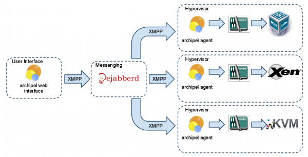
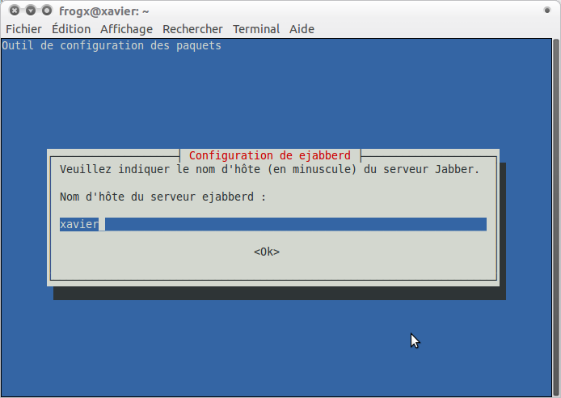
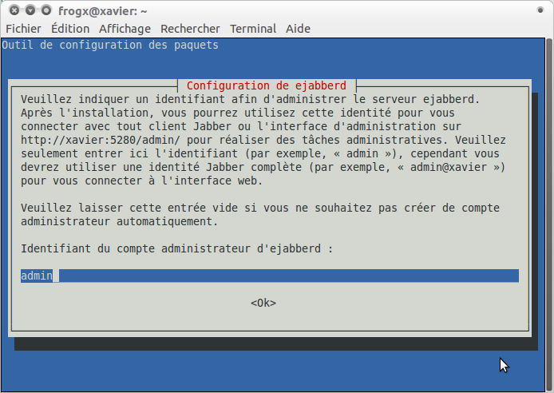
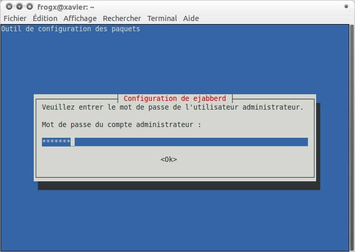
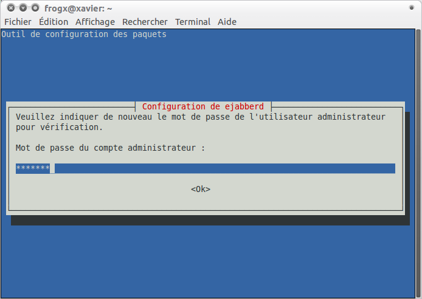

### Table des matières {.toggle}

-   [Installation de archipel sous ubuntu
    10.10](archipel.html#installation-de-archipel-sous-ubuntu-1010)
    -   [introduction](archipel.html#introduction)
    -   [Installation](archipel.html#installation)
        -   [Prérequis](archipel.html#prerequis)
        -   [Serveur ejabberd](archipel.html#serveur-ejabberd)
        -   [Installation de l'agent
            archipel](archipel.html#installation-de-l-agent-archipel)
        -   [Installation du client
            archipel](archipel.html#installation-du-client-archipel)
        -   [Activation du support de
            virtualbox](archipel.html#activation-du-support-de-virtualbox)
        -   [Ajout et Configuration d'un
            hyperviseur](archipel.html#ajout-et-configuration-d-un-hyperviseur)
    -   [Utilisation du client](archipel.html#utilisation-du-client)
        -   [Authentification](archipel.html#authentification)
        -   [Ajouter un
            hyperviseur](archipel.html#ajouter-un-hyperviseur)
        -   [Avatars](archipel.html#avatars)

Installation de archipel sous ubuntu 10.10 {#installation-de-archipel-sous-ubuntu-1010 .sectionedit1}
==========================================

introduction {#introduction .sectionedit2}
------------

[Archipel](http://archipelproject.org/ "http://archipelproject.org/")
est une solution d’orchestration de machines virtuelles basée sur le
protocole XMPP (jabber) et sur libvirt. Grâce à libvirt archipel peut
gérer des machines virtuelles basées sur KVM, Xen, OpenVZ et VMWARE.

Le projet archipel s’appuie sur 3 principaux éléments :

-   Une interface graphique développée en objective J
-   Un bus message assurant l’interface entre le GUI et les hyperviseurs
    (ejabberd)
-   Un agent placé sur les hyperviseur communiquant avec le bus message
    ainsi qu’avec l’hyperviseur au travers de libvirt.

Il existe normalement une possibilité de s’interfacer avec vmware, mais
je n’ai pas encore exploré cette possibilité.

Concernant le client, seul de “vrais” navigateurs sont supportés. Parmis
ceux ci :

-   Google chrome
-   Chromium
-   Firefox

Oubliez IE, cela ne fonctionnera pas !

Installation {#installation .sectionedit3}
------------

### Prérequis {#prerequis .sectionedit4}

sudo apt-get install python-setuptools python-libvirt libvirt0
libvirt-bin ejabberd qemu-kvm

### Serveur ejabberd {#serveur-ejabberd .sectionedit5}

Nous allons travailler sur des nom d’hôtes avec ejabberd. Si vous n’avez
pas de serveur DNS, il faudra alors définir et maintenir a jour la liste
des noms d’hôtes à la main dans le fichier hosts de chacune de vos
machines.

#### Installation des modules supplémentaires {#installation-des-modules-supplementaires}

Archipel nécessite que le serveur ejabberd possède les modules
ejabberd\_xmlrpc.beam et mod\_admin\_extra.beam. Sous ubuntu 10 le
module mod\_admin\_extra est installé de base. Ce n’est pas le cas pour
le module ejabberd\_xmlrpc. Le module ejabberd\_xmlrpc s’appuie sur le
module erlang xml-rpc.

##### erlang-xml-rpc

~~~
wget http://www.ejabberd.im/files/contributions/xmlrpc-1.13-ipr2.tgz
tar zxvf xmlrpc-1.13.tgz
cd xmlrpc-1.13/src/
~~~

Il faut altérer le fichier Makefile avant de lancer la compilation

  Ligne originale                                                     Ligne modifiée
  ------------------------------------------------------------------- -----------------------------------------------------------------------
  XMERL\_PATH=../../xmerl                                             XMERL\_PATH=/usr/lib/erlang/lib/xmerl-1.2.3
  ERLC\_FLAGS=-W \$(DEBUG\_FLAGS) -I \$(XMERL\_PATH)/inc -o ../ebin   ERLC\_FLAGS=-W \$(DEBUG\_FLAGS) -I \$(XMERL\_PATH)/include -o ../ebin

Il ne reste plus qu’à lancer la compilation

~~~
make
~~~

Les modules compilés se trouve dans le répertoire **../ebin**. Nous
devons les déployer dans le répertoire ebin de notre installation de
ejabberd.

~~~
cp ../ebin/*.beam /usr/lib/ejabberd/ebin/
~~~

##### ejabberd\_xmlrpc

Nous allons commencer par télécharger les sources des modules ejabberd
et compiler ensuite le module qui nous intéresse :

~~~
svn co https://svn.process-one.net/ejabberd-modules
erlc -I /usr/lib/ejabberd/include ejabberd-modules/ejabberd_xmlrpc/trunk/src/ejabberd_xmlrpc.erl
~~~

Il ne reste plus qu’a placer le module compilé (ejabberd\_xmlrpc.beam)
dans le repertoire ebin de ejabberd

~~~
sudo cp ejabberd_xmlrpc.beam /usr/lib/ejabberd/ebin/
~~~

#### Configuration

Nous allons commencer par reconfigurer notre serveur jabber. Je part du
principe que le nom d’hôte de la machine hebergeant le serveur ejabberd
est xavier. En fait ce qui nous intéresse est de mettre en place
l’utilisateur admin sans avoir a passer par un shell Erlang.

~~~ {.code .bash}
sudo dpkg-reconfigure ejabberd
~~~

La configuration du serveur jabber doit être quelque peu remanié pour
fonctionner dans le cadre d’utilisation archipel. Il vous suffit de
remplacer la configuration d’origine (/etc/ejabberd/ejabberd.conf) par
la suivante

N’oublier pas de remplacer xavier par votre propre nom d’hôte pour les
lignes ci dessous : {hosts, [“xavier”]}.

{acl, admin, {user, “admin”, “xavier”}}.

~~~
%%%
%%%               ejabberd configuration file
%%%

%%% The parameters used in this configuration file are explained in more detail
%%% in the ejabberd Installation and Operation Guide.
%%% Please consult the Guide in case of doubts, it is included in 
%%% your copy of ejabberd, and is also available online at
%%% http://www.process-one.net/en/ejabberd/docs/

%%% This configuration file contains Erlang terms.
%%% In case you want to understand the syntax, here are the concepts:
%%%
%%%  - The character to comment a line is %
%%%
%%%  - Each term ends in a dot, for example:
%%%      override_global.
%%%
%%%  - A tuple has a fixed definition, its elements are 
%%%    enclosed in {}, and separated with commas:
%%%      {loglevel, 4}.
%%%
%%%  - A list can have as many elements as you want, 
%%%    and is enclosed in [], for example:
%%%      [http_poll, web_admin, tls]
%%%
%%%  - A keyword of ejabberd is a word in lowercase. 
%%%    The strings are enclosed in "" and can have spaces, dots...
%%%      {language, "en"}.
%%%      {ldap_rootdn, "dc=example,dc=com"}. 
%%%
%%%  - This term includes a tuple, a keyword, a list and two strings:
%%%      {hosts, ["jabber.example.net", "im.example.com"]}.
%%%

%%%   =======================
%%%   OVERRIDE STORED OPTIONS

%%
%% loglevel: Verbosity of log files generated by ejabberd.
%% 0: No ejabberd log at all (not recommended)
%% 1: Critical
%% 2: Error
%% 3: Warning
%% 4: Info
%% 5: Debug
%%
{loglevel, 4}.

%%%   ================
%%%   SERVED HOSTNAMES

%%
%% hosts: Domains served by ejabberd.
%% You can define one or several, for example:
%% {hosts, ["example.net", "example.com", "example.org"]}.
%%
{hosts, ["xavier"]}.

%%
%% route_subdomains: Delegate subdomains to other Jabber server.
%% For example, if this ejabberd serves example.org and you want
%% to allow communication with a Jabber server called im.example.org.
%%
{route_subdomains, s2s}.

%%%   ===============
%%%   LISTENING PORTS

%%
%% listen: Which ports will ejabberd listen, which service handles it
%% and what options to start it with.
%%
{listen,
 [
  {4560, ejabberd_xmlrpc, []},

  {5222, ejabberd_c2s, [
            {certfile, "/etc/ejabberd/ejabberd.pem"},
            {access, c2s},
            {max_stanza_size, 65536000}
               ]},    
  {5269, ejabberd_s2s_in, [
               {max_stanza_size, 65536000}

              ]},
  {5280, ejabberd_http, [
             http_bind, 
             http_poll, 
             web_admin
            ]}

 ]}.

%%
%% s2s_use_starttls: Enable STARTTLS + Dialback for S2S connections.
%% Allowed values are: true or false.
%% You must specify a certificate file.
%%
{s2s_use_starttls, true}.

%%
%% S2S whitelist or blacklist
%%
%% Default s2s policy for undefined hosts.
%%
{s2s_default_policy, allow}.

%%
%% Allow or deny communication with specific servers.
%%
%%{{s2s_host, "goodhost.org"}, allow}.
%%{{s2s_host, "badhost.org"}, deny}.

%%%   ==============
%%%   AUTHENTICATION

%%
%% auth_method: Method used to authenticate the users.
%% The default method is the internal.
%% If you want to use a different method, 
%% comment this line and enable the correct ones.
%%
{auth_method, internal}.

%%%   ===============
%%%   TRAFFIC SHAPERS

%%
%% The "normal" shaper limits traffic speed to 1.000 B/s
%%
{shaper, normal, {maxrate, 1000}}.

%%
%% The "fast" shaper limits traffic speed to 50.000 B/s
%%
{shaper, fast, {maxrate, 50000}}.

%%%   ====================
%%%   ACCESS CONTROL LISTS

%%
%% The 'admin' ACL grants administrative privileges to Jabber accounts.
%% You can put as many accounts as you want.
%%
{acl, admin, {user, "admin", "xavier"}}.

%%
%% Local users: don't modify this line.
%%
{acl, local, {user_regexp, ""}}.    

%%%   ============
%%%   ACCESS RULES

%% Define the maximum number of time a single user is allowed to connect:
{access, max_user_sessions, [{10, all}]}.

%% This rule allows access only for local users:
{access, local, [{allow, local}]}.

%% Only non-blocked users can use c2s connections:
{access, c2s, [{deny, blocked},
           {allow, all}]}.

%% For all users except admins used "normal" shaper
{access, c2s_shaper, [{none, admin},
              {normal, all}]}.

%% For all S2S connections used "fast" shaper
{access, s2s_shaper, [{fast, all}]}.

%% Only admins can send announcement messages:
{access, announce, [{allow, admin}]}.

%% Only admins can use configuration interface:
{access, configure, [{allow, admin}]}.

%% Admins of this server are also admins of MUC service:
{access, muc_admin, [{allow, admin}]}.

%% All users are allowed to use MUC service:
{access, muc, [{allow, all}]}.
{access, muc_create, [{allow, local}]}.

%% Everybody can create pubsub nodes
{access, pubsub_createnode, [{allow, all}]}.

%%%   ================
%%%   DEFAULT LANGUAGE

%%
%% language: Default language used for server messages.
%%
{language, "en"}.

%%%   =======
%%%   REGISTRATION

%% In-band registration
{access, register, [{allow, all}]}.

%% In-band registration interval (needs to be not restricted to allow to create rapidly VM)
{registration_timeout, infinity}.

%%%   =======
%%%   MODULES

%%
%% Modules enabled in all ejabberd virtual hosts.
%%
{modules,
 [
  {mod_adhoc,    []},
  {mod_announce, [{access, announce}]}, % requires mod_adhoc
  {mod_caps,     []}, 
  {mod_configure,[]},
  {mod_disco,    []},
  {mod_http_bind,[]},
  {mod_irc,      []},
  {mod_last,     []},
  {mod_muc,      [
          {access, muc},
          {access_create, muc_create},
          {access_persistent, muc_create},
          {access_admin, muc_admin}
         ]},
  {mod_offline,  []},
  {mod_privacy,  []},
  {mod_private,  []},
  {mod_pubsub,   [ % requires mod_caps
          {access_createnode, pubsub_createnode},
          {ignore_pep_from_offline, true},
          {last_item_cache, false},
          {plugins, ["flat", "hometree", "pep"]},
          {max_items_node, 1000}
         ]},
  {mod_register, [
          {access, register}
         ]},
  {mod_roster,   []},
  {mod_shared_roster,[]},
  {mod_time,     []},
  {mod_vcard,    []},
  {mod_version,  []},
  {mod_admin_extra, []}
 ]}.
~~~

#### Tester l'installation {#tester-l-installation}

Afin de tester l’installation nous allons démarrer le serveur ejabberd
en mode live. Ce mode exécute ejabberd dans un shell Erlang. Nous
pourrons voir immédiatement si quelque chose ne va pas.

~~~
sudo /etc/init.d/ejabberd stop
sudo /etc/init.d/ejabberd live
~~~

vous devriez obtenir une sortie similaire à la suivante :

~~~
frogx@xavier:~/Téléchargements$ sudo /etc/init.d/ejabberd live
*******************************************************
* To quit, press Ctrl-g then enter q and press Return *
*******************************************************

Erlang R13B03 (erts-5.7.4) [source] [64-bit] [rq:1] [async-threads:0] [hipe] [kernel-poll:false]

Eshell V5.7.4  (abort with ^G)
(ejabberd@xavier)1> 
=INFO REPORT==== 14-Feb-2011::21:25:59 ===
I(<0.41.0>:ejabberd_app:72) : ejabberd 2.1.5 is started in the node ejabberd@xavier

(ejabberd@xavier)1> 
~~~

Pour sortir du shell taper la commade **q().**

### Installation de l'agent archipel {#installation-de-l-agent-archipel .sectionedit7}

Bon la partie casse pied étant finie (ejabberd ….). Passons à la partie
plaisante et installons l’agent archipel. Un grand merci à l’équipe du
projet archipel pour cette partie se limitant aux deux commandes
suivante :

~~~
sudo easy-install archipel-agent
sudo archipel-initinstall
~~~

Il ne reste plus qu’à éditer le fichier /etc/archipel/archipel.conf et
modifier la liste suivante et remplacer
**REPLACE\_THIS\_WITH\_YOUR\_XMPP\_SERVER\_FQDN** par le nom d’hôte du
serveur jabber (dans mon cas xavier):

~~~
xmpp_server                 = REPLACE_THIS_WITH_YOUR_XMPP_SERVER_FQDN
~~~

Et on peut démarrer l’agent archipel

~~~
sudo /etc/init.d/archipel start
~~~

Il reste a créer 2 pubsub pour que tout fonctionne correctement

~~~
archipel-tagnode --jid=admin@xavier --password=manager --create
archipel-rolesnode --jid=admin@xavier --password=manager --create
~~~

### Installation du client archipel {#installation-du-client-archipel .sectionedit8}

La, c’est la partie facile

Tout d’abord on installe un serveur web

~~~
sudo apt-get install apache2
~~~

Ensuite on se place dans le répertoire servant les pages web

~~~
cd /var/www
~~~

On récupère le dernier build du client

~~~
wget http://nightlies.archipelproject.org/latest-archipel-client.tar.gz
sudo 
~~~

Il ne reste plus qu’à extraire le contenu de l’archive

~~~
sudo tar zxvf latest-archipel-client.tar.gz
sudo chown -R www-data:www-data Archipel
~~~

Il ne reste plus qu’à faire pointer son navigateur sur :
<http://localhost/Archipel>

### Activation du support de virtualbox {#activation-du-support-de-virtualbox .sectionedit9}

Cette partie est en cours de rédaction

Bon cette procédure active le support de kvm mais pas de virtualbox car
celui ci est désactivé dans les paquets ubuntu officiels. Pas de
panique, il est relativement facile de contourner cette problématique :

vous aurez besoin de toutes les dépendance permettant de construire des
paquets ubuntu et de virtualbox

~~~
apt-get source -d libvirt
sudo apt-get build-dep libvirt
dpkg-source -x libvirt*dsc

cd libvirt-0.8.3

dpkg-buildpackage -us -uc -b -rfakeroot
~~~

### Ajout et Configuration d'un hyperviseur {#ajout-et-configuration-d-un-hyperviseur .sectionedit10}

Utilisation du client {#utilisation-du-client .sectionedit11}
---------------------

### Authentification {#authentification .sectionedit12}

L’authentification se fait selon la logique jabber. On s’authentifie
avec un jabber id sous la forme user@xmppserver. Dans notre cas le user
sera admin et le serveur xmpp est le serveur ejabberd (pour moi xavier).

### Ajouter un hyperviseur {#ajouter-un-hyperviseur .sectionedit13}

L’ajout d’hyperviseur se fait au moyen d’un contact dans la logique
d’archipel. Le contact de notre hyperviseur local est créé
automatiquement lors du démarrage et se nomme hypervisor (défini dans le
fichier /etc/archipel.conf dans la section [HYPERVISOR]). Le jid du
contact est donc hypervisor@xavier.

Une fois le contact (hyperviseur) ajouté, il apparaît dans la colonne de
gauche

### Avatars {#avatars .sectionedit14}

Chaque contact (Hyperviseur et VM) peut avoir un avatar permettant de
différencier son rôle ou son OS.

Vous pouvez rajouter vos propres avatars en les déposants dans le
répertoire /var/lib/archipel/avatars. Il faudra vous déconnecter et vous
reconnecter pour les voir apparaître.

