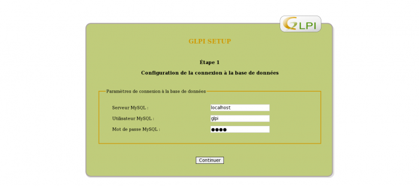

### Table des matières {.toggle}

-   [Installation de GLPI sur
    Ubuntu](glpi-ubuntu-install.html#installation-de-glpi-sur-ubuntu)
    -   [Pré-requis](glpi-ubuntu-install.html#pre-requis)
    -   [Installation](glpi-ubuntu-install.html#installation)
        -   [Création de la base de
            données](glpi-ubuntu-install.html#creation-de-la-base-de-donnees)
        -   [Téléchargement de
            GLPI](glpi-ubuntu-install.html#telechargement-de-glpi)
        -   [Vérification
            PHP](glpi-ubuntu-install.html#verification-php)
        -   [Installation de
            GLPI](glpi-ubuntu-install.html#installation-de-glpi)

Installation de GLPI sur Ubuntu {#installation-de-glpi-sur-ubuntu .sectionedit1}
===============================

Tutoriel rédigé pour une version Ubuntu 0.04 LTS et GLPI 0.72/0.78.

Ce tutoriel a été réalisé par :

  **Rôle**        **Nom**
  --------------- ---------------------------------------------------------------------------------------------------------------------------------------------------------
  **Rédacteur**   [Ludovic VALENTIN](http://www.monitoring-fr.org/community/members/ludovic-valentin/ "http://www.monitoring-fr.org/community/members/ludovic-valentin/")

Pré-requis {#pre-requis .sectionedit3}
----------

Installation des dépendances requises à la mise en place de GLPI :

~~~
$ sudo apt-get update
$ sudo apt-get upgrade
$ sudo apt-get install wget man vim build-essential checkinstall apache2 libapache2-mod-php5 php5 php5-mysql php5-curl mysql-server php5-imap php5-ldap php5-gd
~~~

Installation {#installation .sectionedit4}
------------

### Création de la base de données {#creation-de-la-base-de-donnees .sectionedit5}

~~~
$ sudo mysql -u root -p
> create database glpidb character set utf8;
> grant all privileges on glpidb.* to glpi@localhost identified by 'glpi';
> exit
~~~

### Téléchargement de GLPI {#telechargement-de-glpi .sectionedit6}

~~~
$ sudo cd /tmp
$ sudo wget https://forge.indepnet.net/attachments/download/812/glpi-0.78.3.tar.gz
$ sudo tar -zxf glpi-0.78.3.tar.gz -C /var/www
$ sudo chown -R www-data /var/www/glpi
~~~

### Vérification PHP {#verification-php .sectionedit7}

~~~
$ sudo grep –I memory_limit /etc/php5/apache2/php.ini
memory_limit=64
$ sudo grep –I mysql.so /etc/php5/conf.d/mysql.ini
extension=mysql.so
$ sudo /etc/init.d/apache2 restart
~~~

### Installation de GLPI {#installation-de-glpi .sectionedit8}

L’installation de GLPI se fait depuis un navigateur internet :

<http://votre_adresse_ip/glpi>

Choix de la langue d’installation de GLPI :

Acceptation de la licence de GLPI :

Choix de l’installation (ou de la mise à jour selon les besoins) :

Vérification des pré-requis nécessaires à l’installation de GLPI (en cas
de non-conformité, il faut installer ou paramétrer les dépendances
requises) :

Configuration des paramètres de connexion à la base de données (voir
précédemment lors de la création de la base de données) :

Sélection de la base de données de GLPI (ou bien en créer une nouvelle)
:

Test de la base de données GLPI avec les paramètres spécifiés auparavant
:

Fin de l’installation :

Redirection sur la page d’authentification de GLPI, il faut alors
utiliser les paramètres de connexion indiqués précedement (« étape 4 »
de l’installation de GLPI) :

