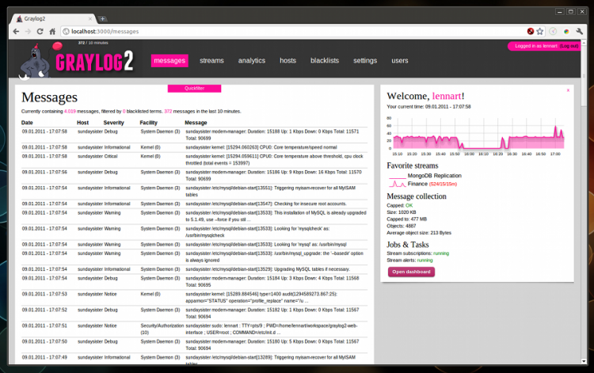

### Table des matières {.toggle}

-   [Graylog2](graylog2.html#graylog2)
    -   [Installation de
        Graylog2](graylog2.html#installation-de-graylog2)
        -   [Installation du
            serveur](graylog2.html#installation-du-serveur)
        -   [Installation de
            l’interface](graylog2.html#installation-de-l-interface)
        -   [Découverte de
            l’interface](graylog2.html#decouverte-de-l-interface)

Graylog2 {#graylog2 .sectionedit1}
========

  **Rôle**            **Nom**
  ------------------- -------------
  **Créateur**        Olivier JAN
  **Contributeurs**   Olivier JAN

[Graylog2](http://www.graylog2.org/ "http://www.graylog2.org/") est une
solution open source de gestion de fichiers journaux qui stockent les
messages dans une base de données
[Elasticsearch](http://www.elasticsearch.org/ "http://www.elasticsearch.org/").
L’ensemble des paramètres de la solution sont quand à eux stockés dans
une base [MongoDB](http://www.mongodb.org "http://www.mongodb.org"). La
solution comprend un serveur écrit en Java qui acceptent les messages de
fichiers journaux via UDP et TCP ou
[AMQP](http://www.amqp.org/ "http://www.amqp.org/") et les stockent en
base. La deuxième partie de la solution est une interface web écrite en
[Ruby](http://www.ruby-lang.org/ "http://www.ruby-lang.org/") qui permet
de gérer, manipuler les messages stockés depuis un navigateur.

Ce document n’a pas vocation à expliquer comment centraliser des
fichiers journaux, ce qui est pourtant le principal intérêt de ce genre
de solution.

Voici quand même un fichier possible de configuration pour rsyslog que
vous mettrez dans */etc/rsyslog.d/60-graylog2.conf* par exemple sur le
serveur dont vous voulez faire suivre les logs en UDP sur le port 514.

~~~~ {.code}
$template Graylog2Output,"<%PRI%> %TIMESTAMP% %HOSTNAME% %APP-NAME% %PROCID% %MSGID% %STRUCTURED-DATA% %msg%\n"
$ActionForwardDefaultTemplate Graylog2Output

*.* @adresse_ip_du_serveur_graylog2:514
~~~~

Installation de Graylog2 {#installation-de-graylog2 .sectionedit3}
------------------------

Il est conseillé d’installer cette solution sur une version 64 bits de
Linux sous peine de ne pas pouvoir avoir une base MongoDB de plus de 4
Go.

L’installation ne pose aucun problème particulier et se fait en deux
temps : Le serveur et ensuite l’interface. Vous pouvez tout à fait faire
cœxister l’ensemble sur la même machine et ce, même sans enlever le
démon de journalisation par défaut d’Ubuntu qui est maintenant
[Rsyslog](http://www.rsyslog.com/ "http://www.rsyslog.com/").
**L’installation décrite ici est entièrement faite dans /opt**.

Depuis la version 0.9.6, Graylog2 change de backend pour le stockage des
messages et utilise désormais
[Elasticsearch](http://www.elasticsearch.org/ "http://www.elasticsearch.org/")
pour cela. Ce backend est plus rapide et permet de stocker beaucoup plus
de messages que MongoDB. MongoDB est cependant conservé pour le stockage
des paramètres de l’application ainsi que pour les statistiques sur les
messages.

### Installation du serveur {#installation-du-serveur .sectionedit4}

Vu qu’une des caractéristiques de Graylog2 est de stocker les messages
de fichiers journaux dans une base Elasticsearch, il est donc logique de
commencer par installer celui-ci.

#### Installation de Elasticsearch

Aucune difficulté pour l’installation de Elasticsearch. On installe
d’abord les pré-requis.

~~~~ {.code .bash}
apt-get install openjdk-6-jre-headless
~~~~

Et le reste n’est que déplacement de fichiers

~~~~ {.code .bash}
wget https://github.com/downloads/elasticsearch/elasticsearch/elasticsearch-0.18.7.tar.gz
tar xzf elasticsearch-0.18.7.tar.gz
mv elasticsearch-0.18.7 /opt/elasticsearch
~~~~

Un peu de configuration en éditant le fichier
*/opt/elasticsearch/config/elasticsearch.yml* pour à minima donner un
nom plus explicite à notre base.

~~~~ {.code}
cluster.name: logcentral
~~~~

Il ne reste qu’à utiliser le script de démarrage fourni
[ici](http://www.elasticsearch.org/tutorials/2010/07/02/setting-up-elasticsearch-on-debian.html "http://www.elasticsearch.org/tutorials/2010/07/02/setting-up-elasticsearch-on-debian.html")
en l’adaptant aux paths pour démarrer Elasticsearch et à démarrer.

~~~~ {.code .bash}
sudo /etc/init.d/elasticsearch start
~~~~

#### Installation de MongoDB

Les développeurs nous ont maché le travail en fournissant des binaires
prêt à l’emploi. Il suffit de les récupérer, de les copier au bon
endroit et de démarrer le démon… Enfin presque ;)

~~~~ {.code}
adduser graylog --no-create-home --disabled-login --shell /bin/false --home /opt
wget http://fastdl.mongodb.org/linux/mongodb-linux-x86_64-2.0.2.tgz
tar xzf mongodb-linux-x86_64-2.0.2.tgz
sudo cp -r mongodb-linux-x86_64-2.0.2 /opt/mongodb
~~~~

Enfin presque car il faut créer un répertoire data forcément au premier
niveau du système de fichiers.

~~~~ {.code}
sudo mkdir -p /data/db
sudo chown -R graylog:graylog /data
~~~~

Il ne reste plus qu’à démarrer le démon que je fais tourner sous
utilisateur graylog que j’ai pris soin de créer avant.

~~~~ {.code}
sudo -u graylog /opt/mongodb/bin/mongod &
~~~~

#### Installation du démon de journalisation {#installation-du-demon-de-journalisation}

La base installée, nous pouvons passer à l’installation proprement dite
du serveur qui est en Java. Il nous faut donc installer au préalable un
environnement Java sur le serveur.

~~~~ {.code}
sudo apt-get install openjdk-6-jre
~~~~

Et ensuite, récupérer l’archive, décompresser, configurer et démarrer

~~~~ {.code}
wget --no-check-certificate https://github.com/downloads/Graylog2/graylog2-server/graylog2-server-0.9.6.tar.gz
tar xzf graylog2-server-0.9.6.tar.gz
sudo mkdir /opt/graylog2
sudo cp -r graylog2-server-0.9.6 /opt/graylog2/server
sudo chown -R graylog:graylog /opt/graylog2
~~~~

Il faut maintenant configurer le serveur avant de le démarrer. Le
fichier de configuration se trouve obligatoirement dans /etc/

~~~~ {.code}
sudo cp /opt/graylog2/server/graylog2.conf.example /etc/graylog2.conf
sudo nano /etc/graylog2.conf
~~~~

Les seules choses indispensables à modifier sont la connexion à la base
de données, le reste étant laissé aux valeurs par défaut. Il faut bien
sûr au préalable créer l’utilisateur dans MongoDB.

~~~~ {.code}
$ /opt/mongodb/bin/mongo
> use graylog2
> db.addUser('graylog-user', 'grayloguser-mongo-passwd')
~~~~

C’est basique mais suffisant pour tester le tout. Passons à l’édition du
fichier de configuration du serveur qui doit contenir le pendant de
l’utilisateur créé ainsi que l’adresse du serveur Elasticsearch ainsi
que le nom de la base.

~~~~ {.code}
# ElasticSearch URL (default: http://localhost:9200/)
elasticsearch_url = http://localhost:9200/
elasticsearch_index_name = logcentral

# MongoDB Configuration
mongodb_useauth = true
mongodb_user = graylog-user
mongodb_password = grayloguser-mongo-passwd
mongodb_host = localhost
#mongodb_replica_set = localhost:27017,localhost:27018,localhost:27019
mongodb_database = graylog2
mongodb_port = 27017
mongodb_max_connections = 500
~~~~

Il est temps de démarrer le serveur

~~~~ {.code}
cd /opt/graylog2/server/bin
sudo ./graylog2ctl start
~~~~

### Installation de l’interface {#installation-de-l-interface .sectionedit5}

Vu que l’interface est en Ruby, il y a quelques pré-requis à installer.
Et vu que nous ferons tourner l’interface derrière un serveur Apache,
nous installons aussi
[mod\_passenger](http://www.modrails.com/ "http://www.modrails.com/").

~~~~ {.code}
sudo apt-get install ruby1.8 rubygems rake make libopenssl-ruby ruby-dev build-essential git-core libapache2-mod-passenger
~~~~

Le reste est somme toute facile.

~~~~ {.code}
wget --no-check-certificat https://github.com/downloads/Graylog2/graylog2-web-interface/graylog2-web-interface-0.9.6.tar.gz
tar xzf graylog2-web-interface-0.9.6.tar.gz
sudo cp -r graylog2-web-interface-0.9.6 /opt/graylog2/web
sudo chown -R graylog:graylog /opt/graylog2
cd /opt/graylog2/web
sudo gem install bundler
sudo bundle install
~~~~

Reste à configurer l’ensemble des fichiers .yml se trouvant dans
/opt/graylog2/web/config. Ils sont bien commentés, je vous passe donc le
détail.

#### Configuration de Apache

Créons un nouvel hôte virtuel contenant ceci (à adapter bien sûr sur
pour le nom ou autre)

~~~~ {.code}
<VirtualHost *:80>

    ServerName      graylog2.monitoring-fr.org
    ServerAlias     *.graylog2.monitoring-fr.org

    ServerAdmin [email protected]
/*  */!function(){try{var t="currentScript"in document?document.currentScript:function(){for(var t=document.getElementsByTagName("script"),e=t.length;e--;)if(t[e].getAttribute("cf-hash"))return t[e]}();if(t&&t.previousSibling){var e,r,n,i,c=t.previousSibling,a=c.getAttribute("data-cfemail");if(a){for(e="",r=parseInt(a.substr(0,2),16),n=2;a.length-n;n+=2)i=parseInt(a.substr(n,2),16)^r,e+=String.fromCharCode(i);e=document.createTextNode(e),c.parentNode.replaceChild(e,c)}}}catch(u){}}();/*  */
    DocumentRoot /opt/graylog2/web/public

    <Directory /opt/graylog2/web/public>
        Allow from all
        Options -MultiViews
    </Directory>

    ErrorLog /var/log/apache2/error.log
    LogLevel warn
    CustomLog /var/log/apache2/access.log combined
</VirtualHost>
~~~~

Ne reste plus qu’à activer ce nouvel hôte et (re)démarrer Apache

~~~~ {.code}
sudo a2ensite graylog2.monitoring-fr.org
sudo /etc/init.d/apache2 restart
~~~~

### Découverte de l’interface {#decouverte-de-l-interface .sectionedit6}

Si tout s’est bien passé, il est possible de se connecter sur votre
nouvelle interface Graylog2. À la première connexion, il vous est
demandé de créer un premier utilisateur. Une fois connecté, vous avez
ceci devant les yeux.

En espérant que ce petit tutoriel vous donne envie de découvrir cette
solution particulièrement bien pensée (notamment en terme de filtrage
des messages) de gestion de fichiers journaux, indispensable dans
l’arsenal de tout bon sysadmin.
