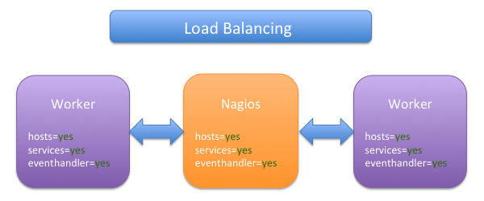
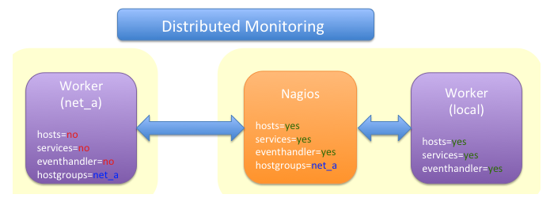

### Table des matières {.toggle}

-   [Setup distribué avec
    Mod\_Gearman](mod_gearman.html#setup-distribue-avec-mod_gearman)
    -   [Avantages](mod_gearman.html#avantages)
    -   [Pré-requis](mod_gearman.html#pre-requis)
    -   [Installation du serveur Gearman sur le serveur
        Nagios](mod_gearman.html#installation-du-serveur-gearman-sur-le-serveur-nagios)
    -   [Installation de Mod\_Gearman sur le serveur
        Nagios](mod_gearman.html#installation-de-mod_gearman-sur-le-serveur-nagios)
        -   [Configuration de Nagios pour
            mod\_gearman](mod_gearman.html#configuration-de-nagios-pour-mod_gearman)
        -   [Contrôle de
            l'installation](mod_gearman.html#controle-de-l-installation)
    -   [Installation optionnelle d'un
        worker](mod_gearman.html#installation-optionnelle-d-un-worker)
    -   [Modes de
        fonctionnement](mod_gearman.html#modes-de-fonctionnement)
        -   [Balance de charge](mod_gearman.html#balance-de-charge)
        -   [Distribution de
            contrôles](mod_gearman.html#distribution-de-controles)

Setup distribué avec Mod\_Gearman {#setup-distribue-avec-mod_gearman .sectionedit1}
=================================

  **Rôle**            **Nom**
  ------------------- -------------
  **Créateur**        Olivier JAN
  **Contributeurs**   Olivier JAN

[Mod\_Gearman](http://labs.consol.de/lang/de/nagios/mod-gearman/ "http://labs.consol.de/lang/de/nagios/mod-gearman/")
est une façon plutôt facile et efficace de distribuer les contrôles
actifs Nagios au travers de votre réseau et d’augmenter les performances
et les possibilités de scalabilité de Nagios. Ceci fonctionne bien
évidemment avec Icinga et Centreon. Mod\_Gearman peut aussi aider à
réduire la charge sur un seul hôte Nagios parce qu’il est beaucoup plus
efficace dans l’exécution des contrôles que l’est le Nagios Core
lui-même. Ce programme est composé de trois parties :

1.  Un module NEB (Nagios Event Broker) qui réside au niveau du Nagios
    Core et qui ajoute les contrôles d’hôtes, de services et les
    eventhandlers à une queue du serveur Gearman.
2.  Il faut bien sûr une contrepartie sous forme de clients Gearman
    (worker) qui exécutent les contrôles. Les workers peuvent être
    configurés pour exécuter uniquement des contrôles d’hôtes ou de
    services pour des groupes spécifiques.
3.  Et bien sûr, il vous faut au moins un [serveur
    Gearman](http://gearman.org/ "http://gearman.org/") pour pouvoir
    fonctionner dans ce setup.

Avantages {#avantages .sectionedit3}
---------

Il y a plusieurs avantages à utiliser mod\_gearman en setup distribué
plutôt qu’une autre forme comme le [setup
classique](http://doc.monitoring-fr.org/3_0/html/advancedtopics-distributed.html "http://doc.monitoring-fr.org/3_0/html/advancedtopics-distributed.html"),
[Nagios DNX](http://dnx.sourceforge.net/ "http://dnx.sourceforge.net/")
ou même le setup distribué à la Centreon.

-   Pas d’installation de Nagios à faire sur les workers, uniquement les
    plugins à distribuer à l’instar de Nagios DNX.
-   Une configuration centrale de Nagios qui permet néanmoins comme
    Centreon de spécifier les contrôles à exécuter par worker en
    utilisant des groupes de services ou d’hôtes spécifiques.
-   Pas d’eventhandlers à activer dans Nagios (chute des performances de
    Nagios) contrairement au setup distribué classique et pas de découpe
    de configuration par worker.
-   Gère aussi bien la haute disponibilité que la balance de charge.
    Vous pouvez avoir autant de serveurs Gearman et de workers que vous
    le souhaitez.

Vous êtes alléchés, passons à l’installation et à l’utilisation de ce
joli monde.

Pré-requis {#pre-requis .sectionedit4}
----------

Pour tester ce setup, il vous faut au minimum :

1.  Une distribution fraîchement installée de Linux (Ubuntu 10.04 ici).
2.  Un Nagios, Icinga ou Centreon opérationnel sur cette machine.

L’idéal pour bien comprendre ce tutoriel est d’avoir une machine
supplémentaire qui servira uniquement de worker. Cette machine est une
distribution Linux fraîchement installée avec les plugins Nagios prêts à
l’emploi. Ces plugins doivent se trouver au même endroit que sur le
serveur Nagios. Ex : Si vos plugins sur le serveur Nagios se trouvent
dans /usr/local/nagios/libexec, il doivent aussi se trouver à cet
endroit sur le worker sous peine qu’il ne les trouve pas.

Installation du serveur Gearman sur le serveur Nagios {#installation-du-serveur-gearman-sur-le-serveur-nagios .sectionedit5}
-----------------------------------------------------

Il est conseillé dans la documentation de mod\_gearman d’avoir au moins
un serveur Gearman sur le même serveur que Nagios. Ne vous inquiétez
pas, ceci ne va pas augmenter la charge de celui-ci, bien au contraire
:) Si vous le pouvez, utilisez une machine deux cœurs et comme ça,
Nagios tournera sur un tandis que le serveur Gearman tournera sur
l’autre.

Il faut d’abord installer quelques librairies nécessaires à la
compilation du serveur

~~~~ {.code}
sudo apt-get install autoconf automake make gcc g++ wget tar file netcat uuid-dev libltdl3-dev libncurses5-dev libevent-dev libboost-dev libboost-graph-dev libboost-iostreams-dev libboost-program-options-dev build-essential libboost-thread-dev libcloog-ppl0
~~~~

Vu que je suis d’accord avec la documentation de Mod\_Gearman qui
conseille d’installer le tout dans /opt pour une désinsatallation facile
en cas de besoin et pour ne pas se mélanger avec les paquets provenant
des dépôts Ubuntu, nous allons du coup procéder à quelques modifications
qui permettront ceci

~~~~ {.code}
sudo nano  /etc/ld.so.conf.d/opt_lib.conf
~~~~

Ajouter */opt/lib* dans ce fichier et le tour est joué avec un

~~~~ {.code}
sudo ldconfig
~~~~

Une fois ceci fait, c’est que du classique

~~~~ {.code}
wget http://launchpad.net/gearmand/trunk/0.33/+download/gearmand-0.33.tar.gz
tar xzf gearmand-0.33.tar.gz
pushd gearmand-0.33
./configure --prefix=/opt
~~~~

Voici le résumé de ma commande configure avant le make traditionnel

~~~~ {.code}
Configuration summary for gearmand version 0.33

   * Installation prefix:       /opt
   * System type:               unknown-linux-gnu
   * Host CPU:                  x86_64
   * C Compiler:                gcc (Ubuntu 4.4.3-4ubuntu5) 4.4.3
   * Assertions enabled:        yes
   * Debug enabled:             no
   * Warnings as failure:       no
   * Building with libsqlite3   no
   * Building with libdrizzle   no
   * Building with libmemcached no
   * Building with libpq        no
   * Building with tokyocabinet no
~~~~

À noter au passage la possibilité (non activée ici) de faire fonctionner
le serveur Gearman avec Memcache.

~~~~ {.code}
make all
sudo make install
popd
~~~~

Pas de configuration à faire côté serveur, l’installation est donc
terminée pour lui. Si tout s’est bien passé, vous pouvez démarrer le
serveur et vérifier qu’il tourne.

~~~~ {.code}
sudo /etc/init.d/gearmand start
Starting gearmand done
sudo /etc/init.d/gearmand status
gearmand is running with pid 20204
~~~~

Installation de Mod\_Gearman sur le serveur Nagios {#installation-de-mod_gearman-sur-le-serveur-nagios .sectionedit6}
--------------------------------------------------

Maintenant que nous savons un serveur, il nous faut un module NEB et un
client Gearman qui sont installés simultanément par Mod\_Gearman. Rien
que du très classique à suivre

~~~~ {.code}
wget http://labs.consol.de/wp-content/uploads/2010/09/mod_gearman-1.3.4.tar.gz
tar xzf mod_gearman-1.3.4.tar.gz 
pushd mod_gearman-1.3.4/
./configure --prefix=/opt --with-gearman=/opt --with-user=nagios --with-init-dir=/etc/init.d
make
sudo make install
sudo make install-config
~~~~

La partie client tournant sous l’utilisateur Nagios, il faut donc
veiller à ce que celui-ci est un shell opérationnel

~~~~ {.code}
sudo chsh nagios

Changing the login shell for nagios
Enter the new value, or press ENTER for the default
    Login Shell [/bin/sh]: /bin/bash
~~~~

Et c’est tout ;) Enfin, presque… Il reste à démarrer le client Gearman
et vérifier qu’il fonctionne.

~~~~ {.code}
sudo /etc/init.d/mod_gearman_worker start
Starting mod_gm_worker done
sudo /etc/init.d/mod_gearman_worker status
mod_gearman_worker is running with pid 22539
~~~~

### Configuration de Nagios pour mod\_gearman {#configuration-de-nagios-pour-mod_gearman .sectionedit7}

Mod\_Gearman étant un module NEB pour Nagios, on le charge et puis
basta. Ajoutez ceci à votre fichier de configuration nagios.cfg pour ce
faire.

~~~~ {.code}
event_broker_options=-1
broker_module=/opt/lib/mod_gearman/mod_gearman.o config=/opt/etc/mod_gearman.conf
~~~~

Il faut bien sûr redémarrer Nagios pour que celui-ci se charge.

~~~~ {.code}
sudo /etc/init.d/nagios restart
~~~~

### Contrôle de l'installation {#controle-de-l-installation .sectionedit8}

Un utilitaire bien pratique est fourni pour contrôler le bon
fonctionnement de l’ensemble.

~~~~ {.code}
/opt/bin/gearman_top
~~~~

Dans mon cas, il retourne ceci

~~~~ {.code}
 Queue Name    | Worker Available | Jobs Waiting | Jobs Running
----------------------------------------------------------------
 check_results |               1  |           0  |           0
 eventhandler  |              20  |           0  |           0
 host          |              20  |          17  |          10
 service       |              20  |          24  |          10
 worker_nagios |               1  |           0  |           0
----------------------------------------------------------------
~~~~

Un worker tourne pour les résultats de contrôles, 2à pour gérer
d’éventuels eventhandlers, 2à pour les services et 20 pour les hôtes.
J’ai un worker (worker\_nagios) sur mon serveur Nagios. Tout est OK.

Installation optionnelle d'un worker {#installation-optionnelle-d-un-worker .sectionedit9}
------------------------------------

Pour installer un worker sur un autre serveur, il suffit de reprendre la
procédure d’installation de mod\_gearman en ayant pris soin d’installer
les librairies suivantes au préalable.

~~~~ {.code}
sudo apt-get install libltdl-dev libncurses5-dev libgearman-dev
~~~~

Avant de lancer le client, il faut au préalable modifier le fichier de
configuration de celui-ci qui se trouve dans /opt/etc/mod\_gearman.conf.
Il faut y préciser à minima l’adresse du serveur Gearman à contacter.

~~~~ {.code}
# sets the addess of your gearman job server. Can be specified
# more than once to add more server.
server=nagios:4730
~~~~

Il suffit ensuite de lancer le processus après compilation par la
commande de start et de vérifier qu’il fonctionne avec status.

~~~~ {.code}
sudo /etc/init.d/mod_gearman_worker start
Starting mod_gm_worker done
sudo /etc/init.d/mod_gearman_worker status
mod_gearman_worker is running with pid 22539
~~~~

N’oubliez pas d’installer sur ce worker les plugins Nagios utilisés sur
votre périmètre sous peine de voir beaucoup d’erreurs en console.

Modes de fonctionnement {#modes-de-fonctionnement .sectionedit10}
-----------------------

Comme indiqué dans l’introduction, il est possible d’utiliser
mod\_gearman à la fois pour de la balance de charge mais aussi pour
distribuer les contrôles en fonction de contraintes réseaux,
géographiques…

### Balance de charge {#balance-de-charge .sectionedit11}

Comme indiqué dans le schéma ci-dessous en provenance du site de
mod\_gearman, la balance de charge ou répartition de charge peut être
utilisée pour diviser sur plusieurs workers un nombre de contrôles
élevés à exécuter et il n’y a dansc e cas qu’à démarrer x instances de
workers gearman avec les plugins installés dessus pour que tout soit
transparent au niveau administration.

### Distribution de contrôles {#distribution-de-controles .sectionedit12}

Comme indiqué dans le schéma ci-dessous en provenance du site de
mod\_gearman, la distribution de contrôles est intéressante dans le cas
où vous souhaitez faire exécuter un certain de type de contrôles depuis
une instance worker particulière pour par exemple traverser des
firewalls ou pour (en poussant à l’extrême) remplacer NRPE sur vos
serveurs.

Mon setup est donc composé de deux machines. Comme sur l’illustration,
un serveur Nagios et un worker gearman tournant sur la même machine et
d’un worker gearman tournant sur un autre serveur.

Contrairement à la balance de charge, il y a ici un peu plus de
complexité dans la configuration. En effet, le fichier de configuration
fourni intègre à la fois des instructions de configuration commune au
worker et au module NEB tournant sur notre serveur Nagios et à la fois
des instructions spécifiques à l’un ou l’autre. Pour faire fonctionner
correctement ce mode, j’ai donc commencer par séparer ce fichier initial
en deux fichiers distincts, l’un pour le module NEB chargé par Nagios et
l’autre pour le worker tournant sur le même serveur.

**Il est possible avec mod\_gearman de préciser des contrôles à être
exécuter sur un worker précis par groupes de services ou groupes
d’hôtes**.

#### Configuration du worker séparé {#configuration-du-worker-separe}

Sur le worker, la configuration reste assez simple et je ne donne ici
que les quelques éléments indispensables à notre mode de fonctionnement.
Je modifie donc le fichier /opt/etc/mod\_gearman.conf avec les options
suivantes

~~~~ {.code}
eventhandler=no
services=no
hosts=no
do_hostchecks=no
servicegroups=net_a
~~~~

Les quatres lignes indiquent à notre worker qu’il ne déclarera pas de
nouvelles queues sur le serveur gearman pour les hosts, eventhandlers et
services mais qu’il créera sur celui-ci **une nouvelle queue pour
accepter les contrôles dont les services (au sens Nagios du terme)
appartiennent au groupe de services net\_a**.

#### Configuration de Nagios et du worker

Au niveau du worker tournant sur notre serveur Nagios, nous souhaitons
que les tous les contrôles de services soient exécutés sauf ceux
appartenant au groupe de services net\_a (qui eux sont éxécutés sur
notre worker distant), nous modifions donc le fichier de configuration
**/opt/etc/mod\_gearman.conf** de la façon suivante

~~~~ {.code}
eventhandler=yes
services=yes
hosts=yes
do_hostchecks=yes
~~~~

Côté Nagios et module NEB maintenant. En préambule, il faut bien
évidemment rattacher au niveau de la configuration Nagios des services
au groupe de services net\_a. C’est de la configuration basique dans
Nagios ;)

Comme précisé ci-dessus, nous utilisons un nouveau fichier de
configuration **/opt/etc/neb\_gearman.conf** qui contient au moins la
directive suivante :

~~~~ {.code}
servicegroups=net_a
~~~~

Ensuite, il faut préciser dans le nagios.cfg le chargement du NEB en
précisant le fichier de configuration distinct du fichier utilisé par le
worker tournant sur le même serveur. nous allons utiliser le fichier de
configuration **/opt/etc/neb\_gearman.conf**

~~~~ {.code}
broker_module=/opt/mod_gearman/lib/mod_gearman/mod_gearman.o config=/opt/etc/neb_gearman.conf
~~~~

Nous aboutissons au résultat voulu. Les contrôles de services
appartenant au groupe de services net\_a sont exécutés sur notre worker
distant et tous les autres contrôles de services et d’hôtes par notre
worker local.
