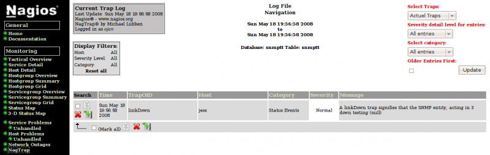

### Table des matières {.toggle}

-   [NagTrap](nagtrap.html#nagtrap)
    -   [Introduction](nagtrap.html#introduction)
        -   [Sources](nagtrap.html#sources)
        -   [Pré-requis](nagtrap.html#pre-requis)
    -   [NagTrap Installation](nagtrap.html#nagtrap-installation)
    -   [NagTrap Configuration](nagtrap.html#nagtrap-configuration)
    -   [SNMP TrapReceiver](nagtrap.html#snmp-trapreceiver)
        -   [SNMP TrapReceiver
            Configuration](nagtrap.html#snmp-trapreceiver-configuration)
        -   [SNMP Trap Test](nagtrap.html#snmp-trap-test)

NagTrap {#nagtrap .sectionedit1}
=======

 Vous devez avoir
une installation fonctionnelle de snmptrapd et snmptt avant de suivre
cette installation.

Introduction {#introduction .sectionedit2}
------------

[NagTrap](http://nagtrap.org/ "http://nagtrap.org/") est un module qui
permet d’interroger la base de données renseignée par SNMPTT pour le
stockage des interruptions SNMP. C’est une interface écrite en PHP dont
l’installation et la configuration ne pose aucun problème. Nagtrap
fournit également un plugin Nagios check\_snmp\_trap qui permet
d’interroger la base de données des interruptions directement depuis
Nagios.

### Sources {#sources .sectionedit3}

-   [http://www.pug.org/mediawiki/index.php/Nagios\_Installation/Nagios\_installieren\#SNMP\_NagTrap](http://www.pug.org/mediawiki/index.php/Nagios_Installation/Nagios_installieren#SNMP_NagTrap "http://www.pug.org/mediawiki/index.php/Nagios_Installation/Nagios_installieren#SNMP_NagTrap")
-   [http://forums.monitoring-fr.org/index.php/topic,19.30.html](http://forums.monitoring-fr.org/index.php/topic,19.30.html "http://forums.monitoring-fr.org/index.php/topic,19.30.html")
-   [http://wiki.monitoring-fr.org/addons/nagtrap](../../../../addons/nagtrap.html "http://wiki.monitoring-fr.org/addons/nagtrap")

### Pré-requis {#pre-requis .sectionedit4}

Il faut avoir d’installer php5 et php5-mysql par défaut.

~~~~ {.code}
sudo apt-get install php5 php5-mysql snmptrapd snmp
~~~~

NagTrap Installation {#nagtrap-installation .sectionedit5}
--------------------

Pour installer NagTrap, il faut récupérer les sources et les
décompresser. Il faut copier le répertoire de l’interface PHP nagtrap
dans */usr/local/nagios/share/nagtrap* et le plugin Perl dans
*/usr/local/nagios/libexec*.

~~~~ {.code}
master:/usr/src/nagios# tar xzf nagtrap-0.1.2.tar.gz
master:/usr/src/nagios# mv nagtrap/nagtrap/ /usr/local/nagios/share/
master:/usr/src/nagios# cp  nagtrap/plugin/check_snmp_traps.pl /usr/local/nagios/libexec/check_snmp_traps
~~~~

L’opération suivante consiste à créer une base de données pour recevoir
les interruptions SNMP.

~~~~ {.code}
master:/usr/src/nagios# mysqladmin create snmptt -p
master:/usr/src/nagios# mysql snmptt < nagtrap/db/snmptt-1.2.sql -p
master:/usr/src/nagios# mysql
   mysql> GRANT SELECT,INSERT,UPDATE,DELETE ON snmptt.* TO 'snmptt'@'localhost' IDENTIFIED BY 'secret';
   Query OK, 0 rows affected (0.00 sec)
   mysql> quit
~~~~

Il est bon de faire un test pour voir si votre base a bien été créée et
si vous pouvez y accéder avec le user snmptt.

~~~~ {.code}
master:/usr/src/nagios# mysql -u snmptt -p secret -D snmptt
   mysql> show tables;
   +------------------+
   | Tables_in_snmptt |
   +------------------+
   | snmptt           | 
   | snmptt_archive   | 
   +------------------+
   2 rows in set (0.01 sec)
   mysql> quit
   Bye
~~~~

Ajouter une table à la base snmptt qui accueillera les traps inconnues.

~~~~ {.code}
master:/usr/src/nagios# mysql snmptt < nagtrap/db/snmptt_unknown.sql
~~~~

NagTrap Configuration {#nagtrap-configuration .sectionedit6}
---------------------

Il faut configurer le plugin
*/usr/local/nagios/libexec/check\_snmp\_traps* suivant avec les
informations de connexion à la base de données.

~~~~ {.code}
# ==================== Database connect information ====================
   my $dbHost = "localhost";
   my $dbName = "snmptt";
   my $dbUser = "snmptt";
   my $dbPass = "secret";
   my $dbTable = "snmptt";
   ....
   # ==================== Load Perl modules ====================
   use strict;
   use Getopt::Long;
   use vars qw($PROGNAME);
   use lib "/usr/local/nagios/libexec/"; # Pfad zur util.pm!!
~~~~

##### Attention aux pièges {#attention-aux-pieges}

-   Selon vos installations et où vous mettez vos plugins, il vous
    faudra indiquer le chemin où se trouve vos plugins nagios. Attention
    à ne pas se faire avoir avec le fameux «./»

~~~~ {.code}
     use lib "/chemin/de/vos/plugins/"
~~~~

-   Vos noms d’hôtes qui sont surveillés par trap dans nagios doivent
    être identiques aux champ hostname dans la base sql

~~~~ {.code}
# Read warning-Traps from database
if ($opt_w) {
   $dbQuery = $dbConnect->prepare("SELECT formatline FROM $dbTable WHERE hostname='$opt_H' AND severity='WARNING' $queryCategory $queryTrapOid $queryTrapRead");
   $dbQuery->execute();
   while (@resultWarning = $dbQuery->fetchrow_array) {
      $countWarning++;
      $lastWarningTrapMessage = $resultWarning['0'];
   }
}

# Read critical-Traps from database
if ($opt_c) {
   $dbQuery = $dbConnect->prepare("SELECT formatline FROM $dbTable WHERE hostname='$opt_H' AND severity='CRITICAL' $queryCategory $queryTrapOid $queryTrapRead");
   $dbQuery->execute();
   while (@resultCritical = $dbQuery->fetchrow_array) {
      $countCritical++;
      $lastCriticalTrapMessage = $resultCritical['0'];
   }
}
~~~~

1.  **Si vous passez une adresse IP à l’option -H du plugin , remplacer
    hostname= par agentip=**
2.  **Vérifier dans votre table sql la valeur dans severity, si ce sont
    0,1 ou 2 remplacer par severity=1 pour le cas WARNING et 2 pour le
    cas CRITICAL.**

Copier le modèle fourni en fichier config.ini.php.

~~~~ {.code}
master:~# cd /usr/local/nagios/share/nagtrap
master:/usr/local/nagios/share/nagtrap# cp etc/config.ini.php-dist etc/config.ini.php
~~~~

Modifier certains paramètres à l’image de votre configuration.

-   */usr/local/nagios/share/nagtrap/etc/config.ini.php*

~~~~ {.code}
[global]
   language = FR
   useAuthentification = 1
   allowedUser = nagiosadmin
   useUnknownTraps = 0
   step = 30
   images = ./images/
   iconStyle = dropline
   cutTrapMessage = 100
   illegalCharJavabox = <,>,'
   [nagios]
   prefix = /nagios
   images = ../images/
   [database]
   host = localhost
   user = snmptt
   password = secret
   name = snmptt
   tableSnmptt = snmptt
   tableSnmpttUnk = snmptt_unknown
   [internal]
   version = Version 0.1.2
   title = NagTrap
~~~~

##### Liens HTML

Voici une astuce pour vous permettre de lier votre interface PHP NagTrap
au menu Nagios (**side.html)**:

-   */usr/local/nagios/share/side.html*

~~~~ {.code}
 -- ~ Nach Zeile 147 --
   <tr>
     <td width=13></td>
     <td nowrap><a href="/nagios/nagtrap/index.php" target="main" onMouseOver="switchdot('index-dot',1)"onMouseOut="switchdot('index-dot',0)" 

class="NavBarItem">NagTrap</a></td>
   </tr>
~~~~

SNMP TrapReceiver {#snmp-trapreceiver .sectionedit7}
-----------------

Il y a des pré-requis avant de commencer à attaquer l’installation de
snmptt\_vx.x

-   **Debian**

~~~~ {.code}
master:~# apt-get install snmpd libconfig-inifiles-perl libsnmp-base libsnmp-perl
~~~~

-   **SuSE**

~~~~ {.code}
master:~# yast -i net-snmp perl-Config-IniFiles
~~~~

Télécharger le package snmptt sur le lien suivant :
[http://sourceforge.net/project/showfiles.php?group\_id=51473](http://sourceforge.net/project/showfiles.php?group_id=51473 "http://sourceforge.net/project/showfiles.php?group_id=51473")
Ensuite, décompresser le package et copier les binaires aux emplacements
suivants. Bien vérifier le chmod +x comme ci-dessous.

~~~~ {.code}
master:/usr/src/nagios# cp snmptt_1.2/snmptt /usr/sbin/
master:/usr/src/nagios# cp snmptt_1.2/snmptthandler /usr/sbin/
master:/usr/src/nagios# cp snmptt_1.2/snmpttconvert* /usr/bin/
master:/usr/src/nagios# cp snmptt_1.2/snmptt.ini /etc/snmp/
master:/usr/src/nagios# chmod +x /usr/bin/snmpttconvert*
master:/usr/src/nagios# chmod +x /usr/sbin/snmptt*
~~~~

Champs à vérifier dans le fichier ini de snmptt

-   */etc/snmp/snmptt.ini*

~~~~ {.code}
[General]
   snmptt_system_name = master
   mode = daemon
   multiple_event = 1
   dns_enable = 0
   strip_domain = 0
   strip_domain_list = <<END
   nagios.local
   END
   resolve_value_ip_addresses = 0
   net_snmp_perl_enable = 1
   net_snmp_perl_best_guess = 1
   translate_log_trap_oid = 0
   translate_value_oids = 1
   translate_enterprise_oid_format = 1
   translate_trap_oid_format = 1
   translate_varname_oid_format = 1
   translate_integers = 1
   mibs_environment = ALL
   wildcard_expansion_separator = " "
   allow_unsafe_regex = 0
   remove_backslash_from_quotes = 0
   dynamic_nodes = 0
   description_mode = 0
   description_clean = 1
   threads_enable = 0
   threads_max = 10
   [DaemonMode]
   daemon_fork = 1
   daemon_uid = nagios
   pid_file = /var/run/snmptt.pid
   spool_directory = /var/spool/snmptt/
   sleep = 5
   use_trap_time = 1
   keep_unlogged_traps = 1
   [Logging]
   stdout_enable = 0
   log_enable = 1
   log_file = /var/log/snmptt.log
   log_system_enable = 1
   log_system_file = /var/log/snmpttsystem.log
   unknown_trap_log_enable = 1
   unknown_trap_log_file = /var/log/snmpttunknown.log
   statistics_interval = 0
   syslog_enable = 0
   syslog_facility = local0
   syslog_level_debug = <<END
   END
   syslog_level_info = <<END
   END
   syslog_level_notice = <<END
   END
   syslog_level_warning = <<END
   END
   syslog_level_err = <<END
   END
   syslog_level_crit = <<END
   END
   syslog_level_alert = <<END
   END
   syslog_level = warning
   syslog_system_enable = 0
   syslog_system_facility = local0
   syslog_system_level = warning
   [SQL]
   db_translate_enterprise = 0
   db_unknown_trap_format = '$-*'
   sql_custom_columns = <<END
   END
   sql_custom_columns_unknown = <<END
   END
   mysql_dbi_enable = 1
   mysql_dbi_host = localhost
   mysql_dbi_port = 3306
   mysql_dbi_database = snmptt
   mysql_dbi_table = snmptt
   mysql_dbi_table_unknown = snmptt_unknown
   mysql_dbi_table_statistics = 
   mysql_dbi_username = snmptt
   mysql_dbi_password = secret
   mysql_ping_on_insert = 1
   mysql_ping_interval = 300
   postgresql_dbi_enable = 0
   postgresql_dbi_module = 0
   postgresql_dbi_hostport_enable = 0
   postgresql_dbi_host = localhost
   postgresql_dbi_port = 5432
   postgresql_dbi_database = snmptt
   postgresql_dbi_table_unknown = snmptt_unknown
   postgresql_dbi_table_statistics = 
   postgresql_dbi_table = snmptt
   postgresql_dbi_username = snmpttuser
   postgresql_dbi_password = password
   postgresql_ping_on_insert = 1
   postgresql_ping_interval = 300
   dbd_odbc_enable = 0
   dbd_odbc_dsn = snmptt
   dbd_odbc_table = snmptt
   dbd_odbc_table_unknown = snmptt_unknown
   dbd_odbc_table_statistics = 
   dbd_odbc_username = snmptt
   dbd_odbc_password = password
   dbd_odbc_ping_on_insert = 1
   dbd_odbc_ping_interval = 300
   [Exec]
   exec_enable = 1
   pre_exec_enable = 1
   unknown_trap_exec = 
   unknown_trap_exec_format = 
   exec_escape = 1
   [Debugging]
   DEBUGGING = 2
   DEBUGGING_FILE = /var/log/snmptt.debug
   DEBUGGING_FILE_HANDLER = /var/log/snmptthandler.debug
   [TrapFiles]
   # Mettre vos fichiers de conf snmptt entre les deux balises END ci-dessous sans laisser de ligne vide.
   snmptt_conf_files = <<END
   /etc/snmp/snmptt.conf
   /etc/snmp/snmptt.conf.nortel5510
   END
~~~~

Personnellement, pour une question de clareté, j’ai créé un fichier de
conf par matériel observé : Exemple : Nortel Baystack 5510 →
snmptt.conf.nortel5510

Ensuite, il s’agit de convertir les mibs qui vous intéresse pour que le
traducteur puisse interpréter les traps.

~~~~ {.code}
master:/usr/src/nagios# cd /usr/bin/
master:/usr/src/nagios# ./snmpttconvertmib -in=/usr/share/snmp/mibs/exemple.mib -out=/etc/snmp/snmptt.conf.nortel5510
~~~~

-   */usr/share/snmp/mibs* → Endroit où déposer vos mibs.
-   */etc/snmp/snmptt.conf.xxx* → Fichier de conf snmptt accueillant la
    traduction de la mib.

##### Script d'initialisation {#script-d-initialisation}

Copier le code ci-dessous pour que le service de traduction des traps
SNMP démarre aux lancements du serveur Nagios.

-   */etc/init.d/snmptt*

~~~~ {.code}
#!/bin/bash
   # init file for snmptt
   # Alex Burger - 8/29/02
   OPTIONS="--daemon"
   RETVAL=0
   prog="snmptt"
   start() {
           echo -n $"Starting $prog: "
           /usr/sbin/snmptt $OPTIONS
           /usr/sbin/snmptrapd -Lf /var/log/snmptt.debug -On -C -c /etc/snmp/snmptrapd.conf
           RETVAL=$?
           echo
           touch /var/lock/snmptt
           return $RETVAL
   }
   stop() {
           echo -n $"Stopping $prog: "
           pkill snmptrapd
           killall snmptt 2>/dev/null
           RETVAL=$?
           echo
           rm -f /var/lock/snmptt
           if test -f /var/run/snmptt.pid; then
             [ $RETVAL -eq 0 ] && rm -f /var/run/snmptt.pid
           fi
           return $RETVAL
   }
   reload(){
           echo -n $"Reloading config file: "
           killall snmptt -HUP
           RETVAL=$?
           echo
           return $RETVAL
   }
   restart(){
           stop
           start
   }
   condrestart(){
       [ -e /var/lock/snmptt ] && restart
       return 0
   }
   case "$1" in
     start)
           start
          ;;
     stop)
           stop
          ;;
     restart)
           restart
          ;;
     reload)
           reload
          ;;
     condrestart)
           condrestart
          ;;
     status)
           status snmptt
           RETVAL=$?
          ;;
     *)
           echo $"Usage: $0 {start|stop|restart|condrestart|reload}"
           RETVAL=1
   esac
   exit $RETVAL
~~~~

### SNMP TrapReceiver Configuration {#snmp-trapreceiver-configuration .sectionedit8}

Les deux champs ci-dessous sont important, ils vont permettre de dire à
NagTrap quel est le traducteur qui va interpréter les traps.

-   */etc/snmp/snmptrapd.conf*

~~~~ {.code}
disableAuthorization yes
traphandle default /usr/sbin/snmptthandler
~~~~

### SNMP Trap Test {#snmp-trap-test .sectionedit9}

Dans un premier temps, nous allons tester l’exécution du script de
démarrage de snmptt

~~~~ {.code}
master: ~# /etc/init.d/snmptt start
~~~~

Pour vérifier si le démon tourne :

~~~~ {.code}
master:~# ps ax | grep snmp
    5964?        Ss     0:00 /usr/bin/perl /usr/sbin/snmptt --daemon
    5965?        Ss     0:00 /usr/bin/perl /usr/sbin/snmptt --daemon
    5967?        Ss     0:00 /usr/sbin/snmptrapd -Lf /var/log/snmptt.debug -On -C -c /etc/snmp/snmptrapd.conf
~~~~

Copier une trap fourni avec snmptt dans le */var/spool/snmptt*/

~~~~ {.code}
master:~# cp /usr/src/nagios/snmptt_1.2/sample-unknown-trap-daemon /var/spool/snmptt/
~~~~

Dans le fichier */var/log/snmpttunknown.log*, l’inscription suivante
doit s’y trouver

-   */var/log/snmpttunknown.log*

~~~~ {.code}
Mon Aug 16 16:06:35 2004: Unknown trap (.1.3.6.1.0.0.0.0.0) received from server01.domain.com at: 
   Value 0: server01.domain.com
   Value 1: 192.168.1.1
   Value 2: 111:21:48:19.07
   Value 3: .1.3.6.1.0.0.0.0.0
   Value 4: 192.168.1.1
   Value 5: public
   Value 6: .1.3.6.1.4.1.232
   Ent Value 0: .1.3.6.1.2.1.1.5.0=SERVER01
   Ent Value 1: .1.3.6.1.4.1.232.11.2.11.1.0=0
   Ent Value 2: .1.3.6.1.4.1.232.11.2.8.1.0=Sample Unknown Trap
~~~~

Nous allons alors créer une règle dans un fichier conf de snmptt pour
que la trap soit reconnu

-   */etc/snmp/snmptt.conf.test*

~~~~ {.code}
EVENT sysName.0 .1.3.6.1.0.0.0.0.0 "Status Events" Normal
   MATCH $2: (^0$)
   FORMAT TestTrap: $3
~~~~

Penser à rajouter ce fichier de test dans votre snmptt.ini et redémarrer
votre démon snmptt

~~~~ {.code}
master: ~# /etc/init.d/snmptt stop
master: ~# /etc/init.d/snmptt start
~~~~

Recopier la trap de test

~~~~ {.code}
master:~# cp /usr/src/nagios/snmptt_1.2/sample-unknown-trap-daemon /var/spool/snmptt/
~~~~

Aller vérifier dans votre base mysql, vous devez avoir la trap.

~~~~ {.code}
 
master:~# mysql -p snmptt -e 'select trapoid,hostname,category,severity from snmptt'
   Enter password: 
   +--------------------+---------------------+---------------+----------+
   | trapoid            | hostname            | category      | severity |
   +--------------------+---------------------+---------------+----------+
   | .1.3.6.1.0.0.0.0.0 | server01.domain.com | Status Events | Normal   | 
   +--------------------+---------------------+---------------+----------+
~~~~
