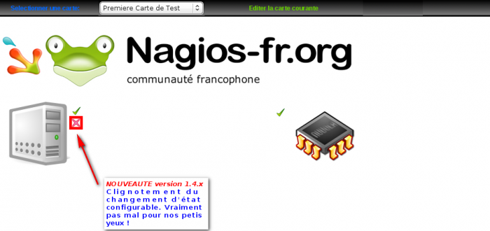
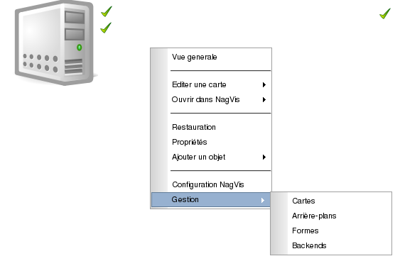
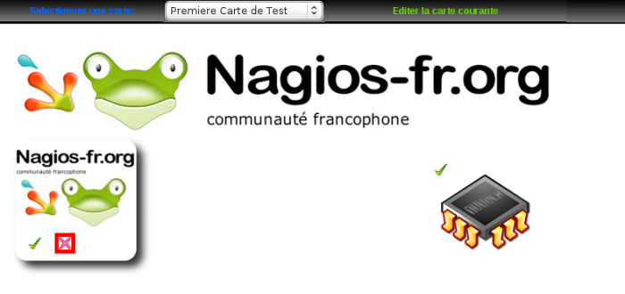
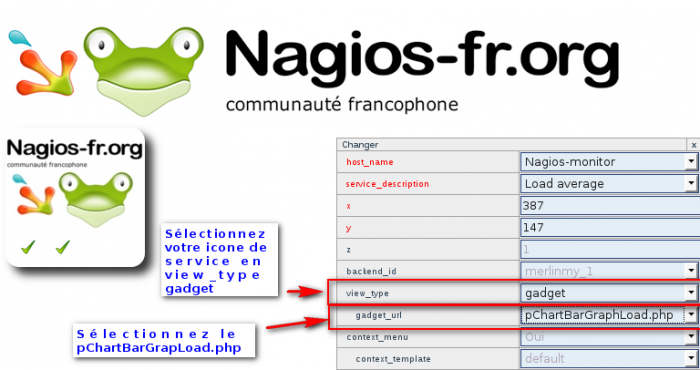
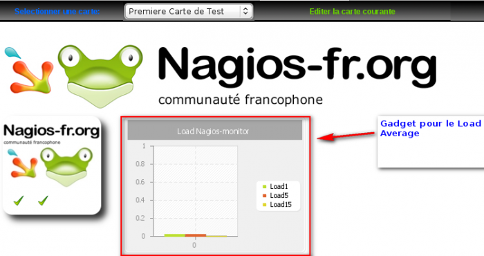
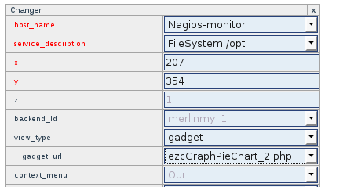
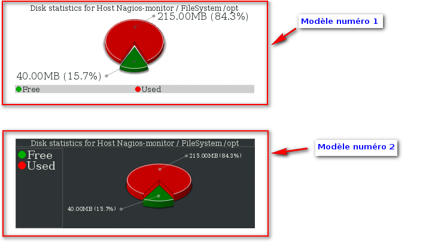
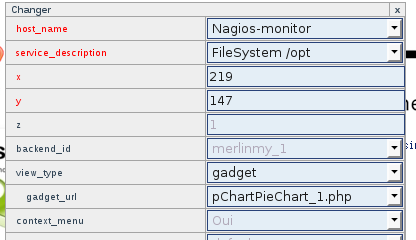
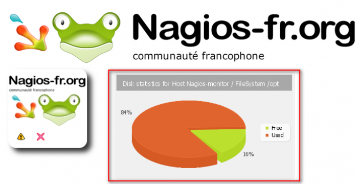

### Table des matières {.toggle}

-   [Customization de
    NagVis](customisation-nagvis.html#customization-de-nagvis)
    -   [En ligne de commande comme l'exemple qui va suivre
        :](customisation-nagvis.html#en-ligne-de-commande-comme-l-exemple-qui-va-suivre)
    -   [Par l'interface
        Web](customisation-nagvis.html#par-l-interface-web)
    -   [Gadgets](customisation-nagvis.html#gadgets)
    -   [Rotation des
        cartes](customisation-nagvis.html#rotation-des-cartes)

Customization de NagVis {#customization-de-nagvis .sectionedit1}
=======================

Cette partie va expliquer comment importer des éléments dans NagVis. Il
y a 2 méthodes possible :

En ligne de commande comme l'exemple qui va suivre : {#en-ligne-de-commande-comme-l-exemple-qui-va-suivre .sectionedit2}
----------------------------------------------------

-   **Pour les icônes**

~~~
wget http://switch.dl.sourceforge.net/sourceforge/nagvis/NagVis-Iconset-Lemon-02.tar.gz

tar zxvf NagVis-Iconset-Lemon-02.tar.gz

cd lemon/nagvis/nagvis/images/iconsets

cp * /usr/local/nagios/share/nagvis/nagvis/images/iconsets/

chown -R www-data:www-data /usr/local/nagios/share/nagvis/
~~~

-   **Pour les formes**

~~~
wget http://switch.dl.sourceforge.net/sourceforge/nagvis/NagVis-Shapes-Server-Dropline.tar.gz

tar zxvf NagVis-Shapes-Server-Dropline.tar.gz

cd shapes_dropline

cp * /usr/local/nagios/share/nagvis/nagvis/images/shapes/

chown -R www-data:www-data /usr/local/nagios/share/nagvis/
~~~

-   **Pour les templates (skins)**

~~~
wget http://dfn.dl.sourceforge.net/sourceforge/nagvis/NagVis-Template-Darkglass-0.4.tar.gz

tar zxvf NagVis-Template-Darkglass-0.4.tar.gz

cd darkglass

cp -r nagvis /usr/local/nagios/share/nagvis/

chown -R www-data:www-data /usr/local/nagios/share/nagvis/
~~~

Voilà avec un peu de tuning, votre Nagvis pourra paraître plus sexy

Par l'interface Web {#par-l-interface-web .sectionedit3}
-------------------

Vous voulez importer une image dans NagVis, voici la manipulation :

Après il suffit de mettre votre image sur votre carte et le tour est
joué.

Gadgets {#gadgets .sectionedit4}
-------

**ATTENTION: Ces gadgets sont explicables que pour le type de service
dont ils sont prévus.**

Trois gadgets sont actuellement sortis pour NagVis 1.4.1. Nous allons
vous expliquer comment les installer et les appliquer à votre carte.

-   **pChartBarGraph**

~~~
wget http://www.nagvis.org/sites/default/files/NagVis-Gadget-pChartBarGraphLoad-0.1.tgz

tar -xvzf NagVis-Gadget-pChartBarGraphLoad-0.1.tgz

cd gadget-pChartBarGraphLoad-0.1/nagvis/nagvis/gadgets

cp -r * /usr/local/nagios/share/nagvis/nagvis/gadgets/

chown -R www-data:www-data /usr/local/nagios/share/nagvis/
~~~

Sur l’interface Web, il faudra choisir un “icône de service” et lui
mettre la propriété “Gadget” au lieu de “Icon”.

Voilà le rendu :

-   **ezcGraphPieChar**

~~~
wget http://www.nagvis.org/sites/default/files/NagVis-Gadget-ezcGraphPieChart-0.1.tgz

tar -xvzf NagVis-Gadget-ezcGraphPieChart-0.1.tgz

cd gadget-ezcGraphPieChart-0.1/nagvis/nagvis/gadgets

cp -r * /usr/local/nagios/share/nagvis/nagvis/gadgets/

chown -R www-data:www-data /usr/local/nagios/share/nagvis/
~~~

Sur l’interface Web, il faudra choisir un “icône de service” et lui
mettre la propriété “Gadget” au lieu de “Icon”.

Voilà le rendu :

-   **pChartPieChart**

~~~
wget http://www.nagvis.org/sites/default/files/NagVis-Gadget-pChartPieChart-0.1.tgz

tar -xvzf NagVis-Gadget-pChartPieChart-0.1.tgz

cd gadget-pChartPieChart-0.1/nagvis/nagvis/gadgets

cp -r * /usr/local/nagios/share/nagvis/nagvis/gadgets/

chown -R www-data:www-data /usr/local/nagios/share/nagvis/
~~~

Sur l’interface Web, il faudra choisir un “icône de service” et lui
mettre la propriété “Gadget” au lieu de “Icon”.

Voilà le rendu :

Rotation des cartes {#rotation-des-cartes .sectionedit5}
-------------------

Pour pouvoir réaliser une rotation de vos différentes cartes NagVis, il
faut paramétrer une balise de rotation dans le fichier nagvis.ini.php
comme le modèle ci-dessous :

~~~
[rotation_test1]
rotationid="test1"
; These steps are rotated. The "Demo2:" is a label which is being displayed in
; the index pages rotation list.
maps="Ma_Carte1:carte1,Ma_Carte2:carte2"
; rotation interval (seconds)
interval=15
~~~

Description

rotationid

C’est l’identifiant correspondant à votre cycle de rotation

maps

Ce sont la liste des cartes que vous désirez voir dans votre cycle\
 La syntaxe est composé de
maps=”\<label\_carte1\>:\<nom\_de\_la\_carte1\>,\<label\_carte2\>:\<nom\_de\_la\_carte2\>,…”

interval

L’intervalle de rotation des cartes

Votre test est accessible à l’url suivante :
[http://IP\_SERV\_NAGIOS/nagvis/nagvis/index.php?rotation=test1](http://IP_SERV_NAGIOS/nagvis/nagvis/index.php?rotation=test1 "http://IP_SERV_NAGIOS/nagvis/nagvis/index.php?rotation=test1")
