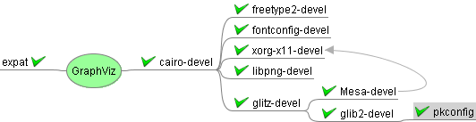
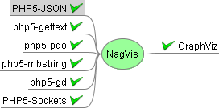
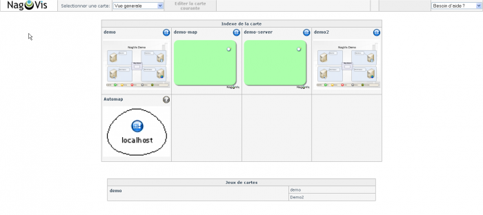

### Table des matières {.toggle}

-   [Installation NagVis sur SLES
    10](nagvis-suse-install.html#installation-nagvis-sur-sles-10)
    -   [Pré-Requis](nagvis-suse-install.html#pre-requis)
        -   [Vérification](nagvis-suse-install.html#verification)
        -   [Compilation
            packages](nagvis-suse-install.html#compilation-packages)
    -   [Installation](nagvis-suse-install.html#installation)
    -   [Paramétrage
        Apache](nagvis-suse-install.html#parametrage-apache)
    -   [Paramétrage de
        NagVis](nagvis-suse-install.html#parametrage-de-nagvis)

Cette documentation n’est plus à jour

Installation NagVis sur SLES 10 {#installation-nagvis-sur-sles-10 .sectionedit1}
===============================

Pré-Requis {#pre-requis .sectionedit2}
----------

Pour l’installation de NagVis, nous allons avoir besoin de :

-   apache2
-   libapache2-mod-php5
-   php5-gd
-   php5-mysql
-   php5-json
-   php5-sockets
-   graphviz

### Vérification {#verification .sectionedit3}

Nous allons vérifier si certains de nos dépendances ne sont pas déjà
installées.

~~~~ {.code .bash}
rpm -qa | grep php5*
 
 
php5-timezonedb-2008.2-0.3
php5-mbstring-5.2.5-9.5
php5-pdo-5.2.5-9.5
php5-gettext-5.2.5-9.5
php5-5.2.5-9.5
php5-devel-5.2.5-9.5
php5-ldap-5.2.5-9.5
php5-zlib-5.2.5-9.5
php5-gd-5.2.5-9.5
php5-mysql-5.2.5-9.5
apache2-mod_php5-5.2.5-9.5
php5-openssl-5.2.5-9.5
php5-pear-5.2.5-9.5
php5-posix-5.2.5-9.5
~~~~

### Compilation packages {#compilation-packages .sectionedit4}

-   **Compilation de Expat**

Nous allons d’abord aborder la compilation de expat-2.0.1 qui est un
pré-requis pour GraphViz, car la version que nous avons récupéré n’est
pas compatible avec celle installé par défaut
(expat-2.0.0-13.2.x86\_64.rpm)

~~~~ {.code .bash}
cd /tmp
wget http://switch.dl.sourceforge.net/project/expat/expat/2.0.1/expat-2.0.1.tar.gz
tar -xvzf expat-2.0.1.tar.gz
cd expat-2.0.1
~~~~

~~~~ {.code .bash}
./configure
~~~~

~~~~ {.code .bash}
make
~~~~

~~~~ {.code .bash}
make install
~~~~

-   **Compilation de GraphViz**

Nous vérifions si graphviz n’est pas déjà présent sur notre système.

~~~~ {.code .bash}
rpm -qa | graphviz*
~~~~

Graphviz a besoin de dépendances pour pouvoir être compilé. Voici
l’arbre de ces dépendances.

#### Installation des dépendances {#installation-des-dependances}

~~~~ {.code .bash}
yum install freetype2-devel fontconfig-devel xorg-x11-devel libpng-devel Mesa-devel pkgconfig glib2-devel glitz-devel cairo-devel php5-sockets php5-json
~~~~

Nous allons devoir installer GraphViz à la main sur notre SLES 10 vu
qu’il est recommandé une version supérieur à la 2.14.

~~~~ {.code .bash}
cd /tmp
tar -xvzf graphviz-2.26.3.tar.gz
cd graphviz-2.26.3
~~~~

~~~~ {.code .bash}
./configure
~~~~

~~~~ {.code .bash}
make
~~~~

~~~~ {.code .bash}
make install
~~~~

-   **Arbres des dépendances pour NagVis**

Installation {#installation .sectionedit5}
------------

-   **Les dépendances doivent être résolu**

-   **L’installation du Broker Module MKLiveStatus doit être installé.**

Nous allons tout d’abord décompresser l’archive de NagVis dans /tmp pour
pouvoir procéder à notre installation.

~~~~ {.code .bash}
cd /tmp
wget http://freefr.dl.sourceforge.net/project/nagvis/NagVis%201.4%20%28stable%29/nagvis-1.4.7.tar.gz
tar xvzf nagvis-1.4*.tar.gz
cd nagvis-1.4*
~~~~

Par mesure de sécurité, nous allons appliquer les droits d’exécution à
l’installeur si ce n’est pas déjà fait.

~~~~ {.code .bash}
chmod +x install.sh
~~~~

Lancer Installation

~~~~ {.code .bash}
./install.sh -n /usr/local/nagios/ -p /usr/local/nagvis -u wwwrun -g www
~~~~

Paramétrage Apache {#parametrage-apache .sectionedit6}
------------------

Créer un fichier nagvis.conf dans /etc/apache2/conf.d et y mettre le
contenu ci-dessous :

~~~~ {.code .bash}
cd /etc/apache2/conf.d
vi nagvis.conf
~~~~

~~~~ {.code}
Alias /nagvis "/applis/nagvis"

<Directory "/usr/local/nagvis">

#  SSLRequireSSL
   Options None
   AllowOverride None
   Order allow,deny
   Allow from all
#  Order deny,allow
#  Deny from all
#  Allow from 127.0.0.1
   AuthName "Nagios Access"
   AuthType Basic
   AuthUserFile /usr/local/nagios/etc/htpasswd.users
   Require valid-user

</Directory>
~~~~

Ensuite redémarrez Apache

~~~~ {.code .bash}
/etc/init.d/apache2 restart
~~~~

Maintenant NagVis est accessible via l’url suivante :
<http://SERV_CENTREON/nagvis>

En allant sur l’interface Web de NagVis, vous avez un message d’erreur
comme celui-ci :

**Error while connecting to MySQL server. Maybe wrong connection
properties in backend? MySQL-Error: Can’t connect to local MySQL server
through socket '/var/lib/mysql/mysql.sock’ (2). (Backend-ID: ndomy\_1)**

Normal, notre nagvis n’est pas encore paramétré à notre layout.

Paramétrage de NagVis {#parametrage-de-nagvis .sectionedit7}
---------------------

Tout d’abord, allez dans /usr/local/nagvis/etc/ et éditez le fichier
nagvis.ini.php

~~~~ {.code .bash}
cd /applis/nagvis/etc
vi nagvis.ini.php
~~~~

Modifiez les variables suivantes et retirer les ;

~~~~ {.code}
language="fr_FR"
refreshtime=60
base="/usr/local/nagvis/"
htmlbase="/nagvis"
backend="live_1"
backendtype="mklivestatus"
socket="unix:/usr/local/nagios/var/rw/live"
~~~~

Ensuite redémarrez Apache

~~~~ {.code .bash}
/etc/init.d/apache2 restart
~~~~

Lancez un navigateur Web, et allez sur votre Serveur Centreon à l’url
suivante :
[http://IP\_SERV\_NAGIOS/nagvis/nagvis/index.php](http://IP_SERV_NAGIOS/nagvis/nagvis/index.php "http://IP_SERV_NAGIOS/nagvis/nagvis/index.php")

