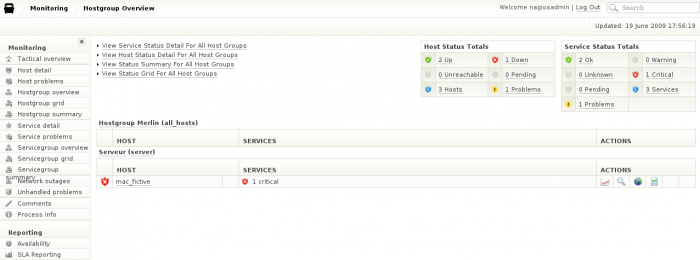

### Table des matières {.toggle}

-   [Ninja](ninja.html#ninja)
    -   [Pré-requis](ninja.html#pre-requis)
    -   [Installation](ninja.html#installation)
        -   [Arrêt des instances](ninja.html#arret-des-instances)
        -   [Récupération des
            sources](ninja.html#recuperation-des-sources)
        -   [Altération de la base de
            Merlin](ninja.html#alteration-de-la-base-de-merlin)
    -   [Configuration](ninja.html#configuration)
        -   [Redémarrage des
            instances](ninja.html#redemarrage-des-instances)
    -   [Présentation de l'interface
        Ninja](ninja.html#presentation-de-l-interface-ninja)

Ninja {#ninja .sectionedit1}
=====

Le projet
[Ninja](http://www.op5.org/community/projects/ninja "http://www.op5.org/community/projects/ninja")
est une tentative de la part d’op5 de développer une interface graphique
pour Nagios la plus flexible qu’il soit pour permettre un jour de voir
la technologie des CGI disparaître de nagios. C’est un projet qui est
lié au projet
[Merlin](../../../../addons/merlin.html "http://wiki.monitoring-fr.org/addons/merlin")
donc il est sous-entendu que Ninja ne peut pas fonctionner sans Merlin.

Pour le moment Ninja est encore très orienté architecture op5 donc il y
aura quelques points de configuration à prévoir pour qu’il se greffe
correctement à Nagios.

Pré-requis {#pre-requis .sectionedit2}
----------

-   Pré-requis pour Merlin
-   Installation de Merlin

Installation {#installation .sectionedit3}
------------

### Arrêt des instances {#arret-des-instances .sectionedit4}

Dans un premier temps avant d’attaquer, il faut arrêter tous processsus
et la base merlin pour éviter toutes sources d’erreurs ou violation de
partage.

~~~~ {.code}
/etc/init.d/merlind stop
/etc/init.d/nagios stop
/etc/init.d/apache2 stop
~~~~

### Récupération des sources {#recuperation-des-sources .sectionedit5}

Comme avec Merlin, nous allons utiliser “git” pour récupérer nos sources
ninja.

~~~~ {.code}
wget http://www.op5.org/op5media/op5.org/downloads/ninja-0.3.2.tar.gz
~~~~

Une fois nos sources récupérées, nous allons copier le contenu dans le
répertoire “share” de nagios

~~~~ {.code}
 
mkdir -p /usr/local/nagios/share/ninja
cp -Rf ninja/* /usr/local/nagios/share/ninja
cd /usr/local/nagios/share/ninja
~~~~

### Altération de la base de Merlin {#alteration-de-la-base-de-merlin .sectionedit6}

Ninja doit altérer la base merlin pour se lier à lui :

Si votre base Merlin à un utilisateur autre que celui par défaut. Il
faudra aller modifier quelques fichiers pour que les informations
concernant Merlin soit correcte :

C’est le script
/usr/local/nagios/share/ninja/install\_scripts/ninja\_db\_init.sh qui
permet cette altération. Ce script s’appuie sur d’autres fichiers qu’il
va falloir modifier.

-   Pour le fichier auth\_import\_mysql.php, il y a deux modifications.
    La première étant les informations de connexion à la base Merlin :

~~~~ {.code}
class ninja_auth_import
{
        private $db_type = mysql;
        private $db_host = "<serv_bdd_merlin> ou localhost";
        private $db_user = <user_merlin>;
        private $db_pass = <mdp_merlin>;
        private $db_database = <nom_base_Merlin>;
        public $prefix = false;
        private $merlin_conf_file = "/usr/local/nagios/etc";    # Endroit où se trouve le merlin.conf
        private $merlin_path = '/usr/local/nagios/bin';       # Endroit où se trouve les binaires
        private $nagios_cfg_path = '/usr/local/nagios/etc';           # Endroit où se trouve le nagios.cfg
~~~~

et la deuxième modification concerne les distributions Debian-like par
rapport au chemin de awk (remplacer le /bin/awk –\> awk).

~~~~ {.code}
public function __construct()
        {
                $this->merlin_conf_file = $this->merlin_path.'/import.php';

                # find db config settings from merlin
                exec("/bin/grep -m1 'imp->db_type' ".$this->merlin_conf_file."| awk -F = {'print $2'}", $db_type, $retval);
                exec("/bin/grep -m1 'imp->db_host' ".$this->merlin_conf_file."| awk -F = {'print $2'}", $db_host, $retval);
                exec("/bin/grep -m1 'imp->db_user' ".$this->merlin_conf_file."| awk -F = {'print $2'}", $db_user, $retval);
                exec("/bin/grep -m1 'imp->db_pass' ".$this->merlin_conf_file."| awk -F = {'print $2'}", $db_pass, $retval);
                exec("/bin/grep -m1 'imp->db_database' ".$this->merlin_conf_file."| awk -F = {'print $2'}", $db_database, $retval);
~~~~

-   Pour le fichier
    /usr/local/nagios/share/ninja/cli-helpers/htpasswd-import.php :

~~~~ {.code}
class htpasswd_importer
{
        private $htpasswd_file = "/usr/local/nagios/etc/htpasswd.users";
        public $overwrite = false;
        public $passwd_ary = array();
        private $existing_ary = array();
        private $db_user = "<user_merlin>";
        private $db_pass = "<mdp_merlin>";
        private $db_name = "<nom_base_Merlin>";
        private $db_port = 3306;
        private $db_host = "<serv_bdd_merlin> ou localhost";
        private $db_table = "users";
        private $db = false;
~~~~

Pour finir, lancer le script ninja\_db\_init.sh

~~~~ {.code}
./ninja_db_init.sh
~~~~

Pour vérifier si tout est correcte, connectez vous sur votre base Merlin
et regardez si dans la table des users, vous avez bien un utilisateur
nagiosadmin :

~~~~ {.code}
mysql -u <user_merlin> -p <nom_base_Merlin>

select * from users;
~~~~

Configuration {#configuration .sectionedit7}
-------------

Nous allons modifier quelques fichiers de configuration pour lier Ninja
au répertoire de nagios.

Dans **/usr/local/nagios/share/ninja/application/config/config.php**,
vous allez modifier les champs suivantes par ces valeurs :

~~~~ {.code}
$config['site_domain'] = '/nagios/ninja/';
$config['nagios_base_path'] = '/usr/local/nagios';
$config['logos_path'] = '/nagios/share/images/logos/';
$nacoma_real_path = '/usr/local/nagios/webconfig/';
$config['nacoma_path'] = '/nagios/webconfig/';
$config['pnp4nagios_path'] = '/nagios/pnp/';
$config['pnp4nagios_config_path'] = '/usr/local/nagios/etc/pnp/config.php';
$config['nagvis_real_path'] = '/usr/local/nagios/nagvis/';
$config['nagvis_path'] = '/nagios/nagvis/';
~~~~

Dans **/usr/local/nagios/share/ninja/application/config/database.php**,
vous allez modifier les champs suivants par les valeurs que vous avez
rentré pour la base merlin:

~~~~ {.code}
'user'     => 'user_merlin'
'pass'     => 'pass_merlin'
'host'     => 'localhost'
'database' => 'db_merlin'
~~~~

Ensuite, nous allons attribuer les bons droits au répertoire ninja

~~~~ {.code}
chown -R www-data:www-data /usr/local/nagios/ninja
~~~~

Pour en finir avec la configuration, nous allons modifier dans la base
le login et mot de passe du compte d’admin

~~~~ {.code}
mysql -h mysqlhost -u root -p mysqlmerlindb --execute="UPDATE users SET username='nagiosadmin', password_algo='sha1', password=SHA1('"mysqlnagiospwd"') where id=1;"
~~~~

### Redémarrage des instances {#redemarrage-des-instances .sectionedit8}

~~~~ {.code}
/etc/init.d/merlind start
/etc/init.d/nagios start
/etc/init.d/apache2 start
~~~~

Présentation de l'interface Ninja {#presentation-de-l-interface-ninja .sectionedit9}
---------------------------------

-   **Tactical Overview**

Cette vue est je pense la meilleure de toute pour le moment. Elle est
entièrement flexible avec son système de widgets. Chaque éléments de la
vue peuvent-être bouger comme vous le désirez. Ils ont même penser à un
système de réduction des widgets.

-   **Host Detail**

On retrouve ici la vue de la liste des hôtes. Elle est devenue plus
sobre et avec des fonctionnalités inspirées des sites web pour une
navigation plus fluide.

-   **Host Problems**

-   **Hostgroup Overview**

-   **Services Detail**

-   **Services Problems**

-   **Comments**

