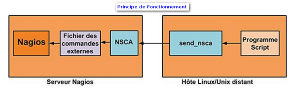

### Table des matières {.toggle}

-   [Protocole NSCA](nsca.html#protocole-nsca)
    -   [Pré-Requis](nsca.html#pre-requis)
    -   [Installation](nsca.html#installation)
        -   [Côté Serveur Nagios](nsca.html#cote-serveur-nagios)
        -   [Côté Machine à
            superviser](nsca.html#cote-machine-a-superviser)
    -   [Principe de
        Fonctionnement](nsca.html#principe-de-fonctionnement)
        -   [Côté Machine à
            superviser](nsca.html#cote-machine-a-superviser1)
        -   [Côté serveur Nagios](nsca.html#cote-serveur-nagios1)

Protocole NSCA {#protocole-nsca .sectionedit1}
==============

La seule différence qu’il y a entre les contrôles actifs et passifs est
que dans le premier cas, les contrôles sont réalisés par Nagios alors
que dans le deuxième cas, ils sont réalisés par des applications
externes. Une fois qu’une application externe a réalisé un contrôle de
service, elle soumet le résultat à Nagios via le fichier de commande
externe. Puis Nagios se charge de lire tous les résultats et de les
replacer. L’agent NSCA permet l’envoi de commandes externes à Nagios.

Pré-Requis {#pre-requis .sectionedit2}
----------

Aussi bien sur le serveur que sur le client, il faudra installer les
packages suivants :

~~~~ {.code}
apt-get install libmcrypt4 snmp
~~~~

Installation {#installation .sectionedit3}
------------

### Côté Serveur Nagios {#cote-serveur-nagios .sectionedit4}

Une fois téléchargée, décompressez l’archive récupérée puis lancer la
compilation et l’installation.

~~~~ {.code}
wget http://freefr.dl.sourceforge.net/sourceforge/nagios/nsca-2.7.2.tar.gz

tar zxvf nsca-2.7.2.tar.gz

cd nsca-2.7.2

./configure --prefix=/usr/local/nagios/ --with-trusted-path=/bin:/sbin:/usr/bin:/usr/sbin:/usr/local/nagios/bin:/usr/local/nagios/libexec

make all
~~~~

On copiera le binaire et le fichier de configuration qui nous intéresse
pour la partie serveur.

~~~~ {.code}
cp src/nsca /usr/local/nagios/bin/

cp sample-config/nsca.cfg /usr/local/nagios/etc/
~~~~

Quelques explications sur le fichier de configuration (nsca.cfg) :

~~~~ {.code}
# A METTRE LE MOT DE PASSE QUE VOUS DESIREZ
password=xxxxxxxx

# LA METHODE DE CRYPTAGE (FAITE VOTRE CHOIX)
decryption_method=1
~~~~

Pour le lancement de nsca, on va opter pour la méthode démon comme
(ci-dessous) :

Attention de vérifier les chemins dans le script du démon. Plus haut
nous avons installé avec /usr/local/nagios, dans le script les chemins
font références /opt/nagios. Variable DAEMON, CONF

~~~~ {.code}
#!/bin/sh

# simple debian init script for nsca
# by sean finney <[email protected]
/*  */!function(){try{var t="currentScript"in document?document.currentScript:function(){for(var t=document.getElementsByTagName("script"),e=t.length;e--;)if(t[e].getAttribute("cf-hash"))return t[e]}();if(t&&t.previousSibling){var e,r,n,i,c=t.previousSibling,a=c.getAttribute("data-cfemail");if(a){for(e="",r=parseInt(a.substr(0,2),16),n=2;a.length-n;n+=2)i=parseInt(a.substr(n,2),16)^r,e+=String.fromCharCode(i);e=document.createTextNode(e),c.parentNode.replaceChild(e,c)}}}catch(u){}}();/*  */>

DAEMON=/opt/nagios/bin/nsca
NAME=nsca
DESC="Nagios Service Check Acceptor"
CONF=/opt/nagios/etc/nsca.cfg
OPTS="--daemon -c $CONF"
PIDFILE="/var/run/nsca.pid"

###

# obviously if the daemon doesn't exist we should stop now
if [ ! -x $DAEMON ]; then
        exit 0
fi

# grab an arbitrary config setting from nsca.cfg
get_config(){
        grep "^[[:space:]]*$1=" $CONF 2>/dev/null | tail | cut -d= -f2-
}

# if the pid_file is specified in the configuration file, nsca will
# take care of the pid handling for us.  if it isn't we should continue
# as we have before
PIDFILE=`get_config pid_file`
# if pidfile isn't set
if [ -z "$PIDFILE" ];  then
        # then this is the default PIDFILE
        PIDFILE="/var/run/nsca.pid"
        # run nsca in the foreground, and have s-s-d fork it for us
        OPTS="-f $OPTS"
        # and then this is how we call SSD
        SSD_STARTOPTS="--background --pidfile $PIDFILE --make-pidfile"
        SSD_STOPOPTS="--pidfile $PIDFILE"
else
        # but if pid_file is set, we don't have to do anything
        SSD_STARTOPTS="--pidfile $PIDFILE"
        SSD_STOPOPTS="--pidfile $PIDFILE"
fi

SSD_START="/sbin/start-stop-daemon -S $SSD_STARTOPTS --exec $DAEMON"
SSD_STOP="/sbin/start-stop-daemon -K $SSD_STOPOPTS --exec $DAEMON"

die(){
        echo $@
        exit 1
}

case "$1" in
start)
        echo -n "Starting $DESC: "
        if [ ! -d "/var/run/nagios" ]; then
                mkdir -p /var/run/nagios || die "ERROR: couldn't create /var/run/nagios"
        fi
        $SSD_START -- $OPTS || die "ERROR: could not start $NAME."
        echo "$NAME."
;;
stop)
        echo -n "Stopping $DESC: "
        $SSD_STOP -- $OPTS || die "ERROR: could not stop $NAME."
        rm -f $PIDFILE
        echo "$NAME."
;;
reload|force-reload)
        echo -n "Reloading $DESC: "
        $SSD_STOP --signal HUP -- $OPTS || die "ERROR: could not reload $NAME."
        echo "$NAME."
;;
restart)
        $0 stop
        $0 start
;;
esac
~~~~

Il sera lancé au démarrage de la machine :

~~~~ {.code}
chmod +x /etc/init.d/nsca

update-rc.d nsca defaults
~~~~

### Côté Machine à superviser {#cote-machine-a-superviser .sectionedit5}

Une fois téléchargée, décompressez l’archive récupérée puis lancer la
compilation et l’installation.

~~~~ {.code}
wget http://freefr.dl.sourceforge.net/sourceforge/nagios/nsca-2.7.2.tar.gz

tar zxvf nsca-2.7.2.tar.gz

cd nsca-2.7.2

./configure --prefix=/usr/local/nagios/ --with-trusted-path=/bin:/sbin:/usr/bin:/usr/sbin:/usr/local/nagios/bin:/usr/local/nagios/libexec

make all
~~~~

On copiera le binaire et le fichier de configuration qui nous intéresse
pour la partie serveur.

~~~~ {.code}
cp src/send_nsca /usr/local/nagios/libexec

cp sample-config/send_nsca.cfg /usr/local/nagios/etc/
~~~~

Quelques explications sur le fichier de configuration (send\_nsca.cfg) :

**Le mot de passe et la méthode de cryptage doivent être à l’identique
que ceux spécifier dans le nsca.cfg**

~~~~ {.code}
# A METTRE LE MOT DE PASSE QUE VOUS DESIREZ
password=xxxxxxxx

# LA METHODE DE CRYPTAGE (FAITE VOTRE CHOIX)
encryption_method=1
~~~~

Principe de Fonctionnement {#principe-de-fonctionnement .sectionedit6}
--------------------------

**Source: Livre NAGIOS au coeur de la Supervision Open Source rédigé par
Olivier Jan**

### Côté Machine à superviser {#cote-machine-a-superviser1 .sectionedit7}

Le principe est simple le send\_nsca aura pour mission d’envoyer une
commande externe au serveur nagios pour lui confirmer dans quel état il
se trouve, donc tout vos scripts devront à la fin faire appel au
send\_nsca.

Comme NRPE, send\_nsca est avant tout un moyen de transport pour
soumettre les résultats de contrôles locaux au serveur Nagios;
send\_nsca contactant pour se faire le démon NSCA fonctionnant sur
celui­-ci. send\_nsca possède les mêmes arguments et options ainsi que
le même fichier de configuration sur toutes les plates­-formes pour
lequel il fonctionne.

~~~~ {.code}
-H <host_address> 
L’adresse IP du serveur Nagios à contacter. 

[-p port] 
Le port distant à contacter ­(défaut 5667). 

[-to to_sec] 
Le seuil de dépassement de temps de connexion exprimé en secondes. La valeur par défaut est 10. 

[-d delim] 
Le séparateur à utiliser pour présenter les données (tabulation par défaut). 
        
[-c config_file] 
Fichier de configuration à utiliser. 
~~~~

Selon que vous retournez au serveur un contrôle d’hôte ou de service, le
format des données varie légèrement.

*Contrôles de services :*

~~~~ {.code}
<host_name>[tab]<svc_description>[tab]<return_code>[tab]<plugin_output>[newline]
~~~~

*Contrôles d’hôtes :*

~~~~ {.code}
<host_name>[tab]<return_code>[tab]<plugin_output>[newline]
~~~~

Dans les deux cas, il faut présenter le nom de l’hôte ; le code retour
et le message à afficher dans la console. Dans le cas du contrôle de
service, il faut en plus envoyer la description du service à impacter
dans Nagios. Nous allons voir un exemple avec d’un côté l’envoi depuis
l’hôte et de l’autre la réception sur le serveur Nagios. Côté client,
l’interaction se fait avec n’importe quel programme sachant exécuter un
script/programme externe. C’est ce programme qui génère l’appel
send\_nsca.

~~~~ {.code}
       
sysop@jeos:~$ echo "jeos;;syslog_warning;;0;;OK - Soumission via send_nsca" |/usr/local/nagios/bin/send_nsca -H 192.168.44.100 -c /usr/local/nagios/etc/send_nsca.cfg -d ";;"

1 data packet(s) sent to host successfully.
~~~~

Dans cet exemple d’appel, nous utilisons un simple echo dont la sortie
est passé via un tube à l’entrée de send\_nsca. Les données sont
présentées avec un double point­ virgule comme séparateur grâce à
l’argument -d et le fichier de configuration est précisé avec l’option
-c. send\_nsca répond en indiquant que le message a bien été transmis.

### Côté serveur Nagios {#cote-serveur-nagios1 .sectionedit8}

C’est NSCA qui reçoit ce message sur le port d’écoute précisé et
transforme ce message en commande externe Nagios. Pour que cette
commande soit bien prise en compte par Nagios, il faut bien entendu
avoir l’hôte et le service précisé présent dans les fichiers de
configuration.

~~~~ {.code}
define service{
name                                passif-generic
use                                 generic-service
service_description                     syslog_warning
host_name                               jeos
active_checks_enabled                    0
passive_checks_enabled                   1
is_volatile                              1
max_check_attempts                       1
check_freshness                          1
freshness_threshold                      120
check_command                            check_dummy!0!No messages in last 6 hours
}
~~~~

Nous créons un fichier qui définit un service pour jeos appelé
syslog\_warning. Sa particularité est d’être un service passif grâce aux
directives active\_check\_enabled à 0 et passive\_checks\_enabled à 1.

-   max\_check\_attempts est à 1 pour passer le service directement en
    état HARD.
-   check\_freshness est à 1 pour pouvoir repasser automatiquement le
    service à l’état ok grâce à la commande
-   check\_dummy 120 minutes (freshness\_threshold) après avoir reçu le
    dernier événement.

Dans Centreon, le réglage du Freshness se fait dans l’onglet “Data
Processing”, et la valeur du freshness\_threshold est à saisir en
secondes.
