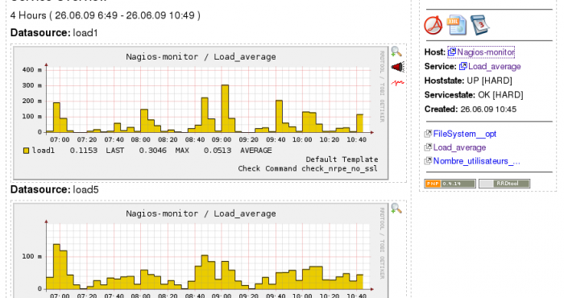
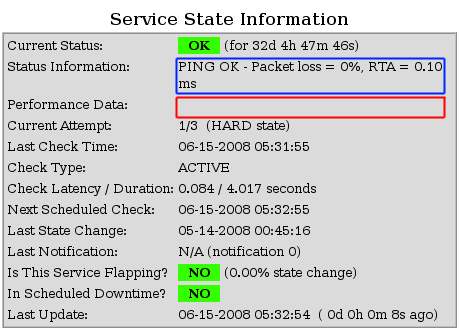

### Table des matières {.toggle}

-   [PNP 0.4](pnp-0.4.html#pnp-04)
    -   -   [Installation](pnp-0.4.html#installation)
    -   [Configuration](pnp-0.4.html#configuration)
    -   [Liaison avec l'interface
        Web](pnp-0.4.html#liaison-avec-l-interface-web)
    -   [Principe de
        fonctionnement](pnp-0.4.html#principe-de-fonctionnement)

PNP 0.4 {#pnp-04 .sectionedit1}
=======

[PNP](http://www.pnp4nagios.org/pnp/start "http://www.pnp4nagios.org/pnp/start")
est l’acronyme de PNP is NOT Perfparse. Il permet de récupérer la partie
performance de la sortie des plugins et d’injecter ces valeurs dans des
bases rrdtool puis de les grapher via un front-end écrit en PHP. Il est
en cela comparable à d’autres outils comme NagiosGraph, NagiosGrapher,
N2RRD voir dans une moindre mesure
[Cacti](../../../../../cacti/start.html "cacti:start").

### Installation {#installation .sectionedit2}

Il faut bien sur s’assurer que RRDtool soit installé

~~~~ {.code .bash}
sudo apt-get install rrdtool librrds-perl
~~~~

Ensuite, la compilation et l’installation proprement dite

~~~~ {.code}
wget http://kent.dl.sourceforge.net/sourceforge/pnp4nagios/pnp-0.4.14.tar.gz
tar -xzf pnp-0.4.14.tar.gz
pushd pnp-0.4.14
./configure --with-perfdata-dir=/usr/local/nagios/var/perfdata/ --with-init-dir=/etc/init.d/
make all
sudo make install
sudo make install-config
~~~~

Ce qui nous intéresse est le Mode Bulk avec le NPCD. La raison de notre
choix c’est que ça allège considérablement Nagios vu que c’est le démon
NPCD qui fait tout le boulot. Nagios n’a juste qu’à écrire les perfdata
dans les fichiers.

~~~~ {.code}
*** Main program, Scripts and HTML files installed ***

Please run 'make install-init' if you want to use
BULK Mode with NPCD

make install-init
~~~~

Les fichiers installés sont les suivants:

-   /usr/local/nagios/bin/npcd
-   /etc/init.d/npcd
-   /usr/local/nagios/libexec/process\_perfdata.pl
-   /usr/local/nagios/share/pnp/
-   /usr/local/nagios/etc/

Configuration {#configuration .sectionedit3}
-------------

Notre configuration sera orienté en Bulk Mode avec le démon NPCD, ce
système est un peu plus complexe à mettre en oeuvre mais sur de grosses
architectures, il est fortement recommandé.

Dans votre nagios.cfg

~~~~ {.code}
process_performance_data=1

#
# service performance data
#
service_perfdata_file=/usr/local/nagios/var/service-perfdata
service_perfdata_file_template=DATATYPE::SERVICEPERFDATA\tTIMET::$TIMET$\tHOSTNAME::$HOSTNAME$\tSERVICEDESC::$SERVICEDESC$\tSERVICEPERFDATA::$SERVICEPERFDATA$\tSERVICECHECKCOMMAND::$SERVICECHECKCOMMAND$\tHOSTSTATE::$HOSTSTATE$\tHOSTSTATETYPE::$HOSTSTATETYPE$\tSERVICESTATE::$SERVICESTATE$\tSERVICESTATETYPE::$SERVICESTATETYPE$\tSERVICEOUTPUT::$SERVICEOUTPUT$
service_perfdata_file_mode=a
service_perfdata_file_processing_interval=15
service_perfdata_file_processing_command=process-service-perfdata-file

#
# host performance data starting with Nagios 3.0
# 
host_perfdata_file=/usr/local/nagios/var/host-perfdata
host_perfdata_file_template=DATATYPE::HOSTPERFDATA\tTIMET::$TIMET$\tHOSTNAME::$HOSTNAME$\tHOSTPERFDATA::$HOSTPERFDATA$\tHOSTCHECKCOMMAND::$HOSTCHECKCOMMAND$\tHOSTSTATE::$HOSTSTATE$\tHOSTSTATETYPE::$HOSTSTATETYPE$\tHOSTOUTPUT::$HOSTOUTPUT$
host_perfdata_file_mode=a
host_perfdata_file_processing_interval=15
host_perfdata_file_processing_command=process-host-perfdata-file
~~~~

Dans le commands.cfg, déclarez les 2 commandes suivantes :

~~~~ {.code}
define command{
        command_name    process-service-perfdata-file
        command_line    /bin/mv /usr/local/nagios/var/service-perfdata /usr/local/nagios/var/spool/perfdata/service-perfdata.$TIMET$
 }

define command{
        command_name    process-host-perfdata-file
        command_line    /bin/mv /usr/local/nagios/var/host-perfdata /usr/local/nagios/var/spool/perfdata/host-perfdata.$TIMET$
 }
~~~~

Concernant les modifications à apporter à PNP :

~~~~ {.code}
cd /usr/local/nagios/etc/pnp

cp rra.cfg-sample rra.cfg
cp npcd.cfg-sample npcd.cfg
~~~~

Liaison avec l'interface Web {#liaison-avec-l-interface-web .sectionedit4}
----------------------------

Pour votre hôte ou votre service, veuillez rajouter :

**Exemple :**

~~~~ {.code}
define host {
  name       host-pnp
  register   0
  action_url /nagios/pnp/index.php?host=$HOSTNAME$
}

define service {
  name       srv-pnp
  register   0
  action_url /nagios/pnp/index.php?host=$HOSTNAME$&srv=$SERVICEDESC$
}
~~~~

Sur l’interface Web nagios vous verrez un icône apparaître

**Attention si vous n’avez pas de remontée de performance dans votre
plugin, pnp ne pourra pas vous générer de graph.**

Principe de fonctionnement {#principe-de-fonctionnement .sectionedit5}
--------------------------

Comment fonctionne le Bulk Mode avec le démon npcd :

-   1) Nagios réalise un check de votre service
-   2) Nagios va aller écrire le résultat du check dans
    /usr/local/nagios/var/service-perfdata
-   3) En même temps, Nagios fait appelle aux commandes
    process-perfdata-file
-   4) Le démon npcd quand à lui va aller scruter toutes les 15 sec
    (variable “service\_perfdata\_file\_processing\_interval”) le
    répertoire /usr/local/nagios/var/spool/perfdata (emplacement où
    nagios a copié les fichiers perfdata et aussi définition dans le
    fichier /usr/local/nagios/etc/pnp/npcd.cfg) voir s’il y trouve des
    fichiers et les traite.

Voilà comment fonctionne en gros le Bulk Mode avec NPCD.

Pour voir si votre installation fonctionne bien, pensez à vérifier :

-   les fichiers de perfdata dans /usr/local/nagios/var pour voir si
    vous avez des données cohérentes dedans ou pas
-   Vous pouvez passer le démon npcd en mode debug pour savoir ce qu’il
    fait (dans le fichier npcd.cfg –\> variable debug=-1). Il ira écrire
    dans le fichier /usr/local/nagios/var/npcd.log

