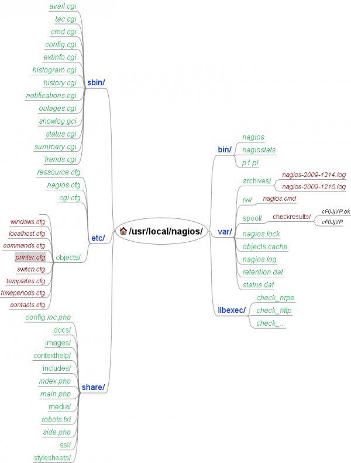
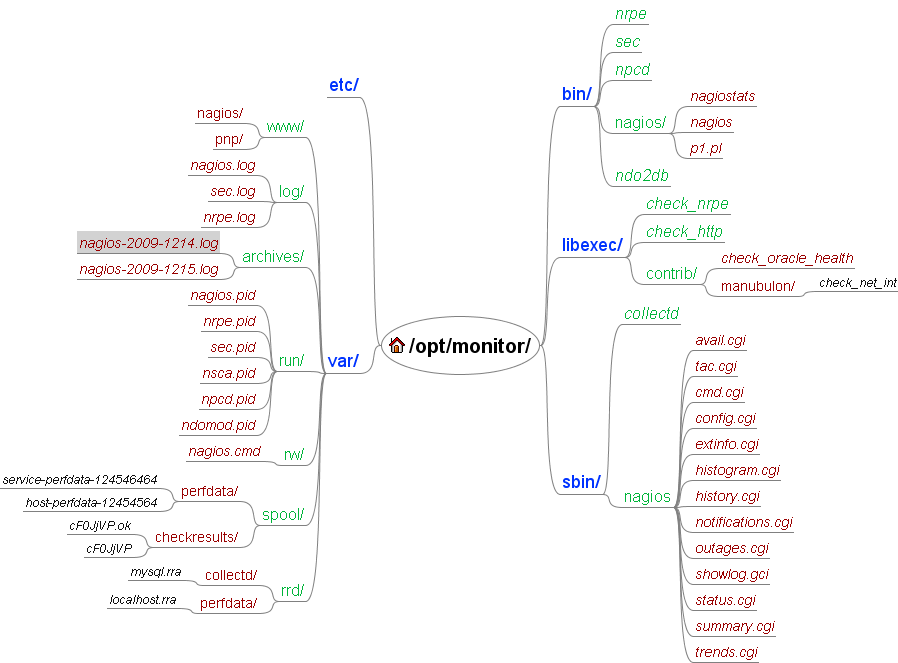
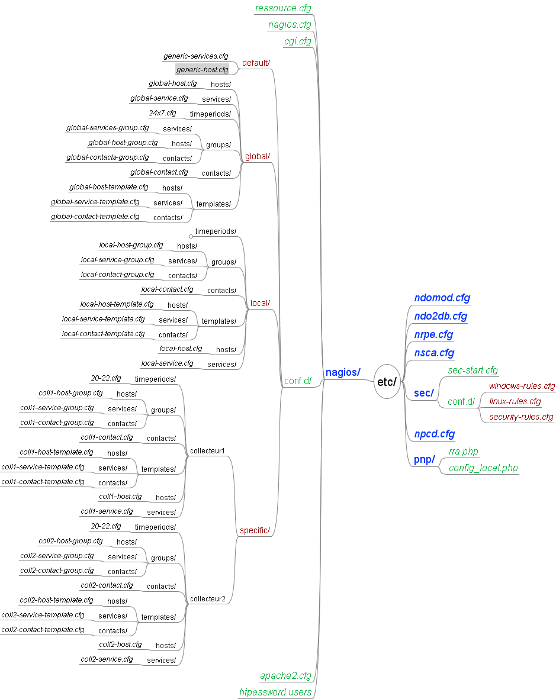

### Table des matières {.toggle}

-   [Arborescence des
    fichiers](installation-layout.html#arborescence-des-fichiers)
    -   [Introduction](installation-layout.html#introduction)
    -   [Arborescence
        standard](installation-layout.html#arborescence-standard)
    -   [Arborescence
        monitoring-fr.org](installation-layout.html#arborescence-monitoring-frorg)
        -   [Principaux chemins
            d'installation](installation-layout.html#principaux-chemins-d-installation)
        -   [Arborescence des fichiers de
            configuration](installation-layout.html#arborescence-des-fichiers-de-configuration)
    -   [Conclusion](installation-layout.html#conclusion)

Arborescence des fichiers {#arborescence-des-fichiers .sectionedit1}
=========================

Introduction {#introduction .sectionedit2}
------------

Il est d’usage lorsque l’on compile soi-même Nagios de tout installer
dans */usr/local/nagios*. Le principal avantage de cette installation
par défaut est qu’il n’y a en général rien à éditer dans les fichiers de
configuration de Nagios et surtout des addons, ceux-ci étant prévus pour
fonctionner par défaut dans cette arborescence. **Elle est donc
particulièrement adaptée aux débutants**.

Pourtant, même si cette installation par défaut est tout à fait valable,
**elle ne correspond plus aux standards actuels** tels que définis par
la Linux Standard Base
([LSB](http://www.linuxfoundation.org/collaborate/workgroups/lsb "http://www.linuxfoundation.org/collaborate/workgroups/lsb"))
et ne permet pas de construire une **solution de supervision contenant
Nagios en son cœur mais pas que Nagios**. C’est le cas de la plupart des
installations où Nagios est complété au minimum par
[NRPE](../../../nagios/addons/nrpe.html "nagios:addons:nrpe"),
[NSCA](../../../nagios/addons/nsca.html "nagios:addons:nsca"), et un
module grapheur type
[PNP](../../../nagios/addons/pnp/start.html "nagios:addons:pnp:start").
Nous allons donc poser les bases d’une telle **installation plutôt
réservée il est vrai à des administrateurs Nagios expérimentés**.

Arborescence standard {#arborescence-standard .sectionedit3}
---------------------

L’arborescence par défaut a sa racine dans */usr/local/nagios*/ comme le
montre le schéma ci-dessous

Six dossiers se trouvent présents sous cette racine.

-   *bin*/ contient les binaires dont nagios bien sûr mais aussi
    nagiostats qui permet d’avoir les statistique sde fonctionnement de
    Nagios et p1.pl qui l’interpréteur Perl intégré si Nagios a été
    compilé avec cette option.
-   *libexec*/ est le répertoire contenant les plugins de contrôle et
    collecte.
-   *sbin*/ contient les fichiers CGI qui sont utilisés par l’interface
    web de Nagios.
-   *share*/ contient l’ensemble des fichiers utilisés par les CGIs
    d’interface web.
-   *var*/ contient les fichiers de données que gèrent Nagios. On y
    retrouve le fichier de log mais aussi les fichiers de rétention et
    de statut. C’est également dans un sous-répertoire (*rw*) de ce
    dossier que se trouve le fichier de pipe des commandes externes.
-   *etc*/ contient l’ensemble des fichiers de ocnfiguration de Nagios.

Voici un [fichier
exhaustif](../../../assets/media/nagios/standard-layout.txt.tar.gz "nagios:standard-layout.txt.tar.gz")
de tous les fichiers et répertoires installés par Nagios obtenu par une
simple commande

~~~~ {.code}
ls -lR
~~~~

sur le répertoire */usr/local/nagios*/ ainsi que le [fichier
source](../../../assets/media/nagios/standard-layout.zip "nagios:standard-layout.zip")
au format
[freemind](http://freemind.sourceforge.net "http://freemind.sourceforge.net")
ayant servi à composer l’image ci-dessus.

Arborescence monitoring-fr.org {#arborescence-monitoring-frorg .sectionedit4}
------------------------------

L’installation qui est proposée dans la suite de ce document permet de :

1.  d’adhérer de façon plus correcte aux standards LSB.
2.  de se composer une solution de supervision sur mesure mélangeant
    Nagios avec d’autres logiciels Open Source.
3.  de voir l’ensemble des objets de configuration sans avoir besoin
    d’éditer de fichiers. Un simple ls suffit. il faut pour cela
    respecter une règle en or : **Un seul objet de configuration par
    fichier de configuration**.
4.  de gérer des configurations complexes en environnement distribué
    avec exceptions sur chacun des collecteurs.
5.  de versionner l’ensemble des fichiers de configuration de la
    solution avec des outils comme
    [SVN](http://subversion.tigris.org/ "http://subversion.tigris.org/"),
    [Git](http://git-scm.com/ "http://git-scm.com/") ou
    [Bazaar](http://bazaar-vcs.org/ "http://bazaar-vcs.org/").

### Principaux chemins d'installation {#principaux-chemins-d-installation .sectionedit5}

Nous allons installer l’ensemble de notre solution de supervision dans
*/opt/monitoring*/. Cette solution contiendra les logiciels
[Nagios](../../../nagios/start.html "nagios:start"),
[NRPE](../../../nagios/addons/nrpe.html "nagios:addons:nrpe"),
[NSCA](../../../nagios/addons/nsca.html "nagios:addons:nsca"),
[PNP](../../../nagios/addons/pnp/start.html "nagios:addons:pnp:start"),
[SEC](../../../nagios/integration/sec.html "nagios:integration:sec"),
[Collectd](../../../nagios/integration/collectd.html "nagios:integration:collectd")
et
[NDOUtils](../../../nagios/addons/ndoutils.html "nagios:addons:ndoutils").

Le schéma ci-dessous illustre cette arborescence d’installation
néanmoins amputé du dossier *etc*/ que nous verrons plus loin.

Pas de révolution par rapport à une installation par défaut mais
quelques points à souligner :

-   Tous les fichiers .pid se retrouvent dans le dossier *var/run*/
    comme c’est la cas sur les distros de type Debian.
-   Idem pour les fichiers de log qui se trouvent dans *var/log*
-   Le dossier *var/www*/ contient l’ensemble des fichiers devant être
    servis par Apache comme dans les distros de type Debian.
-   Le dossier *spool*/ se voit gratifer d’un nouveau sous-répertoire
    *perfdata*/ pour y stocker les fichiers de performance en attente de
    traitement.
-   Un nouveau répertoire *var/rrd*/ pour contenir l’ensemble des bases
    de données
    [RRDTool](../../../supervision/rrdtool.html "supervision:rrdtool"),
    qu’elle soient générées par
    [PNP](../../../nagios/addons/pnp/start.html "nagios:addons:pnp:start"),
    [Collectd](../../../nagios/integration/collectd.html "nagios:integration:collectd")
    ou autres.

Cette arborescence est bien entendu une base que vous avez tout loisir
de modifier en fonction de vos goûts personnels ou de vos propres
standards d’entreprise. Passons au gros morceau avec l’arborescence des
fichiers de configuration.

### Arborescence des fichiers de configuration {#arborescence-des-fichiers-de-configuration .sectionedit6}

Ce document n’a pas pour vocation à donner l’arborescence universelle à
utiliser avec Nagios mais prétend poser les bases d’une structuration
pouvant s’adapter à toutes les situations, que ce soit en environnement
distribué ou simple. L’arborescence proposée est le résultat de
nombreuses années de pratique de gestion de configuration Nagios à la
main.

Les fichiers de configuration contiennent l’ensemble des informations
nécessaires à la prise en compte d’un périmètre de supervision par
Nagios. Il est donc logique d’y trouver des notions d’hôtes, de
services, de contacts, de notifications, d’escalades, de dépendances, de
groupes, de gabarits et de périodes de temps qui sont autant d’objets
que Nagios reconnaît et manipule. Bien que Nagios soit fourni en
standard avec un jeu de fichiers de configuration d’exemple,
l’arborescence choisie pour ces fichiers se révèlent vite inconfortable
et sommaire dès que le périmètre supervisé augmente. Et comme toujours
avec Nagios, on se retrouve avec une liberté totale de faire ce qu’on
veut; y compris des bêtises.

Nous allons voir à l’aide du schéma ci-dessous quelques bonnes pratiques
qui peuvent servir de sources d’inspiration pour votre propre
arborescence de fichiers de configuration.

Avant de rentrer dans quelques explications sur cette arborescence,
voyons en les points forts ^[1)](installation-layout.html#fn__1)^

1.  Ensemble des fichiers de configuration des logiciels dans un seul
    répertoire */opt/monitor/etc*/, pratique pour démarrer l’équivalent
    d’un dépôt de code avec un système de contrôle de révisions.
2.  Une seule directive config\_dir à placer dans le fichier
    *nagios.cfg*. En l’occurrence,
    config\_dir=/opt/monitor/etc/nagios/conf.d.
3.  Une configuration adaptée à tous types d’installation Nagios, de la
    plus simple à la plus complexe. C’est juste un jeu de poupées russes
    qu’il convient maintenant d’expliquer.

Pour cela, rendez-vous dans le dossier */opt/monitor/etc/nagios*/. Ce
dossier contient l’ensemble des fichiers de configuration nécessaires au
bon fonctionnement de Nagios. Au premier niveau, nous retrouvons les
traditionnels fichiers *nagios.cfg*, *resource.cfg*, *cgi.cfg* mais
aussi deux petits nouveaux : le fichier *htpassword.users* et le fichier
*apache2.cfg*. le premier sert à stocker les utilisateurs et mots de
passe servant à l’interface web de Nagios et le fichier *apache2.cfg*
comprend la configuration Apache pour Nagios. Il faudra faire un lien
symbolique vers ce fichier depuis */etc/apache2/conf.d*/ pour qu’il soit
pris en compte par Apache.

Le dossier le plus important, celui qui contiendra l’ensemble de vos
objets de configuration pour Nagios est le dossier *conf.d*/… Reprenez
en cœur avec moi : Comme à la sauce Debian

#### Environnement simple

Dans un environnement simple, vous pouvez vous passer des dossiers
*global*/, *default*/, *local*/ et *specific*/. Il contiennent la même
arborescence et seront utilisés plus loin pour un environnement
distribué. Dans un environnement, depuis le répertoire *conf.d.*/, vous
pointez directement sur les répertoires situés dans un des dossiers
cités plus haut. Le découpage est alors très simple. Un dossier parent
par type d’objets manipulés par Nagios (*hosts*/, *services*/,
*contacts*/,etc…). Chacun des ces dossiers peut être scindés à l’envie
ou au besoin en autant de sous répertoires. par exemple, vous avez des
hôtes Windows et des hôtes Linux, créez alors un sous répertoire
*hosts/linux*/ et *hosts/windows*/. Chacun de ces dossiers contient les
déclarations d’hôtes genre
[www.monitoring-fr.org.cfg](http://www.monitoring-fr.org.cfg "http://www.monitoring-fr.org.cfg")
dans le dossier *hosts/linux*/.

#### Environnement distribué {#environnement-distribue}

Le meilleur pour la fin, mais aussi le plus complexe mais pas trop quand
même. Nous avons vu en environnement simple de quoi pouvait être composé
l’un des dossiers *global*/ ou *local*/, etc… Mais à quoi servent ces
dossiers que nous avons superbement ignorés jusqu’ici ?

En environnement distribué, il y a au moins trois serveurs Nagios; un
central et des collecteurs ^[2)](installation-layout.html#fn__2)^. **Ces
dossiers vont servir à stocker les configurations de chacun de ces
serveurs Nagios**. Cela permet d’avoir l’ensemble des configurations de
serveurs en un seul point (qui est versionné je le rappelle) et
d’ensuite distribuer les objets de configurations en fonction des
serveurs.

-   Le dossier *default*/ contient les gabarits d’objets par défaut. Ce
    dossier est différent sur le central et sur les collecteurs pour
    pouvoir gérer des services qui sont de façon passive sur le central
    alors qu’ils sont vus actifs sur les collecteurs. **Ceci pour
    respecter le fait qu’un serveur central est toujours passif**. Tous
    les autres gabarits utilisés dépendront de ces gabarits par défaut.
-   Le dossier *local*/ contient les objets de configuration uniques aux
    collecteurs.
-   Le dossier *global*/ contient l’ensemble des objets de configuration
    communs au serveur central et aux collecteurs.
-   Le dossier *specific*/ contient des sous répertoires (un par
    collecteur et un pour le central) contenant les objets de
    configuration uniques à un collecteur. Typiquement, les déclarations
    d’hôtes contenus dans le périmètre de collecte d’un collecteur.

Chacun de ces dossiers contient l’arborescence vu plus haut; à savoir
*hosts*/, *services*/, etc… Ce découpage, s’il paraît complexe au
premier abord permet de pouvoir gérer n’importe quel objet de
configuration en fonction du périmètre auquel il s’applique. Cela permet
d’avoir des exceptions de n’importe quel ordre comme un collecteur ne
supervisant son périmètre que de telle heure à telle heure. **Tout est
possible comme désactiver un objet de configuration sans l’enlever de la
configuration**. Il suffit de renommer le fichier
*objet\_de\_configuration.cfg* en *objet\_de\_configuration.no* ou
n’importe quelles extension qu’il vous plaira pour que ce fichier soit
ignoré au prochain redémarrage de Nagios. Vous pouvez aussi l’effacer
puisqu’il pourra renaître de ses cendres grâce au contrôle de révision
mis en place sur le répertoire parent.

Conclusion {#conclusion .sectionedit7}
----------

Nous sommes loin d’avoir fait le tour des possibilités et liberté
offertes par Nagios en matière d’arborescence de fichiers et plus
spécialement de fichiers de configuration. Les pistes évoquées ici
permettent simplement de structurer sa solution de supervision pour une
administration au quotidien plus puissante et plus sûre. Libre à vous
d’adapter l’ensemble de ce document à vos goûts; **l’essentiel étant de
ne pas rater la phase de réflexion sur la gestion de ces fichiers de
configuration**. Le [fichier
source](../../../assets/media/nagios/opt-layout.zip "nagios:opt-layout.zip")
ayant servi à construire les illustrations de ce document peut vous
servir de point de départ.

^[1)](installation-layout.html#fnt__1)^ ne cherchez pas, il n’y pas de
point faible 

^[2)](installation-layout.html#fnt__2)^ appelés également satellites
