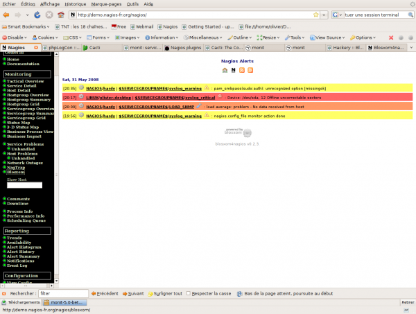

### Table des matières {.toggle}

-   [Blosxom4nagios](blosxom4nagios.html#blosxom4nagios)
    -   [Installation](blosxom4nagios.html#installation)
        -   [Configuration
            Apache](blosxom4nagios.html#configuration-apache)
    -   [Intégration dans
        Nagios](blosxom4nagios.html#integration-dans-nagios)

Blosxom4nagios {#blosxom4nagios .sectionedit1}
==============

[Blosxom4nagios](http://www.openfusion.net/blosxom/blosxom4nagios "http://www.openfusion.net/blosxom/blosxom4nagios")
est une version de blosxom spécialement modifiée pour fonctionner avec
Nagios. Ce logiciel permet de récupérer les lnotifications ou les
event\_handlers de Nagios dans une arborescence html de type blog. J’ai
suivi une démarche un peu identique avec l’essai
[Dokuwiki](../../../../nagios/event_handlers.html "nagios:event_handlers").
Le bénéfice supplémentaire est d’avoir à disposition via son
intermédiaire des flux rss et atom pour les notifications Nagios.

Ce tutoriel a été réalisé par :

  **Rôle**        **Nom**
  --------------- -------------
  **Rédacteur**   Olivier JAN

Installation {#installation .sectionedit3}
------------

S’assurer d’avoir les modules Perl CPAN non standards suivants :

-   Filter::Simple
-   Logger::Syslog

Ensuite la séquence traditionnel d’installation

~~~
http://www.openfusion.com.au/labs/dist/blosxom4nagios-0.2.3.tar.gz
tar xzf blosxom4nagios-0.2.3.tar.gz
sudo mv blosxom4nagios-0.2.3 ./blosxom
cd blosxom
./bin/setup
cd ../
sudo mv blosxom /usr/local/
sudo chown -R nagios:nagcmd /usr/local/blosxom
~~~

Quelques réglages et le lien de apache2 vers le fichier de configuration
de blosxom4nagios pour Apache.

~~~
cd /etc/apache2/conf.d
sudo ln -s /usr/local/blosxom/config/blosxom4nagios.conf
sudo /etc/init.d/apache2 restart
sudo chgrp www-data /usr/local/blosxom/state
sudo chmod g+ws /usr/local/blosxom/state
~~~

blosxom est livré pour fonctionner dans /var/log/nagios ce qui n’est pas
de mon goût et je préfère l’avoir dans /usr/local/blosxom. Il faut donc
modifier les fichiers suivants pour y remplacer le chemin
/var/log/nagios par /usr/local.

-   /usr/local/blosxom/config/blosxom.cfg
-   /usr/local/blosxom/config/blosxom4nagios.cfg
-   /usr/local/blosxom/config/commands\_blosxom.cfg

### Configuration Apache {#configuration-apache .sectionedit4}

~~~
# Subsection blosxom using CGI
AddHandler cgi-script .cgi
Alias /nagios/blosxom/themes /usr/local/blosxom/themes
Alias /nagios/blosxom/images /usr/local/blosxom/images
Alias /nagios/blosxom /usr/local/blosxom/cgi
<Directory /usr/local/blosxom/cgi>
  Options +Indexes
  DirectoryIndex blosxom.cgi
  RewriteEngine on
  RewriteCond %{REQUEST_FILENAME} !-f
  RewriteCond %{REQUEST_FILENAME} !-d
  RewriteCond %{REQUEST_URI} ^/nagios/blosxom
  RewriteRule ^(.*)$ /nagios/blosxom/blosxom.cgi/$1 [L,QSA]
  RewriteCond %{REQUEST_FILENAME} !-f
  RewriteCond %{REQUEST_FILENAME} !-d
  RewriteCond %{REQUEST_URI} ^/blosxom
  RewriteRule ^(.*)$ /blosxom/blosxom.cgi/$1 [L,QSA]
  <FilesMatch "\.cgi$">
    Options +ExecCGI
  </FilesMatch>
</Directory>
<Location /nagios/blosxom>
  SetEnv BLOSXOM_CONFIG_DIR /usr/local/blosxom/config
</Location>
~~~

Intégration dans Nagios {#integration-dans-nagios .sectionedit5}
-----------------------

Ajouter la directive du fichier dans nagios.cfg

~~~
cfg_file=/usr/local/blosxom/config/commands_blosxom.cfg
~~~

Définition du contact dans Nagios

~~~
  define contact{
        contact_name                    nagios
        alias                           Nagios Admin
        service_notification_period     24x7
        host_notification_period        24x7
        service_notification_options    w,u,c,r
        host_notification_options       d,u,r
        service_notification_commands   notify-via-blosxom
        host_notification_commands      host-notify-via-blosxom
        email                           [email protected]
/*  */!function(){try{var t="currentScript"in document?document.currentScript:function(){for(var t=document.getElementsByTagName("script"),e=t.length;e--;)if(t[e].getAttribute("cf-hash"))return t[e]}();if(t&&t.previousSibling){var e,r,n,i,c=t.previousSibling,a=c.getAttribute("data-cfemail");if(a){for(e="",r=parseInt(a.substr(0,2),16),n=2;a.length-n;n+=2)i=parseInt(a.substr(n,2),16)^r,e+=String.fromCharCode(i);e=document.createTextNode(e),c.parentNode.replaceChild(e,c)}}}catch(u){}}();/*  */
        }
~~~

Une fois installé, les notifications arrivent directement dans blosxom.

