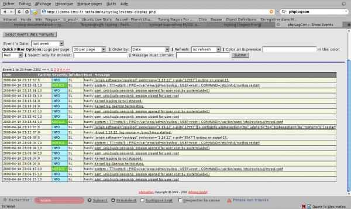
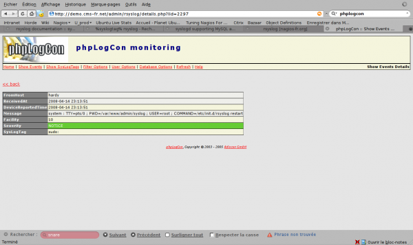
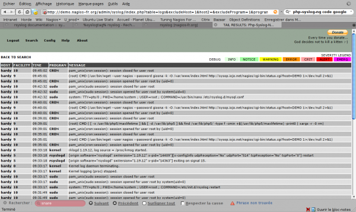

### Table des matières {.toggle}

-   [Rsyslog](rsyslog.html#rsyslog)
    -   [Installation](rsyslog.html#installation)
    -   [Support MySQL](rsyslog.html#support-mysql)

Rsyslog {#rsyslog .sectionedit1}
=======

[Rsyslog](http://www.rsyslog.com/ "http://www.rsyslog.com/") fait partie
de la famille des logiciels de journalisation pour Linux à l’instar de
[Metalog](http://metalog.sourceforge.net/ "http://metalog.sourceforge.net/")
ou
[Syslog-ng](http://www.balabit.com/network-security/syslog-ng/ "http://www.balabit.com/network-security/syslog-ng/")

Rsyslog est un démon de journalisation de type syslogd ayant pour
fonctionnalités principales le support de MySQL, syslog/tcp, RFC 3195,
les listes d’expéditeurs autorisés, le filtrage sur n’importe quel
partie du message et un contrôle très fin du format de sortie. Il est
suffisamment compatible avec sysklogd pour être capable de le remplacer
complètement. Ses fonctionnalités avancées (notamment les possibilités
de cryptage) en font un choix intéressant pour les entreprises tout en
restant simple à configurer pour l’utilisateur débutant. Il existe une
interface web optionnelle nommée
[phpLogCon](http://www.phplogcon.org/ "http://www.phplogcon.org/") qui
permet de voir l’ensemble des données en ligne. En novembre 2007,
Rsyslog est devenu le système de journalisation par défaut de la
distribution
[Fedora](http://fedoraproject.org/ "http://fedoraproject.org/"). C’est
aussi le démon par défaut de la distribution
[Debian](http://debian.org "http://debian.org") depuis la version Lenny
(5.0).

Ce tutoriel a été réalisé par :

  **Rôle**        **Nom**
  --------------- -------------
  **Rédacteur**   Olivier JAN

Installation {#installation .sectionedit3}
------------

A venir

~~~
./configure   --enable-mysql --enable-imtemplate --enable-snmp --enable-imfile
~~~

Support MySQL {#support-mysql .sectionedit4}
-------------

Ce qui fait la particularité de rsyslog par rapport à ses “concurrents”
est la possiblité native (via un module) de stocker les lignes
d’évènements dans une base MySQL.

Pour visualiser le contenu de cette base, il est possible d’utiliser
[phpLogCon](http://www.phplogcon.org/ "http://www.phplogcon.org/"),
interface dédiée à rsyslog ou utiliser
[php-syslog-ng](http://code.google.com/p/php-syslog-ng/ "http://code.google.com/p/php-syslog-ng/"),
qui pour le moment est plus avancé en terme de fonctionnalités.

Pour pouvoir utiliser php-syslog-ng, il faut modifier le fichier
/etc/rsyslog.d/mysql.conf et y ajouter les lignes suivantes :

~~~
$ModLoad MySQL

$template syslog-ng,,"insert into logs(host, facility, priority, level, tag, datetime, program, msg) values ('%HOSTNAME%', '%syslogfacility%', '%syslogfacility-text%', '%syslogseverity-text%', '%syslogtag%', '%timereported:::date-mysql%', '%programname%', '%msg%')", SQL
*.* >localhost,syslog2,rsyslog,rsyslog;syslog-ng
~~~

Une référence des propriétés possibles est dans le man de
[rsysolg.conf](http://www.linuxcertif.com/man/5/rsyslog.conf/ "http://www.linuxcertif.com/man/5/rsyslog.conf/")
et un
[tuto](http://aplawrence.com/Unixart/rsyslog_php_syslog_ng.html "http://aplawrence.com/Unixart/rsyslog_php_syslog_ng.html")
est disponbile également.

Malgré le fait que j’ai demandé de stocker les valeurs level et severity
sous forme text, elles sont stockées et apparaissent sous forme de
nombre dans l’interface. Ce point est à corriger

~~Au moment de rédaction de cette page, une version 2.0 de PhpLogCon est
en cours de développement. A suivre donc…~~

La version 2.3 de PhpLogCon vient de sortir et le moins que l’on puisse
dire, c’est qu’elle rattrape son retard et fait même mieux désormais que
php-syslog-ng.
