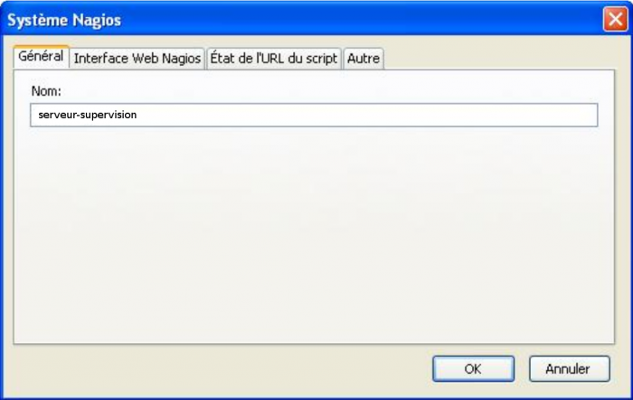
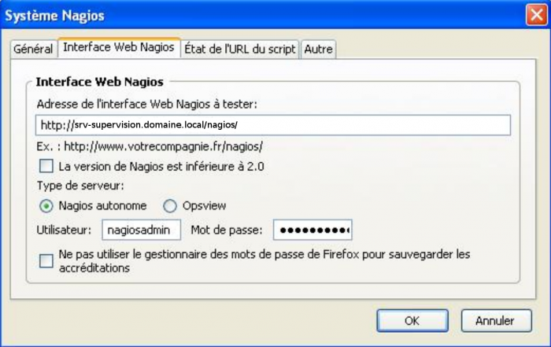
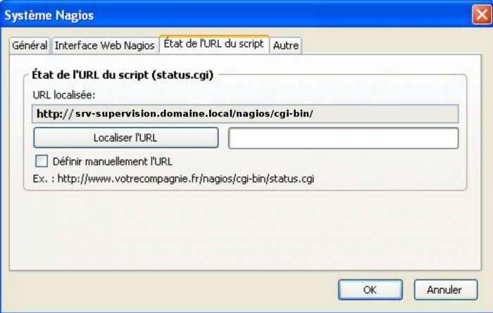
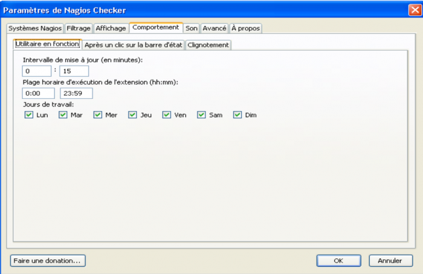
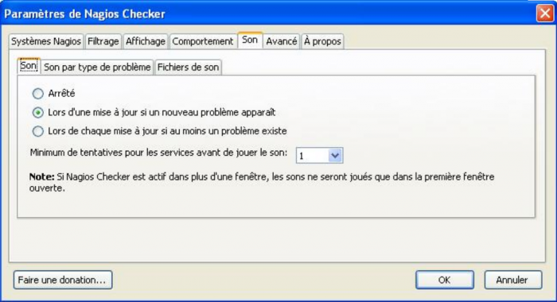

### Table des matières {.toggle}

-   [Extension Mozilla Firefox : Nagios
    Checker](nagios-checker.html#extension-mozilla-firefoxnagios-checker)
    -   [Paramétrer le plugin](nagios-checker.html#parametrer-le-plugin)

Extension Mozilla Firefox : Nagios Checker {#extension-mozilla-firefoxnagios-checker .sectionedit1}
==========================================

Une extension du navigateur Mozilla Firefox permet de récupérer les
informations affichées par l’interface de Nagios. Cette extension
récupère les alertes et permet d’un simple clic d’accéder à la page
Nagios correspondant à l’élément en alerte.

Pour l’installer suivre ce lien avec Firefox bien sûr :p
[https://addons.mozilla.org/fr/firefox/search?q=nagios+checker&cat=all](https://addons.mozilla.org/fr/firefox/search?q=nagios+checker&cat=all "https://addons.mozilla.org/fr/firefox/search?q=nagios+checker&cat=all")

Paramétrer le plugin {#parametrer-le-plugin .sectionedit2}
--------------------

Clic droit → Paramètres sur le plugin tout en bas à droite de la fenêtre
firefox. Ajouter un système Nagios et suivre les screenshots suivants.

Dans l’onglet Général donner un nom à la configuration (ex : nom du
serveur : serveur).

Dans l’onglet Interface Web Nagios, mettre l’URL d’accès à la page
Nagios (ex :
[http://serveur.domaine.local/nagios](http://serveur.domaine.local/nagios "http://serveur.domaine.local/nagios")
Entrer le nom d’utilisateur et le mot de passe.

Dans l’onglet Etat de l’URL du script, entrer manuellement l’URL
[http://serveur.domaine.local/nagios/cgi-bin/status.cgi](http://serveur.domaine.local/nagios/cgi-bin/status.cgi "http://serveur.domaine.local/nagios/cgi-bin/status.cgi")
Valider la configuration. La récupération des informations doit déjà
fonctionner.

Se rendre dans les paramètres généraux et modifier l’intervalle de
vérification à toutes les 15 secondes (0:15).

Ensuite, on peut modifier à sa convenance les alertes sonores, le mode
d’affichage des alertes (séparées par type ou regroupées dans une même
barre… Différents paramètres sont réglables, notamment le son.

