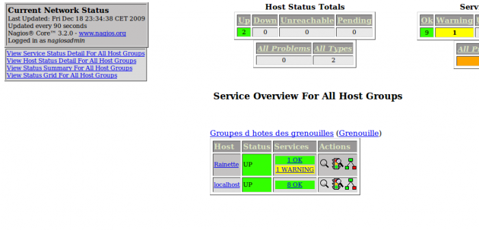

### Table des matières {.toggle}

-   [Création du premier groupe
    d'hôte](creer-son-premier-hostgroup.html#creation-du-premier-groupe-d-hote)
    -   [Ajout d'un hôte à un
        hostgroup](creer-son-premier-hostgroup.html#ajout-d-un-hote-a-un-hostgroup)

Création du premier groupe d'hôte {#creation-du-premier-groupe-d-hote .sectionedit1}
=================================

Dans la configuration de Nagios, les hostgroups ou servicegroups peuvent
être très utile pour vous simplifier la vie. La fonction première permet
de regrouper des hôtes ou services par affinité. Mais en réfléchissant
un peu pour se simplifier la vie, ils peuvent devenir des “pivots de
configuration” pour permettre de déployer massivement des services
prédéfinis en fonction du type, rôle de l’hôte. Nous verrons ça plus
tard dans le chapitre 3.

Ajout d'un hôte à un hostgroup {#ajout-d-un-hote-a-un-hostgroup .sectionedit2}
------------------------------

En faisant simple, nous allons créer un fichier hostgroups.cfg qui
contiendra le code ci-dessous :

~~~~ {.code}
define hostgroup {
    hostgroup_name     Grenouille
    alias              Groupe d'hotes des Grenouilles
    members            Rainette,localhost,...
}
~~~~

**Description des variables**

  **Variable**         **Description**
  -------------------- ---------------------------------------------------------------------------------------------------------------------------------------------------------------------------------------------------------------------------------------------------------------------------------
  hostgroup\_name      Cette variable est utilisée pour définir le nom court à utiliser pour identifier le groupe d’hôtes.
  alias                Cette variable est utilisée pour définir un nom long ou une description à utiliser pour identifier le groupe d’hôtes. Ceci est fourni pour vous permettre d’identifier plus facilement un groupe d’hôtes en particulier.
  members              C’est une liste de noms courts d’ hôtes qui doivent faire partie de ce groupe. Plusieurs noms d’hôtes peuvent être séparés par des virgules. Cette variable peut être utilisée comme une alternative (ou en complément) à la variable hostgroups dans les définitions d’hôtes .
  hostgroup\_members   Cette variable optionnelle peut être utilisée pour inclure des hôtes depuis des sous-groupes dans ce groupe d’hôtes. Précisez une liste séparée par des virgules de noms courts d’autres groupes d’hôtes à inclure dans ce groupe.

Enregistrez le fichier et redémarrez Nagios et voilà le résultat.

