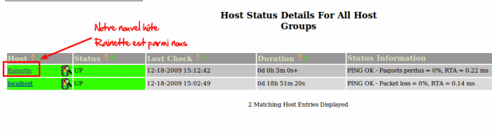

### Table des matières {.toggle}

-   [Créer son premier
    hôte](creer-son-premier-hote.html#creer-son-premier-hote)
    -   [Création du premier
        hôte](creer-son-premier-hote.html#creation-du-premier-hote)

Créer son premier hôte {#creer-son-premier-hote .sectionedit1}
======================

Ce chapitre va montrer pas par pas comment ajouter un hôte juste après
l’installation de Nagios.

Création du premier hôte {#creation-du-premier-hote .sectionedit2}
------------------------

Dans un premier temps, ce qu’il faut savoir c’est que la définition d’un
hôte s’appuie sur un template (en post-install, celui-ci se nomme
**generic-host**). Ces templates sont très utiles pour minimiser la
définition d’un hôte.

Le generic-host se trouve dans le fichier *templates.cfg*.

Pour créer un hôte, il est conseillé de créer un fichier .cfg par hôte.
(je vous cache qu’il y a des façons plus compliquer de gérer les
fichiers, mais ne compliquons pas la chose plus qu’elle n’est).

Donc pour notre machine s’appelant RAINETTE, nous allons donc créer
(dans le répertoire objects) son fichier cfg correspondant :

~~~~ {.code}
vi rainette.cfg
~~~~

Nous allons ajouter les lignes suivantes dans notre fichier :

~~~~ {.code}
define host{
        use                     generic-host
        host_name               Rainette
        alias                   Rainette
        address                 xx.xx.xx.xx
        }
~~~~

et voilà après un redémarrage de Nagios, vous aurez un nouvel hôte ;)
comme ci-dessous

A ce stade, la définition de notre hôte ne comprend aucun service. Le
service de ping sur l’adresse IP de l’hôte en question n’est donc pas
activé à la différence de ce qui est affiché ci-dessous. Du coup sur la
capture d’écran suivante, notre hôte Rainette ne devrait pas afficher un
statut “UP”, ni un résultat de ping.

