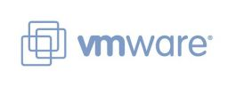

### Table des matières {.toggle}

-   [check\_esx3](check_esx3.html#check_esx3)
    -   [Introduction](check_esx3.html#introduction)
    -   [Plate-forme cible](check_esx3.html#plate-forme-cible)
    -   [Installation](check_esx3.html#installation)
        -   [Installation de vi perl
            toolkit](check_esx3.html#installation-de-vi-perl-toolkit)
    -   [Installation de
        Nagios::Plugin](check_esx3.html#installation-de-nagiosplugin)
    -   [Installation de
        check\_esx3.pl](check_esx3.html#installation-de-check_esx3pl)
    -   [Patcher l'installation](check_esx3.html#patcher-l-installation)
    -   [Tests](check_esx3.html#tests)
    -   [Les possibilités offertes par le
        plugin](check_esx3.html#les-possibilites-offertes-par-le-plugin)

check\_esx3 {#check_esx3 .sectionedit1}
===========

Où comment réaliser la supervision d’un serveur vmware esx

Introduction {#introduction .sectionedit2}
------------

La supervision des serveurs esx n’est pas encore très développée dans le
monde nagios. La société op5 (à l’origine d’un certains nombre de
projets intéressants) propose le plugin
[check\_esx3](http://www.op5.org/community/projects/op5-plugins "http://www.op5.org/community/projects/op5-plugins")
pour répondre à ce besoin.

certains utilisateurs se sont plaints sur les mailing lists que le
plugin pose problème avec esx4. Pour ma part j’ai rencontré le même
genre de problèmes avec des serveurs esx3 et esx4. Cela vient à la fois
du plugin qui utilise une ancienne méthode de connexion et du vi perl
toolkit qui n’évalue pas correctement une variable non initialisée.

Ce tutoriel présente l’installation de check\_esx3, de ses dépendances
et un moyen de corriger le code.

Plate-forme cible {#plate-forme-cible .sectionedit3}
-----------------

Nous effectuerons le déploiement sur une ubuntu 8.04 (jeos). Le serveur
supervisé est un serveur esx4.

Pour info : j’ai également réalisé ce déploiement sur un serveur nagios
sous solaris 10 (sparc) qui supervise des serveurs esx3.

Installation {#installation .sectionedit4}
------------

-   Une petite mise à jour de ubuntu n’est jamais inutile

~~~
sudo apt-get update
sudo apt-get upgrade
~~~

-   si cela n’est pas fait installer également les paquets
    **build-essential, libxml2-dev et libssl-dev**

### Installation de vi perl toolkit {#installation-de-vi-perl-toolkit .sectionedit5}

-   Il se peux que vous ayez besoin de ces paquets :
    -   libxml2-dev
    -   libssl-dev
    -   unzip
-   Nous utiliserons le vi perl toolkit open-source disponible sur
    sourceforge.

\

-   Le vi perl toolkit présente un nombre important de dépendances.
    Voici la liste des modules perl nécessaires.
    -   ExtUtils-MakeMaker-6.54.tar.gz
    -   libwww-perl-5.829.tar.gz
    -   Compress-Raw-Zlib-2.020.tar.gz
    -   Compress-Raw-Bzip2-2.020.tar.gz
    -   IO-Compress-2.020.tar.gz
    -   URI-1.38.tar.gz
    -   HTML-Tagset-3.20.tar.gz
    -   HTML-Parser-3.61.tar.gz
    -   XML-NamespaceSupport-1.10.tar.gz
    -   XML-SAX-0.96.tar.gz
    -   XML-LibXML-1.69.tar.gz
    -   XML-LibXML-Common-0.13.tar.gz
    -   Class-MethodMaker-2.15.tar.gz
    -   Crypt-SSLeay-0.57.tar.gz
    -   Data-Dumper-2.124.tar.gz
    -   viperltoolkit-beta1.zip

\

-   Commençons par télécharger les sources des différents modules

~~~
      wget http://search.cpan.org/CPAN/authors/id/M/MS/MSCHWERN/ExtUtils-MakeMaker-6.54.tar.gz
        wget http://search.cpan.org/CPAN/authors/id/G/GA/GAAS/URI-1.51.tar.gz
        wget http://search.cpan.org/CPAN/authors/id/P/PM/PMQS/Compress-Raw-Zlib-2.020.tar.gz
        wget http://search.cpan.org/CPAN/authors/id/P/PM/PMQS/Compress-Raw-Bzip2-2.020.tar.gz
        wget http://search.cpan.org/CPAN/authors/id/P/PM/PMQS/IO-Compress-2.020.tar.gz
        wget http://search.cpan.org/CPAN/authors/id/P/PE/PETDANCE/HTML-Tagset-3.20.tar.gz
        wget http://search.cpan.org/CPAN/authors/id/G/GA/GAAS/HTML-Parser-3.61.tar.gz
        wget http://search.cpan.org/CPAN/authors/id/G/GA/GAAS/libwww-perl-5.829.tar.gz
        wget http://search.cpan.org/CPAN/authors/id/P/PE/PERIGRIN/XML-NamespaceSupport-1.10.tar.gz
        wget http://search.cpan.org/CPAN/authors/id/G/GR/GRANTM/XML-SAX-0.96.tar.gz
        wget http://search.cpan.org/CPAN/authors/id/P/PH/PHISH/XML-LibXML-Common-0.13.tar.gz
        wget http://search.cpan.org/CPAN/authors/id/P/PA/PAJAS/XML-LibXML-1.69.tar.gz
        wget http://search.cpan.org/CPAN/authors/id/S/SC/SCHWIGON/class-methodmaker/Class-MethodMaker-2.15.tar.gz
        wget http://search.cpan.org/CPAN/authors/id/D/DL/DLAND/Crypt-SSLeay-0.57.tar.gz
        wget http://search.cpan.org/CPAN/authors/id/S/SM/SMUELLER/Data-Dumper-2.124.tar.gz
        wget http://freefr.dl.sourceforge.net/project/viperltoolkit/viperltoolkit-beta1/VI%20Perl%20Toolkit%20Beta/viperltoolkit-beta1.zip
~~~

-   Pour chaque module perl extraire l’archive, se placer dans le
    répertoire du module et saisir la séquence de commandes suivante :

~~~
Perl Makefile.PL
make
make test (cette commande doit renvoyer à la fin All tests successfull)
make install
~~~

-   Extraire vipertoolkit et appliquer la même séquence que précédemment

Installation de Nagios::Plugin {#installation-de-nagiosplugin .sectionedit6}
------------------------------

-   Comme le vi perl toolkit, le module nagios plugin présente quelques
    dépendances

~~~
wget http://search.cpan.org/CPAN/authors/id/K/KA/KASEI/Class-Accessor-0.33.tar.gz
wget http://search.cpan.org/CPAN/authors/id/D/DR/DROLSKY/Params-Validate-0.91.tar.gz
wget http://search.cpan.org/CPAN/authors/id/S/SF/SFINK/Math-Calc-Units-1.06.tar.gz
wget http://search.cpan.org/CPAN/authors/id/A/AD/ADAMK/Config-Tiny-2.12.tar.gz
wget http://search.cpan.org/CPAN/authors/id/T/TO/TONVOON/Nagios-Plugin-0.33.tar.gz
~~~

-   Pour chaque module perl extraire l’archive et dans le répertoire
    généré lors de l’extraction saisir la séquence de commandes suivante
    :

~~~
perl Makefile.PL
make
make test (cette commande doit renvoyer à la fin All tests successfull)
make install
~~~

Installation de check\_esx3.pl {#installation-de-check_esx3pl .sectionedit7}
------------------------------

-   prerequis : git-core, nagios et nagios-plugin
-   note : nagios est installé dans /opt/nagios

~~~
git clone git://git.op5.org/nagios/op5plugins.git
cd op5plugins
cp check_esx3.pl /opt/nagios/libexec/
chown nagios:nagios /opt/nagios/libexec/check_esx3.pl
~~~

OP5 a changé le nom du plugin qui s’appelle maintenant
check\_vmware\_api.pl

Patcher l'installation {#patcher-l-installation .sectionedit8}
----------------------

-   Editer le fichier **/opt/nagios/libexec/check\_esx3.pl**
    -   remplacer le bloc suivant :

~~~
  if (defined($datacenter))
    {
        if (defined($sessionfile) and -e $sessionfile)
        {
            Vim::load_session(service_url => $datacenter, session_file => $sessionfile);
        }
        Util::connect("https://" . $datacenter . "/sdk/webService", $username, $password);

    }
    elsif (defined($host))
    {
        if (defined($sessionfile) and -e $sessionfile)
        {
            Vim::load_session(service_url => $host, session_file => $sessionfile);
        }
        Util::connect("https://" . $host . "/sdk/webService", $username, $password);

    }
~~~

-   par celui ci :

~~~
  if (defined($datacenter))
    {
        if (defined($sessionfile) and -e $sessionfile)
        {
            Vim::load_session(service_url => $datacenter, session_file => $sessionfile);
        }
        #Util::connect("https://" . $datacenter . "/sdk/webService", $username, $password);
        my $service_url="https://".$datacenter."/sdk/vimService";
        Vim::login(service_url => $service_url, user_name => $username, password => $password);

    }
    elsif (defined($host))
    {
        if (defined($sessionfile) and -e $sessionfile)
        {
            Vim::load_session(service_url => $host, session_file => $sessionfile);
        }
        #Util::connect("https://" . $host . "/sdk/webService", $username, $password);
        my $service_url="https://".$host."/sdk/vimService";
        Vim::login(service_url => $service_url, user_name => $username, password => $password);

    }
~~~

-   remplacer la ligne :

~~~
Util::disconnect();
~~~

-   par la ligne :

~~~
Vim::logout();
~~~

-   Editer le fichier
    **/usr/local/share/perl/5.8.8/VMware/VIM2Runtime.pm**
    -   Chercher la méthode **update\_view\_data**
    -   Ajouter le test suivant :

~~~
if ( defined ( $properties ) ) {
~~~

-   Avant la ligne

~~~
if ($properties ne "") {
~~~

-   **Ne pas oublier de “fermer” le test !**

-   Faire de même pour la méthode **set\_view\_data**

Tests {#tests .sectionedit9}
-----

-   Prérequis : un serveur esx avec des accès au sdk en readonly au
    minimum, ou/et un vcenter ou vpshere.

~~~
perl /opt/nagios/libexec/check_esx3.pl -H XXX.XXX.XXX.XXX -u utilisateur -p motdepasse -l cpu -s usage
CHECK_ESX3.PL OK - cpu usage=1.16 % | cpu_usage=1.16%;;
~~~

-   Voila il ne reste plus qu’à déployer les sondes dans nagios.

Les possibilités offertes par le plugin {#les-possibilites-offertes-par-le-plugin .sectionedit10}
---------------------------------------

Le plugin check\_esx présente de nombreux points de contrôles. Il permet
non seulement de vérifier les serveurs esx, mais également les cluster
esx (vsphere et antérieur). Cela permet entre autre à partir d’une seule
connexion de tester l’ensemble des vm de l’infrastructure ou qu’elles
soient (à priori nous ne sommes pas censés savoir à un instant t ou est
exécutée une vm ni ou sont placés les disques virtuels). Tout cela pour
dire qu’il vaut mieux effectuer ses contrôle au niveau infrastructure
(le terme utilisé dans le plugin est : datacenter) qu’au niveau serveur
esx.

Les points de contrôle sont les suivants :

-   **Commun VM, Hôte, Infrastructure (grappe d’hôtes)**
    -   consommation CPU
    -   consommation Mémoire
    -   Charge réseau
    -   io (disques)
    -   runtime (??)
-   **Spécifique aux VM**
    -   consommation CPU
    -   consommation Mémoire
    -   io (disques)
    -   runtime (??)
-   Spécifique aux hôtes
    -   Charge réseau
    -   io (disques)
    -   Espace disque (datastore)
    -   runtime (État de la connexion, état global : cpu, stockage,
        mémoire ….)
    -   Etat des services
-   **Spécifique au datacenter**
    -   io
    -   Espace disque (Datastore)
    -   Runtime
    -   Recommandations

L’appel de check\_esx3.pl avec l’argument -h donne l’ensemble des
possibilités.
