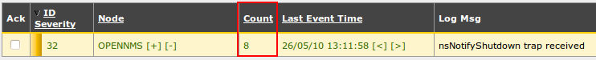
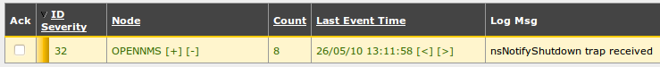
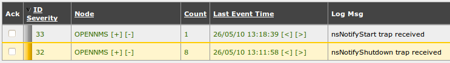
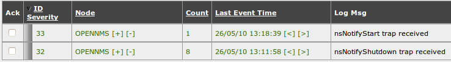
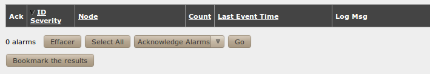
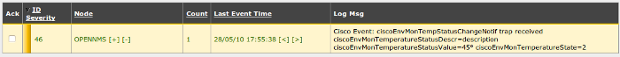
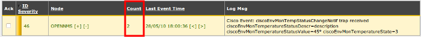
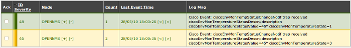
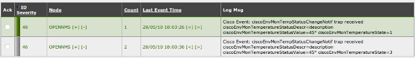

### Table des matières {.toggle}

-   [Configuration des évènements et des
    alarmes](events-alarms.html#configuration-des-evenements-et-des-alarmes)
    -   [1. Concepts clefs](events-alarms.html#concepts-clefs)
    -   [2. Outil mib2opennms](events-alarms.html#outil-mib2opennms)
        -   [2.1 Installation](events-alarms.html#installation)
        -   [2.2 Utilisation](events-alarms.html#utilisation)
        -   [2.3 Traitement
            post-exécution](events-alarms.html#traitement-post-execution)
    -   [3. Fichiers de configuration des
        évènements](events-alarms.html#fichiers-de-configuration-des-evenements)
        -   [3.1 Localisation](events-alarms.html#localisation)
        -   [3.2 Syntaxe des fichiers de
            configuration](events-alarms.html#syntaxe-des-fichiers-de-configuration)
        -   [3.3 Prise en compte des
            modifications](events-alarms.html#prise-en-compte-des-modifications)
        -   [3.4 Exemple de
            déduplication](events-alarms.html#exemple-de-deduplication)
        -   [3.5 Exemple de corrélation
            début-fin](events-alarms.html#exemple-de-correlation-debut-fin)
        -   [3.6 Fichier de log](events-alarms.html#fichier-de-log)
        -   [3.7 Pour aller plus
            loin](events-alarms.html#pour-aller-plus-loin)
    -   [4. Exemple avec des
        varbinds](events-alarms.html#exemple-avec-des-varbinds)
        -   [4.1 Extrait du fichier de configuration
            Cisco2.events.xml](events-alarms.html#extrait-du-fichier-de-configuration-cisco2eventsxml)
        -   [4.2 Explication](events-alarms.html#explication)
        -   [4.3 Démonstration](events-alarms.html#demonstration)
        -   [4.4 Remarques](events-alarms.html#remarques)

Configuration des évènements et des alarmes {#configuration-des-evenements-et-des-alarmes .sectionedit1}
===========================================

1. Concepts clefs {#concepts-clefs .sectionedit2}
-----------------

La fonction principale d’**OpenNMS** est de recevoir des traps **SNMP**.
Ces traps SNMP sont décodées à l’aide de fichiers de configuration créés
à partir des MIBs SNMP. Les traps SNMP, une fois décodées, sont visibles
sous forme d’évènement dans la vue Events et sous forme d’alarme dans la
vue Alarms. Ces deux vues peuvent contenir également les évènements
internes à OpenNMS.

La vue Events permet de visualiser tous les évènements reçus, elle sert
principalement d’historique ou de bac à évènement.

La vue Alarms permet de visualiser les alarmes en cours grâce à deux
fonctions principales :

-   la déduplication : une ligne avec un compteur qui s’incrémente
    représente plusieurs alarmes du même type provenant du même
    équipement ;
-   la corrélation début-fin : l’alarme qui indique la fin d’un problème
    acquitte l’alarme qui indiquait le début du problème ;

Le but de cette vue est de montrer le plus synthétiquement possible
uniquement les problèmes en cours et d’évacuer ceux qui sont terminés.

2. Outil mib2opennms {#outil-mib2opennms .sectionedit3}
--------------------

L’outil **mib2opennms** est un outil qui permet de transformer une mib
SNMP en fichier de configuration XML compréhensible par OpenNMS.

### 2.1 Installation {#installation .sectionedit4}

Pour installer l’outil **mib2opennms** sur un système **CentOS**, tapez
la commande suivante :

~~~~ {.code}
shell> yum install mib2opennms
~~~~

### 2.2 Utilisation {#utilisation .sectionedit5}

Exemple d’utilisation pour décoder la mib NET-SNMP-AGENT :

~~~~ {.code}
shell> mib2opennms -f /opt/opennms/etc/events/NetSNMP.events.xml -6 -w /usr/share/snmp/mibs/NET-SNMP-AGENT-MIB.txt
~~~~

Ceci est un exemple. Vous ne devez pas lancer cette commande car le
fichier /opt/opennms/etc/events/NetSNMP.events.xml existe déjà !

### 2.3 Traitement post-exécution {#traitement-post-execution .sectionedit6}

Cet outil effectue une traduction simple de la mib. Certains éléments
sont à configurés manuellement comme :

-   l’affichage des évènement dans la vue alarms ;
-   la déduplication ;
-   la corrélation début-fin

3. Fichiers de configuration des évènements {#fichiers-de-configuration-des-evenements .sectionedit7}
-------------------------------------------

### 3.1 Localisation {#localisation .sectionedit8}

Les fichiers d’évènements sont stockés dans le répertoire
**/opt/opennms/etc/events**.

Le fichier /opt/opennms/etc/eventconf.xml contient :

-   Les évènements internes à OpenNMS ;
-   Les fichiers d’évènements du répertoire /opt/opennms/etc/events à
    inclure dans la configuration ;

Lorsqu’un fichier est ajouter au répertoire /opt/opennms/etc/events, il
faut insérer à la fin du fichier /opt/opennms/etc/events une ligne
identique à celle-ci :

~~~~ {.code .xml}
...
<event-file>events/NetSNMP.events.xml</event-file>
...
~~~~

OpenNMS possède en standard de nombreux fichiers d’évènements qu’il est
nécessaire d’enrichir (corrélation, déduplication, …). Une liste est
disponible
[ici](http://www.opennms.org/wiki/Supported_Devices "http://www.opennms.org/wiki/Supported_Devices").

### 3.2 Syntaxe des fichiers de configuration {#syntaxe-des-fichiers-de-configuration .sectionedit9}

Exemple de configuration XML pour l’évènement nsNotifyShutdown dans le
fichier /opt/opennms/etc/events/NetSNMP.events.xml :

~~~~ {.code .xml}
<event>
  <mask>
    <maskelement>
      <mename>id</mename>
      <mevalue>.1.3.6.1.4.1.8072.4</mevalue>
    </maskelement>
    <maskelement>
      <mename>generic</mename>
      <mevalue>6</mevalue>
    </maskelement>
    <maskelement>
      <mename>specific</mename>
      <mevalue>2</mevalue>
    </maskelement>
  </mask>
  <uei>uei.opennms.org/vendor/netsnmp/traps/nsNotifyShutdown</uei>
  <event-label>NET-SNMP-AGENT-MIB defined trap event: nsNotifyShutdown</event-label>
  <descr>
  &lt;p&gt;An indication that the agent is in the process of being shut down.&lt;/p&gt;&lt;table&gt;&lt;/table&gt;
  </descr>
  <logmsg dest='logndisplay'>nsNotifyShutdown trap received</logmsg>
  <severity>Warning</severity>
  <alarm-data reduction-key="%uei%:%nodeid%:%interface%" alarm-type="1" auto-clean="true" />
</event>
~~~~

La partie **mask** permet de sélectionner la trap SNMP qui sera décodé
selon :

-   l’OID SNMP renseigné après la balise \<id\>
-   l’identifiant SNMP generic renseigné après la balise \<generic\>
-   l’identifiant SNMP specific renseigné après la balise \<specific\>

Il est également possible d’ajouter un filtrage selon les varbinds de la
trap SNMP. Par exemple, pour sélectionner la trap donc la varbind n°1
est égal à 2, il faut rajouter dans la partie mask la configuration
suivante :

~~~~ {.code .xml}
  <varbind>
    <vbnumber>1</vbnumber>
    <vbvalue>2</vbvalue>
  </varbind>
~~~~

La balise **\<UEI\>** (Unique Event Identifier) est utilisé pour
spécifier une chaîne de caractère qui identifie de façon unique le type
d’évènement dans l’application et plus particulièrement lors de
l’utilisation des filtres dans la vue Events et Alarms.

La balise **\<event-label\>** permet de spécifier un label pour cet
évènement.

La balise **\<descr\>** permet de décrire l’évènement de façon plus
détaillé. Cette partie sera visible dans la vue **Event Detail** de
l’application. Le code HTML peut être utilisé pour cette partie.
L’affichage des varbinds SNMP s’effectue à l’aide des champs
%parm[\#number]%. %parm[\#1]% pour la 1ère varbind par exemple.

La balise **\<logmsg\>** est utilisée pour configurer le texte qui sera
affiché dans la colonne *Log Msg* de la vue Events ou Alarms. Le
paramètre **dest** permet de régler l’affichage et le stockage des
évènements.

La sévérité de l’évènement est renseignée dans la balise
**\<severity\>**.

#### 3.2.1 Déduplication / Corrélation début-fin {#deduplicationcorrelation-debut-fin}

Lorsque la balise **\<alarm-data\>** est présente dans la configuration
de l’évènement, celui-ci apparaît dans la vue Alarms.

*Configuration pour une alarme indiquant un début de problème :*

~~~~ {.code .xml}
<alarm-data reduction-key="%uei%:%nodeid%:%interface%" alarm-type="1" auto-clean="true" />
~~~~

Le champ **alarm-type** est utilisé pour spécifier le début d’alarme (1)
ou la fin d’alarme (2).

Le champ **reduction-key** est utilisé pour la déduplication. Dans cette
exemple, les évènements qui auront le même uei (même identifiant
d’évènement), qui concerneront le même équipement (nodeid : identifiant
de l’équipement dans la base de données) et qui concerneront la même
interface (interface : adresse ip qui indique la source du trap SNMP)
seront affichés sur une seule ligne dans la vue alarms. Un compteur sera
incrémenté lors de la réception d’une nouvelle alarme.

*Configuration pour l’alarme qui indique la fin du problème
correspondant :*

~~~~ {.code .xml}
<alarm-data reduction-key="%uei%:%nodeid%:%interface%" alarm-type="2" auto-clean="true" clear-key="uei.opennms.org/vendor/netsnmp/traps/nsNotifyShutdown:%nodeid%:%interface%" />
~~~~

Le paramètre **clear-key** est utilisé pour définir l’alarme qui indique
le début du problème et qui est résolue par cette alarme. Dans l’exemple
précédent : nsNotifyShutdown = début de problème. nsNotifyStart = fin du
problème.

Le champ **clear-key** de l’alarme nsNotifyStart doit être égal au champ
**reduction-key** de l’alarme nsNotifyShutDown.

Lorsque le paramètre **auto-clean** est positionné à **true**, seul le
dernier évènement qui a généré une alarme est conservé dans la vue
Events. Ceci permet de ne pas encombrer la vue Events (et la table
Events par la même occasion) mais supprime certaines données.

### 3.3 Prise en compte des modifications {#prise-en-compte-des-modifications .sectionedit10}

Pour que les modifications soient prises en compte, vous devez
redémarrer **OpenNMS**. Pour cela, tapez la commande suivante :

~~~~ {.code}
shell> service opennms restart
~~~~

### 3.4 Exemple de déduplication {#exemple-de-deduplication .sectionedit11}

Le déduplication permet sur certains critères configurables de regrouper
plusieurs alarmes sur une seule ligne tout en incrémentant un compteur.

Si on génère plusieurs fois le trap nsNotifyShutdown (remplacer
192.168.1.9 par l’adresse IP de OpenNMS) :

~~~~ {.code}
shell> snmptrap -v2c -c public 192.168.1.9 0 1.3.6.1.4.1.8072.4.2
~~~~

Tous les traps s’affichent sur une seule ligne, un compteur indique
combien de fois il a été reçu :

### 3.5 Exemple de corrélation début-fin {#exemple-de-correlation-debut-fin .sectionedit12}

Lorsqu’on reçoit une alarme qui indique la fin d’un problème, la règle
de corrélation début / fin permet de changer la couleur de l’alarme reçu
précédemment qui indiquait le début de ce problème.

#### 3.5.1 Réception de l’alarme de début de problème {#reception-de-l-alarme-de-debut-de-probleme}

On génère le trap nsNotifyShutdown (remplacer 192.168.1.9 par l’adresse
IP de OpenNMS) :

~~~~ {.code}
shell> snmptrap -v2c -c public 192.168.1.9 0 1.3.6.1.4.1.8072.4.2
~~~~

#### 3.5.2 Réception de l’alarme de fin de problème (symbolisé par la couleur blanche) {#reception-de-l-alarme-de-fin-de-probleme-symbolise-par-la-couleur-blanche}

On génère le trap nsNotifyStart (remplacer 192.168.1.9 par l’adresse IP
de OpenNMS) :

~~~~ {.code}
shell> snmptrap -v2c -c public 192.168.1.9 0 1.3.6.1.4.1.8072.4.1
~~~~

#### 3.5.3 Corrélation des deux alarmes au bout d’un délai configurable {#correlation-des-deux-alarmes-au-bout-d-un-delai-configurable}

Ce délai est configuré par défaut à 30 secondes. L’alarme qui indique le
début du problème change de couleur :

#### 3.5.4 Suppression des alarmes de sévérité Cleared {#suppression-des-alarmes-de-severite-cleared}

A partir d’un délai configurable (5 minutes par défaut) et si aucune
nouvelle alarme du même type n’est reçu, les alarmes de sévérité
*Cleared* (de couleur blanche) disparaissent de la vue alarm (mais pas
de la vue event, qui permet de garder l’historique des traps SNMP
reçus).

### 3.6 Fichier de log {#fichier-de-log .sectionedit13}

Le fichier de log utilisé par le démon **eventd** est par défaut
**/opt/opennms/logs/daemon/eventd.log**.

### 3.7 Pour aller plus loin {#pour-aller-plus-loin .sectionedit14}

Pour aller plus loin, je vous invite à consulter la page suivante :
[http://www.opennms.org/wiki/Event\_Configuration\_How-To](http://www.opennms.org/wiki/Event_Configuration_How-To "http://www.opennms.org/wiki/Event_Configuration_How-To")

4. Exemple avec des varbinds {#exemple-avec-des-varbinds .sectionedit15}
----------------------------

### 4.1 Extrait du fichier de configuration Cisco2.events.xml {#extrait-du-fichier-de-configuration-cisco2eventsxml .sectionedit16}

~~~~ {.code .xml}
<event>
    <mask>
        <maskelement>
            <mename>id</mename>
            <mevalue>.1.3.6.1.4.1.9.9.13.3</mevalue>
        </maskelement>
        <maskelement>
            <mename>generic</mename>
            <mevalue>6</mevalue>
        </maskelement>
        <maskelement>
            <mename>specific</mename>
            <mevalue>7</mevalue>
        </maskelement>
        <varbind>
            <vbnumber>3</vbnumber>
            <vbvalue>1</vbvalue>
        </varbind>
    </mask>
    <uei>uei.opennms.org/vendor/Cisco/traps/ciscoEnvMonTempStatusChangeNotifNormal</uei>
    <event-label>CISCO-ENVMON-MIB defined trap event: ciscoEnvMonTempStatusChangeNotif</event-label>
    <descr>
&lt;p&gt;A ciscoEnvMonTempStatusChangeNotif is sent if there 
is change in the state of a device being monitored
by ciscoEnvMonTemperatureState.&lt;/p&gt;&lt;table&gt;
    &lt;tr&gt;&lt;td&gt;&lt;b&gt;
 
    ciscoEnvMonTemperatureStatusDescr&lt;/b&gt;&lt;/td&gt;&lt;td&gt;
    %parm[#1]%;&lt;/td&gt;&lt;td&gt;&lt;p;&gt;&lt;/p&gt;&lt;/td;&gt;&lt;/tr&gt;
    &lt;tr&gt;&lt;td&gt;&lt;b&gt;
 
    ciscoEnvMonTemperatureStatusValue&lt;/b&gt;&lt;/td&gt;&lt;td&gt;
    %parm[#2]%;&lt;/td&gt;&lt;td&gt;&lt;p;&gt;&lt;/p&gt;&lt;/td;&gt;&lt;/tr&gt;
    &lt;tr&gt;&lt;td&gt;&lt;b&gt;
 
    ciscoEnvMonTemperatureState&lt;/b&gt;&lt;/td&gt;&lt;td&gt;
    %parm[#3]%;&lt;/td&gt;&lt;td&gt;&lt;p;&gt;
        normal(1)
        warning(2)
        critical(3)
        shutdown(4)
        notPresent(5)
        notFunctioning(6)
    &lt;/p&gt;&lt;/td;&gt;&lt;/tr&gt;&lt;/table&gt;
    </descr>
        <logmsg dest='logndisplay'>&lt;p&gt;
            Cisco Event: ciscoEnvMonTempStatusChangeNotif trap received 
            ciscoEnvMonTemperatureStatusDescr=%parm[#1]% 
            ciscoEnvMonTemperatureStatusValue=%parm[#2]% 
            ciscoEnvMonTemperatureState=%parm[#3]%&lt;/p&gt;
        </logmsg>
    <severity>Normal</severity>
    <alarm-data reduction-key="%uei%:%dpname%:%nodeid%:%interface%:%parm[#1]%" alarm-type="2" auto-clean="false" clear-key="uei.opennms.org/vendor/Cisco/traps/ciscoEnvMonTempStatusChangeNotif:%dpname%:%nodeid%:%interface%:%parm[#1]%" />
</event>
<event>
    <mask>
        <maskelement>
            <mename>id</mename>
            <mevalue>.1.3.6.1.4.1.9.9.13.3</mevalue>
        </maskelement>
        <maskelement>
            <mename>generic</mename>
            <mevalue>6</mevalue>
        </maskelement>
        <maskelement>
            <mename>specific</mename>
            <mevalue>7</mevalue>
        </maskelement>
        <varbind>
            <vbnumber>3</vbnumber>
            <vbvalue>2</vbvalue>
        </varbind>
    </mask>
    <uei>uei.opennms.org/vendor/Cisco/traps/ciscoEnvMonTempStatusChangeNotifWarning</uei>
    <event-label>CISCO-ENVMON-MIB defined trap event: ciscoEnvMonTempStatusChangeNotif</event-label>
    <descr>
&lt;p&gt;A ciscoEnvMonTempStatusChangeNotif is sent if there 
is change in the state of a device being monitored
by ciscoEnvMonTemperatureState.&lt;/p&gt;&lt;table&gt;
    &lt;tr&gt;&lt;td&gt;&lt;b&gt;
 
    ciscoEnvMonTemperatureStatusDescr&lt;/b&gt;&lt;/td&gt;&lt;td&gt;
    %parm[#1]%;&lt;/td&gt;&lt;td&gt;&lt;p;&gt;&lt;/p&gt;&lt;/td;&gt;&lt;/tr&gt;
    &lt;tr&gt;&lt;td&gt;&lt;b&gt;
 
    ciscoEnvMonTemperatureStatusValue&lt;/b&gt;&lt;/td&gt;&lt;td&gt;
    %parm[#2]%;&lt;/td&gt;&lt;td&gt;&lt;p;&gt;&lt;/p&gt;&lt;/td;&gt;&lt;/tr&gt;
    &lt;tr&gt;&lt;td&gt;&lt;b&gt;
 
    ciscoEnvMonTemperatureState&lt;/b&gt;&lt;/td&gt;&lt;td&gt;
    %parm[#3]%;&lt;/td&gt;&lt;td&gt;&lt;p;&gt;
        normal(1)
        warning(2)
        critical(3)
        shutdown(4)
        notPresent(5)
        notFunctioning(6)
    &lt;/p&gt;&lt;/td;&gt;&lt;/tr&gt;&lt;/table&gt;
    </descr>
        <logmsg dest='logndisplay'>&lt;p&gt;
            Cisco Event: ciscoEnvMonTempStatusChangeNotif trap received 
            ciscoEnvMonTemperatureStatusDescr=%parm[#1]% 
            ciscoEnvMonTemperatureStatusValue=%parm[#2]% 
            ciscoEnvMonTemperatureState=%parm[#3]%&lt;/p&gt;
        </logmsg>
    <severity>Warning</severity>
    <alarm-data reduction-key="uei.opennms.org/vendor/Cisco/traps/ciscoEnvMonTempStatusChangeNotif:%dpname%:%nodeid%:%interface%:%parm[#1]%" alarm-type="1" auto-clean="false" />
</event>
<event>
    <mask>
        <maskelement>
            <mename>id</mename>
            <mevalue>.1.3.6.1.4.1.9.9.13.3</mevalue>
        </maskelement>
        <maskelement>
            <mename>generic</mename>
            <mevalue>6</mevalue>
        </maskelement>
        <maskelement>
            <mename>specific</mename>
            <mevalue>7</mevalue>
        </maskelement>
        <varbind>
            <vbnumber>3</vbnumber>
            <vbvalue>3</vbvalue>
        </varbind>
    </mask>
    <uei>uei.opennms.org/vendor/Cisco/traps/ciscoEnvMonTempStatusChangeNotifCritical</uei>
    <event-label>CISCO-ENVMON-MIB defined trap event: ciscoEnvMonTempStatusChangeNotif</event-label>
    <descr>
&lt;p&gt;A ciscoEnvMonTempStatusChangeNotif is sent if there 
is change in the state of a device being monitored
by ciscoEnvMonTemperatureState.&lt;/p&gt;&lt;table&gt;
    &lt;tr&gt;&lt;td&gt;&lt;b&gt;
 
    ciscoEnvMonTemperatureStatusDescr&lt;/b&gt;&lt;/td&gt;&lt;td&gt;
    %parm[#1]%;&lt;/td&gt;&lt;td&gt;&lt;p;&gt;&lt;/p&gt;&lt;/td;&gt;&lt;/tr&gt;
    &lt;tr&gt;&lt;td&gt;&lt;b&gt;
 
    ciscoEnvMonTemperatureStatusValue&lt;/b&gt;&lt;/td&gt;&lt;td&gt;
    %parm[#2]%;&lt;/td&gt;&lt;td&gt;&lt;p;&gt;&lt;/p&gt;&lt;/td;&gt;&lt;/tr&gt;
    &lt;tr&gt;&lt;td&gt;&lt;b&gt;
 
    ciscoEnvMonTemperatureState&lt;/b&gt;&lt;/td&gt;&lt;td&gt;
    %parm[#3]%;&lt;/td&gt;&lt;td&gt;&lt;p;&gt;
        normal(1)
        warning(2)
        critical(3)
        shutdown(4)
        notPresent(5)
        notFunctioning(6)
    &lt;/p&gt;&lt;/td;&gt;&lt;/tr&gt;&lt;/table&gt;
    </descr>
        <logmsg dest='logndisplay'>&lt;p&gt;
            Cisco Event: ciscoEnvMonTempStatusChangeNotif trap received 
            ciscoEnvMonTemperatureStatusDescr=%parm[#1]% 
            ciscoEnvMonTemperatureStatusValue=%parm[#2]% 
            ciscoEnvMonTemperatureState=%parm[#3]%&lt;/p&gt;
        </logmsg>
    <severity>Minor</severity>
    <alarm-data reduction-key="uei.opennms.org/vendor/Cisco/traps/ciscoEnvMonTempStatusChangeNotif:%dpname%:%nodeid%:%interface%:%parm[#1]%" alarm-type="1" auto-clean="false" />
</event>
~~~~

### 4.2 Explication {#explication .sectionedit17}

Dans cet exemple, la varbind N°3 de la trap SNMP contient le statut de
la température :

~~~~ {.code}
normal(1)
warning(2)
critical(3)
shutdown(4)
notPresent(5)
notFunctioning(6)
~~~~

On peut donc filtrer les alarmes selon ce paramètre et pouvoir ainsi
déterminer la sévérité de l’alarme en fonction de ce paramètre.

#### 4.2.1 Évènement ciscoEnvMonTempStatusChangeNotifCritical {#evenement-ciscoenvmontempstatuschangenotifcritical}

Cet évènement s’affiche lorsqu’OpenNMS reçoit la trap avec l’oid
.1.3.6.1.4.1.9.9.13.3.7 et la varbind 3 qui est égale à 3.

Ce filtrage s’effectue à l’aide de la portion suivante :

~~~~ {.code .xml}
<varbind>
    <vbnumber>3</vbnumber>
    <vbvalue>3</vbvalue>
</varbind>
~~~~

La sévérité de l’alarme est alors **Minor**.

*La balise **alarm-data** est la suivante :*

~~~~ {.code .xml}
<alarm-data reduction-key="uei.opennms.org/vendor/Cisco/traps/ciscoEnvMonTempStatusChangeNotif:%dpname%:%nodeid%:%interface%:%parm[#1]%" alarm-type="1" auto-clean="false" />
~~~~

*Le paramètre **reduction-key** qui permet la déduplication des alarmes
contient :*

-   l’UEI :
    uei.opennms.org/vendor/Cisco/traps/ciscoEnvMonTempStatusChangeNotif
    ;
-   la variable %dpname% qui correspond au nom du poller qui a reçu
    l’évènement dans le cas d’une architecture distribuée ;
-   la variable %nodeid% qui correspond à l’identifiant de l’équipement
    sur lequel porte cette trap ;
-   la variable %interface% qui correspond à l’adresse IP de l’interface
    réseau qui a envoyé cette trap ;
-   la valeur de la varbind 1 qui correspond à la description de
    l’alarme (ciscoEnvMonTemperatureStatusDescr) ;

Si pour plusieurs alarmes, les 5 champs précédents sont identiques alors
les alarmes sont affichées sur une seule ligne et le compteur est
incrémenté.

Le champ **alarm-type** est égal à 1, cette alarme correspond à un début
de problème.

Le champ **auto-clean** est placé à *false*, tous les évènements
relatifs à cette alarme seront conservés dans la table **Events**.

#### 4.2.2 Évènement ciscoEnvMonTempStatusChangeNotifWarning {#evenement-ciscoenvmontempstatuschangenotifwarning}

Cet évènement s’affiche lorsqu’OpenNMS reçoit la trap avec l’oid
.1.3.6.1.4.1.9.9.13.3.7 et la varbind 3 qui est égale à 2.

Ce filtrage s’effectue à l’aide de la portion suivante :

~~~~ {.code .xml}
<varbind>
    <vbnumber>3</vbnumber>
    <vbvalue>2</vbvalue>
</varbind>
~~~~

La sévérité de l’alarme est alors **Warning**.

*La balise **alarm-data** est la suivante :*

~~~~ {.code .xml}
<alarm-data reduction-key="uei.opennms.org/vendor/Cisco/traps/ciscoEnvMonTempStatusChangeNotif:%dpname%:%nodeid%:%interface%:%parm[#1]%" alarm-type="1" auto-clean="false" />
~~~~

Le paramètre **reduction-key** qui permet la déduplication des alarmes
est identique à l’alarme précédente.

Ceci a deux conséquences :

-   Les alarmes de sévérité Warning et Minor seront affichées sur une
    seule ligne ;
-   L’alarme Normal permettra d’acquitter les alarmes Warning et Minor.

Le champ **alarm-type** est égal à 1, cette alarme correspond à un début
de problème.

Le champ **auto-clean** est placé à *false*, tous les évènements
relatifs à cette alarme seront conservés dans la table **Events**.

#### 4.2.3 Évènement ciscoEnvMonTempStatusChangeNotifNormal {#evenement-ciscoenvmontempstatuschangenotifnormal}

Cet évènement s’affiche lorsqu’OpenNMS reçoit la trap avec l’oid
.1.3.6.1.4.1.9.9.13.3.7 et la varbind 3 qui est égale à 1.

Ce filtrage s’effectue à l’aide de la portion suivante :

~~~~ {.code .xml}
<varbind>
    <vbnumber>3</vbnumber>
    <vbvalue>1</vbvalue>
</varbind>
~~~~

La sévérité de l’alarme est alors **Normal**.

*La balise **alarm-data** est la suivante :*

~~~~ {.code .xml}
<alarm-data reduction-key="%uei%:%dpname%:%nodeid%:%interface%:%parm[#1]%" alarm-type="2" auto-clean="false" clear-key="uei.opennms.org/vendor/Cisco/traps/ciscoEnvMonTempStatusChangeNotif:%dpname%:%nodeid%:%interface%:%parm[#1]%" />
~~~~

*Le paramètre **reduction-key** qui permet la déduplication des alarmes
contient :*

-   la variable %uei% qui correspond à l’uei de l’évènement (ici
    uei.opennms.org/vendor/Cisco/traps/ciscoEnvMonTempStatusChangeNotifNormal)
    ;
-   la variable %dpname% qui correspond au nom du poller qui a reçu
    l’évènement dans le cas d’une architecture distribuée ;
-   la variable %nodeid% qui correspond à l’identifiant de l’équipement
    sur lequel porte cette trap ;
-   la variable %interface% qui correspond à l’adresse IP de l’interface
    réseau qui a envoyé cette trap ;
-   la valeur de la varbind 1 qui correspond à la description de
    l’alarme (ciscoEnvMonTemperatureStatusDescr) ;

Le champ **alarm-type** est égal à 2, cette alarme correspond à une fin
de problème.

Le champ **auto-clean** est placé à *false*, tous les évènements
relatifs à cette alarme seront conservés dans la table **Events**.

Le champ **clear-key** correspond au champ reduction-key des alarmes qui
seront acquittés par celle-ci.

Ici le champ **clear-key** est identique au champ **reduction-key** des
alarmes **ciscoEnvMonTempStatusChangeNotifWarning** et
**ciscoEnvMonTempStatusChangeNotifCritical**. Ces deux alarmes seront
acquittées lorsque l’alarme **ciscoEnvMonTempStatusChangeNotifNormal**
sera reçue.

### 4.3 Démonstration {#demonstration .sectionedit18}

#### 4.3.1 Réception de l'alarme Warning {#reception-de-l-alarme-warning}

#### 4.3.2 Réception de l'alarme Critical {#reception-de-l-alarme-critical}

#### 4.3.3 Réception de l'alarme Normal {#reception-de-l-alarme-normal}

#### 4.3.4 Corrélation début-fin de problème {#correlation-debut-fin-de-probleme}

#### 4.3.5 Suppression des problèmes terminés {#suppression-des-problemes-termines}

### 4.4 Remarques {#remarques .sectionedit19}

Dans cette exemple, l’alarme **ciscoEnvMonTempStatusChangeNotifWarning**
et **ciscoEnvMonTempStatusChangeNotifCritical** ne possèdent pas chacune
leur alarme de fin de problème mais possèdent une seule et même alarme
de fin **ciscoEnvMonTempStatusChangeNotifNormal**.

Ceci pose le problème suivant :

-   soit l’alarme de fin corrèle plusieurs alarmes de début de problème
    et auquel cas on ne peut pas différencier les sévérités
-   soit on différencie les sévérités mais l’alarme de fin ne peut
    corréler qu’une seule alarme de début de problème

La meilleur solution reste lorsque l’équipement envoie une alarme de fin
différente en fonction de la sévérité. Il n’y a alors aucun problème
pour mettre en place la déduplication et la corrélation début-fin.
