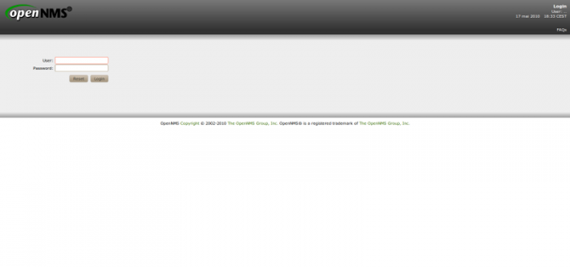
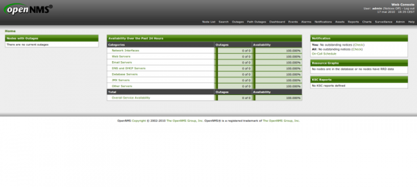

### Table des matières {.toggle}

-   [Installation d'OpenNMS sur CentOS
    5.x](install-on-centos.html#installation-d-opennms-sur-centos-5x)
    -   [1. Pré-requis](install-on-centos.html#pre-requis)
    -   [2. Vérification du
        hostname](install-on-centos.html#verification-du-hostname)
    -   [3. Installation et configuration de la base de données
        PostgreSQL](install-on-centos.html#installation-et-configuration-de-la-base-de-donnees-postgresql)
        -   [3.1 Installation et
            initialisation](install-on-centos.html#installation-et-initialisation)
        -   [3.2 Configuration](install-on-centos.html#configuration)
    -   [4. Installation et configuration
        d'OpenNMS](install-on-centos.html#installation-et-configuration-d-opennms)
        -   [4.1 Configuration du repository
            yum](install-on-centos.html#configuration-du-repository-yum)
        -   [4.2 Installation](install-on-centos.html#installation)
        -   [4.3 Configuration](install-on-centos.html#configuration1)

Installation d'OpenNMS sur CentOS 5.x {#installation-d-opennms-sur-centos-5x .sectionedit1}
=====================================

Cette page explique comment installer OpenNMS sur un système CentOS
version 5.x à partir d’un repository yum. Celle-ci n’explique pas
comment installer la distribution CentOS.

1. Pré-requis {#pre-requis .sectionedit2}
-------------

-   CentOS 5.x installé sans option particulière
-   Être connecté au système avec l’utilisateur root ou un utilisateur
    ayant suffisamment de droits pour exécuter les commandes ci-dessous
-   Une connexion internet disponible sur le système
-   Que le firewall du système soit désactivé ou ouvert sur le port 8980
    (system-config-securitylevel-tui)

2. Vérification du hostname {#verification-du-hostname .sectionedit3}
---------------------------

Vérifier que le serveur répond au ping. Pour cela tapez la commande
suivante :

~~~
shell> ping `uname -n`
~~~

Si celui-ci ne répond pas, ajouter le nom du serveur (obtenu à l’aide de
la commande uname -n) au fichier /etc/hosts.

Exemple : 127.0.0.1 OPENNMS-SERVER localhost.localdomain localhost

3. Installation et configuration de la base de données PostgreSQL {#installation-et-configuration-de-la-base-de-donnees-postgresql .sectionedit4}
-----------------------------------------------------------------

### 3.1 Installation et initialisation {#installation-et-initialisation .sectionedit5}

Pour installer le serveur de base de données, tapez la commande suivante
:

~~~
shell> yum install postgresql-server
~~~

Pour initialiser le serveur de base de données, tapez la commande
suivante :

~~~
shell> service postgresql start
~~~

### 3.2 Configuration {#configuration .sectionedit6}

Pour activer le serveur de base de données à chaque démarrage, tapez la
commande suivante :

~~~
shell> chkconfig postgresql on
~~~

La configuration ci-dessous permet de se connecter au serveur de base de
données sans mot de passe UNIQUEMENT en local.

Modifier le fichier /var/lib/pgsql/data/postgresql.conf pour qu’il
contienne les lignes suivantes :

~~~
listen_addresses = 'localhost'
~~~

Modifier le fichier /var/lib/pgsql/data/pg\_hba.conf pour qu’il
contienne les lignes suivantes :

~~~
# "local" is for Unix domain socket connections only
local   all         all                               trust
# IPv4 local connections:
host    all         all         127.0.0.1/32          trust
# IPv6 local connections:
host    all         all         ::1/128               trust
~~~

Redémarrer postgresql pour prendre en compte les changements à l’aide de
la commande :

~~~
shell> service postgresql restart
~~~

4. Installation et configuration d'OpenNMS {#installation-et-configuration-d-opennms .sectionedit7}
------------------------------------------

### 4.1 Configuration du repository yum {#configuration-du-repository-yum .sectionedit8}

Télécharger le paquet du repository :

~~~
shell> wget http://yum.opennms.org/repofiles/opennms-repo-stable-rhel5.noarch.rpm
~~~

Installer ce paquet avec la commande suivante :

~~~
shell> rpm -ivh opennms-repo-stable-rhel5.noarch.rpm
~~~

### 4.2 Installation {#installation .sectionedit9}

Pour installer OpenNMS, tapez la commande suivante :

~~~
shell> yum install OpenNMS
~~~

### 4.3 Configuration {#configuration1 .sectionedit10}

Pour configurer la JVM à utiliser dans OpenNMS, tapez la commande
suivante :

~~~
shell> JAVA_VERSION=`rpm -qa | grep "^jdk" | cut -d"-" -f2`
shell> /opt/opennms/bin/runjava -S /usr/java/jdk$JAVA_VERSION/bin/java
~~~

Pour configurer OpenNMS, tapez la commande suivante :

~~~
shell> /opt/opennms/bin/install -dis
~~~

Pour activer OpenNMS à chaque démarrage, tapez la commande suivante :

~~~
shell> chkconfig opennms on
~~~

Démarrez OpenNMS avec la commande suivante :

~~~
shell> service opennms start
~~~

L’interface d’openNMS est accessible via l’url suivante :
<http://ip_serv_openNMS:8980/opennms>

**Login :** admin **Mot de passe :** admin

