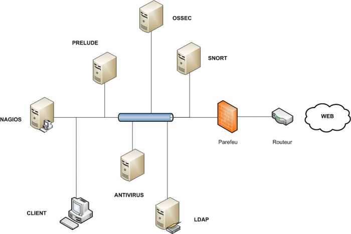
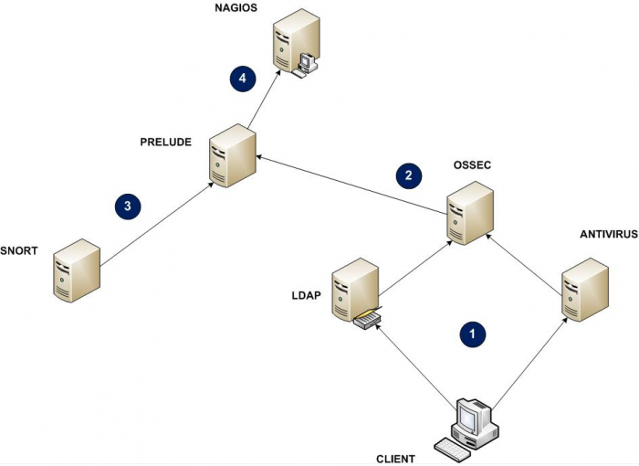
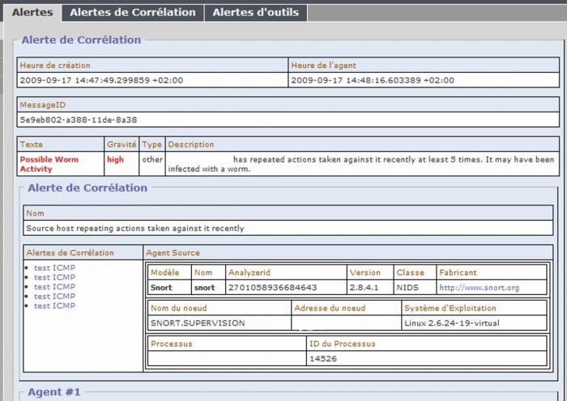

### Table des matières {.toggle}

-   [Architecture d'une solution Sécurité
    OSS](start.html#architecture-d-une-solution-securite-oss)
    -   [Présentation](start.html#presentation)
        -   [La terminologie de la
            sécurité](start.html#la-terminologie-de-la-securite)
        -   [Rôles de la solution](start.html#roles-de-la-solution)
        -   [Fonctionnement](start.html#fonctionnement)
    -   [Documentations](start.html#documentations)

Architecture d'une solution Sécurité OSS {#architecture-d-une-solution-securite-oss .sectionedit1}
========================================

Dans ce dossier, figure une présentation d’une architecture de solutions
Sécurité OSS, ainsi qu’un ensemble de documentations et de tutoriels sur
sa mise en place.

Pour toutes questions, informations complémentaires, rendez-vous sur le
[forum](http://forums.monitoring-fr.org/ "http://forums.monitoring-fr.org/")
du site.

Ce dossier a été réalisé par :

  **Rôle**              **Nom**
  --------------------- ---------------------------------------------------------------------------------------------------------------------------------------------------------
  **Rédacteur**         [Ludovic VALENTIN](http://www.monitoring-fr.org/community/members/ludovic-valentin/ "http://www.monitoring-fr.org/community/members/ludovic-valentin/")
  **Contributeur(s)**   [Romuald FRONTEAU](http://www.monitoring-fr.org/community/members/romuald-fronteau/ "http://www.monitoring-fr.org/community/members/romuald-fronteau/")

Présentation {#presentation .sectionedit3}
------------

### La terminologie de la sécurité {#la-terminologie-de-la-securite .sectionedit4}

-   **IDS** : Intrusion Detection System

-   **HIDS** : Host Intrusion Detection System

-   **NIDS** : Network Intrusion Detection System

-   **IDMEF** : Intrusion Detection Message Exchange Format

-   **PDC** : Primary Domain Controller

-   **LDAP** : Lightweight Directory Access Protocol

-   **SMS** : Short Message Service

-   **LML** : Log Monitoring Lackey

### Rôles de la solution {#roles-de-la-solution .sectionedit5}

#### Ossec

Tout d’abord, afin de s’assurer du bon fonctionnement des postes
informatiques à surveiller, l’installation d’un logiciel comme Ossec, un
HIDS, est très utile. En effet, Ossec permet de vérifier la modification
de fichiers, de détecter des attaques (rootkits, …) et de générer des
alertes.

#### Snort

Ensuite, comme la surveillance système ne fait pas tout, car n’étant pas
infaillible, il est judicieux d’ajouter un logiciel NIDS, tel que Snort.
Cette application, correctement configurée, peut détecter tous trafics
suspects sur le réseau, comme par exemple le scan de ports, les
rootkits, et ainsi de s’assurer une surveillance à la fois système et
réseau.

Tout comme Ossec, Snort envoi lui aussi des alertes.

#### Prelude

Dans l’optique de pouvoir superviser l’ensemble des évènements générés
par ces deux applicatifs, il faut pouvoir les centraliser, rendant de
cette manière l’administration et la visualisation des alertes plus
rapides. C’est ce que permet le logiciel Prelude, un IDS, qui utilise
des applications tels qu’Ossec et Snort comme des sondes.

Ainsi, après avoir intégré ces deux applications à Prelude, leurs
alertes sont transmises et donc centralisés au sein d’un seul logiciel.
De plus, ce logiciel permet de normaliser toutes les alertes au format
IDMEF et les stocke dans une base de données.

**IDMEF**

Le format IDMEF décrit une alerte de façon objet et exhaustive. Une
alerte est le message qui est émis depuis un analyseur, qui est une
sonde en langage IDMEF, vers un collecteur. Le but d’IDMEF est de
proposer un standard permettant d’avoir une communication hétérogène
quel que soit l’environnement ou les capacités d’un analyseur donné. Ces
alertes sont définies au format XML, offrant une possibilité de
validation de chaque message. En général, les implémentations restent
binaires, afin d’éviter les problèmes connus d’ajout d’information
inutiles en dehors d’XML lorsque l’on envoie un message sur le réseau.

IDMEF offre aussi un vocabulaire précis, qu’il est courant d’utiliser
dans le domaine de la détection d’intrusions. Par exemple, une
classification correspond au nom d’une alerte, un impact celui d’un
niveau d’attaque.

**Prelude-Correlator**

Afin de corréler des alertes, Prelude peut intégrer également un
corrélateur, à savoir Prelude-Correlator, un module ou plugin de
l’application, donc parfaitement compatible.

Ce dernier permet ainsi de relier certaines alertes entre elles,
spécifiques à une attaque par exemple, selon des règles de corrélation
définies. Il intercepte alors les alertes et les corrèle (ou pas), avant
de les retransmettre au Prelude.

**Prewikka**

Pour visualiser ces évènements stockés dans une base de données,
Prelude, qui n’a pas d’interface graphique par défaut, possède un module
nommé Prewikka, qui affiche en détail les alertes reçues par le
corrélateur et les diverses sondes (Ossec, Snort).

#### Nagios

Et enfin, Nagios, logiciel de supervision, interroge la base de données
de Prelude à la recherche d’alertes importantes de type Haute (High,
soit Critical) ou Moyenne (Medium, soit Warning) et grâce à
l’agrégation, remonte les alertes sous forme d’un statut.

Ici, Nagios ne sert que de plateforme de visualisation des alertes
Prelude, or comme il y a déjà une console de visualisation Prewikka,
l’ajout d’un serveur Nagios peut sembler inutile. Mais, il ne faut pas
oublier que Prelude ne fait remonter que des informations IDS, Nagios de
par sa multitude d’outils, peut quant à lui faire récupérer beaucoup
plus d’informations systèmes (performance, espace disque, …), et
vérifier que certains services fonctionnent correctement.

### Fonctionnement {#fonctionnement .sectionedit6}

#### Topologie Physique

Voici une topologie réseau de base, formée en étoile :

#### Topologie logique

##### Explications

L’architecture mise en place doit permettre l’acheminement d’une alerte,
provenant d’un poste client, jusqu’à son affichage dans la console de
supervision de Nagios. Le schéma ci-dessus, offre une vision plus claire
du trajet parcouru par une alerte. Ce parcours peut être divisé en
plusieurs étapes :

Pour commencer, il y a un poste client (nommé tout simplement CLIENT),
ce dernier est intégré à un domaine (serveur PDC, nommé LDAP) et dispose
d’un antivirus administré par un serveur (soit nommé ANTIVIRUS.

1.  Un problème x sur CLIENT survient, selon la nature du problème
    (authentification, virus, …), le contrôleur de domaine LDAP, ou bien
    le serveur ANTIVIRUS affiche cet évènement dans un fichier log,
    fichier qui grâce à Ossec est analysé.
2.  OSSEC détecte alors le problème selon ses propres règles et fait
    remonter l’alerte (si besoin) sous forme de message IDMEF au serveur
    PRELUDE. Le serveur PRELUDE, réceptionnant l’alerte, ajoute alors un
    évènement dans sa base de données au format IDMEF, respectant ainsi
    toujours la norme.
3.  De son côté, le serveur SNORT, détecte une attaque y sur le réseau,
    identifiée par ses règles, et transmet alors une alerte IDMEF à
    PRELUDE. Tout comme pour une alerte provenant d’OSSEC, PRELUDE
    stocke l’évènement dans la base de données.
4.  Le serveur de supervision NAGIOS, afin d’afficher les alertes, check
    régulièrement le serveur PRELUDE, et dès qu’il détecte une ou des
    alertes dans la base de données, il affiche un statut CRITICAL ou
    WARNING pour le service gérant le check de Prelude (soit
    check\_prelude). Ainsi, il détecte les alertes x d’Ossec et y de
    Snort, qui selon leur priorité, leur niveau d’importance change le
    statut du service de check\_prelude. Les alertes sont alors
    correctement affichées dans la console du serveur NAGIOS.

##### Cas pratique

Dans cet exemple, le poste CLIENT tente une authentification auprès du
contrôleur de domaine LDAP. Le mot-de-passe n’étant pas le bon, après
plusieurs tentatives, que LDAP a pris soin de stocker dans ses logs,
l’application Ossec cliente qui les analyse, par exemple après trois
échecs, transmet alors une alerte au serveur OSSEC.

OSSEC, réceptionne l’évènement et l’inscrit dans ses propres logs tout
en le transférant au format IDMEF au serveur PRELUDE.

Prelude-Manager, à la réception de l’alerte, l’ajoute dans sa base de
données.

NAGIOS, comme à son habitude, check la base de données de PRELUDE toutes
les cinq minutes, ainsi, au bout des cinq minutes, le service configuré
utilise la commande check\_prelude pour compter la présence d’alertes.
Si la priorité de cette alerte, à savoir, l’échec d’authentification
ldap, est de type CRITICAL, le statut du service sous NAGIOS passe alors
à l’état CRITICAL.

Pour visualiser les détails des alertes, il faut utiliser l’interface
Web de PRELUDE, c’est-à-dire Prewikka, qui affiche les alertes de la
base de données de Prelude.

Ensuite, il est possible de visualiser plus en détail les informations :

Comme le montre cette capture d’écran, l’alerte est beaucoup plus
précise, et détaillée en indiquant le problème rencontré, la sonde qu’il
a générée, …etc. Ainsi, il est possible de trouver l’origine du problème
et donc de le résoudre.

Documentations {#documentations .sectionedit7}
--------------

**Il est fortement recommander de suivre un ordre particulier
d’installation sous peine d’avoir des problèmes de clé d’échange entre
le serveur Prelude et Snort / Ossec. C’est-à-dire, d’abord commencer par
l’installation du serveur Prelude, puis ensuite les sondes. Quant à
Nagios, comme il n’a pas besoin d’une installation particulière, il peut
être installé à tout moment.**

-   **[Prelude-IDS](../../../../securite/prelude/start.html "securite:prelude:start")**
-   **[Ossec](../../../../securite/ossec/start.html "securite:ossec:start")**
-   **[Snort](../../../../securite/snort/start.html "securite:snort:start")**
-   **[Nagios](../../../../nagios/ubuntu-install.html "nagios:ubuntu-install")**
-   **[Intégration Nagios de
    Prelude-IDS](../../../../nagios/integration/prelude.html "nagios:integration:prelude")**

