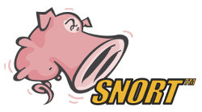

### Table des matières {.toggle}

-   [Snort](start.html#snort)
    -   [Présentation](start.html#presentation)
    -   [Documentation](start.html#documentation)
        -   [Chapitre 1 -
            Installation](start.html#chapitre-1-installation)
        -   [Chapitre 2 - Expertise](start.html#chapitre-2-expertise)

Snort {#snort .sectionedit1}
=====

Dans ce dossier, figure une présentation des fonctionnalités de Snort,
ainsi qu’un ensemble de documentations et de tutoriels sur la mise en
place d’un serveur Snort.

Pour toutes questions, informations complémentaires sur Snort,
rendez-vous sur le
[forum](http://forums.monitoring-fr.org/ "http://forums.monitoring-fr.org/")
du site.

Ce dossier a été réalisé par :

  **Rôle**              **Nom**
  --------------------- ---------------------------------------------------------------------------------------------------------------------------------------------------------
  **Rédacteur**         [Ludovic VALENTIN](http://www.monitoring-fr.org/community/members/ludovic-valentin/ "http://www.monitoring-fr.org/community/members/ludovic-valentin/")
  **Contributeur(s)**   [Romuald FRONTEAU](http://www.monitoring-fr.org/community/members/romuald-fronteau/ "http://www.monitoring-fr.org/community/members/romuald-fronteau/")

Présentation {#presentation .sectionedit3}
------------

Snort
([http://www.snort.org](http://www.snort.org "http://www.snort.org"))
est un NIDS (Network Intrusion Detection System). Il a pour rôle
d’écouter sur le réseau à la recherche d’attaques de pirates, qu’il
détecte grâce à de nombreuses règles disponibles sur le site officiel,
également auprès de certaines communautés comme Emerging.

L’application analyse le réseau, le trafic en temps réel, et peut logger
des paquets. Les alertes sont ensuite stockées dans une base données,
elles peuvent être également sous forme de logs. Snort peut aussi
transmettre, notifier les évènements. Il est basé sur un système de
signatures et combine donc l’analyse du trafic par signature, protocole
et anomalie.

Snort fonctionne sur Linux.

Documentation {#documentation .sectionedit4}
-------------

### Chapitre 1 - Installation {#chapitre-1-installation .sectionedit5}

**[Installation de Snort sur
Ubuntu](../../../../securite/snort/snort-ubuntu-install.html "securite:snort:snort-ubuntu-install")**

1.  **[Pré-Requis](../../../../securite/snort/snort-ubuntu-install.html#pre-requis "securite:snort:snort-ubuntu-install")**
2.  **[Installation](../../../../securite/snort/snort-ubuntu-install.html#installation "securite:snort:snort-ubuntu-install")**
3.  **[Configuration](../../../../securite/snort/snort-ubuntu-install.html#configuration "securite:snort:snort-ubuntu-install")**
4.  **[Utilisation](../../../../securite/snort/snort-ubuntu-install.html#utilisation "securite:snort:snort-ubuntu-install")**

### Chapitre 2 - Expertise {#chapitre-2-expertise .sectionedit6}

**[Architecture d'une solution Sécurité
OSS](../../../../securite/architecture-oss/start.html "securite:architecture-oss:start")**
\
 **[Installation de Oinkmaster sur
Ubuntu](../../../../securite/snort/oinkmaster-ubuntu-install.html "securite:snort:oinkmaster-ubuntu-install")**
