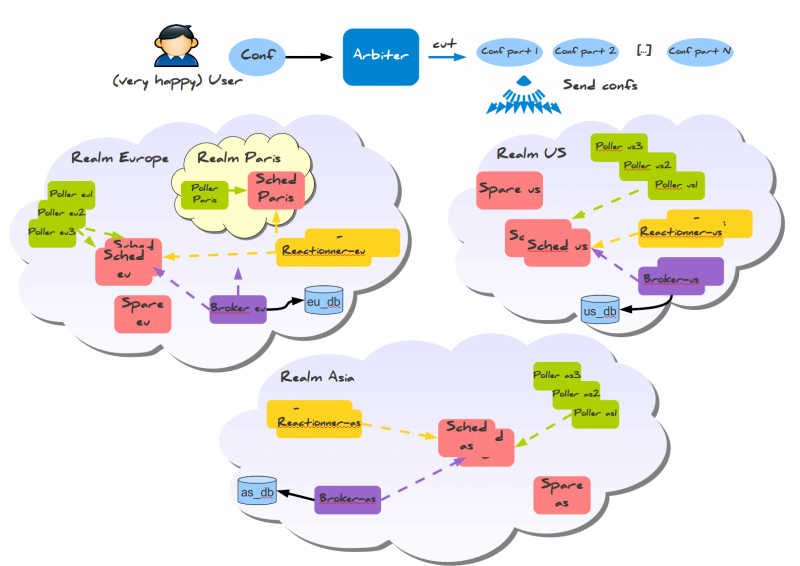
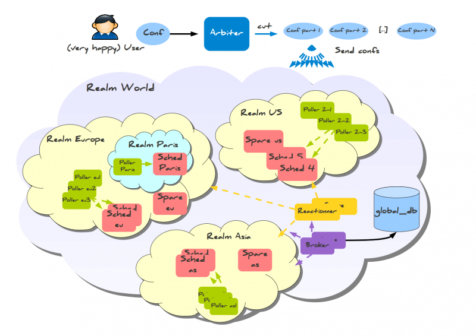

### Table des matières {.toggle}

-   [Les architectures avancées de
    Shinken](shinken-advanced-architecture.html#les-architectures-avancees-de-shinken)
    -   [Supervision
        distribuée](shinken-advanced-architecture.html#supervision-distribuee)
    -   [Architecture mixe (poller en GNU/Linux ET
        Windows)](shinken-advanced-architecture.html#architecture-mixe-poller-en-gnulinux-et-windows)
    -   [La notion de
        realm](shinken-advanced-architecture.html#la-notion-de-realm)
        -   [Les
            sous-realms](shinken-advanced-architecture.html#les-sous-realms)
        -   [Et en résumé ça donne
            quoi?](shinken-advanced-architecture.html#et-en-resume-ca-donne-quoi)
        -   [Des exemples d'utilisations en
            image](shinken-advanced-architecture.html#des-exemples-d-utilisations-en-image)
        -   [La partie configuration des
            realms](shinken-advanced-architecture.html#la-partie-configuration-des-realms)

Les architectures avancées de Shinken {#les-architectures-avancees-de-shinken .sectionedit1}
=====================================

Jusqu’ici le Shinken décrit est un équivalent de Nagios en plus
performant et plus souple du point de vue du code. Ok c’est bien, mais
l’utilisateur il en tirer quoi comme bénéfice direct?

Supervision distribuée {#supervision-distribuee .sectionedit2}
----------------------

La supervision distribuée est facile à mettre en place dans Shinken,
contrairement à Nagios. Pourquoi? Et bien car elle a été prévue dès le
départ. Si je vous dis que le nom de l’application vient de là, ça vous
parle ? :)

En fait, les points de contentions de charge sont en priorités :

-   pollers : ceux qui lancent les sondes, gros consommateurs de perf
-   schedulers : ceux qui ordonnancent.

Pour les deux, un seuil de 150000 checks (ou ordonnancement) en 5
minutes est une limite sur un bon serveur (4 coeurs à 3Ghz). Ils peuvent
être multipliés à merci.

Deux cas se présentent :

-   des sondes très consommatrices (genre beaucoup de perl ou de shell
    mal codés)
-   beaucoup d’ordonnancements tout cours (\> 150000 checks en 5
    minutes).

Dans le premier, il faut multiplier les pollers tout simplement. Dans le
second, ce sont les ordonnanceurs qu’il faut multiplier (et il y a de
forte chance que vous rajoutiez des pollers également, mais ce n’est pas
obligatoire).

Comment on en rajoute? Simple : vous mettez l’application Shinken sur un
nouveau serveur (donc user shinken + fichiers sources dans
/usr/local/shinken). disons que ce serveur se nomme serveur-bis, et
qu’il a l’IP 192.168.0.2 (maitre à 0.1). Vous lancez les daemons
schedulers et/ou pollers que vous voulez :

~~~
python shinken-scheduler.py -d -c etc/schedulerd.cfg
python shinken-poller.py -d -c etc/pollerd.cfg
~~~

Ca ressemble au lancement du serveur-maitre ? Et bien oui, c’est les
mêmes :) Si vous voulez lancer plusieurs daemons schedulers ou pollers
sur le même serveur, dupliquez les fichiers etc/schedulerd.cfg et
etc/pollerd.cfg et modifiez les ports dedans tout simplement. Mais vu
que c’est sur la même machine, l’intérêt est plus que limité (sauf pour
un cas d’exemple genre une VM de test hein…).

Ce n’est pas fini, car là vous avez lancé les daemons, mais l’Arbiter ne
les connait pas. Et bien donnons lui le lien vers eux tout simplement.
Dans le fichier shinken-specific.cfg vous rajoutez :

~~~
define scheduler{
       scheduler_name   scheduler-2
       address  192.168.0.2
       port 7768
       spare    0
       }

define poller{
       poller_name     poller-2
       address  192.168.0.2
       port     7771
       spare    0
}
~~~

Les modifications par rapport aux scheduler-1 et poller-1 sont juste les
noms et les adresses, c’est tout :)

Vous relancez, et c’est fini. Shinken va automatiquement découper la
configuration en deux (deux schedulers actifs), les deux pollers vont
demander des checks aux 2 schedulers, et tout le monde va être content.

#### Supervision hautement disponible

Bon, un serveur ça tombe, le réseau aussi (surtout…). Bref, la haute
dispo ce n’est pas une option, c’est une obligation!

Avec Nagios, ça prends un max de temps, et ça marche mal, ça plombe les
perfs. Bref, ce n’est pas pensé pour. Shinken si! :)

Vous vous souvenez du rajout de scheduler/poller que nous venons de
faire? Et bien on va en rajouter encore deux nouveaux : deux spares :)
Pour les autres daemons (reactionner, broker et arbiter) c’est pareil.

Donc sur un 3ième serveur, nommé serveur-spare, d’IP 192.168.0.3, on
installe Shinken (user+ fichiers dans /usr/local/shinken) et on lance
les daemons :

~~~
python shinken-scheduler.py -d -c etc/schedulerd.cfg
python shinken-poller.py -d -c etc/pollerd.cfg
~~~

Rien de nouveau ici.

Pareil, on rajoute dans la configuration lue par l’Arbiter ces deux
nouveaux daemons :

~~~
define scheduler{
       scheduler_name   scheduler-3
       address  192.168.0.3
       port 7768
       spare    1
       }

define poller{
       poller_name     poller-3
       address  192.168.0.3
       port     7771
       spare    1
}
~~~

Vous remarquez une différence? Oui, outre le nom et l’adresse, il y a 1
au paramètre spare. C’est l’Arbiter qui décide qui est spare et qui ne
l’est pas. Relancez l’Arbiter, et c’est bon, vous avez votre haute
disponibilité :)

..

Oui, c’est tout. En gros vous avec votre configuration toujours coupée
en 2 car il n’y a que 2 schedulers ACTIFS. Pareil pour le poller de
spare : il ne fait rien.

Si un des daemons 1 ou 2 meure, et bien son équivalent -3 va prendre le
relai, tout simplement.

Architecture mixe (poller en GNU/Linux ET Windows) {#architecture-mixe-poller-en-gnulinux-et-windows .sectionedit3}
--------------------------------------------------

On a vu que l’on peut multiplier les pollers comme on veut. Mais sur la
même plate forme? Genre pleins de GNU/Linux ? Mais il serait intéressant
d’avoir quelques pollers Windows pour superviser les windows (ça aide
d’être sur une machine du domaine pour faire du WMI hein…), et le reste
sur du GNU/Linux ou autre magnifiqueenvironnementenlignedecommande.

Et bien cher lecteur, on le peut! Et si tu as suivi, tu ne dois rien
comprendre, car j’ai dit juste au dessus (sisi, relis bien) que les
pollers se connectaient à tous les schedulers. Ah.. donc va séparer les
windows du reste là dedans…

Et bien c’est le rôle du paramètre poller\_tag/poller\_tags. Il
s’applique sur : \* les pollers \* les commandes de supervisions \* les
services \* les hôtes

Bon, en gros c’est simple : vous donnez des tags gérés par un ou
plusieurs pollers. Genre un tag “Windows” au hasard. Puis vous taguez au
choix certaines commandes (genre les \*wmi\* hein…), ou certains
services, ou certains hôtes. Si une commande n’est pas taguée et que le
service qui l’utilise l’est, ceci la tague pour ce service. Pareil pour
l’hôte, avec un héritage implicite pour ses services d’ailleurs.

En gros vous faites :

~~~
define command{
   command_name   
   command_line   c:\shinken\libexec\check_wmi.exe -H $HOSTADRESS$ -r $ARG1$
   poller_tag     Windows
}

define poller{
   poller_name  poller-windows
   address      192.168.0.4
   port     7771
   spare    0
   poller_tags  Windows,DMZ
}
~~~

Et hop, magie : tous les appels à cette commande ne seront pris que par
le poller poller-windows (sauf si d’autres ont aussi ce tag). Les autres
pollers prendront les autres sondes à lancer, lui ne prendra que celle
là (et celle de DMZ que nous allons voir maintenant).

Ah, vous n’avez pas de Windows (quel bol…), mais vous avez une DMZ. Ah,
ces types du réseau hein… Et vous ne voulez pas ouvrir tous les ports?
Et bien le poller\_tag va vous aider.

Vous avez un poller que vous installez sur un serveur en DMZ (user +
fichiers, vous devez savoir faire maintenant). Vous le tagguez DMZ dans
shinken-specific.cfg. Puis vous tagguez tout les hôtes et/ou services
que vous voulez voir supervisé depuis ce poller particulier. C’est tout
simple :

~~~
define host{
   host_name  serveur-DMZ-1
   [...]
   poller_tag DMZ
   [...]
}

define service{
   service_description  CPU
   host_name  serveur-DMZ-2
   [...]
   poller_tag DMZ
   [...]
}
~~~

Et voila, c’est tagué. Vous relancez Arbiter, et la magie opère.

La notion de realm {#la-notion-de-realm .sectionedit4}
------------------

L’architecture de Shinken permet dans la forme que nous avons vu jusqu’à
maintenant d’avoir un point unique d’administration de plusieurs
ordonnanceurs, pollers, reactionners et brokers. Les hôtes sont
dispatchés sur les ordonnanceurs, les services suivent, les satellites
(poller/reactionner/broker) tapent sur tous les ordonnanceurs. C’est
implémenté, et le pire, c’est que ça fonctionne
. Tout le monde est
content.

Tout le monde? Non. Imaginons un peu qu’un administrateur ait une
infrastructure distribuée sur plusieurs continents. Avec l’archi de
Shinken actuellement, si l’administrateur a mis deux ordonnanceur : un à
Bordeaux et un à Shangaï et de même un poller sur Bordeaux, et un sur
Shangaï, les pollers tapent sur les deux ordonnanceurs, et pour ceux qui
n’ont pas le grand bonheur d’avoir un site à Shangaï, autant vous dire
que les lignes internet sont plutôt… bon disons que c’est aléatoire pour
rester poli. De plus, un hôte va se voir affecté sur un ordonnanceur ou
un autre sans pouvoir influer dessus.

Bref, Shinken, dans son état actuel, est pratique pour avoir de la haute
dispo, répartition de charge et performance mais pour un site unique. Et
là vous me voyez venir à des kilomètres : la gestion des sites.

Alors on va utiliser un nom plus général qu’un site (après tout ça peut
être une séparation plus organisationnelle que géographique) : un
**realm**.

Un realm est un groupe de ressources indissociables auquel vont pouvoir
être rattachés des hôtes ou des groupes d’hôtes. Une telle association
sera unique, un hôte ne pourra se trouver que dans un realm donné et il
faudra que ses parents soient dans le même realm (sinon le découpage de
conf et le dispatching ne sera pas content). Si ces derniers n’ont pas
de realm désignés, il hériterons de celui-là lors du découpage de
configuration.

Un realm est donc un groupe de schedulers, [pollers], [reactionners],
[brokers] (ces derniers sont optionnels). Dans un realm, les pollers
vont se connecter à tous les schedulers du realm.

### Les sous-realms {#les-sous-realms .sectionedit5}

Un realm peut contenir un autre realm. Ceci ne change rien pour les
ordonnanceurs, ceux-ci ne s’adressant qu’aux ordonnanceurs du même
realm. Les hôte d’un realm ne seront dispatchés que sur les schedulers
du realm, pas de ses fils. Là où une hiérarchie de realm devient utile
concerne les reactionners/brokers (et dans uen moindre mesure les
pollers): ils sont associés à un realm, mais si ce dernier contient
d’autres realms (qui eux même en contiennent d’autres etc etc) et bien
les reactionners/broker[/poller] vont chercher les infos sur tous les
ordonnanceurs de la hiérarchie de realm.

En fait, cette notion de satellites qui peuvent atteindre les
sous-realms est disponible et ce grâce au paramètre manage\_sub\_realms
avec comme valeur par défaut les pollers a 0, et les reactioners/broker
1. Si après l’administrateur veux le changer pour
décloisonner/cloisonner, libre à lui.

Avoir plusieurs brokers qui tapent sur un même scheduler n’est pas
conseillé du tout! Un broker vide les infos qu’il récupère, et donc le
second ne les aura pas! Si après c’est pour taper sur une base commune
pourquoi pas, mais c’est joué un jeu dangereux.

Il faut bien retenir une chose : un seul Arbiter (et son spare) et une
seule conf, quelque soit le nombre de realms que vous avez.

### Et en résumé ça donne quoi? {#et-en-resume-ca-donne-quoi .sectionedit6}

En résumé, vous mettez un hôte ou un groupe d’hôte dans un realm.
Celui-ci est un ensemble de ressources pour superviser vos hôtes et les
services qui y sont raccrochés. Vous pouvez enlever ou rajouter des
ressources au realm sans avoir à changer la conf des 30K hôtes que vous
avez patiemment configuré car vous avec rajouté un ordonnanceur ou un
poller de plus dans le lot.

Bref, le realm est une facilité pour gérer ses ressources. Si vous
n’avez qu’un petit site gérable par un
ordonnanceur/poller/reactionner/broker, pas la peine de vous embêter
avec un realm, par défaut Shinken en créera un pour vous à la volée et
vous n’en entendrez même pas parler :)

### Des exemples d'utilisations en image {#des-exemples-d-utilisations-en-image .sectionedit7}

Des diagrammes, c’est encore mieux que toutes ces explications :)

Imaginons que l’on a deux environnements distribués un peu partout dans
le monde. Dans un cas, on souhaite un cloisonnement total des
continents. Dans un autre, on accepte que les reactionners et brokers
soient communs à tous les ordonnanceurs du monde (oui, rien que ça :) ).

Voici le cas isolé :

Et le cas plus communs avec les réactionner/broker de communs :

Comme vous pouvez le voir, les éléments sont raccrochés à un seul realm.
Suivant l’héritage que nous leur avons donné, ils utilisent les
schedulers des sous-realm ou non.

### La partie configuration des realms {#la-partie-configuration-des-realms .sectionedit8}

Voici ce que ça devrait donner pour le second cas :

~~~
define realm {
   realm_name       All
   realm_members    Europe,US,Asia
   default          1    ;Est le realm par défaut. Doit être le seul dans ce cas...         
}
define realm{
   realm_name       Europe
   realm_members    Paris   ;Le realm Paris est contenu dans Europe
}
~~~

Je ne sais pas encore si c’est bien utile de forcer la définition des
autres realms même s’ils n’ont qu’un nom…. Un peu comme un hostgroup qui
peut être défini juste en étant présent dans la conf des hosts. Le
paramètre default est utilisé pour définir le realm qui sera utilisé sur
des hôtes ne sont pas placés dans un realm (et qu’aucune de leur
dépendance n’appartient déjà à un realm).

Un seul realm par défaut doit être défini, sauf si vous êtes très
joueur…

~~~
define scheduler{
   scheduler_name       sched Paris
   realm                Paris             ;il ne s'occupera que des hôtes du realm Paris
}
define reactionner{
   reactionner_name     reactionner-maitre
   realm                All                ;Avec ce realm, il atteindra tous les schedulers
}
~~~

Et dans les hôtes/hostgroups :

~~~
define host{
   host_name         serveur-paris
   realm             Paris         ;sera envoyé dans le realm Paris
   [...]
}

define hostgroups{
   hostgroup_name       linux-servers
   alias            Linux Servers
   members          srv1,srv2
   realm                        Europe       ;Realm où seront envoyé les hôtes du groupe
}
~~~

Pour les hôtes, ce paramètre sera géré par l’héritage comme toutes les
propriétés des hôtes. Un hostgroup ayant un realm de défini, mais dont
un de ses hôte a déjà un realm qui n’est pas celui demandé, c’est la
valeur de hôte qui prime (mais avec un petit Warning pour prévenir tout
de même, faut pas exagérer tout de même :) ).
