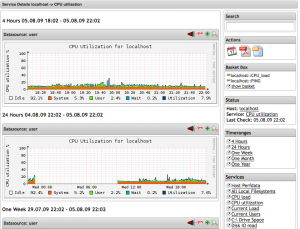

### Table des matières {.toggle}

-   [Interface Shinken](shinken-use-ui.html#interface-shinken)
    -   [Interface basée sur un accès Direct à la
        mémoire](shinken-use-ui.html#interface-basee-sur-un-acces-direct-a-la-memoire)
    -   [Interfaces basée sur le livestatus (réseau
        API)](shinken-use-ui.html#interfaces-basee-sur-le-livestatus-reseau-api)
    -   [Interfaces basées sur le backend
        SQL](shinken-use-ui.html#interfaces-basees-sur-le-backend-sql)
    -   [Modules basée sur l'exportation de données
        (réseau)](shinken-use-ui.html#modules-basee-sur-l-exportation-de-donnees-reseau)
    -   [Autre](shinken-use-ui.html#autre)
    -   [L'exportation de fichiers plats:
        Obsolète](shinken-use-ui.html#l-exportation-de-fichiers-platsobsolete)
    -   [Lequel est le bon pour
        moi?](shinken-use-ui.html#lequel-est-le-bon-pour-moi)

Interface Shinken {#interface-shinken .sectionedit1}
=================

Les administrateurs ont besoin d’un moyen pour afficher les données
d’état et d’interagir avec le système.

Si vous installez Shinken en utilisant l’[installation en 10
minutes](../../../shinken/shinken-10min-start.html "shinken:shinken-10min-start")
(méthode recommandée), vous aurez l’interface Web Shinken installé.

Mais il n’est pas obligatoire de l’utiliser, et vous préférerez
peut-être une autre interface.

Il y a des frontaux web open source et commerciaux utilisant le
livestatus API ou un SQL backend disponibles pour répondre à tous les
besoins.

Interface basée sur un accès Direct à la mémoire {#interface-basee-sur-un-acces-direct-a-la-memoire .sectionedit2}
------------------------------------------------

-   [Shinken
    WebUI](../../../shinken/shinken-use-ui/use_with_webui.html "shinken:shinken-use-ui:use_with_webui")
    , inclus dans l’installation de Shinken.

Interfaces basée sur le livestatus (réseau API) {#interfaces-basee-sur-le-livestatus-reseau-api .sectionedit3}
-----------------------------------------------

-   [Thruk](../../../shinken/shinken-use-ui/use_with_thruk.html "shinken:shinken-use-ui:use_with_thruk")

-   [Multisite](http://wiki.monitoring-fr.org/shinken/shinken-use-ui/use_with_multisite "shinken:shinken-use-ui:use_with_multisite")

-   Module gratuit:
    [NagVis](http://wiki.monitoring-fr.org/shinken/shinken-use-ui/use_with_nagvis "shinken:shinken-use-ui:use_with_nagvis")
    (représentation graphique)

Interfaces basées sur le backend SQL {#interfaces-basees-sur-le-backend-sql .sectionedit4}
------------------------------------

-   [Centreon](http://wiki.monitoring-fr.org/shinken/shinken-use-ui/use_with_centreon "shinken:shinken-use-ui:use_with_centreon")

Modules basée sur l'exportation de données (réseau) {#modules-basee-sur-l-exportation-de-donnees-reseau .sectionedit5}
---------------------------------------------------

-   Module gratuit:
    [Graphite](http://wiki.monitoring-fr.org/shinken/shinken-use-ui/use_with_graphite "shinken:shinken-use-ui:use_with_graphite")
-   Remarque: Intégré out-of-the-box dans Shinken WebUI

Autre {#autre .sectionedit6}
-----

-   Module gratuit:
    [PNP4Nagios](http://wiki.monitoring-fr.org/shinken/shinken-use-ui/use_with_pnp4nagios "shinken:shinken-use-ui:use_with_pnp4nagios")
    (graphique interface)

L'exportation de fichiers plats: Obsolète {#l-exportation-de-fichiers-platsobsolete .sectionedit7}
-----------------------------------------

-   [Vieux CGI &
    VShell](http://wiki.monitoring-fr.org/shinken/shinken-use-ui/use_with_old_cgi_and_vshell "shinken:shinken-use-ui:use_with_old_cgi_and_vshell")
    Remarque: Le Nagios CGI interface web est obsolète.

Lequel est le bon pour moi? {#lequel-est-le-bon-pour-moi .sectionedit8}
---------------------------

Essayez-les et voyez lequel vous convient le mieux.

C’est particulièrement facile avec l’interface utilisateur Web Shinken
et les interfaces livestatus base.

-   Pour les utilisateurs qui débutent avec les petites et moyennes
    installations, Thruk , multisite ou WebUI Shinken sont de bons
    choix;
-   Pour les petites et moyennes entreprises qui ont besoin de
    déploiements tout l’éventail d’outils de Centreon est un bon choix;
-   Pour une évolutivité maximale et un ensemble de fonctionnalités
    solides multisite est recommandé. Thruk est également une interface
    caractéristique très complète qui fournit également une certaine
    évolutivité.

