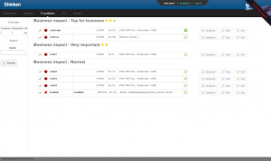

### Table des matières {.toggle}

-   [Shinken WebUI](use_with_webui.html#shinken-webui)
    -   [Mettre en place le module de l'interface utilisateur
        Web](use_with_webui.html#mettre-en-place-le-module-de-l-interface-utilisateur-web)
    -   [Modules
        d'authentification](use_with_webui.html#modules-d-authentification)
    -   [Shinken contact -
        cfg\_password\_webui](use_with_webui.html#shinken-contact-cfg_password_webui)
    -   [Apache htpasswd -
        passwd\_webui](use_with_webui.html#apache-htpasswd-passwd_webui)
    -   [Active Directory / OpenLDAP -
        ad\_webui](use_with_webui.html#active-directoryopenldap-ad_webui)
    -   [Photos des
        utilisateurs](use_with_webui.html#photos-des-utilisateurs)
    -   [Modules de Préférences de
        l'utilisateur](use_with_webui.html#modules-de-preferences-de-l-utilisateur)
    -   [Modules graphiques de
        métrologie](use_with_webui.html#modules-graphiques-de-metrologie)
    -   [Graphiques PNP](use_with_webui.html#graphiques-pnp)
    -   [Graphiques graphite](use_with_webui.html#graphiques-graphite)
    -   [Utilisez-le!](use_with_webui.html#utilisez-le)

Shinken WebUI {#shinken-webui .sectionedit1}
=============

Shinken comprend une d’interface utilisateur Web, qui inclut son propre
serveur Web (pas besoin de configurer Apache ou Microsoft IIS )

Shinken WebUI est lancé au démarrage Shinken, et est configuré à l’aide
du fichier de configuration principal Shinken en y mettant quelques
paramètres de base.

-   Page d’accueil officiel :
    [http://www.shinken-monitoring.org/](http://www.shinken-monitoring.org/ "http://www.shinken-monitoring.org/")
-   Captures d’écran:
    [http://www.shinken-monitoring.org/screenshots/](http://www.shinken-monitoring.org/screenshots/ "http://www.shinken-monitoring.org/screenshots/")
-   Description: “Shinken WebUI est l’interface de visualisation par
    défaut. Il est conçu pour être simple et se concentrer sur la racine
    des problèmes d’analyse et impacts pour les entreprises. ”
-   Licence: AGPL v3
-   Shinken forum:
    [http://www.shinken-monitoring.org/forum/](http://www.shinken-monitoring.org/forum/ "http://www.shinken-monitoring.org/forum/")

Mettre en place le module de l'interface utilisateur Web {#mettre-en-place-le-module-de-l-interface-utilisateur-web .sectionedit2}
--------------------------------------------------------

Activer le webui module dans shinken-specific.cfg fichier de
configuration qui se trouve sur le serveur où votre Arbiter est
installé.

~~~~ {.code}
define module{
        module_name      WebUI
        module_type      webui

        host             0.0.0.0       ; mean all interfaces of your broker server
        port             7767

        # CHANGE THIS VALUE or someone may forge your cookies
        auth_secret      TOCHANGE

        # Allow or not the html characters in plugins output
        # WARNING: so far, it can be a security issue
        allow_html_output  0

        # Option welcome message
        #login_text             Welcome to ACME Shinken WebUI.

        #http_backend    auto
        # ; can be also: wsgiref, cherrypy, paste, tornado, twisted
        # ; or gevent. auto means best match in the system.
        modules          Apache_passwd,ActiveDir_UI,Cfg_password,Mongodb

        # Modules available for the WebUI:
        #
        #   Note: Choose one or more authentication methods.
        #
        #   Apache_passwd: use an Apache htpasswd files for auth
        #   ActiveDir_UI: use AD for auth and photo collect
        #   Cfg_password: use passwords in contacts configuration for authentication
        #
        #   PNP_UI: Use PNP graphs in the UI
        #   GRAPHITE_UI: Use graphs from Graphite
        #
        #   Mongodb: Necessary for enabling user preferences in WebUI
}
~~~~

Avez-vous déjà changé le paramètre auth\_secret ? Non? Faites-le
maintenant!

Le serveur web est un processus Python. Vous n’avez pas besoin d’un
serveur web (Apache) pour exécuter l’interface utilisateur Web.

Modules d'authentification {#modules-d-authentification .sectionedit3}
--------------------------

Le modules WebUI rechercher votre mot de passe utilisateur et permettent
l’authentification ou non. Par défaut, il utilise le module
**cfg\_password\_webui**, qui se penchera sur la définition des contacts
pour les paramètres de **mot de passe**.

Vous devez déclarer ces modules dans le modules propriété de l’interface
Web utilisateur.

Shinken contact - cfg\_password\_webui {#shinken-contact-cfg_password_webui .sectionedit4}
--------------------------------------

Le plus simple est d’utiliser les utilisateurs ajoutés comme contacts
Shinken.

~~~~ {.code}
define module{
       module_name Cfg_password
       module_type cfg_password_webui
}
~~~~

Apache htpasswd - passwd\_webui {#apache-htpasswd-passwd_webui .sectionedit5}
-------------------------------

Ce module utilise un fichier Apache passwd (htpasswd) comme backend
d’authentification. Tout ce qu’il faut, c’est le chemin complet du
fichier (à partir d’un héritage Nagios CGI installation, par exemple).

~~~~ {.code}
define module{
       module_name      Apache_passwd
       module_type      passwd_webui

       # WARNING: put the full PATH for this value!
       passwd           /etc/shinken/htpasswd.users
}
~~~~

Vérifier le propriétaire (l’utilisateur doit être Shinken) et les droits
de ce fichier (doit être lisible).

Si vous ne disposez pas d’un tel fichier, vous pouvez le générer un avec
la commande “htpasswd” (dans Debian “apache2-utils” package), ou à
partir de sites comme
[htaccessTools](http://www.htaccesstools.com/htpasswd-generator/ "http://www.htaccesstools.com/htpasswd-generator/").

Pour être en mesure de se connecter à l’interface utilisateur Web, les
utilisateurs doivent également être déclaré en tant que contacts
Shinken! Ainsi, l’ajout d’un utilisateur dans ce fichier sans l’ajouter
dans les contacts n’aura aucun effet.

Active Directory / OpenLDAP - ad\_webui {#active-directoryopenldap-ad_webui .sectionedit6}
---------------------------------------

Ce module permet de rechercher des mots de passe dans l’Active Directory
ou OpenLDAP.

~~~~ {.code}
define module {
    module_name ActiveDir_UI
    module_type ad_webui
    ldap_uri ldaps://adserver
    username user
    password password
    basedn DC=google,DC=com

    # For mode you can switch between ad (active dir)
    # and openldap
    mode    ad
}
~~~~

Changer “adserver” par votre propre serveur dc, et l’option
“user/password” pour un compte avec un accès en lecture sur le basedn
pour rechercher les entrées d’utilisateur.

Changer “mode” de “ad” à “openldap” pour rendre le module prêt à
s’authentifier sur un service d’annuaire OpenLDAP.

Vous pouvez également trouver l’exemple dans shinken.specific.cfg.

Photos des utilisateurs {#photos-des-utilisateurs .sectionedit7}
-----------------------

les utilisateurs WebUI peuvent avoir leur photos.

A ce stade, seul le “ad\_webui” module permet d’importer et d’afficher
les photos dans l’interface utilisateur Web. Il n’y a pas de
configuration: si vous ajoutez le module « ad\_webui », il va importer
automatiquement les photos des contacts.

Modules de Préférences de l'utilisateur {#modules-de-preferences-de-l-utilisateur .sectionedit8}
---------------------------------------

L’interface Web utilisateur, utilise mongodb pour stocker toutes les
préférences de l’utilisateur : tableaux de bord et autres informations.

Pour activer les préférences des utilisateurs, procédez comme suit:

1.  Installer mongodb en utilisant le script d’installation Shinken:
    install-a mongodb
2.  ajouter « MongoDB » à votre liste de module de l’interface Web
    utilisateur comme cela se fait dans l’exemple en haut de cette page.

 cela est déjà le cas
à l’installation via install -i. Néanmoins un bug dans l’installeur fais
sauter la configuration du module mongodb à l’installation du addon
pnp4angios (Fix en cours :
[https://github.com/naparuba/shinken/issues/707](https://github.com/naparuba/shinken/issues/707 "https://github.com/naparuba/shinken/issues/707"))

Modules graphiques de métrologie {#modules-graphiques-de-metrologie .sectionedit9}
--------------------------------

Vous pouvez lier l’interface Web utilisateur de sorte qu’il présentera
des graphiques à partir d’autres outils, comme
[pnp4nagios](http://wiki.monitoring-fr.org/shinken/shinken-use-ui/use_with_pnp4nagios "shinken:shinken-use-ui:use_with_pnp4nagios")
ou graphite. Tout ce d’ont vous avez besoin est de déclarer ces modules
(il ya déjà des échantillons dans la configuration par défaut) et les
ajouter à la définition des **modules** WebUI.

Graphiques PNP {#graphiques-pnp .sectionedit10}
--------------

Vous pouvez demander une intégration PNP avec un module **pnp\_webui**.
Voici sa définition:

~~~~ {.code}
# Use PNP graphs in the WebUI
define module{
  module_name    PNP_UI
  module_type    pnp_webui
  uri            http://YOURSERVERNAME/pnp4nagios/       ; put the real PNP uri here. YOURSERVERNAME must be changed
                                              ; to the hostname of the PNP server
}
~~~~

Shinken essayera de le faire fonctionner pour vous et remplacera
automatiquement YourServerName avec le broker hôte lors de l’exécution,
mais vous pouvez le changer à la valeur appropriée.

Graphiques graphite {#graphiques-graphite .sectionedit11}
-------------------

Vous pouvez demander des graphiques graphite avec la graphite\_ui
définition.

~~~~ {.code}
define module{
  module_name    GRAPHITE_UI
  module_type    graphite_webui
  uri            http://YOURSERVERNAME/ ; put the real GRAPHITE uri here. YOURSERVERNAME must be changed
                                          ; to the hostname of the GRAPHITE server
}
~~~~

Shinken essayera de le faire fonctionner pour vous et remplacera
automatiquement YourServerName avec le broker hôte lors de l’exécution,
mais vous pouvez le changer à la valeur appropriée.

Utilisez-le! {#utilisez-le .sectionedit12}
------------

La prochaine étape est très simple: il suffit d’accéder l’interface
utilisateur WebUI URL (quelque chose comme http://127.0.0.1:7767/). Se
connecter l’interface avec user/password définit lors de la partie
précédente! Le nom d’utilisateur et mot de passe par défaut sont admin /
admin.
