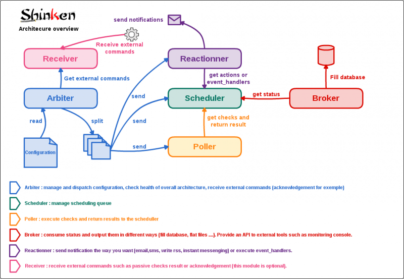
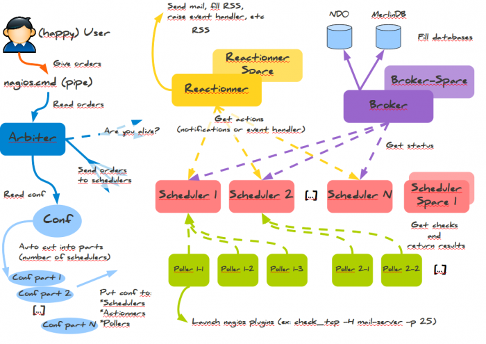
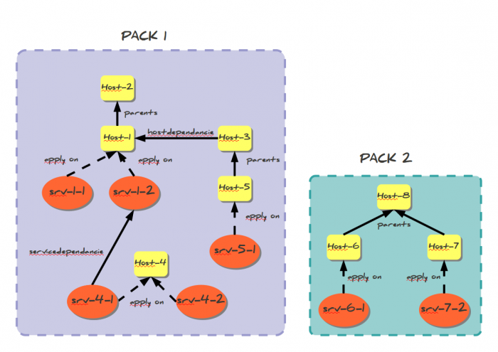
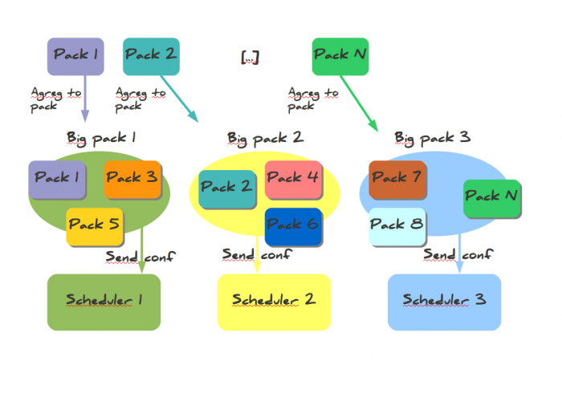
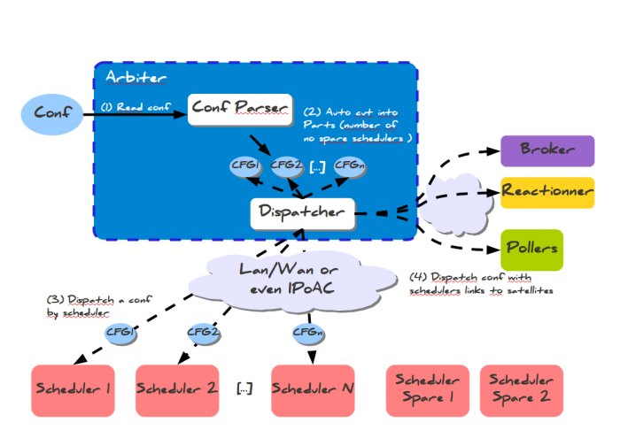
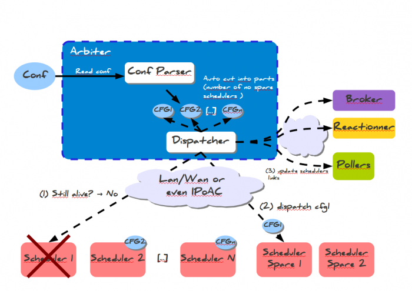
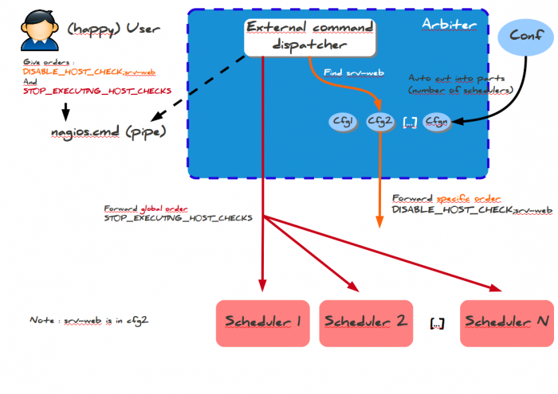
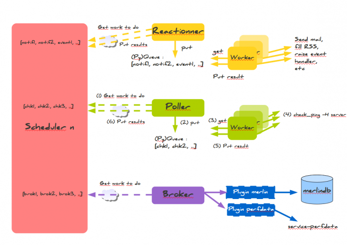

### Table des matières {.toggle}

-   [Fonctionnement de
    Shinken](shinken-work.html#fonctionnement-de-shinken)
    -   [Composants](shinken-work.html#composants)
        -   [Arbiter](shinken-work.html#arbiter)
        -   [Schedulers](shinken-work.html#schedulers)
        -   [Pollers](shinken-work.html#pollers)
        -   [Reactionners](shinken-work.html#reactionners)
        -   [Broker](shinken-work.html#broker)
    -   [Principe de
        fonctionnement](shinken-work.html#principe-de-fonctionnement)
        -   [Général](shinken-work.html#general)
        -   [La Répartition de
            Charge](shinken-work.html#la-repartition-de-charge)
        -   [La Haute
            Disponibilité](shinken-work.html#la-haute-disponibilite)
        -   [Exécution de commande
            Externe](shinken-work.html#execution-de-commande-externe)
        -   [Scheduler / Pollers / Reactionners /
            Broker](shinken-work.html#schedulerpollersreactionnersbroker)

Fonctionnement de Shinken {#fonctionnement-de-shinken .sectionedit1}
=========================

Page rédigée pour une version de Shinken 0.4.

Sur cette page, nous allons présenter et décrire comment Shinken
fonctionne, avec ses différentes interactions et architectures
(mono-serveur, distribuée). Le tout illustré par des schémas afin
d’essayer d’en faciliter la compréhension.

Sources : site et wiki officiels de
[Shinken](http://www.shinken-monitoring.org/ "http://www.shinken-monitoring.org/").

Cette page a été rédigée par :

  **Rôle**        **Nom**
  --------------- ------------------
  **Rédacteur**   Romuald FRONTEAU

Composants {#composants .sectionedit3}
----------

L’idée principale de Shinken est de découpler les différents rôles de
Nagios, un peu comme tente de le faire
[Merlin](../../../addons/merlin.html "nagios:addons:merlin") mais à un
stade encore plus poussé. Les différentes parties de l’application sont
les suivantes :

### Arbiter {#arbiter .sectionedit4}

Il est chargé de lire la configuration, de la découper en autant de
parties qu’il y a d’ordonnanceurs dans l’architecture, et leur envoyer
ainsi qu’aux autres éléments de l’architecture. Il est également garant
de la haute disponibilité : si un élément tombe, il envoi la
configuration qu’il avait en charge à un élément spare défini par
l’administrateur. Enfin, son dernier rôle est de lire les ordres des
administrateurs fournis dans le pipe nommé nagios.cmd et de les
transmettre à tous les ordonnanceur ou un seul suivant la demande.

### Schedulers {#schedulers .sectionedit5}

ils sont chargés d’ordonnancer les vérifications et de levers des
actions en cas de soucis avec ces dernières. Ils ne lancent pas
directement les vérifications ni les notifications. Il ne font que les
proposer dans des files d’attentes où vont venir piocher d’autres
éléments de l’architecture. L’administrateur peut en avoir autant qu’il
veut, l’Arbiter va découper la configuration en fonction du nombre de
schedulers définis.

### Pollers {#pollers .sectionedit6}

Ils ont pour rôle de lancer les sondes demandées par les ordonnanceurs
auquels ils vont piocher les demandes. Ils utilisent un realm de process
qui vont effectuer les vérifications. Une fois par seconde, ils vont
retourner les résultats aux ordonnanceurs pour que ces derniers puissent
effectuer des actions supplémentaires si besoin (comme une notification)
et réordonnancer les tests. Ils sont en première ligne pour les
performances, et l’administrateur peut en avoir autant qu’il en a
envi/besoin. Il peut également avoir des pollers sur GNU/Linux et
d’autres en Windows par exemple comme nous le verrons plus loin.

### Reactionners {#reactionners .sectionedit7}

Ils sont en charge de lancer les vérifications et les actions
correctrices. Ils sont découplés des pollers car il est plus pratique
d’avoir un unique reactionner (avec un spare) pour n’avoir qu’un seul
lieu où se remplissent les flux RSS d’alertes ou les autorisations SMTP
par exemple.

### Broker {#broker .sectionedit8}

Il est en charge de récupérer les informations d’états des ordonnanceurs
et de les traiter. Ces traitements sont fait par des modules. De
nombreux modules existent : un pour l’export en base merlin (MySQL), un
autre pour l’export des données de métrologie dans le fichier
service-perfdata, une présentation des données de style Livestatus, un
export en base Oracle ou encore un export en base CouchDB.

Principe de fonctionnement {#principe-de-fonctionnement .sectionedit9}
--------------------------

### Général {#general .sectionedit10}

Shinken utilise plusieurs daemons qui ont chacun leur rôle. Le maître de
tous est l’Arbiter qui lit la conf, la découpe et l’envoie vers ses
petits camarades. Bien sûr, les satellites comme les pollers ont besoin
de connaître l’adresse des ordonnanceurs. Ces derniers ont la
responsabilité de l’ordonnancement de la supervision. La perte d’un
d’entre eux peu être embêtante : une partie des hôtes ne seront plus
surveillés!

C’est pourquoi Shinken utilise un système de spare : des daemons seront
lancés mais non actifs. Ceci ressemble un peu à du RAID. Ils ne se
verront affecter une configuration, et donc une responsabilité, que si
un daemon maître meurt. Typiquement un placement de ces spares sur la
machine de l’Arbiter peut être utile, il y a peu de chance qu’elle perde
le lien avec elle même… (mais bon avec les réseau, faut jamais faire des
suppositions ….)

Cette architecture est pleinement modulaire et scalable et ne possède
pas de point de contention car l’Arbiter n’a pas grand chose à faire a
priori, comme pour le broker ou le reactionner. Les deux éléments
chargés sont les pollers et les ordonnanceurs, qui sont alignables à
merci, et ce sans effort pour l’administrateur (il ne manquerait plus
que ça!).

Cette architecture peut se résumer en un diagramme :

Sur le schéma ci-dessus,

1.  l’administrateur rentre sa configuration sur l’arbiter, celui-ci va
    alors découper automatiquement la configuration et la pousser sur
    chacun des schedulers.
2.  Les Schedulers vont planifier leurs contrôles en fonction de la
    configuration qu’ils ont reçus.
3.  Les Pollers vont aller chercher les contrôles qu’ils doivent
    réaliser, les exécuter et retourner les résultats aux Pollers.
4.  Le Reactionner va déclencher une action (alerte SMS, Jabber, script
    pro-actif, …) en focntion des résultats des contrôles.
5.  Le Broker va stocker les données collectées selon les modules (NDO,
    LiveStatus, Merlin, CouchDB, …) qui ont été choisis.

### La Répartition de Charge {#la-repartition-de-charge .sectionedit11}

Shinken est capable de découper et pousser la configuration sur les
Schedulers automatiquement. Actuellement, quand il s’agissait de
réaliser de la répartition de charge, l’administrateur devait respecter
les notions d’héritage afin de réaliser ces “packs” de configuration à
déposer sur chacun de ses collecteurs. Avec Shinken, plus besoin de se
tracasser dans ce découpage à s’arracher les cheveux., Shinken le fait
lui même.

#### Découpage {#decoupage}

##### Création des packs {#creation-des-packs}

Shinken prend en compte 2 éléments pour réaliser son découpage : les
hôtes et les services. Les services peuvent être liés à leurs hôtes des
manières suivantes :

-   La relation Père / Enfant
-   La dépendance d’hôtes
-   La dépendance de services

Voici un exemple de découpage, le but de Shinken est de pouvoir créer
des “packs” indépendants les uns des autres pour éviter tous problèmes
en cas de crash d’un élément de la supervision :

##### Aggrégation des packs {#aggregation-des-packs}

L’Arbiter va regrouper des packs afin de créer des “fragments” de la
configuration globale dépendant de la variable de pondération que vous
avez déclaré comme représenté par le schéma ci-dessous.

##### L'envoi des configurations {#l-envoi-des-configurations}

Regardons un peu le dispatching des configurations vers les
ordonnanceurs et ce qui se passe lorsqu’un ordonnanceur n’est plus
disponible Dispatch des configurations.

L’arbiter lit la configuration globale de l’administrateur, il la coupe
en morceaux (autant que l’ordonnanceurs NON spare). Le dispatcheur (une
Classe dans l’Arbiter), l’envoi vers les ordonnanceurs. Puis il créé une
configuration particulière avec juste les adresses des ordonnanceurs à
destinations des satellites comme les pollers ou le broker. Et hop, tout
le monde est content, et se connecte entre eux.

Ca se résume en un diagramme :

### La Haute Disponibilité {#la-haute-disponibilite .sectionedit12}

Actuellement en supervision, les éléments hôtes ou services sont
rattachés à un collecteur physique. On peut le voir dans des solutions
comme Nagios, Nagios avec un Centreon, Zabbix, … Lors d’un crash d’un de
vos collecteurs, l’administrateur doit le plus rapidement basculer les
éléments du collecteur en anomalies vers son secours. Cette opération
demande du temps et est assez lourde à gérer. Dans l’exemple de Nagios,
il faut que l’arbre des héritages soit respecté sinon vos collecteurs
tomberont en erreur car une partie de la configuration n’y sera pas
déployé.

Dans Shinken, l’Arbiter contrôle continuellement l’état de santé de
votre architecture de supervision (Broker, Reactionner, Schedulers,
Pollers). Lorsqu’un de vos Scheduler tombe, l’Arbiter le détecte et va
automatiquement redécouper de nouveau “fragments” de configuration afin
de les redéployer sur les autres Schedulers ou le spare que vous avez
définit.

### Exécution de commande Externe {#execution-de-commande-externe .sectionedit13}

Regardons désormais comment se passe l’envoi de commandes externes par
le client. Dans la philosophie Shinken, celui-ci n’a besoin d’envoyer
ses ordres qu’à un seul endroit, à l’Arbiter.

Il faut séparer les commandes en deux catégories :

-   les commandes globales à tous les ordonnanceurs;
-   les commandes spécifiques à un élément (host/service/contact).

En fait une partie des deuxièmes commandes est en fait globale : les
contacts sont partout et les commandes les concernant sont envoyées
partout. Pour chaque type de commande Shinken sait s’il elles sont
globales ou non. Pour les globales, il ne se pose pas de question, il
envoie à tout le monde et voila.

Pour les spécifiques, il faut qu’il trouve quel est l’ordonnanceur en
question. Il cherche pour cela dans les N configurations l’élément
impacté (hôte ou service). Une fois trouvé, il sait à qui envoyer
l’ordre et il le fait.

Une fois les ordres reçus, les ordonnanceurs n’ont plus qu’à les
appliquer.

Aller hop, le désormais classique diagramme :

### Scheduler / Pollers / Reactionners / Broker {#schedulerpollersreactionnersbroker .sectionedit14}

Ces 3 éléments interagissent continuellement avec le Scheduler. Il est
important de bien comprendre le rôle de chacun.

Le schéma ci-dessous illustre comment le Scheduler, le Poller, le
Reactionner et le Broker communiquent ensemble.

#### Scheduler

Le Scheduler est l’élément de la supervision à recevoir la configuration
et planifier une queue de traitement. D’après le schéma ci-dessus, le
Scheduler s’organise afin de pouvoir interagir avec les autres éléments.
Le Scheduler utilise 3 queues de traitement qu’on pourrait nommer :

-   La Queue des “actions” ou des “contrôles” (communication avec le
    Poller)
-   La Queue des “réactions” (communication avec le Reactionner)
-   La Queue du “stockage” (communication avec le Broker)

#### Reactionner

Nous allons décrire le schéma ci-dessus par étape :

1.  Le Reactionner va interroger le Scheduler afin de connaître les
    actions qu’il va devoir réaliser en fonction du résultat des
    contrôles.
2.  Le Reactionner place ces actions dans une queue de traitement
3.  Les sous-processus du nom de “Workers” vont interroger cette queue
4.  Les “Workers” vont exécuter les notifications ou Eventhandlers
5.  Le résultat de la notifcation va être restituer au Reactionner
6.  Le Reactionner va restituer le résultat au Scheduler

#### Poller

Nous allons décrire le schéma ci-dessus par étape :

1.  Le Poller va interroger le Scheduler afin de connaître les contrôles
    qu’il va devoir effectuer
2.  Le Poller place ces actions dans une queue de traitement.
3.  Les sous-processus du nom de “Workers” vont interroger cette queue
4.  Les “Workers” vont exécuter le contrôle.
5.  Le résultat du contrôle va être restituer au Poller
6.  Le Poller va restituer le résultat au Scheduler

#### Broker {#broker1}

Nous allons décrire le schéma ci-dessus par étape :

1.  Le Broker va interroger le Scheduler afin de connaître les données
    qui va devoir stocker
2.  Le Broker envoie ces données vers les modules de Stockage (Plugin
    Merlin, perfdata, NDO, LiveStatus, …)
3.  Les modules de Stockage injectent les données dans la source de
    stockage (Base de données, socket UNIX, fichier plat, …)

