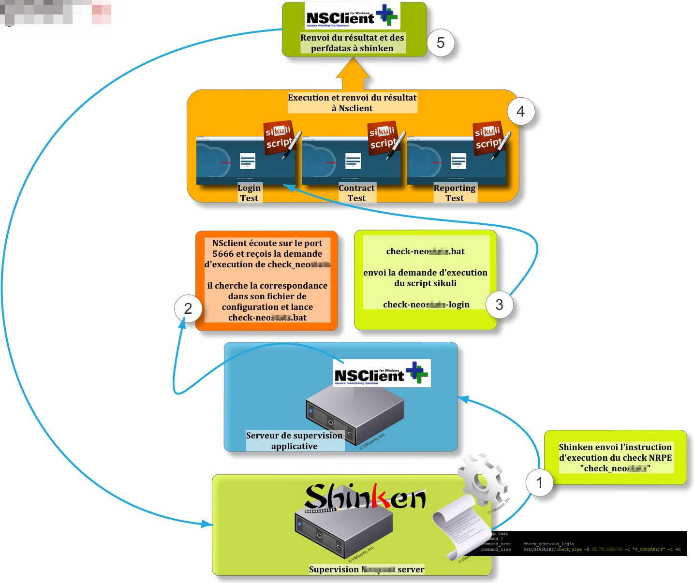
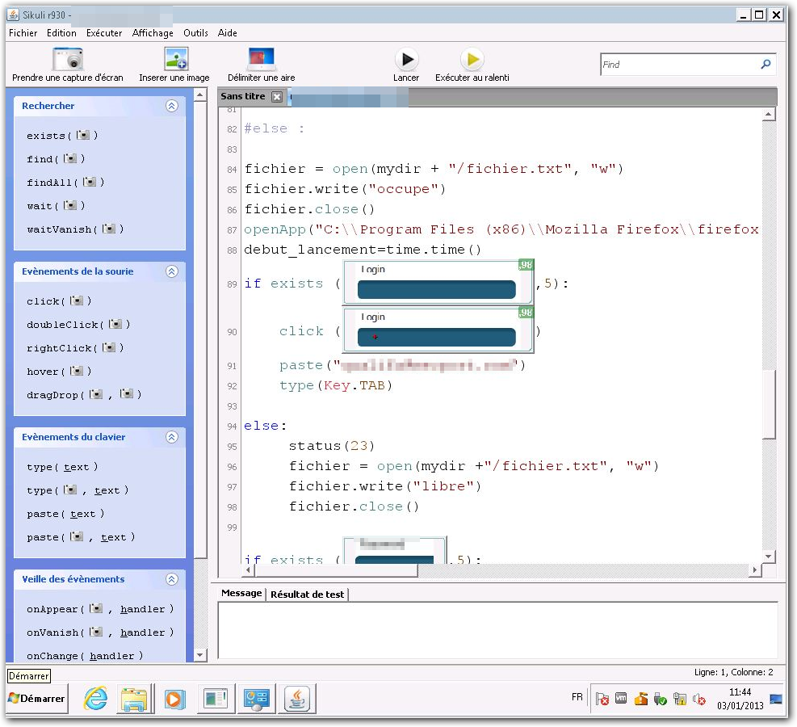
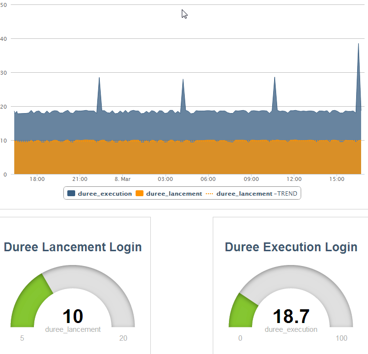

### Table des matières {.toggle}

-   [Supervision du ressenti utilisateur avec
    Sikuli](start.html#supervision-du-ressenti-utilisateur-avec-sikuli)
-   [Introduction](start.html#introduction)
-   [Topologie de
    fonctionnement](start.html#topologie-de-fonctionnement)
-   [Comment ca marche ????](start.html#comment-ca-marche)
    -   -   [NRPE et SHINKEN](start.html#nrpe-et-shinken)
        -   [Installation](start.html#installation)
        -   [Configuration de
            Shinken](start.html#configuration-de-shinken)

Supervision du ressenti utilisateur avec Sikuli {#supervision-du-ressenti-utilisateur-avec-sikuli .sectionedit1}
===============================================

  **Rôle**       **Nom**
  -------------- ----------
  **Créateur**   Floppy84

Introduction {#introduction .sectionedit3}
============

La supervision applicative Sikuli consiste à venir tester le ressenti
utilisateur sur les applications métiers. Pour cela un script est
charger de mener des actions de tests tels que le ferait un user devant
son écran.

C’est assez simple en soit.

Il existe un outil appelé SIKULI qui est capable de faire de la
reconnaissance screen “ecran”. Cet outil permet de développer des
scripts permettant de mener des actions de cliques, de saisie de texte,
de reconnaissance d’affichage etc … en bref tout ce qu’un user pourrait
faire est scriptable dans SIKULI ” et super facilement”.

L’avantage c’est que Sikuli permet de faire des scripts assez facilement
m\^me pour des personnes comme moi (non dev) l’outil permet de scripter
en respectant une algorithmie simple et des captures d’écrans.

Topologie de fonctionnement {#topologie-de-fonctionnement .sectionedit4}
===========================

Comment ca marche ???? {#comment-ca-marche .sectionedit5}
======================

### NRPE et SHINKEN {#nrpe-et-shinken .sectionedit6}

Une fois ce script développé il convient de l’interfacer avec
**Shinken**.

Pour cela on utilise check\_nrpe.

Nrpe est un agent responsable de réaliser les actions de vérification à
la place de snmp. Nrpe permet de soulager la supervision et de faire
faire les actions de vérification par le serveur distant.

En gros le fonctionnement est le suivant:

Le poller de la supervision va lancer un check\_nrpe sur la machine
distante avec l’instruction du script à faire executer par l’agent NRPE
(Par exemple Check\_Neo). Ensuite NRPE prend le relais et vient exécuter
le script demandé check\_neo qui correspond dans le fichier de
configuration NSc.ini à check\_neo.bat Dans ce fichier .bat il y a les
instructions d’éxécution du script SIKULI

“C:\\Program Files (x86)\\Java\\jre6\\bin\\java” -jar “C:\\Program Files
(x86)\\Sikuli X\\sikuli-ide.jar” -r “D:\\neo-login.sikuli”

### Installation {#installation .sectionedit7}

#### Pré-requis {#pre-requis}

-   Une VM Windows XP ou 2008 serveur ou Windows 7
-   Installer JAVA 6 ou 7
-   Installer Sikuli
    [http://www.sikuli.org](http://www.sikuli.org "http://www.sikuli.org")
-   Installer NSCLIENT++

#### Configuration serveur Applicatif

##### Configuration de NSclient++

Une fois installer, sachez qu’il ne faut pas lancer le service
nsclient++ sinon les instructions ne parviennent pas jusqu’a
l’interpreteur. Ensuite il vous faudra configuer nsclient en éditant le
fichier NSC.INI

c:\\Program Files\\NSClient++\\

Il faut ajouter tous les modules suivant dans le fichier en tout début:

~~~
 [modules]
 NRPEListener.dll
 NSClientListener.dll
 FileLogger.dll
 CheckSystem.dll
 CheckDisk.dll
 CheckEventLog.dll
 CheckHelpers.dll
 CheckExternalScripts.dll
~~~

Il vous faudra définit la machine ayant droit a exécuter le script

~~~
 allowed_hosts=monserveurdesup
~~~

Dans la section NRPE il vous faudra editer:

Le port NRPE :

~~~
 [NRPE]
 ;# NRPE PORT NUMBER
 ; This is the port the NRPEListener.dll will listen to.
 port=5666
 string_lenght=18096
 Le timeout:
 command_timeout=180
 socket_timeout=180
 
 
~~~

Dans le section external script il vous faudra y ajouter les commandes a
exécuter par NRPE.

~~~
 [External Scripts]
 command_timeout=120
 check_neo=scripts\check_neo.bat
~~~

Ici on voit que la commande check\_neo execute le script check\_neo.bat
placé dans c:\\Program Files\\NSClient++\\scripts\\

Il faudra donc installer les scripts d’exécution .BAT et d’appel dans le
dossier scripts

~~~
  c:\Program Files\NSClient++\scripts\
~~~

Exemple de contenu du fichier d’exécution :

“C:\\Program Files (x86)\\Java\\jre6\\bin\\java” -jar “C:\\Program Files
(x86)\\Sikuli X\\sikuli-ide.jar” -r “D:\\neo-login.sikuli”

Seul le chemin du script Sikuli doit être modifié.
“D:\\neo-login.sikuli”

Dans la logique Shinken appel check\_nrpe =⇒ avec l’instruction de
lancer la commande check\_neo.

Ensuite Nrpe reçoit l’instruction et sait qu’il faut qu’il lance la
commande check\_neo.

Il va donc chercher dans le fichier de conf **NSC.INI** la ligne
correspondant à la commande Check\_neo.

Il sait de ce fait qu’il faut qu’il lance scripts\\check\_neo.bat

Ce .bat lance le scipt Sikuli D:\\neo-login.sikuli qui est responsable
du test de l’application.

Une fois le test applicatif terminé sikuli renvoi l’information d’état
et de performance à NRPE qui le retourne à son tour à Nagios.

!!!!!!!!!!!!!!!!!!!!! ATTENTION
!!!!!!!!!!!!!!!!!!!!!!!!!!!!!!!!!!!!!!!!!!!

Il est nécessaire de faire exécuter l’application Nsclient++(win32,test)
Il faut donc prévoir de mettre l’exécutable dans le démarrage système.

Ne jamais démarrer Nsclient en tant que service

#### Exemple de scripts

Ne vous arrêtez pas à la longueur du script, c’est assez simple et mon
script est un socle sur lequel vous pouvez vous reposer pour dev votre
script.

Ici il s’agit d’un script qui fait juste une action de login sur mon
portail en gros il vous suffit de modifier les screenshots pour que ca
fonctionne chez vous sur votre site

évidemment ici vous ne voyez pas mes screenshots il apparaissent
uniquement dans l’interface de dev de Sikuli

Copiez le contenu de mon script dans sikuli et remplacez chacune de mes
captunes .png par les vôtres ” avec l’outil photo de sikuli”

[test.doc](../../../../assets/media/sikuli/eue/test.doc "sikuli:eue:test.doc")

\#Fonction de controle de statutn Cette section permet à shinken
d’interpréter les résultats que sikuli lui renvoi avec les perfdatas

~~~
 def status(err_code):
 if err_code == 0:
     fin_test=time.time()
     difftime="%.1f"%(fin_test-debut_test)
     logfile.write(time.strftime('%d/%m/%y %H:%M:%S',time.localtime())+" [INFO] OK: Durée d'execution du test =>"+str(difftime)+"s"+el)
     logfile.close
     fichier = open(mydir +"/fichier.txt", "w")
     closeApp ("Mozilla Firefox")
     fichier.write("libre\n")
     fichier.close()
     print ("OK:"+"|"+"duree_lancement="+str(difflancement)+" duree_execution="+str(difftime))
     sys.exit(err_code)
     exit(err_code)
elif err_code == 1:
     fin_test=time.time()
     difftime="%.1f"%(fin_test-debut_test)
     logfile.write(time.strftime('%d/%m/%y %H:%M:%S',time.localtime())+" [INFO] Warning: Superpostion du scripts de test =>"+str(difftime)+"s"+" erreur N°"+str(err_code)+el)
     logfile.close
     print ("WARNING:"+"|"+str(difftime))
     sys.exit(1)
     exit(err_code)
else: 
      fin_test=time.time()
      difftime="%.1f"%(fin_test-debut_test)
      closeApp("Mozilla Firefox")
      print ("CRITICAL:"+"|"+str(difftime))
      logfile.write(time.strftime('%d/%m/%y %H:%M:%S',time.localtime())+" [ERROR] CRITICAL: Durée d'execution du test =>"+str(difftime)+"s"+" erreur N°"+str(err_code)+el)
      logfile.close
      fichier = open(mydir + "/fichier.txt", "w")
      fichier.write("libre\n")
      fichier.close()
      sys.exit(2)
      closeApp ("Mozilla Firefox")
      exit(err_code)
~~~

### Configuration de Shinken {#configuration-de-shinken .sectionedit8}

Dans Shinken il suffit de configurer un nouveau service sur un hote
dummy virtuel puis d’y reporter l’équivalent des informations suivantes:

define service{

~~~
 service_description    neo-login-Sikuli
 use                    generic-service
 host_name              Neo-Application
 check_command          check_neo_login
 business_impact        2
 normal_check_interval  11
 service_dependencies   mamachinedesupervisionapplicative,nrpe
 retry_interval           1                      ; Re-check the service every one minutes until a hard state can be determined
 max_check_attempts       4
 }
~~~

Il faudra aussi creer dans le fichier command.cfg la commande en
question :

~~~
define command {
     command_name     check_neo_login
     command_line     $PLUGINSDIR$/check_nrpe -H ipdemamachinesupapplicative -c "$check_neo" -t 120}

Après l'option -H il faut spécifier l'ip de la vm supervision applicative et après le -c le nom de la commande que vous avez rentré dans le fichier NSC.INI et qui fait référence à votre script ici c'est check_neo
~~~

#### Ordonnancement

Les scripts de check applicatif sont ordonnancés par Shinken. Seulement
il peut arriver que Shinken exécute en même temps plusieurs scripts
lorsque se produit une erreur de check ou autre ” rechargement de sup ou
forcage ”

Pour éviter tout plantage du serveur de test applicatif, il y a des
locks qui sont placés dans les scripts Sikuli pour éviter la
superposition des checks.

Sur la supervision applicative exemple ces fichiers se situent sur le
bureau du serveur, dans le dossier Sikuli. Il existe deux fichiers :

Le fichier =⇒ fichier.txt =⇒ qui contient l’état du serveur applicative
( libre ou occupe)

le fichier =⇒ lock.txt =⇒ qui contient une série de chiffres (3 ou 33 )
=⇒ ce fichier sert à certains script à vérifier depuis combien de temps
le serveur est verrouillé ( en status occupe)

Si vous voulez impressionner les patrons c’est facile =⇒ il suffit
d’ajouter à votre supervision Applicative le super Hyperviseur Canopsis
pour faire de super graph de reporting

Cet article est partagé et peut être éditer par vos soins pour y ajouter
vos petites astuces ou correction de scripts. Vous pouvez me contacter
si besoin sur le forum “floppy84”.
