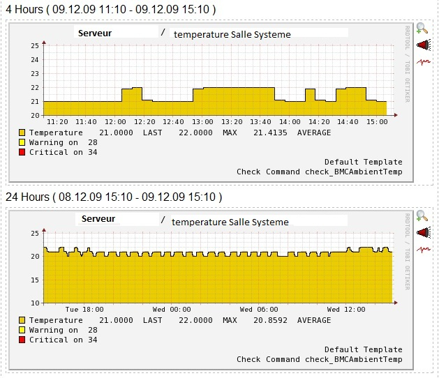

### Table des matières {.toggle}

-   [Supervision Hardware IPMI](ipmi.html#supervision-hardware-ipmi)
    -   [Commandes disponibles](ipmi.html#commandes-disponibles)
    -   [La commande sdr](ipmi.html#la-commande-sdr)
        -   [Utilisation de sdr avec
            cache](ipmi.html#utilisation-de-sdr-avec-cache)
        -   [Utilisation de sdr comme simple
            utilisateur](ipmi.html#utilisation-de-sdr-comme-simple-utilisateur)
        -   [Ecriture du plugin pour la
            température](ipmi.html#ecriture-du-plugin-pour-la-temperature)
        -   [Intégration à Nagios](ipmi.html#integration-a-nagios)

Supervision Hardware IPMI {#supervision-hardware-ipmi .sectionedit1}
=========================

L’Interface de gestion intelligente de matériel, (ou IPMI, Intelligent
Platform Management Interface) est un ensemble de spécifications
d’interfaces communes avec du matériel informatique (principalement des
serveurs) permettant de surveiller certains composants (ventilateur,
sonde de température, …). Les principaux constructeurs de serveurs
implémentent tous ce standard.

Pour la supervision, **IPMI est intéressant car il permet de pouvoir
contrôler tous les aspects matériels d’un serveur sans installer le
moindre agent supplémentaire**. Il est en général possible d’activer les
fonctions IPMI sur un serveur via le BIOS ou via le logiciel de gestion
du constructeur.

L’ensemble du document suivant a été rédigé avec un serveur Dell comme
cible mais peut être transposé pour tous les constructeurs respectant le
standard. Pour interroger ce serveur, c’est
[ipmitool](http://ipmitool.sourceforge.net/ "http://ipmitool.sourceforge.net/")
pour Linux qui a été utilisé sur le serveur Nagios. Il convient de
préparer votre serveur (celui que vous voulez superviser) à accepter les
requêtes distantes IPMI. Sur Dell, il faut activer le mode BMC sur DRAC
et soit dédier une interface réseau soit en partager une pour ce type de
requêtes. Si vous ne souhaitez pas ^[1)](ipmi.html#fn__1)^ travailler
avec le compte root et des privilèges Administrateur sur IPMI, il faut
également créer un nouvel utilisateur de type USER (utilisateur que nous
appelons nagios dans ces exemples).

Commandes disponibles {#commandes-disponibles .sectionedit2}
---------------------

Les commandes disponibles via IPMI

-   *raw* : Send a RAW IPMI request and print response
-   *lan* : Configure LAN Channels
-   *chassis* : Get chassis status and set power state
-   *event* : Send events to MC
-   *mc* : Management Controller status and global enables
-   *sdr* : Print Sensor Data Repository entries and readings
-   *sensor* : Print detailed sensor information
-   *fru* : Print built-in FRU and scan for FRU locators
-   *sel* : Print System Event Log (SEL)
-   *pef* : Configure Platform Event Filtering (PEF)
-   *sol* : Configure and connect IPMIv2.0 Serial-over-LAN
-   *tsol* : Configure and connect Tyan IPMIv1.5 Serial-over-LAN
-   *isol* : Configure Intel IPMIv1.5 Serial-over-LAN
-   *user* : Configure Management Controller users
-   *channel* : Configure Management Controller channels
-   *session* : Print session information
-   *sunoem* : Manage Sun OEM Extensions
-   *exec* : Run list of commands from file
-   *set* : Set runtime variable for shell and exec

Pour la supervision, c’est surtout la commande ‘sdr’ qui est utlisée.
Cette commande nécessite uniquement des privilèges d’utilisateur sur la
carte IPMI du serveur supervisé.

La commande sdr {#la-commande-sdr .sectionedit3}
---------------

Il existe un grand nombre de sondes matérielles qu’il est possible
d’interroger avec la commande IPMI sdr. En voici une liste retournée par
notre serveur Dell.

~~~
Types de sondes disponibles via IPMI

    Temperature                 Voltage                  
    Current                     Fan                      
    Physical Security           Platform Security        
    Processor                   Power Supply             
    Power Unit                  Cooling Device           
    Other                       Memory                   
    Drive Slot / Bay            POST Memory Resize       
    System Firmwares            Event Logging Disabled   
    Watchdog                    System Event             
    Critical Interrupt          Button                   
    Module / Board              Microcontroller          
    Add-in Card                 Chassis                  
    Chip Set                    Other FRU                
    Cable / Interconnect        Terminator               
    System Boot Initiated       Boot Error               
    OS Boot                     OS Critical Stop         
    Slot / Connector            System ACPI Power State  
    Watchdog                    Platform Alert           
    Entity Presence             Monitor ASIC             
    LAN                         Management Subsystem Health
    Battery                     Session Audit            
    Version Change              FRU State 
~~~

Le moyen le plus simple d’utiliser la commande sdr la première fois est
de l’appeler avec le minimum d’options et arguments comme ceci

~~~
/usr/bin/ipmitool -I lanplus -H ip_address -U utilisateur -P passe sdr list all
~~~

Cette commande peut être à la fois lancé en local ou à distance. C’est
cette variante qui est utlisée.

-   L’option -I précise le type de requête entre lan, lanplus et open.
    Comme notre serveur possède la version 2.0 du protocole, il est
    possible d’utiliser ici lanplus.
-   -H l’adresse IP ou nom FQDN du serveur à interroger.
-   -U l’utilisateur
-   -P le mot de passe de cet utilisateur.

La sortie de “sdr list all” est la plus complète qui soit et vous pouvez
en voir un exemple avec ce [fichier de
sortie](../../../assets/media/supervision/dell-ipmi-list-all.txt.zip "supervision:dell-ipmi-list-all.txt.zip").
Il faut noter l’option '-c’ qui permet d’avoir une sortie de cette liste
formatée en CSV, très facile à parcourir ensuite.

~~~
/usr/bin/ipmitool -c -I lanplus -H ip_address -U utilisateur -P passe sdr list all
~~~

nous donne cet extrait de sortie ou ce
[fichier](../../../assets/media/supervision/list-all.csv.zip "supervision:list-all.csv.zip").

~~~
Temp,,,ns
Temp,,,ns
Temp,,,ns
Temp,,,ns
Ambient Temp,26,degrees C,ok
CMOS Battery,10h,ok,7.1,
ROMB Battery,11h,ns,26.3,No Reading
VCORE,12h,ok,3.1,State Deasserted
VCORE,13h,ok,3.2,State Deasserted
CPU VTT,16h,ok,7.1,State Deasserted
1.5V PG,17h,ok,7.1,State Deasserted
1.8V PG,18h,ok,7.1,State Deasserted
3.3V PG,19h,ok,7.1,State Deasserted
5V PG,1Ah,ok,7.1,State Deasserted
Backplane PG,1Dh,ok,7.1,State Deasserted
Flexbay PG,1Fh,ok,7.1,State Deasserted
Linear PG,20h,ok,7.1,State Deasserted
0.9V PG,21h,ok,7.1,State Deasserted
1.5V ESB2 PG,22h,ok,7.1,State Deasserted
0.9V Over Volt,23h,ok,7.1,State Deasserted
CPU Power Fault,24h,ok,7.1,State Deasserted
FAN 1 RPM,2775,RPM,ok
FAN 2 RPM,2625,RPM,ok
FAN 3 RPM,2700,RPM,ok
FAN 4 RPM,2700,RPM,ok
FAN 5 RPM,2700,RPM,ok
FAN 6 RPM,2700,RPM,ok
FAN 7 RPM,,,ns
FAN 8 RPM,,,ns
Presence,50h,ok,3.1,Present
~~~

Voici quelques commandes pour relever des compteurs “classiques”

#### Température {#temperature}

~~~
/usr/bin/ipmitool -c -I lanplus -H ip_address -U utilisateur -P passe sdr type "Temperature"

Temp             | 01h | ns  |  3.1 | Disabled
Temp             | 02h | ns  |  3.2 | Disabled
Temp             | 05h | ns  | 10.1 | Disabled
Temp             | 06h | ns  | 10.2 | Disabled
Ambient Temp     | 08h | ok  |  7.1 | 24 degrees C
CPU Temp Interf  | 76h | ns  |  7.1 | Disabled
~~~

#### Ventilateurs

~~~
/usr/bin/ipmitool -c -I lanplus -H ip_address -U utilisateur -P passe sdr type "Fan"

FAN 1 RPM        | 30h | ok  |  7.1 | 2400 RPM
FAN 2 RPM        | 31h | ok  |  7.1 | 2625 RPM
FAN 3 RPM        | 32h | ok  |  7.1 | 2550 RPM
FAN 4 RPM        | 33h | ok  |  7.1 | 2550 RPM
FAN 5 RPM        | 34h | ok  |  7.1 | 2475 RPM
FAN 6 RPM        | 35h | ok  |  7.1 | 2550 RPM
FAN 7 RPM        | 36h | ns  |  7.1 | Disabled
FAN 8 RPM        | 37h | ns  |  7.1 | Disabled
Fan Redundancy   | 75h | ok  |  7.1 | Fully Redundant
~~~

#### État RAID Disques {#etat-raid-disques}

~~~
/usr/bin/ipmitool -c -I lanplus -H ip_address -U utilisateur -P passe sdr type "Drive Slot / Bay"

Drive            | 80h | ok  | 26.1 | Drive Present
~~~

### Utilisation de sdr avec cache {#utilisation-de-sdr-avec-cache .sectionedit4}

Le problème de cette commande, surtout avec “list all” est son temps
d’exécution qu’il est possible de grandement amélioré en utilisant les
fonctions de cache disponibles comme ci-dessous.

Il faut d’abord générer un fichier de cache

~~~
/usr/bin/ipmitool -I lanplus -H ip_address -U utilisateur -P passe sdr dump ipmi.cache
~~~

ipmi.cache est le fichier de cache qui va être généré dans le répertoire
où est appelé la commande (pwd).

Ce fichier permet alors d’accélérer toutes les requêtes suivantes comme
le prouve ce petit tableau

  Temp Exécution   Sans cache   Avec cache
  ---------------- ------------ ------------
  real             0m7.325s     0m1.598s
  user             0m0.020s     0m0.016s
  sys              0m0.028s     0m0.012s

Il suffit maitenant d’ajouter l’option -s et le nom de fichier de cache
à notre commande

~~~
/usr/bin/ipmitool -S ipmi.cache -I lanplus -H ip_address -U utilisateur -P passe
~~~

### Utilisation de sdr comme simple utilisateur {#utilisation-de-sdr-comme-simple-utilisateur .sectionedit6}

Si vous ne précisez rien sur la ligne de commande, ipmitool se connecte
toujours sur le serveur à requêter avec des privilèges d’administrateur,
ce qui n’est pas souhaité pour juste relever des indicateurs. Il faut
donc explicitement ajouter l’option -L USER pour se connecter comme tel.

~~~
/usr/bin/ipmitool -L USER -S ipmi.cache -I lanplus -H ip_address -U utilisateur -P passe
~~~

C’est tout pour le moment. Peut-être une suite à donner avec
l’intégration à Nagios et l’écriture d’un plugin ?

### Ecriture du plugin pour la température {#ecriture-du-plugin-pour-la-temperature .sectionedit7}

Bon, je me lance pour l’écriture du plugin (en bash). Pour pouvoir
utiliser le plugin, il faut tout d’abord avoir créer un utilisateur de
type “USER” comme dans la partie juste en dessus sur les serveurs à
surveiller.

Aller sur votre serveur nagios et taper : ***\# vi
/usr/local/nagios/libexec/check\_temperature***

~~~
#!/bin/bash

HOST2=$1
TempWarning=$2
TempCritical=$3

if [ $# -lt 3 ]
then echo "utilisation : ./check_temperature @IpHost TempWarning TempCritical"
exit 3
fi

AMBIENT1=`ipmitool -L USER -H $HOST2 -U utilisateur -Ppasse sensor get "Ambient Temp"`
AMBIENT2=`echo ${AMBIENT1} | awk '{print $(22)}'`

if [[ $AMBIENT2 -ge ${TempCritical} ]]
then echo "Temperature Critical = $AMBIENT2|Temperature = $AMBIENT2;${TempWarning};${TempCritical}"
exit 2

elif [[ ${AMBIENT2} -lt ${TempWarning} ]]
then echo "Temperature Ok = $AMBIENT2|Temperature = $AMBIENT2;${TempWarning};${TempCritical}"
exit 0

else echo "Temperature warning = $AMBIENT2|Temperature = $AMBIENT2;${TempWarning};${TempCritical}"
exit 1
fi
~~~

Voilà c’est terminé pour le plugin, c’est pas sorcier non ?

### Intégration à Nagios {#integration-a-nagios .sectionedit8}

Dans cette 3eme partie, il faut que nagios + pnp soient installés.

-   Ajout de quelques lignes dans le commands.cfg :

***\# vi /usr/local/nagios/etc/objects/commands.cfg***

~~~
define command{
        command_name    check_temperature
        command_line    $USER1$/check_temperature $HOSTADDRESS$ $ARG1$ $ARG2$
}
~~~

-   Exemple d’un host avec le service check\_temperature. Ajouter un
    host :

***\# vi /usr/local/nagios/etc/hosts.cfg***

~~~
define host{
        use             linux-server
        host_name       serveur
        alias           serveur
        address         192.168.0.1
}

define service{
        use                     generic-service
        host_name               serveur
        service_description     Temperature Salle Systeme
        check_command           check_temperature!28!34
 action_url      /nagios/pnp/index.php?host=$HOSTNAME$&srv=$SERVICEDESC$
}
~~~

On reçoit une alerte de type Warning lorsque la température atteint 28°
et de type Critical losrque la température atteint 34°. Voici un petit
aperçu :

^[1)](ipmi.html#fnt__1)^ c’est toujours mieux
