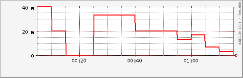
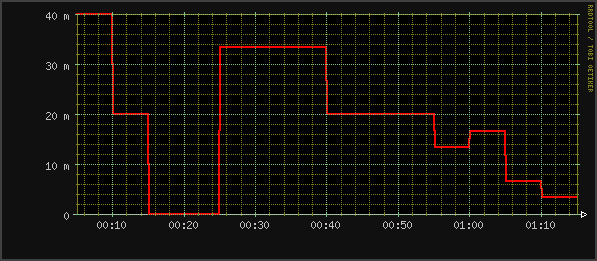
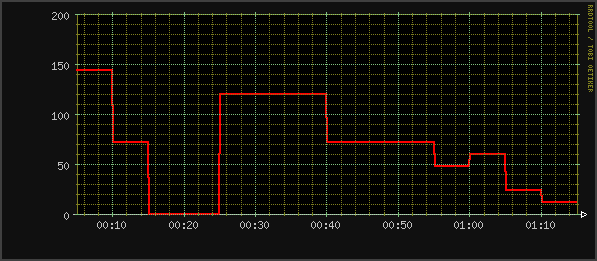
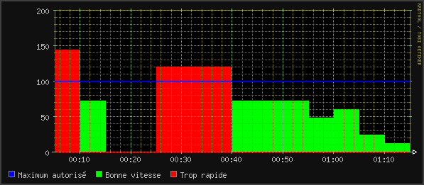
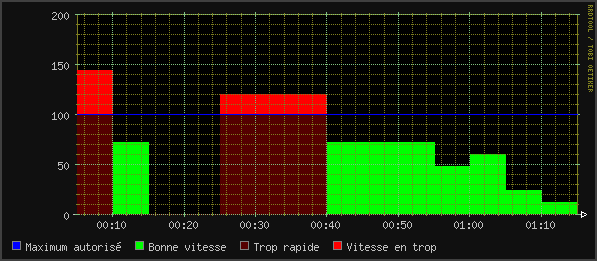

### Table des matières {.toggle}

-   [RRDTool](rrdtool.html#rrdtool)
    -   [Qu'est-ce que RRDTool ?](rrdtool.html#qu-est-ce-que-rrdtool)
        -   [Que permet de faire RRDTool
            ?](rrdtool.html#que-permet-de-faire-rrdtool)
        -   [Pourquoi RRDTool, et pas MRTG
            ?](rrdtool.html#pourquoi-rrdtool-et-pas-mrtg)
        -   [Installer RRDTool](rrdtool.html#installer-rrdtool)
    -   [Premier pas avec
        RRDTool](rrdtool.html#premier-pas-avec-rrdtool)
        -   [Créer une première base
            RRDTool!](rrdtool.html#creer-une-premiere-base-rrdtool)
        -   [Première récupération des
            données](rrdtool.html#premiere-recuperation-des-donnees)
        -   [Les différents types de données gérés par
            RRDTool](rrdtool.html#les-differents-types-de-donnees-geres-par-rrdtool)
        -   [Un peu de graphique!](rrdtool.html#un-peu-de-graphique)

RRDTool {#rrdtool .sectionedit1}
=======

Cette page est une reprise intégrale de celle de [Laurent
Coustet](http://www.ed.zehome.com/?page=rrdtool "http://www.ed.zehome.com/?page=rrdtool").
Elle est un point de départ intéressant et sera complétée au fur et à
mesure.

Qu'est-ce que RRDTool ? {#qu-est-ce-que-rrdtool .sectionedit2}
-----------------------

RRDTool, ou plus exactement Round Robin Database Tool. Pour la
signification exacte de Round Robin, referez vous à la [documentation
Officielle](http://ee-staff.ethz.ch/~oetiker/webtools/rrdtool/ "http://ee-staff.ethz.ch/~oetiker/webtools/rrdtool/"),
car cette définition n’entre pas dans le cadre de cet article, avant
tout pratique! RRDTool, c’est une suite d’outils permettant de stocker
des données, sous un format ”.rrd”, de les restaurer, d’afficher un
graphique avec ces données…

### Que permet de faire RRDTool ? {#que-permet-de-faire-rrdtool .sectionedit3}

Conserver des données dans une base rrdtool, pour ensuite en faire un
graphique. Par exemple, on peut imaginer l’ utilisation classique de ce
genre d’outils: on utilise snmp pour récolter des informations sur une
interface réseau (par exemple le nombre de kilobits transférés), pour
faire un graphique de débits par seconde.\
 Mais rrdtool ne se limite pas à ça!\
 A partir du moment ou vous avez des données de type entier (int) ou
nombre à virgule (float), vous pouvez en faire des graphiques. Par
exemple, on peut monitorer la température de votre ville, la température
de votre processeur, le nombre de voitures passant dans votre rue (grâce
a des outils pour utiliser votre webcam en mode “détection de
mouvements”, avec
[motion](http://motion.sourceforge.net/ "http://motion.sourceforge.net/")
par exemple 

### Pourquoi RRDTool, et pas MRTG ? {#pourquoi-rrdtool-et-pas-mrtg .sectionedit4}

RRDTool et
[MRTG](http://people.ee.ethz.ch/~oetiker/webtools/mrtg/ "http://people.ee.ethz.ch/~oetiker/webtools/mrtg/")
sont du même auteur: Tobias Oetiker. MRTG permet de faire des graphes,
tout comme rrdtool, mais est très limité, par exemple, MRTG n’est pas
capable d’afficher des valeurs négatives, ce que fait sans aucun soucis
rrdtool. MRTG est très limité dans la «customisation» des graphes: mis à
part changer la taille du graphique, changer la couleur de fond,
l’échelle, ça s’arrête la! RRDTool est lui capable de faire tout ce que
vous pouvez imaginer en manipulation graphique, ce que nous allons voir
plus loin dans l’article. Dans MRTG, vous êtes obligés d’utiliser
l’interface web fournie par MRTG, justement, pas sous RRDTool. MRTG est
programmé en perl, et utilise GD pour faire les graphiques, RRDTool est
programmé en C, et est nettement plus rapide. Il «stressera» beaucoup
moins la machine chargée de faire des statistiques.\
 MRTG garde un historique de TOUS les enregistrements effectués,
contrairement a RRDTool, qui au lieu de garder tout les enregistrements,
en fait la moyenne, selon les «RRA» définies…

### Installer RRDTool {#installer-rrdtool .sectionedit5}

Très classique:

~~~
$ apt-get install rrdtool
~~~

Voila une bonne chose de faite

Premier pas avec RRDTool {#premier-pas-avec-rrdtool .sectionedit6}
------------------------

### Créer une première base RRDTool! {#creer-une-premiere-base-rrdtool .sectionedit7}

Nous allons, pour ne pas faire comme tout le monde, non pas monitorer la
vitesse de transfert réseau sur eth0, mais nous allons reprendre
l’exemple d’Alex van den Bogaerdt’s: la vitesse d’une voiture, dans son
[tutorial](http://people.ee.ethz.ch/~oetiker/webtools/rrdtool/tutorial/rrdtutorial.html "http://people.ee.ethz.ch/~oetiker/webtools/rrdtool/tutorial/rrdtutorial.html")
en anglais.

En effet le calcul de la vitesse d’une voiture est très proche du calcul
d’un tranfert réseau. Nous avons une unité de temps, et des kilomètres.
Par exemple: A 14h10 le compteur kilométrique de la voiture indique
14053Km. A 16h00, le compteur indique 14340Km. Il est facile de calculer
la vitesse moyenne de parcours: \
 En 1h50, la voiture à parcouru 14340-14053 = 287Km \
 Soit: 287/1,83 (1.5\*5/6=1.83) = 156Km/h\
 Trève de calculs, passons aux choses sérieuses: créons cette fameuse
base rrd:

~~~
  $ rrdtool create test.rrd           \
           --start 1051480800         \
           DS:vitesse:COUNTER:600:U:U \
           RRA:AVERAGE:0.5:1:24       \
           RRA:AVERAGE:0.5:6:10
~~~

Notez que les \\ sont présents pour une meilleure lisibilité,
généralement, votre shell les interprétera correctement, pour donner une
commande équivalente à:

~~~
  $ rrdtool create test.rrd --start 1051480800 [...]
~~~

Qu’est-ce que nous venons de créer ?\
 Nous avons donc crée une première base rrd, appelée test.rrd, qui
commence à partir du 28 Avril 2003, date de l’écriture de l’article.
Vous pouvez donc constater que rrdtool utilise le format de date spécial
provenant du monde unix: le nombre de secondes écoulées depuis le
premier janvier 1970 UTC. (vous pouvez retrouver le nombre de secondes
en tapant la commande suivante:

~~~
  $ date +%s -d 20030428
~~~

Cette base contiens une source de données (Data Source: DS) de type
COMPTEUR (COUNTER): vitesse. Ce compteur sera lu toutes les 300
secondes, autrement dit toute les 5 minutes (600 \* 0.5). Dans la même
base, nous avons intégré 2 archives Round Robin (RRA): une qui
contiendra une «moyenne» des données chaque fois qu’elles seront lues
(donc pas de moyenne :p), et contenant 24 échantillons (24 x 5minutes =
2heures). L’autre sera la moyenne de 6 données (soit une demi heure) et
comprendra 10 échantillons (5heures).

Supposons que le compteur de notre voiture indique les kilométrages
suivants:

~~~
   00h05  12345 Km
   00h10  12357 Km
   00h15  12363 Km
   00h20  12363 Km
   00h25  12363 Km
   00h30  12373 Km
   00h35  12383 Km
   00h40  12393 Km
   00h45  12399 Km
   00h50  12405 Km
   00h55  12411 Km
   01h00  12415 Km
   01h05  12420 Km
   01h10  12422 Km
   01h15  12423 Km
~~~

Mettons à jour notre base comme suit:

~~~
   rrdtool update test.rrd 1051481100:12345 1051481400:12357 1051481700:12363
   rrdtool update test.rrd 1051482000:12363 1051482300:12363 1051482600:12373
   rrdtool update test.rrd 1051482900:12383 1051483200:12393 1051483500:12399
   rrdtool update test.rrd 1051483800:12405 1051484100:12411 1051484400:12415
   rrdtool update test.rrd 1051484700:12420 1051485000:12422 1051485300:12423
~~~

J’ai volontairement supprimé les \$ que je mets d’habitude devant les
commande à taper, pour que ça soit plus facile pour copier/coller. Comme
vous pouvez le constater, il est possible de donner plusieurs valeurs en
même temps à rrdtool.

### Première récupération des données {#premiere-recuperation-des-donnees .sectionedit8}

Cette fois ci, c’est la commande “rrdtool fetch” qui va nous permettre
de récupérer les données que nous avons entrées juste plus haut:

~~~
  $ rrdtool fetch test.rrd AVERAGE --start 1051481100 --end 1051485300
~~~

Ce qui logiquement donnera le résultat suivant:

~~~
  1051481100: nan
  1051481400: 4.0000000000e-02
  1051481700: 2.0000000000e-02
  1051482000: 0.0000000000e+00
  1051482300: 0.0000000000e+00
  1051482600: 3.3333333333e-02
  1051482900: 3.3333333333e-02
  1051483200: 3.3333333333e-02
  1051483500: 2.0000000000e-02
  1051483800: 2.0000000000e-02
  1051484100: 2.0000000000e-02
  1051484400: 1.3333333333e-02
  1051484700: 1.6666666667e-02
  1051485000: 6.6666666667e-03
  1051485300: 3.3333333333e-03
~~~

nan signifie Not A Number. En effet, il est impossible de calculer une
vitesse avec seulement une valeur.

### Les différents types de données gérés par RRDTool {#les-differents-types-de-donnees-geres-par-rrdtool .sectionedit9}

RRDTool sait gérer 4 types de données:

-   DERIVE
-   GAUGE
-   COUNTER
-   ABSOLUTE

Commencez par créer ce graph tiré de la doc officielle rrdtool:

~~~
   rrdtool create all.rrd --start 978300900 \
            DS:a:COUNTER:600:U:U \
            DS:b:GAUGE:600:U:U \
            DS:c:DERIVE:600:U:U \
            DS:d:ABSOLUTE:600:U:U \
            RRA:AVERAGE:0.5:1:10
   rrdtool update all.rrd \
            978301200:300:1:600:300    \
            978301500:600:3:1200:600   \
            978301800:900:5:1800:900   \
            978302100:1200:3:2400:1200 \
            978302400:1500:1:2400:1500 \
            978302700:1800:2:1800:1800 \
            978303000:2100:4:0:2100    \
            978303300:2400:6:600:2400  \
            978303600:2700:4:600:2700  \
            978303900:3000:2:1200:3000
   rrdtool graph all1.gif -s 978300600 -e 978304200 -h 400 \
            DEF:linea=all.rrd:a:AVERAGE LINE3:linea#FF0000:"Line A" \
            DEF:lineb=all.rrd:b:AVERAGE LINE3:lineb#00FF00:"Line B" \
            DEF:linec=all.rrd:c:AVERAGE LINE3:linec#0000FF:"Line C" \
            DEF:lined=all.rrd:d:AVERAGE LINE3:lined#000000:"Line D"
~~~

La ligne A est un compteur, donc il devrait constamment s’incrémenter et
RRDtool devrait calculer les différences. De plus, RRDtool a besoin de
diviser la différence par l’intervalle de temps écoulé. Cela devrait
résulter en une ligne droite à 1 (les deltas sont 300, le temps est
300)\
 La ligne B est une gauge, les valeurs sont les mêmes que lorsque vous
les avez entrées on constate donc une sorte de vague.\
 La ligne C est de type derive. Cela peut être un compteur décroissant.
Les valeurs peuvent donc descendre en dessous de 0…\
 La lignes D est de type absolute. Ce type est analogue au counter.
Cependant, aucune différence n’est faite entre les valeurs, vous
retrouvez donc exactement les même valeurs que celles que vous avez
entrées.

### Un peu de graphique! {#un-peu-de-graphique .sectionedit10}

Aller, c’est parti, cette fois on va s’amuser, créons notre premier
graphique:

~~~
  $ rrdtool graph vitesse.png                          \     
            --start 1051481100 --end 1051485300        \     
            --imgformat PNG                            \     
            DEF:vitesse=test.rrd:vitesse:AVERAGE       \     
            LINE2:vitesse#FF0000
~~~

\
 Ceci créera un graphique commençant à minuit, et se terminant a 1h du
matin.\
 Félicitaions, vous venez de créer votre premier graphique sous
RRDTool!!\
 Modifions un peu ce graphique, assez «moche»!\
 Les couleurs sont en hexadécimal, comme dans une page HTML, par
exemple.\
 Voici quelques bases:\
 \#FF0000 Se lit FF 00 00, soit Rouge Vert Bleu.\
 Ainsi:

~~~
  #FF0000 sera Rouge
  #00FF00 sera Vert
  #0000FF sera Bleu
  #FF00FF sera Rouge + Bleu
  #555555 sera Gris
~~~

Vous avez la possibilité avec rrdtool de modifier pas mal de paramètres
sur les graphiques, comme dit plus haut dans l’article. Parmi ces
paramètres, on notera:

~~~
  --vertical-label "texte"
  --title "titre du graph"
  --width x (ou x est en pixels)
  --height x (ou x est en pixels)
  --color X#xxxxxx
~~~

Où X est l’objet à colorer a voir dans la [doc
officielle](http://people.ee.ethz.ch/~oetiker/webtools/rrdtool/manual/rrdgraph.html "http://people.ee.ethz.ch/~oetiker/webtools/rrdtool/manual/rrdgraph.html")
pour le détail.

Voici une commande réalisant le même graphique que précédemment, une
fois customizé:

~~~
  $ rrdtool graph vitesse2.png                              \
            --start 1051481100 --end 1051485300             \
            --imgformat PNG                                 \
      --width 500 --height 200                        \
            --color CANVAS#000000                 \
      --color BACK#101010                 \
      --color FONT#C0C0C0                 \
      --color MGRID#80C080                \
      --color GRID#808020                 \
      --color FRAME#808080                \
      --color ARROW#FFFFFF                \
      --color SHADEA#404040               \
      --color SHADEB#404040               \
            DEF:vitesse=test.rrd:vitesse:AVERAGE            \
            LINE2:vitesse#FF0000
~~~

\
 Vous n’avez qu’à admirer le résultat… Je vous laisse le plaisir de
mettre un titre au graphique
\
 Comme vous pouvez le constater, l’unité n’est pas la bonne (milli…)\
 Au lieu de modifier directement la base rrd, nous allons donc modifier
ça au niveau du graphique, à l’aide des mathématiques :)\
 Les mathématiques dans rrdtool sont sous forme de RPN: Reverse Polish
Notation.

Voici le nouveau graphique:

~~~
  $ rrdtool graph vitesse3.png                              \
            --start 1051481100 --end 1051485300             \
            --imgformat PNG                                 \
      --width 500 --height 200                        \
            --color CANVAS#000000                 \
      --color BACK#101010                 \
      --color FONT#C0C0C0                 \
      --color MGRID#80C080                \
      --color GRID#808020                 \
      --color FRAME#808080                \
      --color ARROW#FFFFFF                \
      --color SHADEA#404040               \
      --color SHADEB#404040               \
            DEF:vitesse=test.rrd:vitesse:AVERAGE            \
      "CDEF:kmh=vitesse,3600,*"                       \
            LINE2:kmh#FF0000
~~~

\
 Et hop nous voila la vitesse en Kilomètres par heures.\
 Petite explication sur le calcul effectué:\
 “CDEF:kmh=vitesse,3600,\*” « notez que j’ai utilisé les guillements,
pour ne pas que l’étoile soit interprétée par votre shell favori :)\
 signifie: kmh = vitesse \* 3600\
 En RPN, on prononcerait comme suit: prendre vitesse, prendre 3600, les
multiplier, mettre le résultat dans kmh.

~~~
  $ rrdtool graph vitesse4.png                              \
            --start 1051481100 --end 1051485300             \
            --imgformat PNG                                 \
      --width 500 --height 200                        \
            --color CANVAS#000000                 \
      --color BACK#101010                 \
      --color FONT#C0C0C0                 \
      --color MGRID#80C080                \
      --color GRID#808020                 \
      --color FRAME#808080                \
      --color ARROW#FFFFFF                \
      --color SHADEA#404040               \
      --color SHADEB#404040               \
            DEF:vitesse=test.rrd:vitesse:AVERAGE            \
      "CDEF:kmh=vitesse,3600,*"                       \
      CDEF:rapide=kmh,100,GT,kmh,0,IF                 \
      CDEF:bonne=kmh,100,GT,0,kmh,IF                  \
      HRULE:100#0000FF:"Maximum autorisé"             \
      AREA:bonne#00FF00:"Bonne vitesse"               \
      AREA:rapide#FF0000:"Trop rapide"
~~~

\
 Nous avons l’apparition de la condition IF.\
 CDEF:rapide=kmh,100,GT,kmh,0,IF\
 en RPN se lira: prendre kmh, prendre 100, kmh supérieur a 100 ?, si
oui, retourner kmh, sinon retourner 0.\
 Passons à une RPN plus évoluée:

~~~
  $ rrdtool graph vitesse5.png                              \
            --start 1051481100 --end 1051485300             \
            --imgformat PNG                                 \
      --width 500 --height 200                        \
            --color CANVAS#000000                 \
      --color BACK#101010                 \
      --color FONT#C0C0C0                 \
      --color MGRID#80C080                \
      --color GRID#808020                 \
      --color FRAME#808080                \
      --color ARROW#FFFFFF                \
      --color SHADEA#404040               \
      --color SHADEB#404040               \
            DEF:vitesse=test.rrd:vitesse:AVERAGE            \
      "CDEF:kmh=vitesse,3600,*"                       \
      CDEF:rapide=kmh,100,GT,kmh,0,IF                 \
      CDEF:over=kmh,100,GT,100,kmh,-,0,IF             \
      CDEF:bonne=kmh,100,GT,0,kmh,IF                  \
      HRULE:100#0000FF:"Maximum autorisé"             \
      AREA:bonne#00FF00:"Bonne vitesse"               \
      AREA:rapide#550000:"Trop rapide"                \
      STACK:over#FF0000:"Vitesse en trop"
~~~

\
 On notera l’utilisation de STACK: STACK c’est comme une AREA, sauf
qu’au lieu de commencer à 0, elle commencera à la dernière valeur
maximale de la dernière AREA, ou LINE. Donc, la place d’une STACK est
importante.\
 Explication sur la RPN utilisé ici:\
 CDEF:over=kmh,100,GT,100,kmh,-,0,IF\
 En RPN, on lira: prendre kmh, prendre 100, si kmh \> 100, alors
retourner 100 - kmh, ou bien, retourner 0.\
 Et voila un joli résultat de ce que peut faire RRDTool, moyennant
quelques minutes de réflexion sur les RPN!\
 Maintenant, je laisse vos esprits travailler ….

