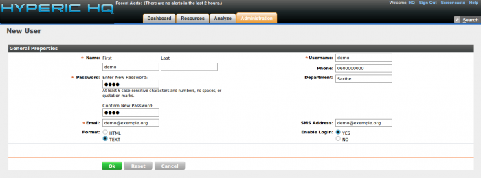

### Table des matières {.toggle}

-   [Installation de Hyperic HQ sur Ubuntu 8.0.4
    LTS](hyperic-ubuntu-install.html#installation-de-hyperic-hq-sur-ubuntu-804-lts)
    -   [Pré-Requis](hyperic-ubuntu-install.html#pre-requis)
    -   [Installation](hyperic-ubuntu-install.html#installation)
        -   [Lancement de
            l'installation](hyperic-ubuntu-install.html#lancement-de-l-installation)
        -   [Démarrage de l'instance Hyperic
            HQ](hyperic-ubuntu-install.html#demarrage-de-l-instance-hyperic-hq)
        -   [Démarrage de
            l'agent](hyperic-ubuntu-install.html#demarrage-de-l-agent)
    -   [Présentation de
        l'interface](hyperic-ubuntu-install.html#presentation-de-l-interface)
        -   [Login](hyperic-ubuntu-install.html#login)
        -   [Dashboard](hyperic-ubuntu-install.html#dashboard)
        -   [Ressource](hyperic-ubuntu-install.html#ressource)
        -   [Analyze](hyperic-ubuntu-install.html#analyze)
        -   [Administration](hyperic-ubuntu-install.html#administration)

Installation de Hyperic HQ sur Ubuntu 8.0.4 LTS {#installation-de-hyperic-hq-sur-ubuntu-804-lts .sectionedit1}
===============================================

[Hyperic HQ](http://www.hyperic.com "http://www.hyperic.com") est conçu
pour diriger des applications web et une infrastructure. La capacité
unique d’Hyperic HQ est d’automatiquement découvrir et contrôler le
logiciel et les ressources de réseau, sans tenir compte du type de
machine ou de l’endroit. Ce qui vous donne une vue unifiée de la
performance et l’état de santé de votre IT.

La société Hyperic étant été racheté par la société SpringSource,
Hyperic HQ complète l’éventail de produit de cette dernière.

Hyperic HQ permet de monitorer une très grande variété de ressources :

-   OS
-   serveurs web et proxys
-   serveurs d’applications
-   bases de données
-   MOM
-   technologies Microsoft (AD, Exchange, .NET)
-   produits de virtualisation
-   ressources réseau
-   et bien d’autres comme Alfresco par exemple

Ce tutoriel a été réalisé par :

  **Rôle**        **Nom**
  --------------- ------------------
  **Rédacteur**   Romuald FRONTEAU

**Première impressions**

Le fonctionnement de Hyperic HQ n’a pas l’air compliqué en soit. D’un
côté un serveur qui renifle tous les agents Hyperic que vous avez
installé sur votre réseau. Le reste Hyperic HQ le fait lui même.

Au niveau installation, comme vous le verrez ci-dessous, simple et
rapide à la fois. Pas besoin de se tirer les cheveux avec l’installation
de dépendance etc …, l’installeur fait tout.

Au niveau du portail, une interface JBoss classe et travaillé se
présente devant nos yeux. Un dashboard entièrement customisable avec une
technologie en Drag’n drop.

Pré-Requis {#pre-requis .sectionedit3}
----------

Le seul pré-requis dont on a besoin est wget pour la manière dont l’on
veut récupérer l’installeur de Hyperic HQ

~~~~ {.code}
sudo apt-get install wget
~~~~

Installation {#installation .sectionedit4}
------------

-   **Récupération des sources**

~~~~ {.code}
wget http://freefr.dl.sourceforge.net/project/hyperic-hq/Hyperic%20HQ%204.1/HQ%204.1.2/hyperic-hq-installer-4.1.2-1053-x86-linux.tgz

tar xvzf hyperic-hq-installer-4.1.2-1053-x86-linux.tgz
~~~~

-   **Préparation du répertoire d’installation Hyperic**

L’installation d’hyperic ne doit pas se faire en utilisateur root donc
le répertoire d’installation doit appartenir à un utilisateur normal.
Pour notre cas, nous avions déjà un utilisateur “system” sur notre
machine. System sera alors propriétaire de notre répertoire.

Nous allons axé l’installation d’Hyperic comme une installation de
Nagios via les sources.(Vous êtes libre de choisir n’importe quel
répertoire.)

~~~~ {.code}
sudo mkdir /usr/local/hyperic

sudo chown system:system /usr/local/hyperic

sudo chmod +w /usr/local/hyperic
~~~~

### Lancement de l'installation {#lancement-de-l-installation .sectionedit5}

Le lancement ne doit pas se faire en root, de toute façon il refuse
l’exécution du setup si vous passez un “sudo” L’installation se fera
dans 2 terminal.

**Terminal numéro 1**

~~~~ {.code}
cd hyperic-hq-installer/

./setup.sh
~~~~

~~~~ {.code}
Unpacking JRE to temporary directory /tmp/jre

Initializing Hyperic HQ 4.1.2 Installation...

Loading taskdefs...

Taskdefs loaded

Choose which software to install:

1: Hyperic HQ Server

2: Hyperic HQ Agent

You may enter multiple choices, separated by commas.
~~~~

Répondre **1,2**

**Sur les hôtes à superviser, il n’y a juste que l’agent à installer
donc choix de l’option 2 et c’est tout.**

~~~~ {.code}
HQ server installation path [default '/home/hyperic']:
~~~~

Mettre **/usr/local/hyperic**

~~~~ {.code}
Enter the fully qualified domain name of the SMTP server that HQ will use to send email messages [default 'demo-hyperic_HQ.domain.fr']:
~~~~

Appuyer sur “Entrer” ou vous pouvez répondre aussi **localhost**

~~~~ {.code}
HQ agent installation path [default '/usr/local/hyperic']:
~~~~

Appuyer sur “Entrer”

~~~~ {.code}
Loading install configuration...

Install configuration loaded.

Preparing to install...

Validating agent install configuration...

Validating server install configuration...

Checking server webapp port...

Checking server secure webapp port...

Checking server JRMP port...

Checking server JNP port...

Verifying admin user properties

Validating server DB configuration...

Installing the agent...

Looking for previous installation

Unpacking agent to: /usr/local/hyperic/agent-4.1.2...

Installing the agent JRE ...

Unpacking JRE x86-linux-glibc2-jre-1_5.tar.gz to: /usr/local/hyperic/agent-4.1.2...

Setting permissions on agent binaries...

Fixing line endings on text files...

--------------------------------------------------------------------------------

Installation Complete:

  Agent successfully installed to: /usr/local/hyperic/agent-4.1.2

--------------------------------------------------------------------------------

 You can now start your HQ agent by running this command:

  /usr/local/hyperic/agent-4.1.2/bin/hq-agent.sh start

Installing the server...

Unpacking server to: /usr/local/hyperic/server-4.1.2...

Creating server configuration files...

Copying binaries and libraries to server installation...

Copying server configuration file...

Copying server control file...

Copying server binaries...

Copying server libs...

Setting up server database...

Now login to another terminal as root and execute this script:

/tmp/hyperic-hq-installer/installer-4.1.2/data/hqdb/tune-os.sh

This script sets up the proper shared memory settings to run the

built-in database.
~~~~

**NE PAS FAIRE ENTRER TOUT DE SUITE !!!**

**Terminal numéro 2**

Dans un autre terminal, connectez vous à votre machine et lancez :

~~~~ {.code}
sudo /tmp/hyperic-hq-installer/installer-4.1.2/data/hqdb/tune-os.sh

/etc/sysctl.conf does not define kernel.shmmax, adding it

Tuning completed successfully!
~~~~

Une fois finie, revenez au premier terminal.

**Terminal numéro 1**

Vous pouvez maintenant faire “Entrer”

~~~~ {.code}
Setting up JDBC driver...

Copying database files...

Configuring database...

Starting repopulation of configuration table...

Starting built-in database...

Waiting for built-in database to start (on port 9432)...

Preparing database...

Waiting for server to stop...

Stopping built-in database...

Built-in database stopped.

Installing the server JRE ...

Unpacking JRE x86-linux-glibc2-jre-1_5.tar.gz to: /usr/local/hyperic/server-4.1.2...

Setting permissions on server binaries...

Fixing line endings on text files...

--------------------------------------------------------------------------------

Installation Complete:

  Server successfully installed to: /usr/local/hyperic/server-4.1.2

--------------------------------------------------------------------------------

 You can now start your HQ server by running this command:

  /usr/local/hyperic/server-4.1.2/bin/hq-server.sh start

 Note that the first time the HQ server starts up it may take several minutes

 to initialize.  Subsequent startups will be much faster.

 Once the HQ server reports that it has successfully started, you can log in

 to your HQ server at: 

  http://demo-hyperic_HQ.domain.fr:7080/

  username: hqadmin

  password: hqadmin

 To change your password, log in to the HQ server, click the "Administration"

 link, choose "List Users", then click on the "hqadmin" user.

Setup completed.

A copy of the output shown above has been saved to:

  /tmp/hyperic-hq-installer/installer-4.1.2/./hq-install.log
~~~~

### Démarrage de l'instance Hyperic HQ {#demarrage-de-l-instance-hyperic-hq .sectionedit6}

Pour démarrer Hyperic HQ Server:

~~~~ {.code}
/usr/local/hyperic/server-4.1.2/bin/hq-server.sh start

Starting HQ server...

Initializing HQ server configuration...

Checking jboss jndi port...

Checking jboss mbean port...

Starting HQ built-in database...

HQ built-in database started.

Booting the HQ server (Using JAVA_OPTS=-XX:MaxPermSize=192m -Xmx512m -Xms512m)...

HQ server booted.

Login to HQ at: http://127.0.0.1:7080/
~~~~

**ATTENTION: Premier lancement assez long le temps de l’initialisation
donc patience (comptez un bon 5 minutes) !**

### Démarrage de l'agent {#demarrage-de-l-agent .sectionedit7}

Pour démarrer l’agent Hyperic :

~~~~ {.code}
/usr/local/hyperic/agent-4.1.2/bin/hq-agent.sh start

Starting HQ Agent...

[ Running agent setup ]

What is the HQ server IP address: xx.xxx.xx.xx
~~~~

Mettre l’adresse IP du serveur Hyperic: **xx.xxx.xx.xx**

~~~~ {.code}
Should Agent communications to HQ always be secure [default=no]: 
~~~~

Appuyer sur “Entrer” si vous n’utilisez https pour l’interface Web

~~~~ {.code}
What is the HQ server port     [default=7080]:
~~~~

Appuyer sur “Entrer”

~~~~ {.code}
- Testing insecure connection ... HQ is still starting (retrying in 10 seconds)

- Testing insecure connection ... Success
~~~~

Si le teste vous met le message “Testing insecure connection … HQ is
still starting (retrying in 10 seconds)”, c’est que le serveur est en
cours de démarrage, alors patience

~~~~ {.code}
What is your HQ login [default=hqadmin]:
~~~~

Mettre **hqadmin**

~~~~ {.code}
What is your HQ password: 
~~~~

Mettre **hqadmin**

~~~~ {.code}
What IP should HQ use to contact the agent [default=xx.xx.xx.xx]: 
~~~~

Appuyer sur “Entrer”

~~~~ {.code}
What port should HQ use to contact the agent [default=2144]: 
~~~~

Appuyer sur “Entrer”

~~~~ {.code}
- Received temporary auth token from agent

- Registering agent with HQ

- HQ gave us the following agent token

    1251216913716-7766044278903428583-384807710027846718

- Informing agent of new HQ server

- Validating

- Successfully setup agent
~~~~

Présentation de l'interface {#presentation-de-l-interface .sectionedit8}
---------------------------

### Login {#login .sectionedit9}

Pour se connecter au portail Hyperic, il est accessible à l’URL
suivante: <http://ip_serv_hyperic:7080>

Nom d’utilisateur: hqadmin

Mot de passe: hqadmin

### Dashboard {#dashboard .sectionedit10}

Comme expliqué ci-dessus, le dashboard possède une technologie Drag’n
drop qui permet à l’utilisateur de le personnaliser comme il le désire.

#### Configuration du portlet Metric Viewer

### Ressource {#ressource .sectionedit11}

Chez Hyperic, les termes sont un peu différents.

Un serveur physique = une platforme

Un process de logiciel = un serveur (apache, postgresql, etc …)

Par contre le service, reste toujours un service.

#### Monitor

Dans cette vue, nous avons un éventail complet de métrologie (graph un
peu bizarre et manque de couleur).

#### Inventory

Cette vue ressemble à une gestion de parc. Elle rappatrie tous les
informations concernant votre machine.

#### Alert

Cette vue est une représentation des journaux d’alertes classés par
jour.

#### Views

Cette vue vous permet de lancé dans la foulée certaines commandes
pratique pour contrôler l’état de santé de votre machine distante sans
avoir à vous y connecter.

### Analyze {#analyze .sectionedit12}

Ce menu gère des journaux des alertes et évènements avec code de
couleurs en fonction du niveau d’alerte.

### Administration {#administration .sectionedit13}

#### Authentication/Authorization

##### List Users

Cette vue liste les utilisateurs et on a la possibilité dans créer des
nouveaux.

##### New User

#### HQ Server Settings

##### Edit HQ Server Settings

Cette vue est un panneau des options générales d’Hyperic HQ. On y
retrouve URL, Nombres de jours d’historisation des données…

##### Monitoring Defaults

Cette vue permet de configurer les templates d’interrogation des
machines (intervalle d’interrogation, activation, métrologie).

##### Escalation Schemes Configuration

Cette vue vous permet de configurer des règles de notifications, tout
comme dans nagios.

#### Plugins

##### Groovy Console

Cette console permet de tester le code de templates.

##### HQ Health

Cette vue vous permet de voir si votre système est bien équilibré et que
vous ne souffrez pas de latence dans le traitement de vos résultats.

