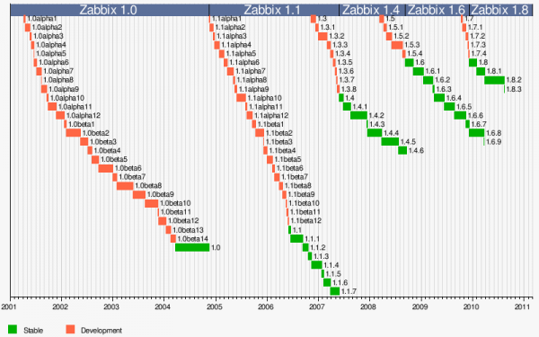

### Table des matières {.toggle}

-   [Introduction à
    Zabbix](zabbix-introduction.html#introduction-a-zabbix)
    -   [Présentation](zabbix-introduction.html#presentation)
    -   [Historique](zabbix-introduction.html#historique)
    -   [Fonctionnalités](zabbix-introduction.html#fonctionnalites)
    -   [Références](zabbix-introduction.html#references)
    -   [Aides & Conseils](zabbix-introduction.html#aides-conseils)
        -   [Support
            officiel](zabbix-introduction.html#support-officiel)
        -   [Communautés](zabbix-introduction.html#communautes)
        -   [Autres](zabbix-introduction.html#autres)

Introduction à Zabbix {#introduction-a-zabbix .sectionedit1}
=====================

Page rédigée pour une version de Zabbix 1.8.2.

Sur cette page, nous allons présenter et décrire les principales
fonctionnalités de Zabbix.

Sources : site et wiki officiels de
[Zabbix](http://www.zabbix.com/ "http://www.zabbix.com/").

Cette page a été rédigée par :

  **Rôle**        **Nom**
  --------------- ---------------------------------------------------------------------------------------------------------------------------------------------------------
  **Rédacteur**   [Ludovic VALENTIN](http://www.monitoring-fr.org/community/members/ludovic-valentin/ "http://www.monitoring-fr.org/community/members/ludovic-valentin/")

Présentation {#presentation .sectionedit3}
------------

Zabbix est une application libre (open source) de supervision des
systèmes et des réseaux en infrastructure IT, développée en C.
L’interface web est quant à elle, développée en PHP et en JavaScript.

Mise à part les versions serveur et proxy qui sont exclusivement sur
Unix, Zabbix est multiplateforme, et est disponible sous des systèmes
d’exploitation tels que par exemple Windows, Linux, Solaris, …etc.

Par sa polyvalence, Zabbix peut superviser et vérifier les statuts d’une
multitude de services réseaux, ou systèmes (serveurs), tout en
surveillant au niveau matériel de nombreux types d’équipements présents
au sein d’une infrastructure IT, comme un routeur, une imprimante, un
téléphone IP, grâce à l’utilisation du protocole SNMP.

Zabbix supporte également le protocole IPMI, et dispose d’outils
d’auto-découverte d’équipements. Il intègre par défaut la gestion de
cartes (réseaux) et de graphiques, tous visualisables depuis une même
interface.

Historique {#historique .sectionedit4}
----------

Au commencement, Zabbix vu le jour en 1998 développé par Alexei
Vladishev, sous la forme d’un projet interne, afin de répondre aux
besoins de supervision d’une banque. C’est seulement à partir de 2001
que le logiciel passa sous licence GPL, avec la sortie d’une première
version alpha de Zabbix 1.0. Après plusieurs années de développement, la
version finale 1.0 fut disponible le 23 mars 2004.

Mise à part la version 1.1, qui est sortie environ 2 ans plus tard la
première, l’évolution de Zabbix est constante, avec en moyenne 2 sorties
majeures par an pour arriver aujourd’hui à la version 1.8, sortie en
décembre 2009. Zabbix est actuellement disponible sous la version 1.8.3.

De nos jours, Zabbix est développé sous licence GPL v2 par l’entreprise
Zabbix SIA, fondée en 2005, afin de fournir un support professionnel et
des services d’intégration, de déploiement, de consulting, ou encore de
formation, ainsi que différents partenariats avec des entreprises à
l’international.

Avec un nombre toujours croissant d’utilisateurs dans les
infrastructures IT, Zabbix est devenu en l’espace de quelques années,
l’une des applications open source de supervision les plus populaires
dans le monde.

Fonctionnalités {#fonctionnalites .sectionedit5}
---------------

**Supervision**

Configuration centralisée, Accès centralisée à toutes les données,
Jusqu’à 1000 nœuds ZABBIX, Nombre illimité de proxy

**Evolutivité**

Testé avec 100000 équipements et serveurs supervisés, Testé avec 1000000
de contrôles de disponibilités et de performances, Traitement de
milliers de contrôles de disponibilités et de performances par seconde

**Suivi en temps réel**

Surveillance des performances, Surveillance des disponibilités,
Surveillance des intégrités, Conditions de notifications flexibles,
Alertes des utilisateurs (email, SMS, jabber), Journalisation (logging)

**Visualisation**

Vues et diaporama définies par l’utilisateur, Cartographie, Graphiques,
Zoom

**Résolution rapide des problèmes**

Envoi des alertes par email, téléphone, SMS, ou par alertes audio,
Exécute des commandes à distance

**Gestion du SLA**

Services IT hiérarchiques, Rapport SLA en temps réel

**Rapports et tendances**

Facilités d’intégration d’outils, Analyse des statistiques
journalières/mensuelles/annuelles, Rapports SLA

**Import/Export de données XML**

Facilité de partage des templates

**Auto-découverte**

Découverte par plage d’adresse IP, services ou SNMP, Surveillance
automatique des équipements découverts

**Supervision Web**

Surveillance des performances et des disponibilités Web, Scénarios
flexibles, Support des méthodes POST et GET

**Flexibilité**

Support des protocoles IPv4 et IPv6, Facilités d’extension des agents
natifs, Toutes les méthodes de notifications, Fonctionne sur toute
plateforme

**Supervision pro-active**

Exécution automatique de commandes à distance, Exécution automatique des
commandes IPMI

**Surveillance globale**

Suivi d’un groupe d’hôtes comme un seul hôte

**Surveillance sans agent**

Surveillance de services distants (FTP, SSH, HTTP, …), Support du
SNMPv1/v2/v3, Support de l’IPMI, Support des traps SNMP

**Agents de haute performance**

Toutes les plateformes sont supportées (Unix, Windows, Novell),
Utilisation de la mémoire, Utilisation du réseau, Disk I/O,
Disponibilité de l’espace disque, Contrôle des fichiers, Surveillances
des fichiers journaux, …etc

**Sécurité**

Permissions des utilisateurs flexibles, Authentification par adresse IP,
Protection contre les attaques du type Brute Force

**Escalades et notifications**

Notifications répétées, Escalades illimitées, Récupération des messages,
Notification lorsqu’un problème est résolu

**Fonctions de gestion**

ping, traceroute vers un hôte, Toutes les autres fonctions

**Tableau de bord**

Tableau de bord personnalisable, Ressources, données favorites, Haut
niveau de vision

**Supervision avec agent**

Agent natif pour toute plateforme, Evite les problèmes de connections

**Administration facile**

Très rapide courbe d’apprentissage, Toutes les données sont stockées
dans une base de données (MySQL, PostgreSQL, Oracle, SQLite),
Configuration centralisée et stockage de l’information

**Solution Open Source**

Aucune licence de limitation du moteur, Accès au code source, Ouvert aux
audits du code

**Toutes les informations en ligne**

Manuel ZABBIX, Wiki ZABBIX, Forums ZABBIX

**Soutenu par la société Zabbix**

Contrats de support annuels, Solutions clés en main, Compte de
responsable technique, Services professionnels

Références {#references .sectionedit7}
----------

Voici une liste non-exhaustive des principales entreprises ayant recours
à Zabbix :

  **Nom**                                    **Pays**
  ------------------------------------------ ------------
  Basler Versicherungen                      Suisse
  Bat Blue                                   Etats-Unis
  Connecture                                 Etats-Unis
  Dataprev                                   Brésil
  DEAC                                       Lettonie
  Fellowtech                                 Allemagne
  Lojas Renner SA                            Brésil
  Latvijas tirdzniecības banka               Lettonie
  Miracle Linux Corporation                  Japon
  Netia                                      Pologne
  NTT ComTechnology                          Japon
  Parex Bank                                 Lettonie
  Petrobras                                  Brésil
  Procergs                                   Brésil
  Serpro                                     Brésil
  T-Systems Enterprise Services GmbH         Allemagne
  VSAA (The State Social Insurance Agency)   Lettonie
  XS4ALL Internet bv                         Pays-Bas

Aides & Conseils {#aides-conseils .sectionedit9}
----------------

### Support officiel {#support-officiel .sectionedit10}

Avec la fondation de Zabbix SIA, Zabbix s’est doté d’un semble de
services d’intégration, de déploiement, de consulting et de formation,
avec bien sûr un support professionnel :

[http://www.zabbix.com](http://www.zabbix.com "http://www.zabbix.com")

Sur ce site figure notamment un wiki (documentation) ainsi qu’un forum.

Zabbix possède également de nombreux partenaires dans le monde, pouvant
au niveau national proposer un support et gérer, à un certain niveau la
distribution de Zabbix.

Pour consulter la liste des partenaires officiels de Zabbix :

[http://www.zabbix.com/partners.php](http://www.zabbix.com/partners.php "http://www.zabbix.com/partners.php")

### Communautés {#communautes .sectionedit11}

Comme la plupart des applications open sources, Zabbix possède de par sa
multitude d’utilisateurs à travers le monde, un vaste potentiel
d’entre-aide par l’intermédiaire de forums, ou de blogs, mais aussi et
surtout par les différentes communautés qui traitent de l’open source en
général, ou plus précisément de la supervision et de Zabbix.

Voici une liste de liens vers des sites communautaires :

[http://www.zabbix.com/community.php](http://www.zabbix.com/community.php "http://www.zabbix.com/community.php")

[http://www.monitoring-fr.org](http://www.monitoring-fr.org "http://www.monitoring-fr.org")

### Autres {#autres .sectionedit12}

Il existe également de nombreux sites, wiki ou blogs (francophones) sur
Internet parlant de Zabbix. N’étant pas spécialisés sur une solution de
supervision, ces sites/wiki/blogs “généralistes” publient de temps à
temps des articles, des Howto et des tutoriels sur Zabbix.

Voici un échantillon de sites sur lesquels figurent différentes
informations sur Zabbix :

[http://www.moroblog.info/](http://www.moroblog.info/ "http://www.moroblog.info/")

[http://novalan.fr/](http://novalan.fr/ "http://novalan.fr/")

[http://doc.ubuntu-fr.org/](http://doc.ubuntu-fr.org/ "http://doc.ubuntu-fr.org/")

[http://blog.thelinuxfr.org/](http://blog.thelinuxfr.org/ "http://blog.thelinuxfr.org/")

[http://www.synergeek.fr/](http://www.synergeek.fr/ "http://www.synergeek.fr/")
