### Table des matières {.toggle}

-   [Superviser un hôte SNMP avec
    Zabbix](zabbix-snmp-host.html#superviser-un-hote-snmp-avec-zabbix)
    -   [Pré-requis](zabbix-snmp-host.html#pre-requis)
    -   [Utilisation du SNMP](zabbix-snmp-host.html#utilisation-du-snmp)
        -   [Lister les mesures SNMP d'un
            équipement](zabbix-snmp-host.html#lister-les-mesures-snmp-d-un-equipement)
        -   [Trouver le code OID d'une mesure
            SNMP](zabbix-snmp-host.html#trouver-le-code-oid-d-une-mesure-snmp)
    -   [Création d'un hôte](zabbix-snmp-host.html#creation-d-un-hote)
    -   [Supervision SNMP](zabbix-snmp-host.html#supervision-snmp)
        -   [Ajout d'un item
            SNMP](zabbix-snmp-host.html#ajout-d-un-item-snmp)
        -   [Ajout d'un template
            SNMP](zabbix-snmp-host.html#ajout-d-un-template-snmp)

Superviser un hôte SNMP avec Zabbix {#superviser-un-hote-snmp-avec-zabbix .sectionedit1}
===================================

Tutoriel rédigé pour une version Ubuntu 8.04/10.04 LTS et Zabbix 1.8.2.

Dans ce tutoriel, nous allons suivre les différentes étapes nécessaires
à la supervision d’un hôte avec agent SNMP dans Zabbix.

Sources : site et wiki officiels de
[Zabbix](http://www.zabbix.com/ "http://www.zabbix.com/"), article sur
le site
[Synergeek](http://www.synergeek.fr/2009/01/suivre-des-peripheriques-snmp-avec-zabbix/ "http://www.synergeek.fr/2009/01/suivre-des-peripheriques-snmp-avec-zabbix/").

Ce tutoriel a été réalisé par :

  **Rôle**        **Nom**
  --------------- ---------------------------------------------------------------------------------------------------------------------------------------------------------
  **Rédacteur**   [Ludovic VALENTIN](http://www.monitoring-fr.org/community/members/ludovic-valentin/ "http://www.monitoring-fr.org/community/members/ludovic-valentin/")

Pré-requis {#pre-requis .sectionedit3}
----------

Pour superviser des équipements SNMP, Zabbix requiert le support SNMP.
Ce support est automatiquement pris en charge si vous avez installer
votre serveur Zabbix par les dépôts. Sinon depuis les sources, il est
nécessaire de télécharger le support SNMP manuellement, et d’activer ce
dernier dans Zabbix lors de la compilation des sources avant
l’installation du serveur.

Voir le tutoriel **[Installation de Zabbix sur
Ubuntu](../../../zabbix/zabbix-ubuntu-install.html "zabbix:zabbix-ubuntu-install")**
pour plus d’informations.

Dans ce tutoriel, on considère que vous disposer d’un équipement
supportant le protocole SNMP, tel qu’un commutateur (switch) par
exemple. Ce dernier est déjà paramétré au niveau SNMP et fonctionne
correctement. Pour illustrer la procédure de mise en place de la
supervision d’un hôte SNMP, nous allons utiliser le SNMPv1 avec la
communauté de base “public”.

Utilisation du SNMP {#utilisation-du-snmp .sectionedit4}
-------------------

### Lister les mesures SNMP d'un équipement {#lister-les-mesures-snmp-d-un-equipement .sectionedit5}

Grâce aux outils SNMP installés sur votre serveur Zabbix, il vous est
possible de lister à distance l’ensemble des mesures SNMPs disponible
sur votre équipement/hôte à superviser. Pour cela, rien de plus simple,
il suffit de lancer la commande suivante avec l’adresse IP de votre
équipement :

~~~
$ sudo snmpwalk adresse_ip -v 1 -c public
~~~

Au lieu de lister l’intégralité des mesures SNMP, il peut être
intéressant de “filtrer” la liste obtenue, à condition bien sûr de
connaître les noms des mesures voulues. Dans notre cas, nous voulons
afficher les mesures concernant le débit entrant sur la ou les cartes
réseaux de votre hôte à superviser. L’intitulé de cette mesure étant
**ifInOctets**, on peut donc entrer cette commande :

~~~
$ sudo snmpwalk adresse_ip -v 1 -c public | grep -I ifInOctets
~~~

Voici un exemple de résultat obtenu avec la commande précédente :

~~~
IF-MIB::ifInOctets.1 = Counter32: 1495616893
IF-MIB::ifInOctets.2 = Counter32: 101967273
IF-MIB::ifInOctets.3 = Counter32: 0
IF-MIB::ifInOctets.4 = Counter32: 0
IF-MIB::ifInOctets.5 = Counter32: 1421759570
~~~

Ici, on peut donc constater qu’il y a 5 cartes réseaux sur notre hôte.
La dénomination “ifInOctets.1” représente la carte numéro 1,
“ifInOctets.2” pour la deuxième, et ainsi de suite.

Pour aller plus loin voici d’autres mesures pouvant également vous
intéresser :

-   **ifOutOctets** : pour le débit sortant d’une carte réseau.
-   **ifSpeed** : pour la vitesse maximale du débit d’une carte réseau.

### Trouver le code OID d'une mesure SNMP {#trouver-le-code-oid-d-une-mesure-snmp .sectionedit6}

Maintenant que l’on connaît les mesures qui nous intéressent, en
l’occurrence les débits entrants sur les cartes réseaux de l’équipement
à superviser, nous pouvons récupérer les codes OID correspondants. Ces
derniers sont essentiels pour permettre à Zabbix d’interroger l’hôte
SNMP. Pour ce tutoriel, nous allons nous contenter de récupérer le code
OID de la mesure **ifInOctets.1**, c’est-à-dire la mesure du débit
entrant sur la carte réseau numéro 1 de notre équipement SNMP. On
effectue donc la commande suivante (avec l’adresse IP adéquate) :

~~~
$ sudo snmpget -v 1 -c public -on adresse_ip ifInOctets.1
~~~

Voici un exemple de résultat de la commande précédente :

~~~
.1.3.6.1.2.1.2.2.1.10.1 = Counter32: 2547359378
~~~

Ici, dans notre exemple le code OID de la mesure ifInOctets.1 est
`.1.3.6.1.2.1.2.2.1.10.1`. Avec le code OID de notre mesure on peut
alors passer à la configuration de Zabbix. Afin de mettre en place la
supervision de cette mesure SNMP sur notre équipement.

La donnée “Counter32” signifie que la valeur est retournée sous la forme
d’un entier 32bits. Quant à la dernière valeur, elle correspond à la
dernière mesure pour ce code OID, à savoir “2547359378” bits/s.

Création d'un hôte {#creation-d-un-hote .sectionedit7}
------------------

Comme pour tout élément à superviser dans Zabbix, il faut commencer par
créer un hôte. Rendons-nous donc sur la page **Configuration/Hosts** :

[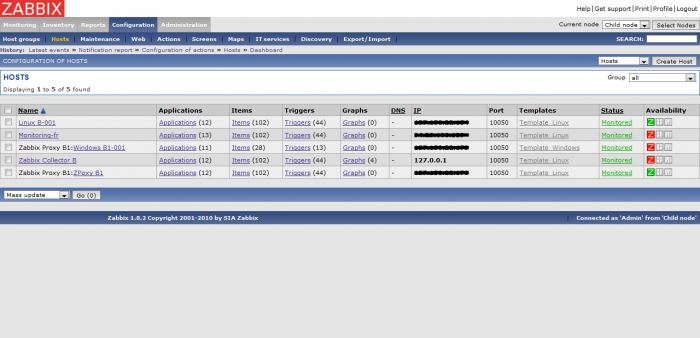](../../../_detail/zabbix/zabbix-snmp-host_creation-hote-1.png@id=zabbix%253Azabbix-snmp-host.html "zabbix:zabbix-snmp-host_creation-hote-1.png")

Une fois sur cette page, en cliquant sur le bouton **Create Host**, nous
allons pouvoir démarrer la configuration d’un nouvel hôte :

[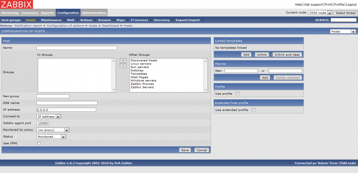](../../../_detail/zabbix/zabbix-snmp-host_creation-hote-2.png@id=zabbix%253Azabbix-snmp-host.html "zabbix:zabbix-snmp-host_creation-hote-2.png")

On remplit ensuite le formulaire normalement, en renseignant les
informations essentiels à l’ajout d’un hôte comme par exemple son
adresse IP (ou son nom DNS) et son nom. Voici un exemple :

[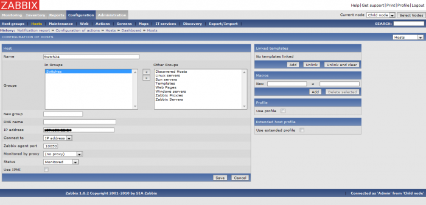](../../../_detail/zabbix/zabbix-snmp-host_creation-hote-3.png@id=zabbix%253Azabbix-snmp-host.html "zabbix:zabbix-snmp-host_creation-hote-3.png")

Après avoir compléter le formulaire de création de l’hôte, il faut
cliquer sur **Save** pour ajouter cet hôte. Automatiquement on doit être
redirigé sur la liste des hôtes de la page **Configuration/Hosts**, sur
celle-ci doit donc figurer notre nouvel hôte :

[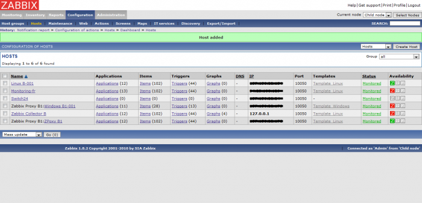](../../../_detail/zabbix/zabbix-snmp-host_creation-hote-4.png@id=zabbix%253Azabbix-snmp-host.html "zabbix:zabbix-snmp-host_creation-hote-4.png")

Cette étape est enfin terminée. On peut maintenant passer à la mise en
place des mesures SNMP à surveiller.

Supervision SNMP {#supervision-snmp .sectionedit8}
----------------

A partir de là, deux possibilités s’offrent à nous pour superviser un
équipement SNMP : soit on ajoute un ou plusieurs items spécifiques à
partir des codes OID obtenus auparavant, soit on associe un template
SNMP déjà existant à notre hôte (template par défaut). Le choix dépend
avant tout de vos besoins, si vous voulez recevoir de nombreuses mesures
SNMP de votre équipement, l’ajout d’un template sera un gain de temps
non-négligeable pour commencer la surveillance de votre hôte SNMP.

En revanche, si vous rechercher seulement à surveiller quelques mesures,
comme par exemple le débit d’une de vos cartes réseau sur un switch,
l’ajout d’un petit nombre d’items manuellement va permettre de ne pas
alourdir la supervision de l’équipement. En effet, au vu de la quantité
très importante d’items qu’un template SNMP par défaut peut ajouter,
c’est-à-dire environ 200, il peut être plus pratique d’optimiser la
surveillance de votre hôte avec seulement les données dont vous avez
besoin.

### Ajout d'un item SNMP {#ajout-d-un-item-snmp .sectionedit9}

Pour ajouter un item de type SNMP, il faut se rendre sur la page
**Configuration/Hosts** puis cliquer sur le lien des items votre hôte
SNMP nouvellement créé, par défaut il n’y a aucun item associé à ce
dernier :

Sur l’écran des items de l’hôte, la liste est donc vide :

[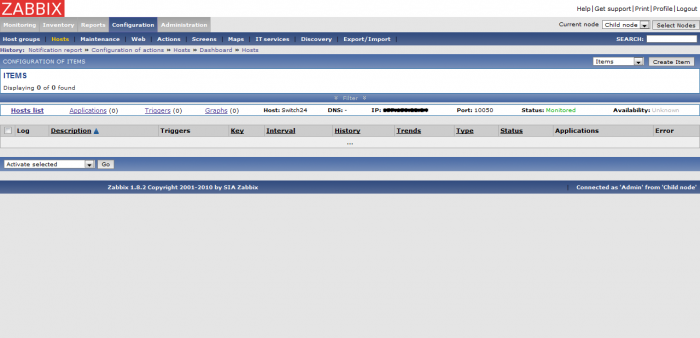](../../../_detail/zabbix/zabbix-snmp-host_ajout-item-2.png@id=zabbix%253Azabbix-snmp-host.html "zabbix:zabbix-snmp-host_ajout-item-2.png")

Maintenant, cliquons sur le bouton **Create item** dans le coin
supérieur droit pour ajouter un nouvel item :

[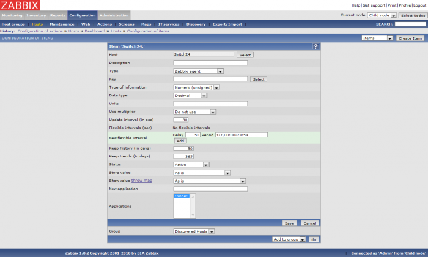](../../../_detail/zabbix/zabbix-snmp-host_ajout-item-3.png@id=zabbix%253Azabbix-snmp-host.html "zabbix:zabbix-snmp-host_ajout-item-3.png")

Sur le formulaire de configuration de notre item, il faut tout d’abord
sélectionner le type et choisir `SNMPv1/SNMPv2/SNMPv3 agent`. Dans notre
tutoriel, nous allons utiliser un item de type `SNMPv1 agent`. Dans le
paramétrage de l’item, nous allons devoir renseigner le code OID de la
mesure de notre équipement SNMP que nous voulons surveiller. Voici un
exemple de configuration, dans celui-ci nous, c’est le débit entrant sur
la carte réseau 1 d’un switch qui va être supervisé :

[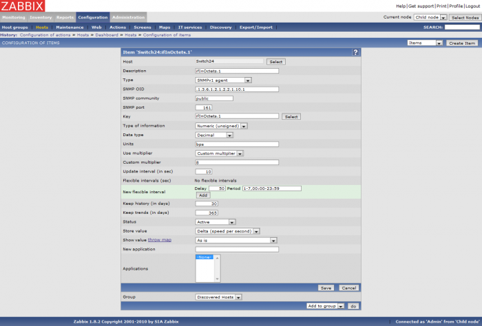](../../../_detail/zabbix/zabbix-snmp-host_ajout-item-4.png@id=zabbix%253Azabbix-snmp-host.html "zabbix:zabbix-snmp-host_ajout-item-4.png")

Une fois la page remplie, on peut sauvegarder le nouvel item et le
visualiser maintenant dans la liste des items de notre hôte :

[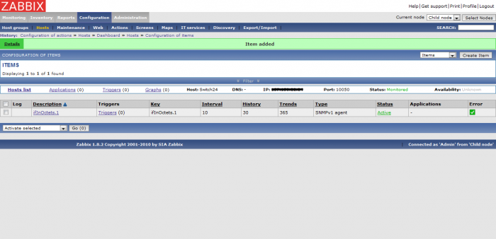](../../../_detail/zabbix/zabbix-snmp-host_ajout-item-5.png@id=zabbix%253Azabbix-snmp-host.html "zabbix:zabbix-snmp-host_ajout-item-5.png")

A ce stade, la configuration est terminée. On retournant sur la page
**Configuration/Hosts**, l’affichage de notre hôte doit alors indiquer
l’utilisation du SNMP, avec une couleur verte pour informer que cela
fonctionne. Si l’icône SNMP reste tout de même rouge après plusieurs
minutes (pensez à rafraîchir la page), c’est qu’il doit y avoir une
erreur (au niveau de l’item, ou bien de l’équipement SNMP, …) :

[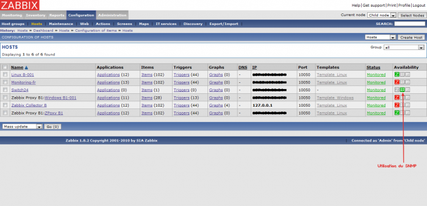](../../../_detail/zabbix/zabbix-snmp-host_ajout-item-6.png@id=zabbix%253Azabbix-snmp-host.html "zabbix:zabbix-snmp-host_ajout-item-6.png")

Maintenant, il est possible de voir la valeur de la mesure SNMP
surveillée, en l’occurrence le débit entrant sur la carte réseau 1 de
notre switch. Pour cela il faut se rendre sur la page
**Monitoring/Overview**, et sélectionner l’affichage des données `Data`
au lieu des `triggers` affichés par défaut :

[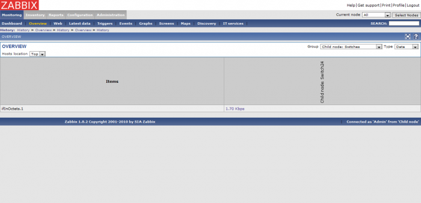](../../../_detail/zabbix/zabbix-snmp-host_ajout-item-7.png@id=zabbix%253Azabbix-snmp-host.html "zabbix:zabbix-snmp-host_ajout-item-7.png")

Ou encore en allant sur la page **Monitoring/Latest data** :

[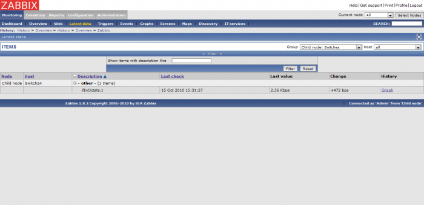](../../../_detail/zabbix/zabbix-snmp-host_ajout-item-8.png@id=zabbix%253Azabbix-snmp-host.html "zabbix:zabbix-snmp-host_ajout-item-8.png")

Voilà, vous avez réussi à mettre en place un item SNMP sur votre hôte
(switch).

### Ajout d'un template SNMP {#ajout-d-un-template-snmp .sectionedit10}

Au lieu d’ajouter manuellement des items, on peut tout simplement
utiliser un template associé à notre hôte SNMP à superviser. L’ajout
d’un template se fait dans la page **Configuration/Hosts**. Sur cet
écran, nous allons éditer l’hôte SNMP précédemment ajouté, en cliquant
sur son nom :

[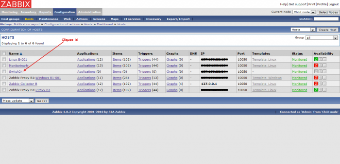](../../../_detail/zabbix/zabbix-snmp-host_ajout-template-1.png@id=zabbix%253Azabbix-snmp-host.html "zabbix:zabbix-snmp-host_ajout-template-1.png")

On arrive alors sur sa page de configuration. Il faut alors tout
simplement lui associer un template. Pour associer un template à un
hôte, on clique sur le bouton **Add** de la partie **Linked templates**
puis on sélectionne le template voulu.

[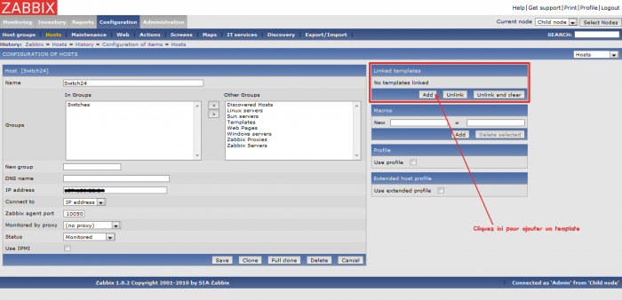](../../../_detail/zabbix/zabbix-snmp-host_ajout-template-2.png@id=zabbix%253Azabbix-snmp-host.html "zabbix:zabbix-snmp-host_ajout-template-2.png")

Dans notre cas, on va choisir le template SNMPv1. Ensuite, nous pouvons
enregistrer la modification après avoir vérifié que le template était
bien affiché dans l’écran de paramétrage de notre hôte comme ici :

Après avoir cliqué sur **Save**, on retourne automatiquement sur la page
des hôtes. Sur la ligne correspondant à notre hôte SNMP, nous pouvons
normalement constater que le template SNMPv1 lui est bien associé :

[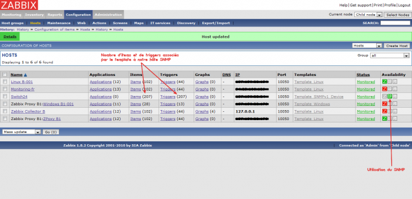](../../../_detail/zabbix/zabbix-snmp-host_ajout-template-4.png@id=zabbix%253Azabbix-snmp-host.html "zabbix:zabbix-snmp-host_ajout-template-4.png")

La configuration est terminée. L’affichage de notre hôte doit alors
indiquer l’utilisation du SNMP, avec une couleur verte pour informer que
cela fonctionne. Si l’icône SNMP reste tout de même rouge après
plusieurs minutes (rafraîchir la page), c’est qu’il doit y avoir une
erreur (au niveau de l’item, ou bien de l’équipement SNMP, …).

On se rendant sur la page **Monitoring/Overview**, on peut maintenant
suivre l’état des items du template de notre hôte SNMP.
