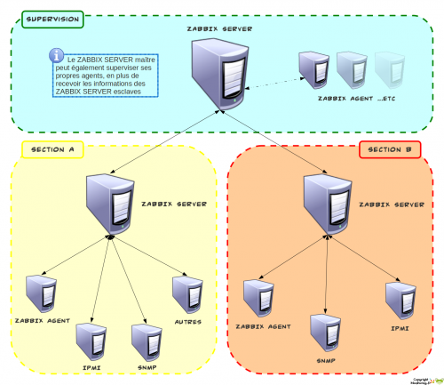

### Table des matières {.toggle}

-   [Fonctionnement de
    Zabbix](zabbix-work.html#fonctionnement-de-zabbix)
    -   [Composants](zabbix-work.html#composants)
        -   [Zabbix Server](zabbix-work.html#zabbix-server)
        -   [Zabbix Frontend](zabbix-work.html#zabbix-frontend)
        -   [Zabbix Proxy](zabbix-work.html#zabbix-proxy)
        -   [Zabbix Agent](zabbix-work.html#zabbix-agent)
    -   [Interactions](zabbix-work.html#interactions)
        -   [Principe de
            fonctionnement](zabbix-work.html#principe-de-fonctionnement)
        -   [Gestion des flux](zabbix-work.html#gestion-des-flux)
    -   [Checks actifs/passifs](zabbix-work.html#checks-actifspassifs)
        -   [Checks passifs](zabbix-work.html#checks-passifs)
        -   [Checks actifs](zabbix-work.html#checks-actifs)
    -   [Système d'alerte](zabbix-work.html#systeme-d-alerte)
        -   [Terminologie](zabbix-work.html#terminologie)
        -   [Principe de
            fonctionnement](zabbix-work.html#principe-de-fonctionnement1)
    -   [Architecture](zabbix-work.html#architecture)
        -   [Mono-serveur](zabbix-work.html#mono-serveur)
        -   [Distribuée](zabbix-work.html#distribuee)

Fonctionnement de Zabbix {#fonctionnement-de-zabbix .sectionedit1}
========================

Page rédigée pour une version de Zabbix 1.8.2.

Sur cette page, nous allons présenter et décrire comment Zabbix
fonctionne, avec ses différentes interactions et architectures
(mono-serveur, distribuée). Le tout illustré par des schémas afin
d’essayer d’en faciliter la compréhension.

Sources : site et wiki officiels de
[Zabbix](http://www.zabbix.com/ "http://www.zabbix.com/").

Cette page a été rédigée par :

  **Rôle**        **Nom**
  --------------- ---------------------------------------------------------------------------------------------------------------------------------------------------------
  **Rédacteur**   [Ludovic VALENTIN](http://www.monitoring-fr.org/community/members/ludovic-valentin/ "http://www.monitoring-fr.org/community/members/ludovic-valentin/")

Composants {#composants .sectionedit3}
----------

### Zabbix Server {#zabbix-server .sectionedit4}

Composant principal, le Zabbix Server permet une surveillance à distance
(et en local) du bon fonctionnement de différents services systèmes et
réseaux, tels que : les serveurs Web, les serveurs de courriers, ou bien
encore les serveurs FTP, …etc. Il gère la notification par mail, afin
d’avertir les administrateurs de toute nouvelle alerte.

Zabbix Server peut fonctionner sans avoir recours aux agents, mais dans
ce cas, il ne remontera qu’une quantité limitée d’informations. Il peut
également utiliser le protocole SNMP pour superviser des hôtes.

### Zabbix Frontend {#zabbix-frontend .sectionedit5}

Deuxième composant essentiel après Zabbix Server, Zabbix Frontend est
tout simplement l’interface de visualisation des évènements, mais aussi,
et surtout l’interface d’administration et de configuration de Zabbix.

Zabbix Frontend, étant une interface Web (php), a l’avantage d’être
accessible depuis n’importe quelle plateforme possédant un navigateur
internet.

### Zabbix Proxy {#zabbix-proxy .sectionedit6}

Zabbix Proxy permet de collecter des informations sur la performance et
la disponibilité des données sur un hôte, avant de les transmettre au
Zabbix Server.

Zabbix Proxy offre la possibilité de réduire la charge d’un serveur
Zabbix. En effet, toutes les informations collectées peuvent être
traitées en local, avant leur transmission au serveur.

Le Proxy de Zabbix est idéal pour une surveillance centralisée de sites
distants, fonctionnant comme un serveur intermédiaire, il remplit
parfaitement son rôle de collecteur de données d’équipements variés.
Distant d’un serveur Zabbix, il agit comme une sonde de collecte et de
traitement des données.

### Zabbix Agent {#zabbix-agent .sectionedit7}

Bien qu’optionnel, se passer du Zabbix Agent serait une erreur, car même
si le serveur Zabbix peut fonctionner sans agent, l’usage de ces
derniers permet une meilleure surveillance des hôtes, et donc une
supervision plus accrue.

L’installation d’un Zabbix Agent sur un hôte offre essentiellement une
surveillance active des ressources locales, des applications, … etc.
L’agent envoi toutes informations supervisée au Zabbix Server.

Interactions {#interactions .sectionedit8}
------------

### Principe de fonctionnement {#principe-de-fonctionnement .sectionedit9}

Comme l’indique la partie précédente, Zabbix est en quelque sorte,
modulable et dispose d’une capacité d’adaptation aux infrastructures à
la fois pratique, et simple à mettre en place.

Entre ses différents composants, il existe un certain nombre
d’interactions, utiles à connaître afin d’en comprendre au mieux le
fonctionnement :

Dans ce schéma, les composants Zabbix sont regroupés en trois blocs, le
premier représente la partie serveur de Zabbix, c’est-à-dire, les
composants Server et Frontend, qui sont essentiels au fonctionnement et
à l’administration d’un serveur Zabbix. Ces deux composants utilisent
une base de données, servant à stocker les données de supervision, et
également pour les afficher dans l’interface Web.

Quant aux deux autres blocs, ils représentent la partie Agent et Proxy
de Zabbix. L’agent peut interagir avec le proxy, en transférant ses
données non-plus directement vers le serveur Zabbix, mais plutôt vers le
proxy. Ce dernier agissant comme un serveur intermédiaire, c’est-à-dire
un collecteur, il utilise donc comme pour Zabbix Server une base de
données.

### Gestion des flux {#gestion-des-flux .sectionedit10}

Le schéma ci-dessous montre les protocoles et flux utilisés par les
différents éléments qui composent une supervision Zabbix :

Checks actifs/passifs {#checks-actifspassifs .sectionedit11}
---------------------

Zabbix utilise le protocole JSON pour communiquer avec les Zabbix
Agents.

### Checks passifs {#checks-passifs .sectionedit12}

Dans Zabbix, les checks passifs sont de simples requêtes de données
émises par le serveur (Zabbix Proxy ou Server) à l’agent installé sur un
hôte à superviser. Le Zabbix Agent répond ensuite à la requête.

Afin d’illustrer le fonctionnement avec un cas concret, voici un exemple
:

1.  Le serveur ouvre une connexion TCP avec l’agent
2.  Le serveur envoi une requête **agent.ping\\n**
3.  L’agent réceptionne et lit la requête
4.  Réponse de l’agent au serveur avec **\<HEADER\>\<DATALEN\>1**
5.  Le serveur analyse la réponse de l’agent et récupère la valeur
    demandée 1

### Checks actifs {#checks-actifs .sectionedit13}

A la différence des checks passifs, les checks actifs n’attendent pas la
requête du serveur pour envoyer les données, en effet, les checks actifs
effectuent eux-mêmes les tests de manière périodique, puis ils
transmettent les différents résultats au serveur. Le processus de
fonctionnement des checks actifs peut être décomposé en 2 parties :

#### Récupération de la liste des items {#recuperation-de-la-liste-des-items}

Pour chaque hôte supervisé (configuré) sur le serveur Zabbix, un certain
nombre d’items (par l’intermédiaire des templates) sont définis.
Lorsqu’un agent est démarré en mode actif, il effectue une requête au
serveur afin de récupérer sa liste d’items.

Voici un exemple un peu plus concret :

1.  L’agent ouvre une connexion TCP avec le serveur
2.  L’agent demande ensuite sa liste d’items
3.  Le serveur répond en envoyant la liste d’items propres à cet agent
4.  L’agent réceptionne la réponse du serveur
5.  La collecte des données définis par les items démarre

#### Envoi des données collectées {#envoi-des-donnees-collectees}

Une fois la liste des items récupérés par l’agent, ce dernier démarre
alors sa collecte de données à un intervalle régulier pour chaque item.
Il transmet ensuite au serveur les données, et reçoit une réponse de
celui-ci pour confirmer la bonne réception.

Exemple du processus d’envoi de données :

1.  L’agent ouvre une connexion TCP avec le serveur
2.  L’agent envoi sa liste de valeurs (données collectées pour chaque
    item)
3.  Le serveur réceptionne et traite les données
4.  Le server retourne le statut à l’agent

Système d'alerte {#systeme-d-alerte .sectionedit14}
----------------

### Terminologie {#terminologie .sectionedit15}

**Item :** un item est un élément qui teste des services et collecte des
données.

**Trigger :** génère un évènement en réaction à une certaine valeur ou
donnée remontée par un item.

**Action :** envoi des alertes (notifications), en fonction d’évènements
précis générés par des triggers.

### Principe de fonctionnement {#principe-de-fonctionnement1 .sectionedit16}

Dans Zabbix, la génération d’une alerte est le résultat d’un
enchaînement de conditions. Voici un schéma montrant les différentes
relations entre les 3 éléments essentiels de Zabbix pour la génération
d’une alerte, c’est-à-dire l’item, le trigger et l’action.

Dans le processus de génération d’une alerte, le premier maillon de la
chaîne est l’item. Cet élément collecte les données à surveiller, comme
par exemple « Est-ce que le port 522 est ouvert ? », ensuite, le trigger
chargé de surveiller cet item, en fonction de ses conditions et des
valeurs remontées par l’item, il génère un évènement de type PROBLEM,
UNKNOW ou OK (avec différents niveaux de criticités possibles).

Pour créer une alerte, le 3ème et dernier élément de Zabbix à entrer en
jeux est l’action. Celui-ci fonctionne comme le trigger, à la différence
qu’il surveille les évènements créés par le trigger (au lieu des valeurs
remontées par les items pour ce dernier) , selon ses conditions, il
génère alors une alerte (ou notification) de type EMAIL, SMS, ou encore
JABBER.

Architecture {#architecture .sectionedit17}
------------

### Mono-serveur {#mono-serveur .sectionedit18}

Architecture la plus simple de Zabbix, le choix de l’installation d’un
seul serveur répond avant tout à des besoins propres à de petites ou
moyennes entreprises.

La mise en place d’une architecture mono-serveur (standalone) est des
plus classiques, on y retrouve un serveur Zabbix, à partir duquel sont
surveillés des agents Zabbix, des équipements SNMP, IPMI, ou encore tout
autre système ou service.

### Distribuée {#distribuee .sectionedit19}

Lorsque les infrastructures et/ou les besoins ne permettent pas
l’utilisation d’un mono-serveur, il faut alors mettre en place une
architecture distribuée. Zabbix permet 3 types de supervision distribuée
:

#### Multi-serveur

Le premier type d’architecture distribuée de Zabbix correspond à
l’association de plusieurs Zabbix Server. Cette architecture permet par
exemple de mettre en place deux serveurs dans 2 sites distants, avec une
administration locale de la supervision pour chacun d’entre eux.

L’usage d’une architecture multi-serveur permet de combiner
l’administration décentralisée et centralisée, offrant ainsi des
possibilités organisationnelles intéressantes.

#### Multi-proxy

Selon les besoins d’administration de la supervision d’une
infrastructure, un seul serveur Zabbix peut suffire, à partir duquel
l’ensemble des hôtes seront gérés, puis pour la collecte de données,
l’ajout de plusieurs proxys Zabbix vont permettre de recueillir toutes
les informations des équipements supervisés dans différents lieux, avant
de les transmettre au serveur Zabbix.

Avec une architecture multi-proxy, l’administration est centralisée sur
un seul serveur Zabbix, et utilise plusieurs proxy, à savoir des
collecteurs, afin de remontées les données de différents sites, secteurs
d’une infrastructure IT.

#### Multi-serveur et Multi-proxy

Lorsqu’il est nécessaire d’administrer localement plusieurs sites,
bâtiments différents, l’utilisation de plusieurs serveurs Zabbix
combinés à des collecteurs (proxy) devient alors indispensable. Grâce à
cette combinaison, il devient alors possible de mettre en place de
vastes architectures de supervision, parfaitement optimisé pour répondre
correctement aux besoins de supervision d’une infrastructure.

En combinant les architectures multi-serveur et multi-proxy, il est
alors possible à la fois de centraliser et de décentraliser
l’administration de la supervision, tout en utilisant des collecteurs
pour des zones ne nécessitant pas une administration locale.
