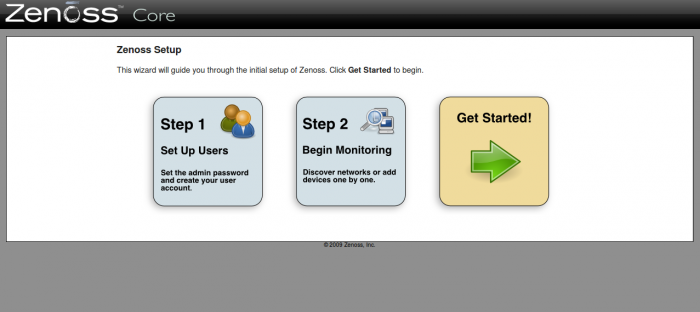

### Table des matières {.toggle}

-   [Installation de Zenoss sur
    Ubuntu](zenoss-ubuntu-install.html#installation-de-zenoss-sur-ubuntu)
    -   [Pré-requis](zenoss-ubuntu-install.html#pre-requis)
    -   [Installation](zenoss-ubuntu-install.html#installation)

Installation de Zenoss sur Ubuntu {#installation-de-zenoss-sur-ubuntu .sectionedit1}
=================================

Tutoriel de Zenoss sur Ubuntu 8.04 LTS.

Tout comme Nagios,
[Zenoss](http://www.zenoss.com/ "http://www.zenoss.com/") est un outil
de supervision open-source gratuit (il existe une version commerciale
comportant plus d’options). Il se base sur une application Web qui va
surveiler les noeuds de votre réseau et générer des rapports si chers
aux yeux des décideurs informatiques…

Il utilise des protocoles pour renifler votre réseau comme :

1.  SNMP
2.  SSH
3.  ICMP

Ce tutoriel a été réalisé par :

  **Rôle**        **Nom**
  --------------- ------------------
  **Rédacteur**   Romuald FRONTEAU

**Première approche :**

Le portail Web de supervision est sobre et classieux, basé sur un
système de Drag’n Drop pour le Dashboard avec utilisation de Portlets,
changement configuration à chaud et un principe de géo-localisation
grâce à googlemap.

Cette interface a du charme et nous console du léger temps d’adaptation
pour analyser comment la bête fonctionne.

Dommage qu’on sente le commerce derrière cet outil avec le remplissage
d’un formulaire avec certaines questions sur l’utilité, taille de
l’infra, etc … Après il faut voir si Zenoss sont du genre agressif ou
non en démarchage client.

Pré-requis {#pre-requis .sectionedit3}
----------

Avant de procéder à l’installation, zenoss aura besoin de quelques
packages pour fonctionner comme il se doit.

~~~~ {.code}
sudo apt-get install snmp ttf-liberation libgomp1 gcj
~~~~

Installation {#installation .sectionedit4}
------------

Un très bon point est à souligner, Zenoss offre un dépôt pour
l’installation de son produit ce qui facilite gradement la démarche
d’installation. Il nous suffit de le renseigner dans le fichier
*/etc/apt/sources.list*

~~~~ {.code}
# DEPOT ZENOSS
deb http://dev.zenoss.org/deb main stable
~~~~

On met à jour la liste des packages disponibles et on installe (zenoss
sera installé dans /usr/local/zenoss):

~~~~ {.code}
sudo apt-get update
sudo apt-get install zenoss-stack
~~~~

Vous n’aurez plus qu’à démarrer le démon zenoss

~~~~ {.code}
sudo /etc/init.d/zenoss-stack start
~~~~

Le portail Zenoss est accessible via l’url suivante:
<http://ip_serv_zenoss:8080>

On arrive sur une page de setup comme ci-dessous:

Vous pouvez sautez ces étapes et passer directement au dashboard, mais
pourquoi ne pas prendre le temps de paramétrer une ou plusieurs machines
avant de rentrer dans le vif du sujet.

Mode manuel(comme tout mode manuel ce sera long):

ou le mode auto qui peut s’avérer plus payant, après vous n’aurez juste
qu’à classer vos hôtes.

voilà pour la partie installation / configuration.
