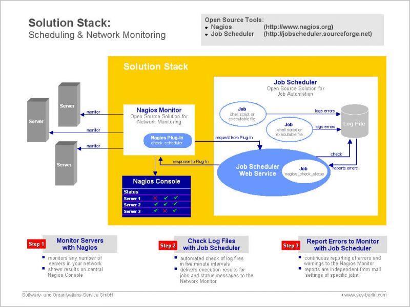

Ce tutoriel a été réalisé par :

  **Rôle**        **Nom**
  --------------- ------------------
  **Rédacteur**   Romuald FRONTEAU

Comme j’aime bien le schéma explicatif de l’implémentation de Job
Scheduler et Nagios, le voilà. Il est bien sûr pris sur le site de Job
Scheduler.

Reste à tester la chose comme expliqué sur le site de Job Scheduler.

Pré-requis {#pre-requis .sectionedit3}
----------

Job Scheduler doit être installé, pour cela vous pouvez vous rendre à la
page ci-dessous :

**[Installation de Job
Scheduler](../../infra/jobscheduler.html "infra:jobscheduler")**

La liste des pré-requis est assez courte mais au combien importante.
Tout d’abord il vous faut impérativement trois fichiers:

-   [sos.stack.jar](../../lib/exe/fetch.php@hash=12e3b6&media=http%253A%252F%252Fwww.sos-berlin.com%252Fdownload%252Fscheduler%252Flib%252Fsos.stacks.jar "http://www.sos-berlin.com/download/scheduler/lib/sos.stacks.jar")
    qui est en fait une archive contenant la définition de tâche que
    Nagios peut superviser.
-   [check\_scheduler.pl](../../lib/exe/fetch.php@hash=aa0e58&media=http%253A%252F%252Fwww.sos-berlin.com%252Fdownload%252Fscheduler%252Fsources%252Fsos%252Fstacks%252Fnagios%252Fcheck_scheduler.pl.html "http://www.sos-berlin.com/download/scheduler/sources/sos/stacks/nagios/check_scheduler.pl.html")
    est le plugin Nagios vous permettant de superviser job scheduler
-   [check\_monitor.xml](../../lib/exe/fetch.php@hash=49c439&media=http%253A%252F%252Fwww.sos-berlin.com%252Fdownload%252Fscheduler%252Fconfig%252Fscheduler_monitor.xml "http://www.sos-berlin.com/download/scheduler/config/scheduler_monitor.xml")
    est la définition d’une tâche que nous utiliserons pour notre
    premier cas.

Il est important de noter que check\_scheduler.pl requiert Perl dans sa
version 5.8 minimum, ainsi que des paquets Perl comme Net::HTTP et
XML::XPath (disponible sur
[www.cpan.org](../../lib/exe/fetch.php@hash=97f0d7&media=http%253A%252F%252Fwww.cpan.org.html "http://www.cpan.org")
)

Configuration {#configuration .sectionedit4}
-------------

La configuration de cette supervision se déroule en deux temps bien
distinct. Dans un premier temps nous allons configurer Job Scheduler
pour qu’il puisse être superviser, puis votre serveur Nagios pour qu’il
supervise ce que demandé.

### Configuration de Job Scheduler {#configuration-de-job-scheduler .sectionedit5}

Dans un premier temps, il s’agit de télécharger l’archive contenant les
différents job utilisé pour Nagios, ainsi que le
[check\_monitor.xml](../../lib/exe/fetch.php@hash=49c439&media=http%253A%252F%252Fwww.sos-berlin.com%252Fdownload%252Fscheduler%252Fconfig%252Fscheduler_monitor.xml "http://www.sos-berlin.com/download/scheduler/config/scheduler_monitor.xml")

Une fois ces fichiers en votre possession veuillez lire votre fichier
factory.ini:

~~~
LCPXP-407:~/scheduler/config$ sudo vi factory.ini
~~~

Rechercher la chaine CLASS\_PATH:

~~~
[java]
class_path              = /usr/local/scheduler/lib/*.jar

;   
~~~

Il ne vous reste plus qu’à copier le fichier sos.stack.jar dans le
répertoire signifié par la variable CLASS\_PATH.

La deuxième chose à faire est de copier le fichier check\_monitor.xml.
Veuillez placer le fichier que vous venez de télécharger dans
/usr/local/scheduler/config . Une fois ces étapes effectuer, relancer
Job Scheduler.

### Configuration de Nagios {#configuration-de-nagios .sectionedit6}

Rappelons que vous devez avoir en votre possession le fichier
check\_schedule.pl et que les modules perl NET::HTTP et XML::XPATH
doivent être installé sur votre machine client (serveur Job Schedule).

Le principe de configuration reste aussi simple que pour Job Schedule, à
ceci près qu’une petite modification du plugin est peut être à
effectuer. Une fois copier dans votre répertoire /libexec de votre
serveur de supervision Nagios, procédez à une petite lecture du fichier:

~~~
nagios@Nagios:/usr/local/nagios/libexec$ vi check_scheduler.pl 
~~~

A la première ligne, en entête d’exécution du fichier perl, vous pouvez
lire:

~~~
#! /opt/perl-5.8.6/bin/perl -w
~~~

Pour vérifier que ce chemin est bien le bon, veuillez faire un petit
“which perl” dans votre invite de commande. le chemin qui vous sera
révélé sera celui à mettre à la place.

~~~
#! /usr/bin/perl
~~~

Maintenant, il ne nous reste plus qu’à ajouter notre hôte Job Schedule
dans Nagios et de définir le service de supervision associé.