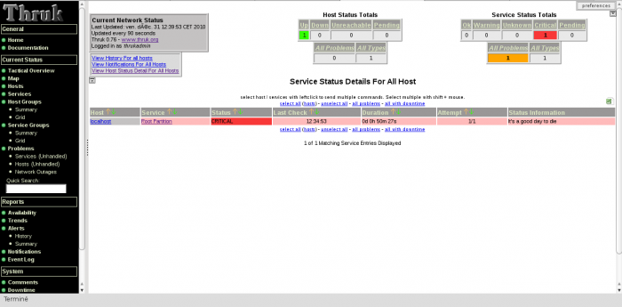

L’installation suivante a été réalisé à partir d’une installation
d’ubuntu 10.04 server avec profil “LAMP SERVER” & “OPENSSH SERVER”.
Cette installation vous présente un Shinken se trouvant sur un
mono-serveur (car mon portable est limité ;)). Bien sûr vous pouvez
décider le(s) rôle(s) (quel(s) démon(s)) que votre machine incarne(nt).

Pré Requis {#pre-requis .sectionedit2}
----------

Pour la bonne installation de Shinken, nous allons d’abord mettre à jour
notre Debian.

~~~
apt-get update
apt-get install ssh
~~~

il va falloir installer les packets suivants :

~~~
apt-get install python python-dev python-setuptools build-essential pyro git-core python-mysqldb python-json python-sqlite
~~~

### Création du compte utilisateur {#creation-du-compte-utilisateur .sectionedit3}

Pour que Shinken s’exécute, nous allons créer un utilisateur système
dédié.

~~~
sudo useradd -m shinken
sudo passwd shinken
~~~

Ensuite, nous allons lié l’utilisateur shinken au groupe shinken

~~~
sudo groupadd shinken
sudo usermod -G shinken shinken
~~~

 : l’utilisateur shinken fait
parti du groupe apache uniquement si on décide d’installer une interface
web.

L’utilisateur Shinken est aussi membre du groupe Apache www-data

~~~
sudo usermod -G shinken www-data
~~~

Installation {#installation .sectionedit4}
------------

Nous allons récupérer les sources de shinken

~~~
wget http://shinken-monitoring.org/pub/shinken-0.4.1.tar.gz

tar -xvzf shinken-0.4.1.tar.gz

cd shinken-0.4.1
~~~

Cette partie de l’installation se réalise en fonction de la préférence
de chacun, certains voudront avoir l’installation de Shinken dans un
répertoire qu’ils auront choisit et d’autres avoir une installation
clean à la mode distribution GNU Linux. Pour notre part, nous avons
choisit l’installation d’un le répertoire /opt/shinken (car je n’aime
pas aller chercher à droite à gauche les éléments de ma solution de
Supervision).

### Installation par script {#installation-par-script .sectionedit5}

En utilisation le script d’installation de Shinken, par défaut celui-ci
copiera Shinken dans plusieurs filesystems à la mode distribution. Mais
vous pouvez modifier le comportement de ce script en modifiant le
fichier setup.cfg

~~~
vi setup_parameters.cfg

[install]
etc-path=/opt/shinken/etc
var-path=/opt/shinken/var
plugins-path=/opt/shinken/libexec
~~~

Pour modifier l’utilisateur et le groupe par défaut, c’est dans le
setup.py que ça se passe. Pas besoin de le toucher normalement, il est
déjà à Shinken.

Une fois la modification réalisée, lancez le script d’installation avec
la commande suivante :

~~~
sudo python setup.py install --install-scripts=/opt/shinken/bin
~~~

Normalement, l’installation passe toute seule ;)

Une fois votre installation de shinken terminée, il faut vérifier
qu’elle fonctionne.

Nous allons démarrer tous les démons afin de vérifier le bon
fonctionnement de Shinken. Démarrez les démons dans l’ordre suivant (il
est préférable de lancer l’arbiter en dernier).

~~~
sudo /etc/init.d/shinken-scheduler start
sudo /etc/init.d/shinken-poller start
sudo /etc/init.d/shinken-broker start
sudo /etc/init.d/shinken-reactionner start
sudo /etc/init.d/shinken-arbiter start
~~~

Pour que vos démons démarrent au lancement de la machine. Pour mon cas,
vu que je n’ai qu’une machine, elle incarnera tous les rôles de Shinken.
Bien sûr, en fonction de votre architecture, lancez les commandes
suivants selon ce que vous désirez :

~~~
sudo update-rc.d shinken-scheduler defaults
sudo update-rc.d shinken-poller defaults
sudo update-rc.d shinken-broker defaults
sudo update-rc.d shinken-reactionner defaults
sudo update-rc.d shinken-arbiter defaults
~~~

### Test de bon fonctionnement {#test-de-bon-fonctionnement .sectionedit6}

Vous allez pouvoir maintenant vérifier le bon fonctionnement de Shinken

~~~
ps -fu shinken

UID        PID  PPID  C STIME TTY          TIME CMD
shinken   6575     1  1 20:30 ?        00:00:05 /usr/bin/python /opt/shinken/bin/shinken-broker.py -d -r -c /opt/shinken/etc/brokerd.ini
shinken   6608     1  0 20:31 ?        00:00:02 /usr/bin/python /opt/shinken/bin/shinken-poller.py -d -r -c /opt/shinken/etc/pollerd.ini
shinken   6609  6608  0 20:31 ?        00:00:01 /usr/bin/python /opt/shinken/bin/shinken-poller.py -d -r -c /opt/shinken/etc/pollerd.ini
shinken   6621     1  2 20:31 ?        00:00:07 /usr/bin/python /opt/shinken/bin/shinken-scheduler.py -d -r -c /opt/shinken/etc/schedulerd.ini
shinken   6639     1  0 20:31 ?        00:00:00 /usr/bin/python /opt/shinken/bin/shinken-reactionner.py -d -r -c /opt/shinken/etc/reactionnerd.ini
shinken   6640  6639  0 20:31 ?        00:00:00 /usr/bin/python /opt/shinken/bin/shinken-reactionner.py -d -r -c /opt/shinken/etc/reactionnerd.ini
shinken   6652     1  0 20:32 ?        00:00:01 /usr/bin/python /opt/shinken/bin/shinken-arbiter.py -d -r -c /opt/shinken/etc/nagios.cfg -c /opt/shinken/etc/
shinken   6653  6575  3 20:32 ?        00:00:08 /usr/bin/python /opt/shinken/bin/shinken-broker.py -d -r -c /opt/shinken/etc/brokerd.ini
shinken   6654  6575  0 20:32 ?        00:00:01 /usr/bin/python /opt/shinken/bin/shinken-broker.py -d -r -c /opt/shinken/etc/brokerd.ini
shinken   6655  6608  0 20:32 ?        00:00:01 /usr/bin/python /opt/shinken/bin/shinken-poller.py -d -r -c /opt/shinken/etc/pollerd.ini
shinken   6657  6608  0 20:32 ?        00:00:01 /usr/bin/python /opt/shinken/bin/shinken-poller.py -d -r -c /opt/shinken/etc/pollerd.ini
shinken   6659  6608  0 20:32 ?        00:00:02 /usr/bin/python /opt/shinken/bin/shinken-poller.py -d -r -c /opt/shinken/etc/pollerd.ini
shinken   6664  6639  0 20:32 ?        00:00:00 /usr/bin/python /opt/shinken/bin/shinken-reactionner.py -d -r -c /opt/shinken/etc/reactionnerd.ini
shinken   6667  6608  0 20:32 ?        00:00:01 /usr/bin/python /opt/shinken/bin/shinken-poller.py -d -r -c /opt/shinken/etc/pollerd.ini
~~~

Nous allons aussi voir le fichier de log de nagios
/opt/shinken/var/nagios.log

~~~
tail -f /opt/shinken/var/nagios.log
~~~

Votre fichier nagios.log et status.dat doivent se mettre à jour
régulièrement. IL est possible que votre nagios.log vous alerte
concernant les plugins. C’est normal nous ne les avons pas encore
installé.

Maintenant que notre Shinken tourne, ça serait bien qu’il est une
panoplie de plugins pour pouvoir interroger nos hôtes ainsi qu’une
interface web pour voir le résultat.

Installation des Nagios Plugins {#installation-des-nagios-plugins .sectionedit7}
-------------------------------

### Pré-requis {#pre-requis1 .sectionedit8}

Pour que la compilation des plugins se passe correctement, il faut
quelques pré-requis

~~~
sudo apt-get install libgnutls-dev libmysqlclient15-dev libssl-dev libsnmp-perl libkrb5-dev libldap2-dev libsnmp-dev libnet-snmp-perl gawk libwrap0-dev libmcrypt-dev fping snmp gettext smbclient dnsutils php5-gd postfix ntp nmap saidar traceroute php5-snmp curl syslog-ng
~~~

Récupérer les sources des Nagios Plugins et décompressez les

~~~
cd shinken-install

wget http://netcologne.dl.sourceforge.net/project/nagiosplug/nagiosplug/1.4.15/nagios-plugins-1.4.15.tar.gz

tar -xvzf nagios-plugins-1.4.15.tar.gz

cd nagios-plugins-1.4.15

./configure --prefix=/opt/shinken/ --with-nagios-user=shinken --with-nagios-group=shinken --enable-libtap --enable-extra-opts --enable-perl-modules

make

sudo make install
~~~

Une fois vos plugins installés, il ne reste plus que l’interface pour
voir notre Shinken tourner.

Installation de l'interface Web {#installation-de-l-interface-web .sectionedit9}
-------------------------------

Dans ce tutoriel, nous allons choisir l’interface Thruk pour tourner
avec Shinken.

Pour installer Thruk via les paquets, il faut s’assurer que libgd et
libxpm sont bien installés.

Ensuite, récupérer le paquet debian de Thruk (celui que j’ai pris est
pour la version 32 bits)

~~~
cd shinken-install

wget http://www.thruk.org/files/Thruk-0.76-i486-linux-gnu-thread-multi-5.10.0.tar.gz

mv Thruk-0.76 Thruk

cp -R Thruk /opt/shinken
~~~

Une fois votre Interface Thruk copiée dans le répertoire de Shinken,
nous allons lancé le script de démarrage du serveur de Thruk pour
vérifier si nous accédons bien à notre interface

Dans un terminal, lancez le script suivant :

~~~
sudo /opt/shinken/Thruk/script/thruk_server.pl
~~~

Maintenant vous pouvez vous connecter à <http://IP_SERVEUR_SHINKEN:3000>

J’ai obtenu une erreur et c’est normal car je n’ai défini aucun backend
par défaut pour Thruk. Vu que Thruk s’appuie sur Livestatus, nous allons
devoir installer livestatus.

### Configuration de Thruk {#configuration-de-thruk .sectionedit10}

Le module Livestatus de shinken écoutant sur le port 50000, il faut
modifier Thruk en conséquence.

Pour Thruk, allez dans /opt/shinken/Thruk/thruk.conf, et modifier comme
ci-dessous dans la balise **\<Component Thruk::Backend\>**

~~~
# Backend Configuration, enter your backends here
<Component Thruk::Backend>
    <peer>
        name   = Shinken
        type   = livestatus
        <options>
            peer    = 127.0.0.1:50000
       </options>
    </peer>
#    <peer>
#        name   = External Icinga
#        type   = livestatus
#        <options>
#            peer    = 172.16.0.2:9999
#       </options>
#    </peer>
</Component>
~~~

Lancez le serveur de Thruk

~~~
sudo /opt/shinken/Thruk/script/thruk_server.pl
~~~

Ouvrez un navigateur et allez à l’url suivante :
<http://IP_SERV_SHINKEN:3000>

N’oubliez pas de configurer Shinken pour qu’il discute avec Thruk, dans
le fichier /usr/local/shinken/etc/shinken-specific.cfg vous avez le
module activé pour le broker

~~~
define broker{
       broker_name      broker-1
       address          localhost
       port             7772
       spare            0
       modules           Status-Dat, Simple-log, Livestatus
       manage_sub_realms 1  
       manage_arbiters   1   
       realm    Local
       }
~~~

et la définition du module lui même :

~~~
define module{
       module_name      Livestatus
       module_type      livestatus
       host             *      
       port             50000   ; port to listen
       database_file    /var/lib/shinken/livestatus.db
~~~

pour le /var/lib/shinken/livestatus.db :

~~~
mkdir /var/lib/shinken
chown shinken:shinken /var/lib/shinken
~~~